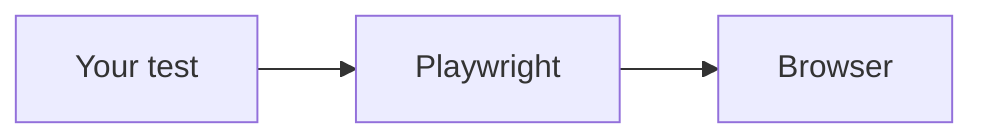

# Block syntax cheat sheet

The full specification is `Data/Source/course/FORMAT.md`; read it when a case is not covered here. Everything that is not a block below is plain Markdown (tables, lists, `- [ ]` checklists, links).

## Front matter

```yaml
---
day: 11                     # number across the course (Day 11 = Week 3, day 1)
week: 3
title: Locators in Depth
subtitle: One sentence that says what the day is about — with an em-dash detail if useful
estimatedTime: 3 hours
topics:                     # 3–5 short items
  - Role, label and text locators
objectives:                 # 6–8, each starting with a verb: Explain, Use, Recognise, Read and fix, Compare…
  - Explain why a role locator survives a redesign
prerequisitesFromEarlierDays:   # quoted, "Day N: …"; [] on Day 1
  - "Day 9: locators, actions and web-first assertions"
workspace: pw-course/tests/day11/
---
```

`workspace` text that starts with "Pre-loaded" gives the demo workspace (Days 1–2); anything else gives the learner's `pw-course` project.

## Code

| Fence | Meaning |
|---|---|
| ` ```ts mode=read ` | Display only. The default for snippets, partial code and illustrations. |
| ` ```ts file=ts-basics/day6/registration.ts mode=editor run="node day6/registration.ts" ` | A runnable lesson file with a Run button. |
| ` ```ts file=tests/day9/practice-pages.ts mode=editor ` | A file the learner creates but does not run directly (page fixture, module, page object, config). |
| `… expect=error` | The run is meant to fail (type error, failing test). Used for "break it on purpose". |
| `… network=true` | Needs the internet (playwright.dev). Avoid in new content; the practice pages work offline. |
| `… preview='{"/api/products": [{"name": "Wireless Mouse", "price": 799}]}'` | What View in Page answers when a practice page fetches that path. |
| ` ```json file=… mode=editor ` | A config file for the editor. |
| ` ```text mode=read `, ` ```html mode=read `, ` ```json mode=read ` | Display only: folder trees, markup, data. |

Paths and commands:

- `file=` is relative to `pw-course/`.
- `run=` is always quoted. It runs in `pw-course/`, or in `pw-course/ts-basics/` for `ts-basics/…` files: `run="node day6/x.ts"`, `run="npm run check -- day6/x.ts"`, `run="npx playwright test tests/day9/x.spec.ts --project=chromium"`.
- TypeScript days: `ts-basics/dayN/<kebab-name>.ts`. Playwright days: `tests/dayN/<name>.spec.ts`. Framework layers: `pages/` (PascalCase), `fixtures/index.ts`, `test-data/`, `utils/`.
- Node runs `.ts` directly with type stripping, so: no `enum` (use literal unions), and `import type` for types.

## Terminal and output

````markdown
```bash terminal
# a comment line is kept
npx playwright test tests/day9/signin.spec.ts --project=chromium
```

```output terminal
Running 5 tests using 1 worker
  ✓  1 [chromium] › tests/day9/signin.spec.ts:5:5 › TC-201 … (412ms)
  …
  5 passed (2.1s)
```
````

- ` ```output console ` is the **exact** output of `node file.ts`. It is checked against a real run.
- ` ```output terminal ` is runner or `tsc` output, where timings and paths vary.
- An output block directly after a file block becomes that file's expected output.
- ` ```bash mode=read ` shows commands the learner must **not** run here ("on your own computer").

## Diagrams and reference

````markdown


```reference title="More web-first assertions"
| Assertion | Passes when… |
|---|---|
| `toBeChecked()` | the box is ticked |
```
````

- Mermaid: `flowchart TD/LR`, `subgraph`, `sequenceDiagram`, `<br/>` for line breaks in labels, ①②③ for steps.
- `reference` renders collapsed. Use it for "for later" detail; the text above it names the few items to learn now.

## Callouts

```markdown
> [!TESTER] Test case → automated test
> Each manual step becomes one action, and each expected result one assertion.
```

| Variant | Use |
|---|---|
| `TESTER` | Shown as "The tester's view": the link to manual testing, career or interview advice. 1–3 per day. |
| `TIP` | A habit or shortcut; the closing `Coming up on Day N`. |
| `NOTE` | A clarification or OS/platform caveat ("On a company laptop?"). |
| `WARNING` | A trap ("Straight quotes only", "Always fix the red underlines"). |
| `DEEPDIVE` | Optional precision for the curious. Rare. |
| `PLATFORM` | A note for the app's developers; hidden from learners. |

The title on the first line is optional. Keep a callout to 1–3 sentences, and only when it adds something new.

## Quiz and exercise

See [quizzes-and-problems.md](quizzes-and-problems.md) for the fields. Two syntax rules break the build when forgotten:

1. **Quote YAML values** that start with a backtick, contain `: `, or start with a quote or a number: `explanation: "\`filter\` keeps…"`, `- "5"`. Escape inner double quotes as `\"`.
2. **Exercises use four backticks** (` ````exercise `) so the prompt can contain ` ``` ` fences. Inside a `prompt: |` block, write plain Markdown; do not quote list items.

## Do not

- Draw ASCII markers under code (`└──┬──┘`); they break when the line wraps.
- Use ` ```text ` for TypeScript (use `ts mode=read`).
- Put a quiz anywhere but the end of its part (Fundamentals) or the Practice quiz.
- Put an exercise in a tab's intro, before its first `##`.
