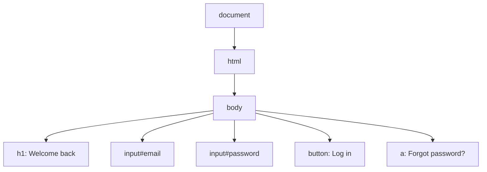

# Prerequisites

## P1 · Manual testing vs test automation

You already know how to test software. You read a requirement, write test cases, open the application, click through the steps and compare what you see with what you expected.

**Test automation** means writing those same steps as a script so that a computer can repeat them — fast, the same way every time, as often as you like.

| | Manual testing | Automated testing |
|---|---|---|
| Who performs the steps | A human tester | A script run by a tool |
| Speed | Minutes per test case | Seconds per test case |
| Repeating the same test 100 times | Tiring and error-prone | Easy — same result every time |
| Finding *new*, unexpected problems | Excellent (human judgement) | Weak — only checks what it was told |
| Cost | Low to start, high over time | Higher to start, low over time |

> [!TESTER] Automation does not replace you
> Automation takes over the *repetitive checking* (e.g. the 200 regression test cases you run before every release). That frees you for exploratory testing, usability checks and edge cases — work that needs a human brain. The best automation engineers are former manual testers, because they already know **what** to test.

### What is worth automating?

Good candidates:

- **Regression tests** — features that already work and must keep working after every change
- **Smoke tests** — the "is the app alive?" checks after every deployment (login, home page, search)
- **Data-heavy tests** — the same form tested with 50 different inputs
- **Cross-browser checks** — the same flow on Chrome, Firefox and Safari

Poor candidates:

- Features that change every week (the script breaks every week)
- One-time tests you will never run again
- "Does this *look* nice?" judgements
- Exploratory testing

```quiz
id: d1-p1-q1
type: multiple
question: Your team releases every two weeks. Which of these are GOOD candidates for automation? (Select all that apply)
options:
  - Login with valid and invalid credentials, checked before every release
  - Checking whether the new banner design "feels modern"
  - Registration form tested with 40 combinations of input data
  - A one-time data migration check that will never be repeated
answer: [a, c]
explanation: Repeated checks (login before every release) and data-driven checks (40 input combinations) give the best return. Visual "feel" needs human judgement, and a one-time check is not worth scripting.
```

## P2 · How a web page is built

Playwright controls web pages, so you need a basic picture of what a web page is made of. You do **not** need to be a web developer.

### Step 1 — The browser asks, the server answers

When you type a URL such as `https://shop.example.com/login` and press Enter:

1. The browser sends a **request** to the server at `shop.example.com`
2. The server sends back a **response** — mostly an **HTML** document
3. The browser reads the HTML and draws (renders) the page you see

### Step 2 — HTML is made of elements

HTML describes *what is on the page* using **tags**. Here is a tiny login page:

```html mode=read
<h1>Welcome back</h1>

<label for="email">Email</label>
<input id="email" type="email" placeholder="you@example.com">

<label for="password">Password</label>
<input id="password" type="password">

<button class="btn-primary">Log in</button>
<a href="/forgot">Forgot password?</a>
```

| Piece | Example | What it means |
|---|---|---|
| **Tag / element** | `<button>…</button>` | A thing on the page: button, input, link, heading |
| **Text** | `Log in` | What the user reads |
| **Attribute** | `id="email"`, `type="password"`, `class="btn-primary"` | Extra information about the element |
| **id** | `id="email"` | A (usually) unique name for one element |
| **class** | `class="btn-primary"` | A style group — many elements can share it |

### Step 3 — The DOM is the live tree

When the browser reads the HTML it builds the **DOM (Document Object Model)** — a live, tree-shaped copy of the page in memory. JavaScript on the page can change the DOM at any time (show a popup, add a row to a table, display "Login failed").



Automation tools like Playwright find elements in this tree (for example "the **button** whose text is **Log in**") and act on them, just as you would with a mouse and keyboard.

> [!TIP] Try it in any browser
> Right-click any element on a web page and choose **Inspect**. The Developer Tools panel opens and highlights that element in the DOM. This is the single most useful habit for an automation tester.

```quiz
id: d1-p2-q1
type: single
question: "In `<input id=\"email\" type=\"email\" placeholder=\"you@example.com\">`, what is `placeholder`?"
options:
  - A tag
  - An attribute
  - The visible text of a button
  - The DOM
answer: b
explanation: "`input` is the tag (element). `id`, `type` and `placeholder` are attributes — extra information about that element."
```

```quiz
id: d1-p2-q2
type: truefalse
question: The DOM can change after the page has loaded — for example when an error message appears after you click "Log in".
answer: true
explanation: The DOM is live. JavaScript adds, removes and changes elements all the time. This is exactly why automation tools must be good at *waiting* for elements — a key Playwright strength.
```

## P3 · Browsers, engines, headed and headless

Every browser has an **engine** that turns HTML into the page you see. There are three main engine families today:

| Engine | Browsers built on it | Playwright name |
|---|---|---|
| **Chromium** (Blink) | Google Chrome, Microsoft Edge, Opera, Brave | `chromium` |
| **Gecko** | Mozilla Firefox | `firefox` |
| **WebKit** | Apple Safari (Mac, iPhone, iPad) | `webkit` |

If your app works in one browser of each family, it will very likely work in all the browsers built on that family. That is why Playwright ships exactly these three: **Chromium, Firefox and WebKit**.

### Headed vs headless

- **Headed** — the browser window is visible on screen. Great for learning and debugging.
- **Headless** — the browser runs *without* a visible window. Faster, and the normal way to run tests on build servers (CI).

Same browser, same behaviour — the only difference is whether a window is drawn.

```quiz
id: d1-p3-q1
type: single
question: A user reports a bug that only happens on iPhone Safari. Which Playwright browser would you use to reproduce it?
options:
  - chromium
  - firefox
  - webkit
answer: c
explanation: Safari (desktop and iOS) is built on the WebKit engine, so `webkit` is the closest match.
```

## P4 · Words you will hear all course

| Term | Plain-English meaning |
|---|---|
| **Script** | A file of instructions a computer runs |
| **Framework** | A ready-made structure + tools you build your tests inside |
| **Library** | A package of ready-made code you call from your own code |
| **Test runner** | The program that finds your tests, runs them and reports pass/fail |
| **Assertion** | An automated "expected result" check, e.g. *the title should be "Dashboard"* |
| **Locator** | The way a test finds an element, e.g. *the button named "Log in"* |
| **Flaky test** | A test that sometimes passes and sometimes fails without any code change — usually a timing problem |
| **CI (Continuous Integration)** | A server that automatically runs your tests whenever developers push code |
| **Node.js** | The program that runs JavaScript/TypeScript outside a browser (you install it on Day 3) |
| **TypeScript** | JavaScript + types. The language we write Playwright tests in (Days 5–8) |

> [!TESTER] Test case → automated test
> A manual test case has **steps** and **expected results**. In automation, steps become **actions** (click, fill, go to URL) and expected results become **assertions**. You already think this way.

# Fundamentals

## F1 · What is Playwright?

**Playwright** is a free, open-source framework for testing web applications end-to-end. It opens real browsers, performs the actions a user would perform, and checks the results.

Key facts:

- Created by **Microsoft**, first released in **January 2020**, open source (Apache 2.0 licence)
- Built by engineers who had earlier created **Puppeteer** (Google's Chrome automation library) — Playwright extends that idea to *all* major browser engines
- Works with **Chromium, Firefox and WebKit** on **Windows, macOS and Linux**, headed or headless, locally or in CI
- Can **emulate mobile devices** (screen size, touch, user agent) for Chrome on Android and Mobile Safari
- Available in **JavaScript/TypeScript, Python, Java and .NET (C#)** — in this course we use **TypeScript**

### Two parts: the library and the test runner

When people say "Playwright" they usually mean **Playwright Test** — the package `@playwright/test`. It bundles everything you need in one install:

| Part | What it does |
|---|---|
| **Browser automation** | Launch browsers, open pages, click, type, navigate |
| **Test runner** | Finds test files, runs them (in parallel), retries, times out slow tests |
| **Assertions** (`expect`) | Checks results, with automatic re-trying |
| **Fixtures** | Gives every test a fresh, ready-to-use browser page |
| **Reporters** | Terminal output and an interactive HTML report |
| **Tools** | Codegen (records your clicks as code), UI Mode, Trace Viewer, Inspector |

> [!NOTE]
> With older tools (e.g. Selenium in JavaScript) you had to combine several packages yourself: a browser driver, a test runner such as Mocha or Jest, an assertion library and a reporting plugin. Playwright Test ships all of these together, already wired up.

```quiz
id: d1-f1-q1
type: single
question: Which package gives you Playwright's test runner, assertions and fixtures together?
options:
  - "`playwright-browser`"
  - "`@playwright/test`"
  - "`selenium-webdriver`"
  - "`puppeteer`"
answer: b
explanation: "`@playwright/test` (\"Playwright Test\") bundles the runner, `expect` assertions, fixtures and reporters. It is what `npm init playwright@latest` installs on Day 3."
```

## F2 · See auto-waiting before you study it

> [!PLATFORM]
> Days 1–2 run before learners install anything. Pre-load a workspace that already has Playwright installed (`npm init playwright@latest`, config from `platform/playwright.config.ts`) and the demo files `tests/day1/auto-wait.spec.ts`, `tests/day1/dom-tour.spec.ts`, `tests/day2/contexts.spec.ts` and `tests/day2/browsers.spec.ts`.

Before any more theory, watch Playwright's most important feature in action. Your workspace already contains a demo test. It opens a practice "Checkout" page where the **Pay now** button only appears **2 seconds** after the page loads — just like a real page waiting for a payment service.

The test does **not** contain any "wait 2 seconds" instruction. Watch what happens.

```ts file=tests/day1/auto-wait.spec.ts mode=editor run="npx playwright test tests/day1/auto-wait.spec.ts --project=chromium --headed"
import { test, expect } from '@playwright/test';

// A tiny practice page. The "Pay now" button is added 2 seconds after the page loads.
const checkoutPage = `
  <h1>Checkout</h1>
  <p id="status">Loading payment options…</p>
  <script>
    setTimeout(() => {
      document.getElementById('status').textContent = 'Ready to pay';
      const button = document.createElement('button');
      button.textContent = 'Pay now';
      button.onclick = () => {
        document.getElementById('status').textContent = 'Payment successful';
      };
      document.body.appendChild(button);
    }, 2000);
  </script>
`;

test('Playwright waits for the Pay now button by itself', async ({ page }) => {
  // Load the practice page into the browser tab
  await page.setContent(checkoutPage);

  // Click the button — it does not exist yet! Playwright waits until it appears.
  await page.getByRole('button', { name: 'Pay now' }).click();

  // Check the result — this assertion also retries automatically
  await expect(page.locator('#status')).toHaveText('Payment successful');
});
```

Press **Run** (or type the command in the terminal):

```bash terminal
npx playwright test tests/day1/auto-wait.spec.ts --project=chromium --headed
```

```output terminal
Running 1 test using 1 worker

  ✓  1 [chromium] › tests/day1/auto-wait.spec.ts:20:5 › Playwright waits for the Pay now button by itself (2.3s)

  1 passed (3.1s)
```

**What to observe**

1. In the browser pane you see "Loading payment options…" for about 2 seconds.
2. The button appears, is clicked immediately, and the text changes to "Payment successful".
3. The test took a little over 2 seconds — Playwright waited *exactly as long as needed*, not a fixed amount.

### Experiment

In the editor, change `2000` (2 seconds) to `8000` and run again. The test still passes — the default *action* wait is generous. Now change it to `40000` (40 seconds) and run once more: the test fails after 30 seconds with a **timeout** message, because Playwright Test's default time limit for a whole test is 30 seconds. Change it back to `2000` when you're done.

```quiz
id: d1-i2-q1
type: single
question: The demo test passed even though the button appeared 2 seconds late. Why?
options:
  - The test contains a hidden 2-second sleep
  - Playwright auto-waits for the element to be ready before clicking
  - The browser loads pages faster in headed mode
  - "`setContent` waits 5 seconds for every page"
answer: b
explanation: Playwright's actions auto-wait until the element exists, is visible, stable and enabled. It clicked as soon as the button was ready.
```

# Implementation

## I1 · Turn a manual test case into automation steps

Before writing any code, automation engineers translate a manual test case into **actions** and **assertions**. Let's do it for a real-world example.

**Manual test case TC-101 — Successful login**

| # | Step | Expected result |
|---|---|---|
| 1 | Open `https://shop.example.com/login` | Login page shows heading "Welcome back" |
| 2 | Enter `asha@example.com` in Email | — |
| 3 | Enter `Secret@123` in Password | — |
| 4 | Click **Log in** | Dashboard opens; URL contains `/dashboard` |
| 5 | — | Text "Hello, Asha" is visible |

**Translated into Playwright thinking**

| Manual step | Type | Playwright action / assertion (plain English) |
|---|---|---|
| Open the login URL | Action | *go to* `https://shop.example.com/login` |
| Heading "Welcome back" shows | Assertion | *expect* heading "Welcome back" *to be visible* |
| Enter email | Action | *fill* the **Email** field with `asha@example.com` |
| Enter password | Action | *fill* the **Password** field with `Secret@123` |
| Click Log in | Action | *click* the **button** named "Log in" |
| URL contains /dashboard | Assertion | *expect* page URL *to contain* `/dashboard` |
| "Hello, Asha" visible | Assertion | *expect* text "Hello, Asha" *to be visible* |

And here is what that becomes in Playwright code. Don't worry about the syntax yet — by Day 9 you will write this yourself. For now, notice how closely it matches the table:

```ts mode=read
import { test, expect } from '@playwright/test';

test('TC-101 successful login', async ({ page }) => {
  await page.goto('https://shop.example.com/login');                                   // open URL
  await expect(page.getByRole('heading', { name: 'Welcome back' })).toBeVisible();     // check heading

  await page.getByLabel('Email').fill('asha@example.com');                             // enter email
  await page.getByLabel('Password').fill('Secret@123');                                // enter password
  await page.getByRole('button', { name: 'Log in' }).click();                          // click Log in

  await expect(page).toHaveURL(/dashboard/);                                           // URL check
  await expect(page.getByText('Hello, Asha')).toBeVisible();                           // welcome text
});
```

> [!TESTER]
> Notice that Playwright finds elements the way a **user** describes them — "the button named *Log in*", "the field labelled *Email*" — not by technical ids. That makes tests easier to read and more robust when developers change the page's internals.

```quiz
id: d1-i1-q1
type: single
question: In the code above, which line is an ASSERTION (an expected result)?
options:
  - "`await page.getByLabel('Email').fill('asha@example.com');`"
  - "`await page.getByRole('button', { name: 'Log in' }).click();`"
  - "`await expect(page).toHaveURL(/dashboard/);`"
  - "`await page.goto('https://shop.example.com/login');`"
answer: c
explanation: "Lines that start with `expect(...)` are assertions — they check an expected result. `goto`, `fill` and `click` are actions."
```

## I2 · Take a tour of the DOM

Lesson P2 said Playwright finds elements in the DOM the way a user describes them. Let's prove it. This demo loads the same tiny login page from P2 into the browser and asks Playwright questions about it — no clicking yet, just *looking*.

```ts file=tests/day1/dom-tour.spec.ts mode=editor run="npx playwright test tests/day1/dom-tour.spec.ts --project=chromium --headed"
import { test, expect } from '@playwright/test';

// The login page from lesson P2, as text
const loginPage = `
  <title>My Shop - Log in</title>
  <h1>Welcome back</h1>
  <label for="email">Email</label>
  <input id="email" type="email" placeholder="you@example.com">
  <label for="password">Password</label>
  <input id="password" type="password">
  <button class="btn-primary">Log in</button>
  <a href="/forgot">Forgot password?</a>
`;

test('a tour of the DOM', async ({ page }) => {
  await page.setContent(loginPage);                    // load the page into the tab

  // Ask the page questions, the way a user would describe things
  console.log('Tab title:', await page.title());
  console.log('Heading text:', await page.getByRole('heading').textContent());
  console.log('Button text:', await page.getByRole('button').textContent());
  console.log('Link goes to:', await page.getByRole('link').getAttribute('href'));
  console.log('Email placeholder:', await page.getByLabel('Email').getAttribute('placeholder'));

  // And check a few expected results
  await expect(page.getByRole('heading', { name: 'Welcome back' })).toBeVisible();
  await expect(page.getByRole('button', { name: 'Log in' })).toBeEnabled();
  await expect(page.getByLabel('Email')).toHaveAttribute('type', 'email');
});
```

```bash terminal
npx playwright test tests/day1/dom-tour.spec.ts --project=chromium --headed
```

```output terminal
Running 1 test using 1 worker

Tab title: My Shop - Log in
Heading text: Welcome back
Button text: Log in
Link goes to: /forgot
Email placeholder: you@example.com
  ✓  1 [chromium] › tests/day1/dom-tour.spec.ts:15:5 › a tour of the DOM (190ms)

  1 passed (1.1s)
```

Match each printed line to the HTML in P2: the **tag** decides the role (`h1` → heading, `button` → button, `a` → link), the **text** gives the name, and **attributes** (`href`, `placeholder`, `type`) are read with `getAttribute`.

**Try it:** add a second button `<button>Cancel</button>` to the HTML and run again. The line `page.getByRole('button')` now matches **two** buttons and the test fails with a *strict mode violation*. Change it to `page.getByRole('button', { name: 'Log in' })` to make it pass. That error is Playwright protecting you from clicking the wrong thing — you'll meet it often.

```quiz
id: d1-i2-dom-q1
type: single
question: "In the demo, which part of `<a href=\"/forgot\">Forgot password?</a>` makes `getByRole('link')` find it?"
options:
  - The text "Forgot password?"
  - The `a` tag — links have the role "link"
  - The `href` attribute
  - The class name
answer: b
explanation: "The tag decides the role. The text becomes the link's accessible name (used for `{ name: '…' }`), and `href` is an attribute you can read with `getAttribute`."
```

# Practice

## Quiz · Day 1 check

```quiz
id: d1-pr-q1
type: single
question: Which is the BEST description of Playwright?
options:
  - A manual test-case management tool from Microsoft
  - An open-source framework that automates Chromium, Firefox and WebKit to test web apps end-to-end
  - A browser made by Microsoft
  - A load-testing tool for APIs
answer: b
explanation: Playwright is an open-source end-to-end testing framework for web apps that drives all three major browser engines.
```

```quiz
id: d1-pr-q3
type: single
question: What does "headless" mean?
options:
  - The browser has no address bar
  - The browser runs without a visible window
  - The test has no assertions
  - The page has no heading element
answer: b
explanation: Headless browsers do all the same work but don't draw a window. Tests run headless by default; add `--headed` to watch.
```

```quiz
id: d1-pr-q6
type: truefalse
question: A flaky test is one that fails every single time because of a real bug.
answer: false
explanation: A flaky test passes sometimes and fails sometimes without any code change — usually because of timing or shared-state problems. A test that fails every time because of a bug is doing its job!
```

## Exercises

````exercise
id: d1-ex1
title: Convert a manual test case
level: easy
type: written
prompt: |
  Convert this manual test case into an **action / assertion** table like the one in lesson I1.

  **TC-205 — Search for a product**
  1. Open `https://shop.example.com`
  2. Type `wireless mouse` in the search box
  3. Press Enter
  4. Expected: the results heading says `Results for "wireless mouse"`
  5. Expected: at least one product card is shown
  6. Click the first product
  7. Expected: the product page shows an **Add to cart** button

  For every row write: the manual step, whether it is an **Action** or an **Assertion**, and the plain-English Playwright step (e.g. *click the button named "Add to cart"*).
hints:
  - Steps that *do* something are actions; steps that *check* something are assertions.
  - 'Describe elements the way a user would: "the search box", "the heading", "the button named …".'
modelAnswer: |
  | Manual step | Type | Playwright step (plain English) |
  |---|---|---|
  | Open the shop | Action | go to `https://shop.example.com` |
  | Type "wireless mouse" in search | Action | fill the search box with `wireless mouse` |
  | Press Enter | Action | press `Enter` in the search box |
  | Heading says Results for "wireless mouse" | Assertion | expect the heading to have text `Results for "wireless mouse"` |
  | At least one product card | Assertion | expect the number of product cards to be greater than 0 |
  | Click the first product | Action | click the first product card |
  | Add to cart button shown | Assertion | expect the button named "Add to cart" to be visible |
````

````exercise
id: d1-ex5
title: Break the auto-wait demo on purpose
level: challenge
type: code
prompt: |
  Open `tests/day1/auto-wait.spec.ts`.

  1. Change the button's text in the page from `Pay now` to `Pay` (inside the `<script>`), **but leave the test looking for `Pay now`**. Run the test.
  2. Read the error message. What is Playwright waiting for, and for how long?
  3. Fix the test so it looks for the correct button name, and run it again.
file: tests/day1/auto-wait.spec.ts
run: npx playwright test tests/day1/auto-wait.spec.ts --project=chromium
hints:
  - The error message quotes the exact locator it was waiting for.
  - The default time limit for one test is 30 seconds.
solution: |
  // Step 1 result: the test fails after ~30 s with a timeout. The message says it was
  // waiting for getByRole('button', { name: 'Pay now' }), which never appeared.
  //
  // Step 3 fix — look for the new button name:
  await page.getByRole('button', { name: 'Pay' }).click();
````

## Reflection

Before moving on, make sure you can answer these out loud:

1. Which kinds of manual tests are worth automating, and which are not?
2. What is the difference between a **tag**, an **attribute** and the **DOM**?
3. Why did the auto-wait demo pass without any "wait 2 seconds" instruction?
4. Name the three browser engines Playwright ships and one real browser built on each.

> [!TIP] Coming up on Day 2
> How Playwright actually talks to a browser, the Browser → Context → Page model, the features that make it stand out, and an honest comparison with Selenium and Cypress.
