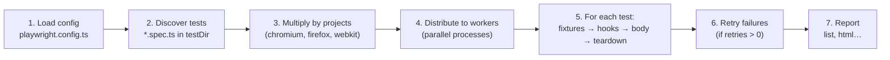

# Prerequisites

## P1 · Quick recap from Day 9

Quick checks on Day 9 before we take control of the runner:

```quiz
id: d10-p1-q1
type: single
question: "Which locator finds `<button>Sign in</button>`?"
options:
  - "`page.getByRole('button', { name: 'Sign in' })`"
  - "`page.getByLabel('Sign in')`"
  - "`page.getByRole('link', { name: 'Sign in' })`"
answer: a
explanation: A button element has the role button; its text is its accessible name.
```

```quiz
id: d10-p1-q2
type: single
question: Where does `await page.setContent(loginPage)` belong when every test in a file needs it?
options:
  - "`test.beforeAll`"
  - "`test.beforeEach`"
  - Copied into every test
answer: b
explanation: "`beforeEach` runs before every test and has access to `page`; `beforeAll` runs once and cannot use `page`."
```

```quiz
id: d10-p1-q3
type: single
question: Which assertion keeps retrying until the text matches?
options:
  - "`expect(await locator.textContent()).toBe('Dashboard')`"
  - "`await expect(locator).toHaveText('Dashboard')`"
answer: b
explanation: Web-first assertions retry (5 s by default); reading the text once and comparing does not.
```

# Fundamentals

## F1 · Controlling which tests run: annotations and tags

| Annotation | Effect |
|---|---|
| `test.only('…', …)` | Run **only** this test (and other `.only` tests). Handy while writing — never commit it! |
| `test.skip('…', …)` | Don't run this test; report it as skipped |
| `test.skip(condition, 'reason')` *(inside a test)* | Skip only when the condition is true, e.g. `test.skip(browserName === 'webkit', 'Feature not supported in Safari yet')` |
| `test.fixme('…', …)` | Skip because the **test** needs fixing (marks it as "fixme" in the report) |
| `test.fail()` *(inside a test)* | "This test is expected to fail" (known bug) — it passes when it fails, and alerts you when it starts passing |
| `test.slow()` *(inside a test)* | Triple the timeout for this test |

The config line `forbidOnly: !!process.env.CI` (Day 4) makes CI **fail** if someone left a `test.only` in the code — otherwise CI would silently run only one test.

### Tags

Tags label tests so you can run subsets such as smoke or regression packs:

```ts mode=read
test('valid user reaches the dashboard', { tag: '@smoke' }, async ({ page }) => { /* … */ });

test('remember-me box can be ticked', { tag: ['@regression', '@login'] }, async ({ page }) => { /* … */ });

test.describe('Enrolment', { tag: '@enrol' }, () => { /* every test inside gets @enrol */ });
```

(Tags written inside the title, like `'login works @smoke'`, also work.)

```bash terminal
npx playwright test --grep @smoke            # only tests tagged @smoke
npx playwright test --grep-invert @slow      # everything EXCEPT @slow
npx playwright test --grep "@smoke|@login"   # @smoke OR @login
```

```quiz
id: d10-f6-q1
type: single
question: A teammate pushed code with `test.only` still in it. What happens on CI with the generated config?
options:
  - CI runs only that one test and reports success
  - CI fails the run, because `forbidOnly` is true when the CI variable is set
  - CI ignores `.only`
  - CI deletes the test
answer: b
explanation: "`forbidOnly: !!process.env.CI` turns a leftover `.only` into a failure on CI, protecting the full suite from being silently skipped."
```

## F2 · What the runner does when you press Run



### Timeouts to remember

| Timeout | Default | Change it with |
|---|---|---|
| Whole test — the body plus `beforeEach` hooks and fixture setup | **30 s** | `timeout` in the config, `--timeout=60000`, or `test.setTimeout(60000)` |
| Each web-first assertion (`expect`) | **5 s** | `expect: { timeout: 10000 }` in the config, or `{ timeout: 10000 }` on one assertion |
| Each action (`click`, `fill`…) | no separate limit — bounded by the test timeout | `use: { actionTimeout: 10000 }` |

### Results you can get

| Status | Meaning |
|---|---|
| ✓ **passed** | Everything worked |
| ✘ **failed** | An action/assertion failed or timed out |
| **flaky** | Failed first, then **passed on retry** — investigate! |
| **skipped** | Skipped by `test.skip` / `test.fixme` |

When any test fails, the command ends with a non-zero **exit code** — that's how CI knows the build is red.

```quiz
id: d10-f7-q1
type: single
question: "With `retries: 1`, a test fails on the first attempt and passes on the retry. How is it reported?"
options:
  - passed
  - failed
  - flaky
  - skipped
answer: c
explanation: Passing only on retry means the result isn't consistent. Playwright marks it flaky so you can investigate the root cause.
```

# Implementation

## I1 · Filter, list, tag and skip

Run subsets of your suite:

```bash terminal
# only smoke tests
npx playwright test tests/day9 --grep @smoke --project=chromium

# everything except smoke tests
npx playwright test tests/day9 --grep-invert @smoke --project=chromium

# titles containing "error"
npx playwright test tests/day9 -g "error" --project=chromium

# what would run in ALL browsers, without running it
npx playwright test tests/day9/login.spec.ts --list
```

```output terminal
Listing tests:
  [chromium] › day9/login.spec.ts:10:7 › Sign in page › shows the sign-in form @smoke
  [chromium] › day9/login.spec.ts:17:7 › Sign in page › valid user reaches the dashboard @smoke
  …
  [webkit] › day9/login.spec.ts:48:7 › Sign in page › remember-me can be ticked and unticked @regression
Total: 18 tests in 1 file
```

6 tests × 3 projects = 18.

Now try the annotations. Create `tests/day10/annotations.spec.ts` (it imports the practice pages from the Day 9 folder):

```ts file=tests/day10/annotations.spec.ts mode=editor run="npx playwright test tests/day10/annotations.spec.ts"
import { test, expect } from '@playwright/test';
import { loginPage } from '../day9/practice-pages';

test('runs everywhere', async ({ page }) => {
  await page.setContent(loginPage);
  await expect(page.getByRole('button', { name: 'Sign in' })).toBeVisible();
});

test('skipped on WebKit only', async ({ page, browserName }) => {
  // Conditional skip: imagine a known Safari-only issue
  test.skip(browserName === 'webkit', 'Known Safari issue BUG-123');
  await page.setContent(loginPage);
  await expect(page.getByLabel('Remember me')).not.toBeChecked();
});

test.skip('password reset link', async ({ page }) => {
  // Not built yet — skipped for everyone
});

test.fixme('sign in with Google', async ({ page }) => {
  // The test itself needs work — shows as "fixme" in the report
});
```

```bash terminal
npx playwright test tests/day10/annotations.spec.ts
```

```output terminal
Running 12 tests using 4 workers

  ✓   1 [chromium] › tests/day10/annotations.spec.ts:4:5 › runs everywhere (210ms)
  ✓   2 [chromium] › tests/day10/annotations.spec.ts:9:5 › skipped on WebKit only (190ms)
  -   3 [chromium] › tests/day10/annotations.spec.ts:16:6 › password reset link
  -   4 [chromium] › tests/day10/annotations.spec.ts:20:6 › sign in with Google
  ✓   5 [firefox] › tests/day10/annotations.spec.ts:4:5 › runs everywhere (520ms)
  …
  -  11 [webkit] › tests/day10/annotations.spec.ts:9:5 › skipped on WebKit only
  …

  7 skipped
  5 passed (3.1s)
```

> [!TIP] `test.only` while you work
> Change one `test(` to `test.only(` and run the file — only that test runs. Remove `.only` before you commit: on CI it fails the whole run (`forbidOnly`).

## I2 · See the hooks run in order

```ts file=tests/day10/hooks.spec.ts mode=editor run="npx playwright test tests/day10/hooks.spec.ts --project=chromium --workers=1"
import { test, expect } from '@playwright/test';

test.beforeAll(async () => {
  console.log('beforeAll  → once, before the tests');
});

test.beforeEach(async ({ page }) => {
  console.log('beforeEach → before each test');
  await page.setContent('<h1>Hooks demo</h1>');
});

test.afterEach(async () => {
  console.log('afterEach  → after each test');
});

test.afterAll(async () => {
  console.log('afterAll   → once, after the tests');
});

test('first test', async ({ page }) => {
  console.log('test body  → first test');
  await expect(page.getByRole('heading')).toHaveText('Hooks demo');
});

test('second test', async ({ page }) => {
  console.log('test body  → second test');
  await expect(page.getByRole('heading')).toBeVisible();
});
```

`--workers=1` makes the tests run one after another so the order is easy to read:

```bash terminal
npx playwright test tests/day10/hooks.spec.ts --project=chromium --workers=1
```

```output terminal
Running 2 tests using 1 worker

beforeAll  → once, before the tests
beforeEach → before each test
test body  → first test
afterEach  → after each test
  ✓  1 [chromium] › tests/day10/hooks.spec.ts:20:5 › first test (160ms)
beforeEach → before each test
test body  → second test
afterEach  → after each test
afterAll   → once, after the tests
  ✓  2 [chromium] › tests/day10/hooks.spec.ts:25:5 › second test (40ms)

  2 passed (900ms)
```

**Try it:** run the same command **without** `--workers=1`. If Playwright starts two or more workers (the default is half your CPU cores), each worker runs its own `beforeAll` and `afterAll` — you'll see them printed more than once.

## I3 · Debug a failing test

Create a test with two deliberate mistakes:

```ts file=tests/day10/broken.spec.ts mode=editor expect=error run="npx playwright test tests/day10/broken.spec.ts --project=chromium"
import { test, expect } from '@playwright/test';
import { loginPage } from '../day9/practice-pages';

test('wrong expected text', async ({ page }) => {
  await page.setContent(loginPage);
  await page.getByRole('button', { name: 'Sign in' }).click();
  // Mistake 1: the real message is "Please enter your email and password"
  await expect(page.getByRole('alert')).toHaveText('Email is required');
});

test('element that does not exist', async ({ page }) => {
  test.setTimeout(5000);   // fail faster than the default 30 s while we practise
  await page.setContent(loginPage);
  // Mistake 2: there is no "Log in" button — it's called "Sign in"
  await page.getByRole('button', { name: 'Log in' }).click();
});
```

```bash terminal
npx playwright test tests/day10/broken.spec.ts --project=chromium
```

```output terminal
  1) [chromium] › tests/day10/broken.spec.ts:4:5 › wrong expected text ─────────────

    Error: expect(locator).toHaveText(expected) failed

    Locator:  getByRole('alert')
    Expected: "Email is required"
    Received: "Please enter your email and password"
    Timeout:  5000ms

       6 |   await page.getByRole('button', { name: 'Sign in' }).click();
       7 |   // Mistake 1: the real message is "Please enter your email and password"
    >  8 |   await expect(page.getByRole('alert')).toHaveText('Email is required');
         |                                         ^

  2) [chromium] › tests/day10/broken.spec.ts:11:5 › element that does not exist ──────

    Test timeout of 5000ms exceeded.

    Error: locator.click: Test timeout of 5000ms exceeded.
    Call log:
      - waiting for getByRole('button', { name: 'Log in' })

      14 |   // Mistake 2: there is no "Log in" button — it's called "Sign in"
    > 15 |   await page.getByRole('button', { name: 'Log in' }).click();
         |                                                      ^

  2 failed
```

Two very different failures:

| Failure | Clue in the output | Typical cause |
|---|---|---|
| **Assertion failed** | `Expected: …` vs `Received: …` | Wrong expectation — or a real bug in the app |
| **Timeout waiting for an element** | `waiting for getByRole('button', { name: 'Log in' })` | Wrong locator, element never appears, or appears too late |

### Your debugging toolbox

| Tool | Command | Best for |
|---|---|---|
| Error output | *(always shown)* | First look: which line, expected vs received |
| HTML report | `npx playwright show-report` | Browsing failures, steps and timings; screenshots/traces when enabled |
| Headed mode | `--headed` | Watching what really happens |
| Inspector | `npx playwright test tests/day10/broken.spec.ts --debug` | Stepping through one action at a time |
| UI Mode | `npx playwright test --ui` | Watch mode, time-travel through each step |

Fix both mistakes (`'Please enter your email and password'` and `'Sign in'`), remove the `test.setTimeout` line, and run again until it's green.

## I4 · Read the HTML report

```bash terminal
npx playwright test tests/day9 tests/day10 --project=chromium
npx playwright show-report
```

In the report:

1. Use the filters at the top (**Passed / Failed / Flaky / Skipped**) and the search box — try typing `@smoke`.
2. Click a test to see every step (`setContent`, `fill`, `click`, `expect …`) with its duration.
3. Failed tests show the same error as the terminal, plus attachments when screenshots or traces are enabled in the config.

Press `Ctrl + C` in the terminal to stop the report server when you're done.

# Practice

## Quiz · Day 10 check

```quiz
id: d10-pr-q3
type: single
question: What is the default timeout for a whole test, and for one web-first assertion?
options:
  - 5 s and 30 s
  - 30 s and 5 s
  - 60 s and 10 s
  - No limit for both
answer: b
explanation: "A test may take up to 30 s (its body plus beforeEach hooks and fixture setup; afterEach and beforeAll/afterAll get their own limit of the same length). Each expect retries for up to 5 s."
```

```quiz
id: d10-pr-q4
type: multiple
question: Which of these are valid ways to tag a test as @smoke? (Select all that apply)
options:
  - "`test('login works', { tag: '@smoke' }, async ({ page }) => {…})`"
  - "`test('login works @smoke', async ({ page }) => {…})`"
  - "`test.smoke('login works', async ({ page }) => {…})`"
  - "`test.describe('Login', { tag: '@smoke' }, () => {…})` around the test"
answer: [a, b, d]
explanation: Tags go in the details object, in the title, or on a describe (applies to every test inside). There is no `test.smoke`.
```

```quiz
id: d10-pr-q5
type: single
question: "`test.skip(browserName === 'firefox', 'Upload not supported')` is written inside a test. When is the test skipped?"
options:
  - Always
  - Only when it runs in the firefox project
  - Never — skip must be outside the test
  - Only on CI
answer: b
explanation: The conditional form of `test.skip` skips only when the condition is true.
```

```quiz
id: d10-pr-q7
type: single
question: You run `npx playwright test --grep @smoke --project=firefox`. Two files contain 3 and 4 tests; 2 tests in total are tagged @smoke. How many test runs?
options:
  - "2"
  - "6"
  - "7"
  - "21"
answer: a
explanation: "Only the 2 @smoke tests are selected, and only one project runs: 2 × 1 = 2."
```

## Spot the bug

````exercise
id: d10-bug1
title: Four bugs, one test file
level: medium
type: code
prompt: |
  This file has **four** bugs. Some make tests fail, some make them unreliable, one breaks CI. Find and fix them all, then save the fixed version as `tests/day10/bugs.spec.ts` and run it.

  ```ts
  import { test, expect } from '@playwright/test';
  import { loginPage } from '../day9/practice-pages';

  test.beforeAll(async ({ page }) => {
    await page.setContent(loginPage);
  });

  test.only('wrong password shows an error', async ({ page }) => {
    await page.setContent(loginPage);
    await page.getByLabel('Email').fill('student@qa.academy');
    await page.getByLabel('Password').fill('nope');
    page.getByRole('button', { name: 'Sign in' }).click();
    expect(page.getByRole('alert')).toHaveText('Invalid email or password');
  });
  ```
file: tests/day10/bugs.spec.ts
run: npx playwright test tests/day10/bugs.spec.ts --project=chromium
hints:
  - Which fixtures are available in beforeAll?
  - Which lines talk to the browser but have no `await`?
  - What does `forbidOnly` do on CI?
solution: |
  import { test, expect } from '@playwright/test';
  import { loginPage } from '../day9/practice-pages';

  // Bug 1: beforeAll can't use `page` → use beforeEach (and remove the duplicate setContent in the test)
  test.beforeEach(async ({ page }) => {
    await page.setContent(loginPage);
  });

  // Bug 2: test.only would fail CI (forbidOnly) and hide all other tests → plain test()
  test('wrong password shows an error', async ({ page }) => {
    await page.getByLabel('Email').fill('student@qa.academy');
    await page.getByLabel('Password').fill('nope');
    // Bug 3: missing await on the click
    await page.getByRole('button', { name: 'Sign in' }).click();
    // Bug 4: missing await on the web-first assertion
    await expect(page.getByRole('alert')).toHaveText('Invalid email or password');
  });
````

## Exercises

````exercise
id: d10-ex3
title: Run exactly what you need
level: easy
type: terminal
prompt: |
  Write (and run) the command for each:

  1. Only the `@smoke` tests in `tests/day9`, Chromium only.
  2. Every test in `tests/day9` **except** `@smoke`, one worker, Firefox only.
  3. Only tests with `dashboard` in the title, with the browser visible.
  4. List all tests in `tests/day9/login.spec.ts` for WebKit without running them.
  5. Re-run only the tests that failed last time, then open the HTML report.
solution: |
  npx playwright test tests/day9 --grep @smoke --project=chromium
  npx playwright test tests/day9 --grep-invert @smoke --workers=1 --project=firefox
  npx playwright test -g "dashboard" --headed
  npx playwright test tests/day9/login.spec.ts --project=webkit --list
  npx playwright test --last-failed
  npx playwright show-report
````

## Week 2 mini-project · Test the enrolment page

````exercise
id: d10-project
title: "Mini-project: automate the QA Academy enrolment page"
level: challenge
type: code
prompt: |
  You've received these requirements for the **enrolment page** (`enrolPage` in `tests/day9/practice-pages.ts`). Like a manual tester, first list your test cases — then automate them in `tests/day10/enrol.spec.ts`.

  **Requirements**
  - **R1** The page title is `QA Academy - Enrol` and the heading is `Enrol in a course`.
  - **R2** The **Enrol now** button is **disabled** until *I accept the terms* is ticked, and disabled again when it is unticked.
  - **R3** Submitting without a name shows `Name is required`.
  - **R4** An email without `@` shows `Enter a valid email`.
  - **R5** Submitting without choosing a course shows `Please choose a course`.
  - **R6** A valid enrolment (name `Asha Verma`, email `asha@example.com`, course **API Testing**) shows `Thanks, Asha! You are enrolled in API Testing.`
  - **R7** After a successful enrolment, `Seats left` goes from **12** to **11**.

  **Your suite must**
  - use `test.describe('Enrolment page', …)` and a `beforeEach` that loads the page,
  - have at least **7** tests (one per requirement — R6 and R7 may share one test if you prefer 6),
  - tag R1 and R6 with `@smoke`, the rest with `@regression`,
  - use user-facing locators (`getByRole`, `getByLabel`, `getByTestId`) and web-first assertions only,
  - pass on **chromium** and **firefox**.

  Then run:
  ```
  npx playwright test tests/day10/enrol.spec.ts --project=chromium --project=firefox
  npx playwright test tests/day10/enrol.spec.ts --grep @smoke
  npx playwright show-report
  ```
file: tests/day10/enrol.spec.ts
run: npx playwright test tests/day10/enrol.spec.ts --project=chromium --project=firefox
hints:
  - "The course dropdown has the label Course: `page.getByLabel('Course').selectOption('API Testing')` (by visible text or by value 'api')."
  - "The seats text has a test id: `page.getByTestId('seats')`."
  - "To test R3–R5 the Enrol button must be enabled — tick the terms box first."
  - Write a small helper function inside the file (e.g. `fillForm(page, name, email, course)`) to avoid repeating the same fills. Its `page` parameter can be typed with `import { type Page } from '@playwright/test'`.
rubric:
  - All 7 requirements have at least one assertion
  - describe + beforeEach used; no test depends on another test
  - Correct tags; `--grep @smoke` runs exactly the R1 and R6 tests
  - Every browser action and web-first assertion is awaited
  - Passes on chromium and firefox
solution: |
  import { test, expect, type Page } from '@playwright/test';
  import { enrolPage } from '../day9/practice-pages';

  // Helper: fill the form (empty strings leave a field blank) and accept the terms
  async function fillForm(page: Page, name: string, email: string, course: string): Promise<void> {
    await page.getByLabel('Full name').fill(name);
    await page.getByLabel('Email').fill(email);
    if (course !== '') {
      await page.getByLabel('Course').selectOption(course);
    }
    await page.getByLabel('I accept the terms').check();
  }

  test.describe('Enrolment page', () => {
    test.beforeEach(async ({ page }) => {
      await page.setContent(enrolPage);
    });

    test('R1: shows the correct title and heading', { tag: '@smoke' }, async ({ page }) => {
      await expect(page).toHaveTitle('QA Academy - Enrol');
      await expect(page.getByRole('heading', { name: 'Enrol in a course' })).toBeVisible();
    });

    test('R2: Enrol button follows the terms checkbox', { tag: '@regression' }, async ({ page }) => {
      const enrol = page.getByRole('button', { name: 'Enrol now' });
      const terms = page.getByLabel('I accept the terms');
      await expect(enrol).toBeDisabled();
      await terms.check();
      await expect(enrol).toBeEnabled();
      await terms.uncheck();
      await expect(enrol).toBeDisabled();
    });

    test('R3: name is required', { tag: '@regression' }, async ({ page }) => {
      await fillForm(page, '', 'asha@example.com', 'API Testing');
      await page.getByRole('button', { name: 'Enrol now' }).click();
      await expect(page.getByRole('status')).toHaveText('Name is required');
    });

    test('R4: email must contain @', { tag: '@regression' }, async ({ page }) => {
      await fillForm(page, 'Asha Verma', 'asha.example.com', 'API Testing');
      await page.getByRole('button', { name: 'Enrol now' }).click();
      await expect(page.getByRole('status')).toHaveText('Enter a valid email');
    });

    test('R5: a course must be chosen', { tag: '@regression' }, async ({ page }) => {
      await fillForm(page, 'Asha Verma', 'asha@example.com', '');
      await page.getByRole('button', { name: 'Enrol now' }).click();
      await expect(page.getByRole('status')).toHaveText('Please choose a course');
    });

    test('R6: valid enrolment shows a confirmation', { tag: '@smoke' }, async ({ page }) => {
      await fillForm(page, 'Asha Verma', 'asha@example.com', 'API Testing');
      await page.getByRole('button', { name: 'Enrol now' }).click();
      await expect(page.getByRole('status')).toHaveText('Thanks, Asha! You are enrolled in API Testing.');
    });

    test('R7: seats left goes down by one', { tag: '@regression' }, async ({ page }) => {
      await expect(page.getByTestId('seats')).toHaveText('Seats left: 12');
      await fillForm(page, 'Asha Verma', 'asha@example.com', 'Playwright Basics');
      await page.getByRole('button', { name: 'Enrol now' }).click();
      await expect(page.getByTestId('seats')).toHaveText('Seats left: 11');
    });
  });
````

## Week 2 wrap-up

You can now:

- ✅ Read and write TypeScript: variables, types, operators, conditions, loops, functions, async/await, modules
- ✅ Write, organise, tag, filter, run and debug Playwright tests
- ✅ Turn written requirements into an automated test suite

> [!TIP] Coming up in Week 3
> **Locators in depth** (role, text, CSS, XPath, filtering, chaining, strictness), **actions** (hover, drag-and-drop, uploads, dialogs, frames), more **assertions**, and your first **Page Object Model** — moving the "how" out of your tests into `pages/`.
