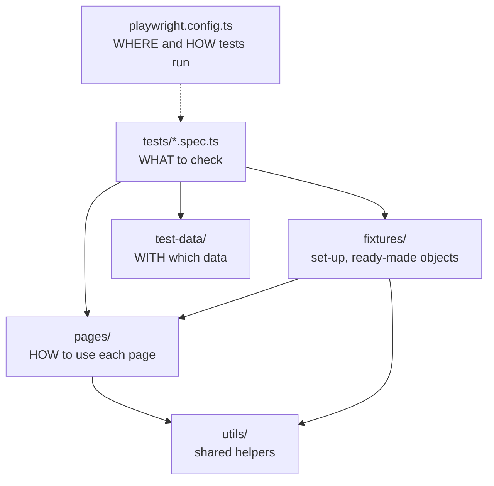

# Prerequisites

## P1 · Checklist before you start

- [ ] Your Day 9 tests pass: `npx playwright test tests/day9 --project=chromium` (Day 9)
- [ ] `tests/day9/practice-pages.ts` exists and exports `signInPage` and `enrolPage` (Day 9 · P3)
- [ ] Explain what a fixture is, and what `{ page }` does (Day 9 · F2)
- [ ] Export something from one file and import it into another (Day 8 · F7)

```quiz
id: d10-p1-q1
type: single
question: "`test-data/users.ts` exports `student`. What's the import line in `tests/day10/login.spec.ts`?"
options:
  - "`import { student } from '../test-data/users';`"
  - "`import { student } from '../../test-data/users';`"
  - "`import { student } from './test-data/users';`"
  - "`import student from 'test-data';`"
answer: b
explanation: "From tests/day10, go up two folders (../../) to reach the project folder, then into test-data."
```

## P2 · Why test code needs structure

Picture your suite six months from now: 300 tests. The *Sign in* button's text changes to *Log in*. If every test finds that button itself, you edit 300 files. If one file knows how to use the sign-in page, you edit one line.

You already organise manual testing this way:

| Manual testing | Automation framework |
|---|---|
| Test cases, grouped into suites | `tests/` — spec files, grouped with `test.describe` |
| Shared steps ("Log in as a student") | `pages/` — page objects that know how to use each page |
| Preconditions ("user is on the sign-in page") | Hooks and **fixtures** — set-up that runs before each test |
| Test-data sheets | `test-data/` — modules of users, products, messages |
| Test plan: which suites run where, how often | `playwright.config.ts` — browsers, retries, timeouts, reports |
| Tags on test cases: *smoke*, *regression* | Tags: `{ tag: '@smoke' }` |

A **framework** is simply this: an agreed structure, so that everyone knows where things live and each fact is written down **once**.

```quiz
id: d10-p2-q1
type: single
question: "The Sign in button is renamed to Log in. In a well-structured framework, how many places need changing?"
options:
  - Every test that signs in
  - One — the page object for the sign-in page
  - None — Playwright finds the new name automatically
  - Only the config file
answer: b
explanation: "Keeping each page's locators in one page object means a UI change is fixed in one place."
```

# Fundamentals

## F1 · The layers of a framework

Here's the structure you'll build today, inside `pw-course`:

```text
pw-course/
├── playwright.config.ts   ← how tests run: browsers, timeouts, reports
├── package.json           ← npm scripts: test, test:smoke, report…
├── tests/                 ← the tests themselves (*.spec.ts)
│   ├── day9/
│   └── day10/
├── pages/                 ← page objects: how to use each page
│   ├── SignInPage.ts
│   └── EnrolPage.ts
├── fixtures/              ← custom fixtures: ready-made set-up for tests
│   └── index.ts
├── test-data/             ← users, products, expected messages
│   ├── users.ts
│   └── messages.ts
└── utils/                 ← small helpers used by several layers
    └── practice-site.ts
```



| Layer | Holds | Rule of thumb |
|---|---|---|
| `tests/` | Test files — titles, steps, assertions | Reads like a test case: *what* is checked, not *how* to find each element |
| `pages/` | One page object per page or component | The only place that knows a page's locators |
| `fixtures/` | Custom fixtures (F7) | Set-up that many tests need, handed to them by name |
| `test-data/` | Plain data: users, products, messages | No browser code at all — just values |
| `utils/` | Small general helpers — dates, random emails, API calls | Used by several layers |
| `playwright.config.ts` | Browsers, timeouts, retries, reports, base URL | One place for decisions that apply to every test |

Folder names vary between teams — some say `page-objects/` or `data/` — but the idea is always the same: **each kind of thing has its own place**. Only `tests/` is special to Playwright, because the config's `testDir` points at it; the other folders are plain modules that tests import.

> [!NOTE] Naming conventions
> Test files: `feature.spec.ts` (`signin.spec.ts`). Page objects: the page name in PascalCase — every word capitalised — ending in `Page` (`SignInPage.ts`). Everything else: short, lower-case names with hyphens (`practice-site.ts`).

```quiz
id: d10-f1-q1
type: single
question: "Where does a list of 20 product names and prices, used by several search tests, belong?"
options:
  - "`tests/`"
  - "`pages/`"
  - "`test-data/`"
  - "`playwright.config.ts`"
answer: c
explanation: "It's plain data with no browser code, used by several tests: test-data."
```

## F2 · `playwright.config.ts` in depth

On Day 3 you changed one line of this file. Now you can read all of it. Here's the generated config, without its comment lines, plus a few settings you'll add today:

```ts mode=read
import { defineConfig, devices } from '@playwright/test';

export default defineConfig({
  testDir: './tests',
  fullyParallel: true,
  forbidOnly: !!process.env.CI,
  retries: process.env.CI ? 2 : 0,
  workers: process.env.CI ? 1 : undefined,
  timeout: 30_000,
  expect: { timeout: 5_000 },
  reporter: [['list'], ['html', { open: 'never' }]],
  use: {
    baseURL: 'https://qa-academy.test',
    trace: 'on-first-retry',
    screenshot: 'only-on-failure',
  },
  projects: [
    { name: 'chromium', use: { ...devices['Desktop Chrome'] } },
    { name: 'firefox', use: { ...devices['Desktop Firefox'] } },
    { name: 'webkit', use: { ...devices['Desktop Safari'] } },
  ],
});
```

The file **default-exports** (Day 8 · F7) one big settings object, wrapped in `defineConfig(…)` so that VS Code can check and autocomplete every setting.

### The top-level settings

| Setting | Meaning |
|---|---|
| `testDir: './tests'` | Where Playwright looks for `*.spec.ts` files |
| `fullyParallel: true` | Run tests **inside** each file in parallel too, not just different files |
| `forbidOnly: !!process.env.CI` | On a CI server, fail the run if a `test.only` was left in (Day 9 · F6) |
| `retries: process.env.CI ? 2 : 0` | Re-run a failed test up to 2 times on CI; never on your computer (Day 5 · F7) |
| `workers: process.env.CI ? 1 : undefined` | How many tests run at once. `undefined` lets Playwright choose based on your computer |
| `timeout: 30_000` | Maximum time for **each test**, including its `beforeEach` hooks and fixture set-up: 30 seconds (the default). `afterEach`, `beforeAll` and `afterAll` hooks each get their own limit of the same length |
| `expect: { timeout: 5_000 }` | How long each web-first assertion keeps retrying: 5 seconds (the default) |
| `reporter` | Which reports to produce: here, a list in the terminal plus the HTML report |

`30_000` is just `30000` written with an underscore to make it easier to read — the underscore is ignored.

### `process.env.CI` — one config, two environments

`process.env` holds the computer's **environment variables**: named settings the system passes to every program. CI servers such as GitHub Actions set a variable called `CI`. So `process.env.CI ? 2 : 0` (a ternary, Day 5 · F7) means *"on a CI server, 2 retries; on my computer, 0"*. In `forbidOnly`, `!` (Day 5 · F7) turns a value into its opposite true/false, and `!!` does that twice — so a variable that is set (truthy, Day 7 · F1) becomes `true`, and a missing one becomes `false`.

### `use` — settings for every test

`use` holds settings that affect the browser and page each test gets:

| Option | Example | Effect |
|---|---|---|
| `baseURL` | `'https://qa-academy.test'` | `page.goto('/signin')` opens `https://qa-academy.test/signin`. Change one line to test another environment |
| `trace` | `'on-first-retry'` | Record a trace when a test is retried. Also: `'on'`, `'off'`, `'retain-on-failure'`. Locally, where `retries` is 0, nothing is recorded — use `--trace on` (Day 2) when you need one |
| `screenshot` | `'only-on-failure'` | Attach a screenshot to each failed test in the report. Also: `'on'`, `'off'` |
| `video` | `'retain-on-failure'` | Keep a video of failed tests. Also: `'on'`, `'off'`, `'on-first-retry'` |
| `actionTimeout` | `10_000` | Maximum time for each action, such as `click()`. The default is no limit of its own — only the test's 30 s |

### `projects` — the same tests, several ways

Each **project** runs the whole suite once with its own settings — usually one per browser (Day 2 · F4). `devices['Desktop Chrome']` is a ready-made bundle of settings (browser, screen size and more). Here `...` is the **spread** operator: it copies every property of one object into another — so all of those settings land in the project's `use`. It looks like the rest parameter from Day 8 · F2, but does a different job. You can also add mobile projects, such as `devices['Pixel 7']`.

### Settings at three levels

Settings apply from the most general to the most specific, and the more specific one wins:

| Level | Where | Example |
|---|---|---|
| Whole suite | `use` at the top of the config | `screenshot: 'only-on-failure'` |
| One project | `use` inside a project | `...devices['Desktop Safari']` |
| One file or group | `test.use({ … })` in a spec file | `test.use({ viewport: { width: 375, height: 667 } });` |

```quiz
id: d10-f2-q1
type: single
question: "Tests pass on your computer but you want 2 retries on the CI server only. Which setting does that?"
options:
  - "`retries: 2`"
  - "`retries: process.env.CI ? 2 : 0`"
  - "`workers: process.env.CI ? 2 : 0`"
  - "`forbidOnly: 2`"
answer: b
explanation: "The ternary picks 2 when the CI environment variable is set, and 0 otherwise."
```

```quiz
id: d10-f2-q2
type: single
question: "With `baseURL: 'https://staging.shop.test'` in the config, what does `await page.goto('/cart')` open?"
options:
  - "`/cart` on the last page visited"
  - "`https://staging.shop.test/cart`"
  - "`https://playwright.dev/cart`"
  - "An error: goto needs a full URL"
answer: b
explanation: "A path starting with / is added to the baseURL. Switching environments then means changing one line."
```

```quiz
id: d10-f2-q3
type: single
question: "A web-first assertion gives up after 5 seconds, and a whole test after 30 seconds. Which two settings control these?"
options:
  - "`expect.timeout` and `timeout`"
  - "`actionTimeout` and `retries`"
  - "`workers` and `timeout`"
  - "`timeout` and `globalTimeout`"
answer: a
explanation: "expect: { timeout } is per assertion; the top-level timeout is per test."
```

## F3 · Grouping and shared set-up: `describe` and hooks

### `test.describe` — a test suite

`test.describe('title', () => { … })` groups related tests, like a suite in a test-management tool. The group title appears before each test's title in reports: `Sign-in › wrong password is rejected`.

```ts mode=read
test.describe('Sign-in', () => {
  test('valid student reaches the dashboard', async ({ page }) => { /* … */ });
  test('wrong password is rejected', async ({ page }) => { /* … */ });
});
```

### Hooks — code that runs around tests

If every test in a group starts with the same steps, move them into a **hook**:

| Hook | Runs… | Typical use |
|---|---|---|
| `test.beforeEach(async ({ page }) => { … })` | Before **every** test in its file or group | Open the page; sign in |
| `test.afterEach(async ({ page }) => { … })` | After every test — passed or failed | Clean-up; extra logging |
| `test.beforeAll(async () => { … })` | Once, before the first test in its file or group — **once per worker** | Expensive one-time set-up, such as creating test data through an API |
| `test.afterAll(async () => { … })` | Once, after the last test — once per worker | Removing that test data |

```ts mode=read
test.describe('Sign-in', () => {
  test.beforeEach(async ({ page }) => {
    await page.goto('/signin');            // every test in this group starts here
  });

  test('empty form shows a message', async ({ page }) => {
    await page.getByRole('button', { name: 'Sign in' }).click();
    await expect(page.getByRole('alert')).toHaveText('Please enter your email and password');
  });
});
```

`beforeEach` and `afterEach` can use fixtures like `page`; they get the **same** page as the test. `beforeAll` and `afterAll` can't use `page`, because they don't belong to any single test.

> [!WARNING] Don't share state between tests through `beforeAll`
> "Sign in once in `beforeAll`, then let all tests use that session" sounds efficient, but tests run in parallel and in separate contexts (Day 9 · F1). Each test should set up what it needs, in `beforeEach` or a fixture. (For fast sign-in, Playwright can save and reuse a signed-in state — a topic for later.)

```quiz
id: d10-f3-q1
type: single
question: "A describe block has a beforeEach and 4 tests. How many times does the beforeEach run?"
options:
  - "1"
  - "4"
  - "5"
  - "It depends on the number of workers"
answer: b
explanation: "beforeEach runs before every test in its group: 4 tests, 4 runs. (beforeAll is the one that depends on workers.)"
```

```quiz
id: d10-f3-q2
type: single
question: "A test fails halfway through. Which hook still runs for that test?"
options:
  - Only beforeAll
  - "afterEach"
  - None — hooks stop after a failure
  - Only beforeEach
answer: b
explanation: "afterEach runs after every test, passed or failed — that's what makes it suitable for clean-up."
```

## F4 · Tags, steps and better assertion messages

### Tags — choosing which tests run

Give tests **tags** in the details object — the optional argument between the title and the callback:

```ts mode=read
test('valid student reaches the dashboard', { tag: '@smoke' }, async ({ page }) => { /* … */ });
test('wrong password is rejected', { tag: ['@validation', '@auth'] }, async ({ page }) => { /* … */ });

test.describe('Enrolment', { tag: '@enrol' }, () => {
  // every test in here gets @enrol
});
```

Tags start with `@`. (Some teams write them in the title instead: `test('checkout works @smoke', …)` — that works too.) Then choose tests from the command line:

| Command | Runs |
|---|---|
| `npx playwright test --grep @smoke` | Only tests tagged `@smoke` |
| `npx playwright test --grep-invert @slow` | Everything **except** `@slow` tests |

To run tests with **either** of two tags, separate them with a vertical bar, which means "or":

```bash terminal
npx playwright test --grep "@smoke|@auth"
```

> [!TESTER]
> Typical tags: `@smoke` (a quick check that the build is usable), `@regression` (the full suite), `@slow`, and a feature name such as `@checkout`. They're the same labels you'd put on manual test cases.

### `test.step` — readable reports

Long tests read better in the report when they're split into named steps:

```ts mode=read
await test.step('Enter credentials and submit', async () => {
  await page.getByLabel('Email').fill('student@qa.academy');
  await page.getByLabel('Password').fill('Learn@123');
  await page.getByRole('button', { name: 'Sign in' }).click();
});
```

In the HTML report and the trace, the actions appear nested under *Enter credentials and submit*. When a test fails, you see immediately which step broke.

> [!TIP] Two extras for assertions
> A second argument to `expect` adds a custom message to the report when the assertion fails: `` await expect(page.getByTestId('seats'), 'seat count should drop after enrolling').toHaveText('Seats left: 11'); ``. And `expect.soft(…)` records a failure but lets the test continue, so you see **all** the problems on a page at once; the test is still marked failed at the end.

```quiz
id: d10-f4-q1
type: single
question: "Which command runs every test EXCEPT the ones tagged @slow?"
options:
  - "`npx playwright test --grep @slow`"
  - "`npx playwright test --grep-invert @slow`"
  - "`npx playwright test --skip @slow`"
  - "`npx playwright test -g !@slow`"
answer: b
explanation: "--grep-invert runs the tests that do NOT match."
```

## F5 · Test data and helpers as modules

Hard-coded values scattered through tests cause two problems: the same value is written in many places, and it's hard to see which data a test uses. Move them into **modules** (Day 8 · F7):

```ts mode=read
// test-data/users.ts
export type User = { email: string; password: string; name: string };

export const student: User = { email: 'student@qa.academy', password: 'Learn@123', name: 'Student' };
```

```ts mode=read
// tests/day10/signin.spec.ts
import { student } from '../../test-data/users';

await page.getByLabel('Email').fill(student.email);
```

Now the student's email is written once. The `User` type means TypeScript checks every user you add (Day 6).

| Put in `test-data/` | Put in `utils/` |
|---|---|
| Users, products, addresses | A function that builds a unique email: `uniqueEmail('asha')` |
| Expected messages and texts | A function that formats a date the way the app shows it |
| Lists for data-driven tests (Day 9 · ex5) | Anything that *does* something rather than *is* something |

> [!WARNING] Passwords and secrets
> Test data files end up in version control, where everyone can read them. Real passwords, API keys and tokens belong in **environment variables** — `process.env.STUDENT_PASSWORD` — set on the CI server or in a local `.env` file that is never committed. The generated config has commented-out lines for reading a `.env` file with a package called `dotenv`. Our practice password is fine to keep in the code: it's for a pretend site.

```quiz
id: d10-f5-q1
type: single
question: "Where should the password for your company's real staging admin account be stored?"
options:
  - "In `test-data/users.ts`, so every test can import it"
  - "In an environment variable, read with `process.env`"
  - "In the test's title"
  - "In `playwright.config.ts`, under use"
answer: b
explanation: "Secrets stay out of code and version control. Environment variables are set on the CI server or in an uncommitted .env file."
```

## F6 · Page objects

A **page object** gathers everything tests need to know about one page — its locators and the actions a user can take there — into one module. Tests then say *what* they do (`signInPage.signIn(email, password)`) instead of *how* (three locators and three actions).

Page objects are usually written as a **class**. You haven't met classes yet, so here's the minimum you need:

```ts mode=read
import type { Page, Locator } from '@playwright/test';

export class SignInPage {                         // ① a class: a blueprint for objects
  readonly page: Page;                            // ② properties, each with a type
  readonly emailField: Locator;

  constructor(page: Page) {                       // ③ runs once, when a test writes: new SignInPage(page)
    this.page = page;                             //    "this" = the object being built
    this.emailField = page.getByLabel('Email');
  }

  async goto(): Promise<void> {                   // ④ a method: a function that belongs to the object
    await this.page.goto('/signin');
  }
}
```

| # | Part | Meaning |
|---|---|---|
| ① | `class SignInPage { … }` | A **blueprint**. It describes what every sign-in page object has and can do |
| ② | Properties | Values each object holds, like an object's properties (Day 6). `readonly` means they're set once, in the constructor, and never replaced |
| ③ | `constructor` | Set-up code that runs when an object is created with `new SignInPage(page)`. Inside a class, `this` means "the object itself" |
| ④ | Methods | Functions that belong to the object. They use `this.` to reach its properties |

A class name also works as a **type**: `let signInPage: SignInPage;` means "an object built from the SignInPage class".

Using it in a test:

```ts mode=read
const signInPage = new SignInPage(page);    // build an object from the blueprint
await signInPage.goto();
await signInPage.emailField.fill('student@qa.academy');
```

`Page` and `Locator` are types from Playwright — the types of `page` and of what `getByRole` & co. return — so they're imported with `import type` (Day 8 · F7).

> [!TIP] What goes in a page object?
> Locators and user actions: `signIn(email, password)`, `enrol(details)`. Assertions usually stay in the **tests**, because *what* to check differs from test to test.

```quiz
id: d10-f6-q1
type: single
question: "What does `new SignInPage(page)` do?"
options:
  - Opens a new browser tab
  - Creates an object from the SignInPage class, running its constructor with this page
  - Navigates to the sign-in page
  - Imports the SignInPage file
answer: b
explanation: "new builds an object from the class, and the constructor sets up its properties. Navigating happens only when you call goto()."
```

## F7 · Custom fixtures

On Day 9 you used Playwright's built-in fixtures, like `page`. You can add **your own**, so that tests can simply ask for a ready-to-use page object:

```ts mode=read
test('wrong password is rejected', async ({ signInPage }) => {    // ← our own fixture
  await signInPage.signIn('student@qa.academy', 'wrong');
  await expect(signInPage.message).toHaveText('Invalid email or password');
});
```

You define custom fixtures once, by **extending** Playwright's `test`:

```ts mode=read
import { test as base } from '@playwright/test';            // import test, but call it "base" here
import { SignInPage } from '../pages/SignInPage';

type QaAcademyFixtures = { signInPage: SignInPage };

export const test = base.extend<QaAcademyFixtures>({
  signInPage: async ({ page }, use) => {
    const signInPage = new SignInPage(page);      // set-up…
    await signInPage.goto();
    await use(signInPage);                        // …hand it to the test, and wait while the test runs…
    // …anything here is clean-up, after the test
  },
});

export { expect } from '@playwright/test';        // pass expect through, so tests import both from here
```

| Piece | Meaning |
|---|---|
| `test as base` | Import `test`, but name it `base` in this file — because we're about to create our own `test` |
| `base.extend<QaAcademyFixtures>({ … })` | A new `test` with everything the original has, plus the fixtures described by the type in angle brackets |
| `async ({ page }, use) => { … }` | How to build the fixture. It can ask for other fixtures, like `page` |
| `await use(value)` | Hands `value` to the test and waits until the test finishes. Code before it is set-up; code after it is clean-up |
| `export { expect } from …` | Re-exports Playwright's `expect` unchanged |

Tests then import from **your** fixtures file instead of from `@playwright/test`:

```ts mode=read
import { test, expect } from '../../fixtures';
```

Fixtures versus `beforeEach`: both do set-up, but a fixture is **reusable across files**, runs **only for tests that ask for it**, and keeps its set-up and clean-up together. Hooks are fine for set-up that belongs to one file.

```quiz
id: d10-f7-q1
type: single
question: "In a fixture, what does `await use(signInPage)` do?"
options:
  - Calls signInPage's goto() method
  - Hands signInPage to the test and waits until the test finishes, before any clean-up runs
  - Registers a new test
  - Imports the SignInPage class
answer: b
explanation: "Everything before use() is set-up, everything after is clean-up, and the test runs in between."
```

# Implementation

Today's files go into several folders of `pw-course`. Run commands from the `pw-course` folder.

## I1 · Update your config

Open `playwright.config.ts` and make it look like this. Your file also contains commented-out lines from the generator; keep them or delete them, as you prefer. The new settings are `timeout`, `expect`, `baseURL` and `screenshot`:

```ts file=playwright.config.ts mode=editor
import { defineConfig, devices } from '@playwright/test';

export default defineConfig({
  // Where the tests are
  testDir: './tests',

  // Run the tests inside each file in parallel, too
  fullyParallel: true,

  // On a CI server, fail the run if a test.only was left in the code
  forbidOnly: !!process.env.CI,

  // Retry failed tests twice on CI, never on your own computer
  retries: process.env.CI ? 2 : 0,

  // On CI, one worker at a time; locally, let Playwright decide
  workers: process.env.CI ? 1 : undefined,

  // Time limits
  timeout: 30_000,                 // each test, with its beforeEach hooks: 30 s
  expect: { timeout: 5_000 },      // each web-first assertion: 5 s

  // Reports: a list in the terminal, and an HTML report that doesn't open by itself
  reporter: [['list'], ['html', { open: 'never' }]],

  // Settings shared by every test in every project
  use: {
    baseURL: 'https://qa-academy.test',   // page.goto('/signin') opens https://qa-academy.test/signin
    trace: 'on-first-retry',              // record a trace when a test is retried
    screenshot: 'only-on-failure',        // attach a screenshot to every failed test
  },

  // One project per browser: every test runs once in each
  projects: [
    { name: 'chromium', use: { ...devices['Desktop Chrome'] } },
    { name: 'firefox', use: { ...devices['Desktop Firefox'] } },
    { name: 'webkit', use: { ...devices['Desktop Safari'] } },
  ],
});
```

`timeout` and `expect.timeout` are set to their default values, so nothing changes yet — but now the limits are visible, and easy to change. Run your Day 9 tests to check that nothing broke:

```bash terminal
npx playwright test tests/day9 --project=chromium
```

## I2 · Create the framework folders

Create three folders next to `tests`:

```bash terminal
mkdir pages fixtures test-data utils
```

**A stand-in for the real website.** Our practice pages aren't on the internet. This helper answers the browser's requests to `https://qa-academy.test` with them, using `page.route` — the network mocking you saw on Day 2 · I6. Tests can then use `page.goto('/signin')`, just as they would with a real site:

```ts file=utils/practice-site.ts mode=editor
import type { Page } from '@playwright/test';
import { signInPage, enrolPage } from '../tests/day9/practice-pages';

// Stands in for a real web server: answers the browser's requests to
// https://qa-academy.test with our practice pages. A real project doesn't need this —
// its tests open the real application.
export async function serveQaAcademy(page: Page): Promise<void> {
  await page.route('https://qa-academy.test/signin', (route) =>
    route.fulfill({ contentType: 'text/html', body: signInPage }));
  await page.route('https://qa-academy.test/enrol', (route) =>
    route.fulfill({ contentType: 'text/html', body: enrolPage }));
}
```

**Test data**: the users and the messages, each written once:

```ts file=test-data/users.ts mode=editor
// Test users, in one place. Tests import what they need.
export type User = { email: string; password: string; name: string };

export const student: User = {
  email: 'student@qa.academy',
  password: 'Learn@123',
  name: 'Student',
};

export const wrongPassword: User = {
  email: 'student@qa.academy',
  password: 'not-my-password',
  name: 'Student',
};
```

```ts file=test-data/messages.ts mode=editor
// Every message the sign-in page can show, spelled exactly once
export const signInMessages = {
  empty: 'Please enter your email and password',
  invalid: 'Invalid email or password',
  signingIn: 'Signing in…',
};
```

## I3 · A suite with `describe`, hooks, tags and steps

The Day 9 sign-in tests, reorganised. Compare them with `tests/day9/signin.spec.ts`: the set-up is written once, the data comes from `test-data`, and the tests are grouped and tagged.

```ts file=tests/day10/signin.spec.ts mode=editor run="npx playwright test tests/day10/signin.spec.ts --project=chromium"
import { test, expect } from '@playwright/test';
import { serveQaAcademy } from '../../utils/practice-site';
import { student, wrongPassword } from '../../test-data/users';
import { signInMessages } from '../../test-data/messages';

test.describe('Sign-in', () => {
  // Runs before EACH test in this group: every test starts on the sign-in page
  test.beforeEach(async ({ page }) => {
    await serveQaAcademy(page);
    await page.goto('/signin');                      // baseURL + '/signin'
  });

  test('valid student reaches the dashboard', { tag: ['@smoke', '@auth'] }, async ({ page }) => {
    await test.step('Enter credentials and submit', async () => {
      await page.getByLabel('Email').fill(student.email);
      await page.getByLabel('Password').fill(student.password);
      await page.getByRole('button', { name: 'Sign in' }).click();
    });

    await test.step('See the dashboard', async () => {
      await expect(page.getByRole('heading', { name: 'Dashboard' })).toBeVisible();
      await expect(page.getByText(`Welcome back, ${student.name}!`)).toBeVisible();
    });
  });

  test('empty form shows a message', { tag: '@validation' }, async ({ page }) => {
    await page.getByRole('button', { name: 'Sign in' }).click();
    await expect(page.getByRole('alert')).toHaveText(signInMessages.empty);
  });

  test('wrong password is rejected', { tag: ['@validation', '@auth'] }, async ({ page }) => {
    await page.getByLabel('Email').fill(wrongPassword.email);
    await page.getByLabel('Password').fill(wrongPassword.password);
    await page.getByRole('button', { name: 'Sign in' }).click();
    await expect(page.getByRole('alert')).toHaveText(signInMessages.invalid);
  });
});
```

```output terminal
Running 3 tests using 2 workers

  ✓  1 [chromium] › tests/day10/signin.spec.ts:13:7 › Sign-in › valid student reaches the dashboard @smoke @auth (1.2s)
  ✓  2 [chromium] › tests/day10/signin.spec.ts:26:7 › Sign-in › empty form shows a message @validation (250ms)
  ✓  3 [chromium] › tests/day10/signin.spec.ts:31:7 › Sign-in › wrong password is rejected @validation @auth (258ms)

  3 passed (2.5s)
```

The group title *Sign-in ›* and the tags appear in every line. Now pick tests by tag:

```bash terminal
npx playwright test tests/day10/signin.spec.ts --project=chromium --grep @smoke
npx playwright test tests/day10/signin.spec.ts --project=chromium --grep-invert @validation
```

Open the report (`npx playwright show-report`) and click the first test: its actions are grouped under the two step names.

## I4 · Watch the hooks run in order

```ts file=tests/day10/hooks.spec.ts mode=editor run="npx playwright test tests/day10/hooks.spec.ts --project=chromium --workers=1"
import { test } from '@playwright/test';

test.beforeAll(async () => {
  console.log('beforeAll  - once, before the first test in this file');
});

test.beforeEach(async () => {
  console.log('  beforeEach - before every test');
});

test.afterEach(async () => {
  console.log('  afterEach  - after every test, passed or failed');
});

test.afterAll(async () => {
  console.log('afterAll   - once, after the last test in this file');
});

test('first test', async () => {
  console.log('    first test');
});

test.describe('a group', () => {
  test.beforeEach(async () => {
    console.log('    group beforeEach - only for tests in this group, after the outer one');
  });

  test('second test', async () => {
    console.log('      second test');
  });
});
```

```output terminal
Running 2 tests using 1 worker

beforeAll  - once, before the first test in this file
  beforeEach - before every test
    first test
  afterEach  - after every test, passed or failed
  ✓  1 [chromium] › tests/day10/hooks.spec.ts:19:5 › first test (1ms)
  beforeEach - before every test
    group beforeEach - only for tests in this group, after the outer one
      second test
  afterEach  - after every test, passed or failed
afterAll   - once, after the last test in this file
  ✓  2 [chromium] › tests/day10/hooks.spec.ts:28:7 › a group › second test (0ms)

  2 passed (623ms)
```

The outer `beforeEach` runs for **both** tests; the group's `beforeEach` only for the test inside the group, after the outer one. `--workers=1` makes the order easy to read. With several workers, each worker runs its own `beforeAll` and `afterAll`.

**Try it:** run it again without `--workers=1`. With `fullyParallel`, the two tests may land on different workers — count how many times `beforeAll` is printed. (Usually twice: once per worker.)

## I5 · Your first page object and custom fixture

**1. The page object** — everything about the sign-in page, in one place:

```ts file=pages/SignInPage.ts mode=editor
import type { Page, Locator } from '@playwright/test';

// A page object: everything tests need to know about the sign-in page, in one place
export class SignInPage {
  // Properties: the page, and the locators for its elements
  readonly page: Page;
  readonly emailField: Locator;
  readonly passwordField: Locator;
  readonly signInButton: Locator;
  readonly message: Locator;

  // The constructor runs once, when a test writes: new SignInPage(page)
  constructor(page: Page) {
    this.page = page;
    this.emailField = page.getByLabel('Email');
    this.passwordField = page.getByLabel('Password');
    this.signInButton = page.getByRole('button', { name: 'Sign in' });
    this.message = page.getByRole('alert');
  }

  // Methods: the actions a user can take here
  async goto(): Promise<void> {
    await this.page.goto('/signin');
  }

  async signIn(email: string, password: string): Promise<void> {
    await this.emailField.fill(email);
    await this.passwordField.fill(password);
    await this.signInButton.click();
  }
}
```

**2. The fixture** — hands every test that asks for it a signed-out sign-in page, ready to use:

```ts file=fixtures/index.ts mode=editor
import { test as base } from '@playwright/test';
import { SignInPage } from '../pages/SignInPage';
import { serveQaAcademy } from '../utils/practice-site';

// The extra fixtures our tests can ask for
type QaAcademyFixtures = {
  signInPage: SignInPage;
};

// A new test() that has everything the normal one has, plus our fixtures
export const test = base.extend<QaAcademyFixtures>({
  signInPage: async ({ page }, use) => {
    await serveQaAcademy(page);               // set-up: make the practice site available
    const signInPage = new SignInPage(page);
    await signInPage.goto();
    await use(signInPage);                    // hand it to the test, and wait until the test ends
    // anything after use() is clean-up, and runs after the test
  },
});

// Re-export expect, so tests import both from one place
export { expect } from '@playwright/test';
```

**3. The tests** — short, and readable by anyone on the team:

```ts file=tests/day10/signin-pom.spec.ts mode=editor run="npx playwright test tests/day10/signin-pom.spec.ts --project=chromium"
import { test, expect } from '../../fixtures';
import { student, wrongPassword } from '../../test-data/users';
import { signInMessages } from '../../test-data/messages';

test('valid student reaches the dashboard', { tag: '@smoke' }, async ({ signInPage, page }) => {
  await signInPage.signIn(student.email, student.password);
  await expect(page.getByRole('heading', { name: 'Dashboard' })).toBeVisible();
});

test('wrong password is rejected', async ({ signInPage }) => {
  await signInPage.signIn(wrongPassword.email, wrongPassword.password);
  await expect(signInPage.message).toHaveText(signInMessages.invalid);
});

test('empty form shows a message', async ({ signInPage }) => {
  await signInPage.signIn('', '');
  await expect(signInPage.message).toHaveText(signInMessages.empty);
});
```

```output terminal
Running 3 tests using 2 workers

  ✓  1 [chromium] › tests/day10/signin-pom.spec.ts:5:5 › valid student reaches the dashboard @smoke (1.1s)
  ✓  2 [chromium] › tests/day10/signin-pom.spec.ts:10:5 › wrong password is rejected (249ms)
  ✓  3 [chromium] › tests/day10/signin-pom.spec.ts:15:5 › empty form shows a message (247ms)

  3 passed (2.5s)
```

The first test asks for **two** fixtures, `signInPage` and `page`: they share the same browser page, because the `signInPage` fixture was built from `page`.

Compare the three versions of "wrong password is rejected": Day 9 (everything inline), I3 (hooks and test data) and this one. Each step moved a kind of knowledge to its own layer, and the test itself got shorter and closer to the test case.

**Try it:** the product owner renames the button to *Log in*. Which single line would you change? (Answer: `signInButton` in `SignInPage.ts`.)

## I6 · npm scripts for the framework

Give your smoke run a short name (Day 3 · I8):

```bash terminal
npm pkg set scripts.test:smoke="playwright test --grep @smoke"
```

```bash terminal
npm run test:smoke -- --list
```

```output terminal
Listing tests:
  [chromium] › day10/signin-pom.spec.ts:5:5 › valid student reaches the dashboard
  [chromium] › day10/signin.spec.ts:13:7 › Sign-in › valid student reaches the dashboard
  [firefox] › day10/signin-pom.spec.ts:5:5 › valid student reaches the dashboard
  [firefox] › day10/signin.spec.ts:13:7 › Sign-in › valid student reaches the dashboard
  [webkit] › day10/signin-pom.spec.ts:5:5 › valid student reaches the dashboard
  [webkit] › day10/signin.spec.ts:13:7 › Sign-in › valid student reaches the dashboard
Total: 6 tests in 2 files
```

`--list` shows what **would** run, without running it: a quick way to check that your tags pick the right tests. Two smoke tests × three browsers = six runs.

# Practice

## Quiz · Day 10 check

```quiz
id: d10-pr-q1
type: single
question: "What does `fullyParallel: true` add, compared with the default?"
options:
  - Tests run in all browsers at once
  - Tests inside the same file can also run in parallel, not only different files
  - Tests retry in parallel
  - Hooks run in parallel with tests
answer: b
explanation: "By default, files run in parallel but the tests inside one file run in order. fullyParallel lets them spread across workers too."
```

```quiz
id: d10-pr-q2
type: single
question: "Where should the locator for the 'Enrol now' button live in a framework?"
options:
  - In every test that clicks it
  - In the EnrolPage page object
  - In test-data/messages.ts
  - In playwright.config.ts
answer: b
explanation: "Page objects are the one place that knows a page's locators."
```

```quiz
id: d10-pr-q3
type: single
question: "`test.describe('Cart', { tag: '@cart' }, () => { … })` contains 5 tests. Which tests does `--grep @cart` run?"
options:
  - None — tags only work on single tests
  - All 5 — the group's tag applies to every test inside it
  - Only the first test
  - Only tests that also have @cart in their own title
answer: b
explanation: "A tag on a describe block is given to every test in it."
```

```quiz
id: d10-pr-q4
type: single
question: "Why can't `test.beforeAll` use the page fixture?"
options:
  - Because beforeAll runs after the tests
  - Because it doesn't belong to any single test, and every test gets its own page
  - Because beforeAll can't be async
  - It can — page works everywhere
answer: b
explanation: "page is created fresh for each test. beforeAll runs once for a group of tests, so there's no single page to hand it."
```

```quiz
id: d10-pr-q5
type: single
question: "A test imports `{ test, expect } from '../../fixtures'` instead of `'@playwright/test'`. Why?"
options:
  - "The fixtures file's test has the team's custom fixtures, such as signInPage"
  - It makes the tests run faster
  - "@playwright/test can only be imported once per project"
  - It's required for tags to work
answer: a
explanation: "The extended test has all the built-in fixtures plus the custom ones; expect is re-exported for convenience."
```

```quiz
id: d10-pr-q6
type: multiple
question: "Which belong in a page object? (Select all that apply)"
options:
  - "The locator for the Email field"
  - "A method `signIn(email, password)`"
  - "The list of 50 test users"
  - "The number of retries on CI"
answer: [a, b]
explanation: "Page objects hold a page's locators and actions. Users go in test-data; retries go in the config."
```

```quiz
id: d10-pr-q8
type: single
question: "In a fixture, where does clean-up code go?"
options:
  - Before `await use(…)`
  - After `await use(…)`
  - In the test itself
  - In playwright.config.ts
answer: b
explanation: "Code after use() runs after the test has finished — the natural place for clean-up."
```

## Where does it belong?

````exercise
id: d10-pr-sort
title: Sort the framework pieces
level: easy
type: written
prompt: |
  For each item, name the place it belongs: `tests/`, `pages/`, `fixtures/`, `test-data/`, `utils/`, `playwright.config.ts`, or an environment variable.

  1. A function that returns today's date in the format the app shows, e.g. `25 Sep 2026`
  2. The locators and actions for the checkout page
  3. "Run every test in Chromium and on a Pixel 7 phone"
  4. The expected error texts of the registration form
  5. `test('TC-512 guest can check out', …)`
  6. Set-up that gives tests a signed-in dashboard page, used by 40 tests in 12 files
  7. The API key for the payment provider's test account
  8. A 1-minute time limit for every test
modelAnswer: |
  1. `utils/` — a helper that *does* something, used in several places.
  2. `pages/` — a `CheckoutPage` page object.
  3. `playwright.config.ts` — two projects, one with `devices['Pixel 7']`.
  4. `test-data/` — plain values, written once.
  5. `tests/` — a spec file, such as `tests/checkout.spec.ts`.
  6. `fixtures/` — a custom fixture, reusable across files (a `beforeEach` would have to be repeated in each of the 12 files).
  7. An environment variable — secrets never go in the code.
  8. `playwright.config.ts` — `timeout: 60_000`.
````

## Mini-project · Organise the enrolment suite

Build the same structure for the **enrol page**, in five steps (Step 4 is an optional challenge).

````exercise
id: d10-ex1
title: "Step 1: enrolment test data"
level: easy
type: code
prompt: |
  Create `test-data/enrolments.ts` that exports:

  1. A type `Enrolment` with `fullName`, `email` and `course` (all strings).
  2. Two enrolments:
     - `asha`: `Asha Verma`, `asha@example.com`, `API Testing`
     - `noAtSign`: `Ravi Kumar`, `ravi.example.com`, `Playwright Basics`
  3. An object `enrolMessages` with three properties: `nameRequired` (`Name is required`), `invalidEmail` (`Enter a valid email`) and `chooseCourse` (`Please choose a course`).

  It has no tests of its own — Steps 2 and 3 use it, and VS Code underlines any type mistakes as you type.
file: test-data/enrolments.ts
hints:
  - "Copy the shape of test-data/users.ts."
  - "`export const enrolMessages = { nameRequired: 'Name is required', … };`"
solution: |
  // Test data for the enrolment page
  export type Enrolment = { fullName: string; email: string; course: string };

  export const asha: Enrolment = {
    fullName: 'Asha Verma',
    email: 'asha@example.com',
    course: 'API Testing',
  };

  export const noAtSign: Enrolment = {
    fullName: 'Ravi Kumar',
    email: 'ravi.example.com',
    course: 'Playwright Basics',
  };

  export const enrolMessages = {
    nameRequired: 'Name is required',
    invalidEmail: 'Enter a valid email',
    chooseCourse: 'Please choose a course',
  };
````

````exercise
id: d10-ex2
title: "Step 2: the EnrolPage page object"
level: medium
type: code
prompt: |
  Create `pages/EnrolPage.ts` with a class `EnrolPage`, modelled on `SignInPage`:

  1. Properties (all `readonly`): `page`, and locators `nameField`, `emailField`, `courseList`, `termsCheckbox`, `enrolButton`, `status` and `seats`. Use the locators from Day 9 · I4.
  2. A method `goto()` that opens `/enrol`.
  3. A method `enrol(enrolment: Enrolment)` that fills the name and email, selects the course, ticks the terms and clicks *Enrol now*. Import the `Enrolment` type from Step 1 with `import type`.
file: pages/EnrolPage.ts
hints:
  - "`import type { Enrolment } from '../test-data/enrolments';`"
  - "`this.courseList = page.getByLabel('Course');` and later `await this.courseList.selectOption(enrolment.course);`"
  - "The seats text has a test id: `page.getByTestId('seats')`."
solution: |
  import type { Page, Locator } from '@playwright/test';
  import type { Enrolment } from '../test-data/enrolments';

  // Page object for the course enrolment page
  export class EnrolPage {
    readonly page: Page;
    readonly nameField: Locator;
    readonly emailField: Locator;
    readonly courseList: Locator;
    readonly termsCheckbox: Locator;
    readonly enrolButton: Locator;
    readonly status: Locator;
    readonly seats: Locator;

    constructor(page: Page) {
      this.page = page;
      this.nameField = page.getByLabel('Full name');
      this.emailField = page.getByLabel('Email');
      this.courseList = page.getByLabel('Course');
      this.termsCheckbox = page.getByRole('checkbox', { name: 'I accept the terms' });
      this.enrolButton = page.getByRole('button', { name: 'Enrol now' });
      this.status = page.getByRole('status');
      this.seats = page.getByTestId('seats');
    }

    async goto(): Promise<void> {
      await this.page.goto('/enrol');
    }

    // Fill the whole form, accept the terms and submit
    async enrol(enrolment: Enrolment): Promise<void> {
      await this.nameField.fill(enrolment.fullName);
      await this.emailField.fill(enrolment.email);
      await this.courseList.selectOption(enrolment.course);
      await this.termsCheckbox.check();
      await this.enrolButton.click();
    }
  }
````

````exercise
id: d10-ex3
title: "Step 3: the enrolment suite"
level: medium
type: code
prompt: |
  Create `tests/day10/enrol.spec.ts`:

  1. A `test.describe('Enrolment', { tag: '@enrol' }, …)` group.
  2. Inside it, declare `let enrolPage: EnrolPage;` and a `beforeEach` that calls `serveQaAcademy(page)`, creates the page object and opens the page.
  3. Four tests:
     - `student can enrol in a course` (tag `@smoke`): enrol `asha`; in a `test.step` named `Confirmation and seat count`, check the status says `Thanks, Asha! You are enrolled in API Testing.` and the seats say `Seats left: 11`
     - `an email without @ is rejected`: enrol `noAtSign`; check the status shows `enrolMessages.invalidEmail` and seats stay at 12
     - `a name is required`: enrol `{ fullName: '', email: 'asha@example.com', course: 'API Testing' }`; check for `enrolMessages.nameRequired`
     - `enrol button needs the terms`: the button starts disabled, and is enabled after ticking the terms

  Run it, then run only its smoke test:
  ```
  npx playwright test tests/day10/enrol.spec.ts --project=chromium
  npx playwright test tests/day10/enrol.spec.ts --project=chromium --grep @smoke
  ```
file: tests/day10/enrol.spec.ts
run: npx playwright test tests/day10/enrol.spec.ts --project=chromium
hints:
  - "A variable declared in the describe block, and assigned in beforeEach, is visible to every test in the group."
  - "In beforeEach: `enrolPage = new EnrolPage(page); await enrolPage.goto();`"
  - "The tests don't need `{ page }` at all: `async () => { await enrolPage.enrol(asha); … }`."
solution: |
  import { test, expect } from '@playwright/test';
  import { EnrolPage } from '../../pages/EnrolPage';
  import { serveQaAcademy } from '../../utils/practice-site';
  import { asha, noAtSign, enrolMessages } from '../../test-data/enrolments';

  test.describe('Enrolment', { tag: '@enrol' }, () => {
    let enrolPage: EnrolPage;

    test.beforeEach(async ({ page }) => {
      await serveQaAcademy(page);
      enrolPage = new EnrolPage(page);
      await enrolPage.goto();
    });

    test('student can enrol in a course', { tag: '@smoke' }, async () => {
      await enrolPage.enrol(asha);

      await test.step('Confirmation and seat count', async () => {
        await expect(enrolPage.status).toHaveText('Thanks, Asha! You are enrolled in API Testing.');
        await expect(enrolPage.seats).toHaveText('Seats left: 11');
      });
    });

    test('an email without @ is rejected', async () => {
      await enrolPage.enrol(noAtSign);
      await expect(enrolPage.status).toHaveText(enrolMessages.invalidEmail);
      await expect(enrolPage.seats).toHaveText('Seats left: 12');
    });

    test('a name is required', async () => {
      await enrolPage.enrol({ fullName: '', email: 'asha@example.com', course: 'API Testing' });
      await expect(enrolPage.status).toHaveText(enrolMessages.nameRequired);
    });

    test('enrol button needs the terms', async () => {
      await expect(enrolPage.enrolButton).toBeDisabled();
      await enrolPage.termsCheckbox.check();
      await expect(enrolPage.enrolButton).toBeEnabled();
    });
  });
````

````exercise
id: d10-ex4
title: "Step 4 (optional challenge): an enrolPage fixture"
level: challenge
type: code
prompt: |
  Add an `enrolPage` fixture to `fixtures/index.ts`, next to `signInPage`, so that a test can simply write:
  ```ts
  test('enrolling through the fixture', async ({ enrolPage }) => {
    await enrolPage.enrol(asha);
    await expect(enrolPage.seats).toHaveText('Seats left: 11');
  });
  ```
  1. Add `enrolPage: EnrolPage` to the fixtures type.
  2. Add the fixture: serve the site, create the page object, open the page, `use` it.
  3. Put the test above in `tests/day10/enrol-fixture.spec.ts` (importing `test` and `expect` from your fixtures, and `asha` from the test data), and run it.
file: fixtures/index.ts
hints:
  - "The type becomes `{ signInPage: SignInPage; enrolPage: EnrolPage }`."
  - "Copy the signInPage fixture and change the class and the names."
solution: |
  import { test as base } from '@playwright/test';
  import { SignInPage } from '../pages/SignInPage';
  import { EnrolPage } from '../pages/EnrolPage';
  import { serveQaAcademy } from '../utils/practice-site';

  // The extra fixtures our tests can ask for
  type QaAcademyFixtures = {
    signInPage: SignInPage;
    enrolPage: EnrolPage;
  };

  // A new test() that has everything the normal one has, plus our fixtures
  export const test = base.extend<QaAcademyFixtures>({
    signInPage: async ({ page }, use) => {
      await serveQaAcademy(page);
      const signInPage = new SignInPage(page);
      await signInPage.goto();
      await use(signInPage);
    },

    enrolPage: async ({ page }, use) => {
      await serveQaAcademy(page);
      const enrolPage = new EnrolPage(page);
      await enrolPage.goto();
      await use(enrolPage);
    },
  });

  export { expect } from '@playwright/test';
````

````exercise
id: d10-ex5
title: "Step 5: a script for the suite"
level: easy
type: terminal
prompt: |
  Add an npm script `test:enrol` that runs only the `@enrol` tests in Chromium, then run it.
solution: |
  npm pkg set scripts.test:enrol="playwright test --grep @enrol --project=chromium"
  npm run test:enrol
````

## Reflection

1. In one sentence each: what goes in `tests/`, `pages/`, `fixtures/`, `test-data/` and `utils/`?
2. Which config settings would you change to (a) test a different environment, (b) get a video of each failed test, (c) give slow tests 60 seconds?
3. When would you use a `beforeEach` hook, and when a custom fixture?
4. Why do assertions usually stay in tests rather than in page objects?
5. Compare the three versions of "wrong password is rejected" (Day 9, I3 and I5). What changed, and why is each step an improvement?

> [!TIP] Two weeks done
> You started with *what Playwright is* and finished with an organised framework: TypeScript fundamentals, a real test runner, locators and web-first assertions, configuration, hooks, tags, test data, page objects and fixtures. Next steps: more page objects for bigger journeys, reusing a signed-in state, API testing with the `request` fixture, visual comparisons, and running your suite on a CI server.
