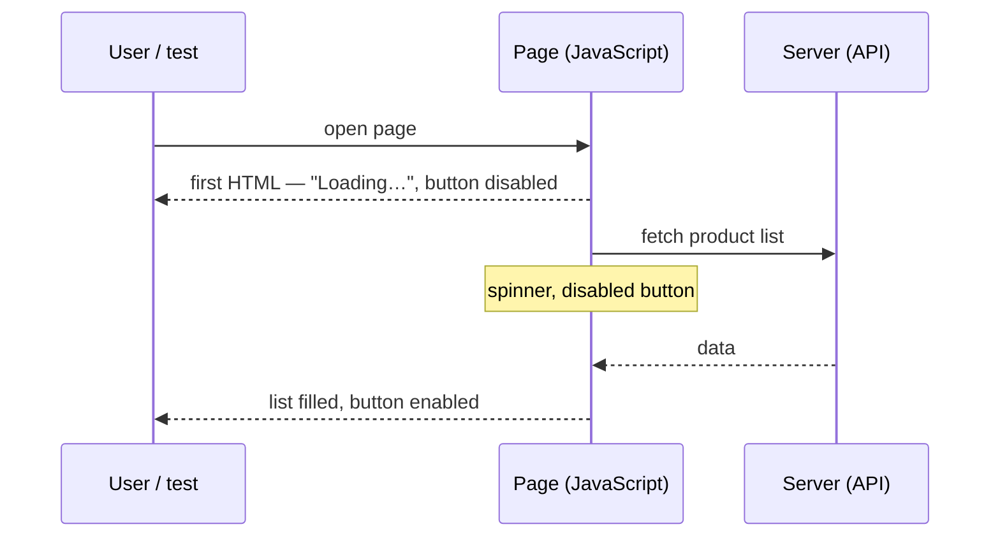
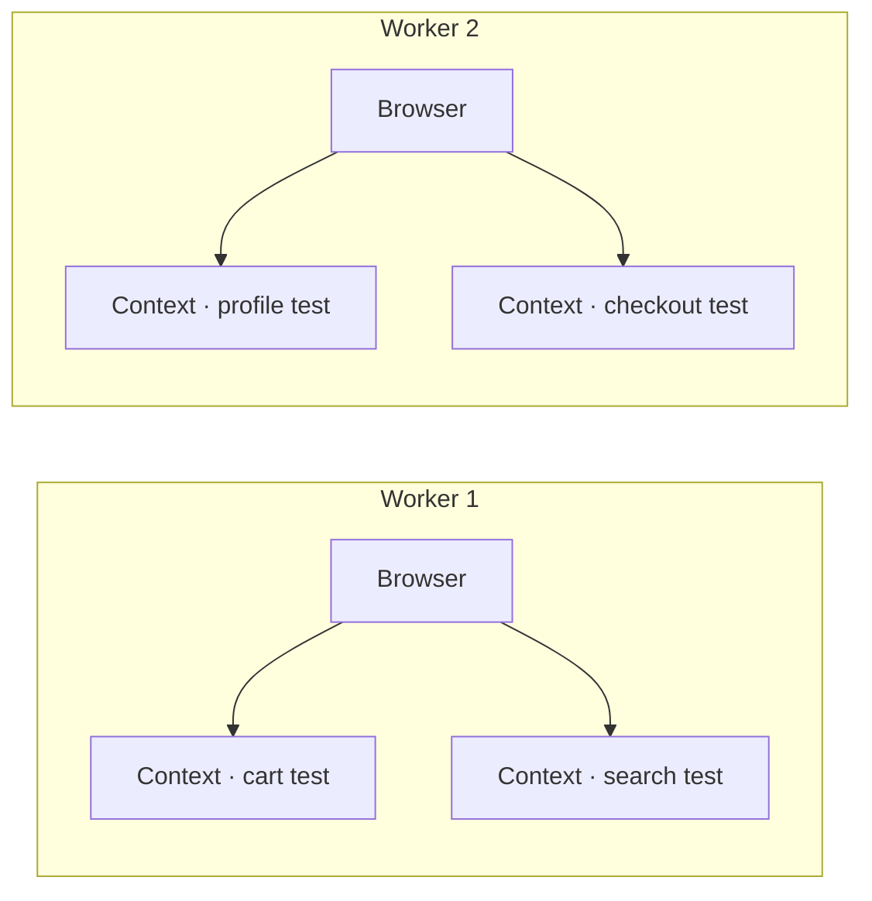
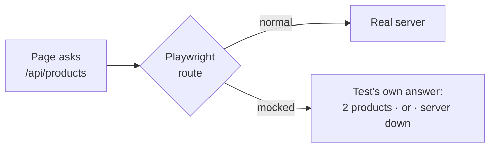

# Prerequisites

## P1 · Why automated tests become unreliable

Yesterday you met the word **flaky**: a test that sometimes passes and sometimes fails, although nobody changed the code. Flaky tests are the number one reason automation projects lose trust — when a red result might be "just flakiness", people stop believing *any* result.

Almost every flaky test has one of four causes:

| Cause | What happens | Manual-testing equivalent |
|---|---|---|
| **Timing** | The script clicks before the button exists, or checks a message before it appears | Clicking "Pay" while the page is still loading |
| **Shared state** | One test leaves a user logged in, a cart full or a setting changed, and the next test trips over it | Testing on a machine where the previous tester left things half-done |
| **Fragile locators** | The script finds elements by details that change often (long CSS paths, position on the page) | Test steps that say "click the third blue button" |
| **Environment** | A slow server, a missing test user, a different screen size on the build server | "It works on my machine" |

Today is about how Playwright attacks the first two causes directly and helps with the other two. Keep this table in mind — at the end of the Fundamentals you'll map every feature back to one of its rows.

```quiz
id: d2-p1-q1
type: single
question: A test fails only when it runs right after the "change language" test. Which cause of flakiness is this?
options:
  - Timing
  - Shared state
  - Fragile locators
  - Environment
answer: b
explanation: The earlier test left something behind (the language setting) that the next test trips over. On Day 1 you saw the cure — a fresh browser context for every test.
```

## P2 · "The page has loaded" is not "the page is ready"

Older websites loaded everything at once: you clicked a link, waited, and the complete page arrived. Modern web apps work differently. The first HTML arrives quickly, and then the page's JavaScript keeps working:

1. It asks the server for data in the background (a request to an **API** — a web address that returns data rather than a page).
2. While waiting, it shows a spinner, a "Loading…" message, or a greyed-out (**disabled**) button.
3. When the data arrives, it updates the DOM: fills a list, enables a button, shows a message.
4. Sometimes it animates things into place — a sliding menu, a fading pop-up.



A human tester waits naturally — you see the spinner and don't click yet. A naïve script doesn't: it clicks the moment the first HTML arrives, and fails. That's the **timing** row from P1.

> [!TESTER]
> Think of every "the button didn't respond", "the message didn't appear" or "the list was empty" bug you've seen during a slow day on the test environment. For an automated test, *every* day is a slow day unless the tool knows how to wait.

```quiz
id: d2-p2-q1
type: single
question: A page shows "Loading…" and a disabled "Continue" button for two seconds while it fetches data. What should a good automated test do?
options:
  - Click "Continue" immediately after the page opens
  - Wait a fixed 10 seconds before every click, just in case
  - Wait until the button is actually enabled, then click — no longer than necessary
  - Refresh the page until the button is enabled
answer: c
explanation: The ideal is to wait exactly as long as needed. Too short fails; too long wastes time on every single step.
```

## P3 · How tests used to wait

Before tools like Playwright, automation engineers had two ways to deal with timing:

**1. Fixed waits ("sleeps")** — pause for a set time before each risky step:

```ts mode=read
await sleep(5000);            // wait 5 seconds, whether needed or not
await clickButton('Pay now');
```

Problem: if the page needs 6 seconds today, the test fails; if it needs 1 second, you wasted 4. Multiply by hundreds of steps and a suite that should take 5 minutes takes 50 — and it's *still* flaky.

**2. Explicit waits** — write a condition for every risky step ("wait until this button is clickable, for up to 10 seconds"). Tools such as Selenium provide helpers for this. It works, but *you* must remember to add the right wait in the right place, every time. Forget one, and that step becomes flaky.

Playwright's answer is to **build the waiting into every action and every assertion** — you'll see exactly how in F1 and F2.

```quiz
id: d2-p3-q1
type: multiple
question: What is wrong with putting a fixed 5-second sleep before every click? (Select all that apply)
options:
  - It wastes time whenever the page is ready sooner
  - It still fails when the page needs longer than 5 seconds
  - It makes the browser slower
  - Across hundreds of steps it makes the whole suite very slow
answer: [a, b, d]
explanation: Fixed sleeps are both slow and unreliable. The browser itself doesn't get slower — the test just sits idle.
```

# Fundamentals

## F1 · Auto-waiting and actionability checks

The Playwright docs describe it like this: *Playwright performs a range of actionability checks on the elements before making actions to ensure these actions behave as expected.* In plain words: **before every click, fill or check, Playwright makes sure the element is really ready — and keeps re-checking until it is.**

There are five checks:

| Check | Meaning | Real-life example of failing it |
|---|---|---|
| **Visible** | The element has a size (it isn't empty or collapsed) and isn't hidden with styling. It may still be scrolled out of view — Playwright scrolls to it | A menu item inside a closed menu |
| **Stable** | The element has stopped moving (its position is the same for two animation frames in a row) | A pop-up still sliding in |
| **Receives events** | Nothing is covering it — a click at that spot would really reach it | A "Saving…" overlay or cookie banner on top of the button |
| **Enabled** | It isn't disabled | A greyed-out "Submit" button waiting for the terms checkbox |
| **Editable** | It's enabled *and* not read-only (for typing) | A read-only field showing your account number |

Each kind of action checks only what makes sense for it:

| Action | Visible | Stable | Receives events | Enabled | Editable |
|---|---|---|---|---|---|
| `click`, `check`, `uncheck`, `dblclick`, `tap` | ✓ | ✓ | ✓ | ✓ | – |
| `hover`, `dragTo` | ✓ | ✓ | ✓ | – | – |
| `fill`, `clear` | ✓ | – | – | ✓ | ✓ |
| `selectOption` | ✓ | – | – | ✓ | – |

Before any of this, Playwright also checks that the locator matches **exactly one** element — so it never clicks the wrong "Delete" button by accident. (A few actions, such as pressing a key with `press` or focusing a field, need no checks at all.)

### How the waiting works

1. Find the element in the DOM (waiting for it to appear if necessary).
2. Run the checks.
3. If a check fails, wait a moment and try again — Playwright retries quickly at first, then less often.
4. When every check passes, perform the action.
5. If the checks still don't pass when the time limit runs out, the step fails with a **timeout** error that says which check was failing.

You'll watch these retries happen in the debug log in Implementation I2.

> [!TESTER]
> This is exactly what you do by instinct: wait for the spinner to finish, wait for the button to turn from grey to blue, close the cookie banner. Playwright does it automatically, on every step, without being told.

```quiz
id: d2-f1-q1
type: single
question: A cookie banner covers the "Log in" button. Which actionability check stops Playwright from clicking?
options:
  - Visible
  - Stable
  - Receives events
  - Editable
answer: c
explanation: The button is visible, but a click at its position would hit the banner instead. Playwright waits until the button can really receive the click.
```

```quiz
id: d2-f1-q2
type: single
question: Which check does `fill` (typing into a field) perform that `click` does not?
options:
  - Visible
  - Enabled
  - Editable
  - Stable
answer: c
explanation: To type, the field must be editable — enabled and not read-only.
```

```quiz
id: d2-f1-q3
type: single
question: The checks never pass because the button stays disabled forever (a real bug). What happens?
options:
  - Playwright clicks anyway after a while
  - The test waits forever
  - The step fails with a timeout error that explains which check was failing
  - Playwright skips the step and continues
answer: c
explanation: Waiting always has a limit. When it runs out, the test fails with a clear message — exactly what you want when there's a real bug.
```

## F2 · Web-first assertions: checks that wait

Actions wait before acting. **Assertions** — the expected results — wait too.

The docs explain that Playwright includes *web-specific async matchers that will wait until the expected condition is met.* These are called **web-first assertions** (or auto-retrying assertions):

```ts mode=read
await expect(page.getByText('Saved!')).toBeVisible();
```

This line means: *"keep checking until the text 'Saved!' is visible — for up to 5 seconds."* If it appears after 1.3 seconds, the check passes at 1.3 seconds. If it never appears, the test fails after 5 seconds with *expected* vs *received*.

Compare that with a **one-time check** — read a value once, then compare it. (`page.locator('#message')` finds an element by its **id** — the `#` means "id". It's handy for elements that have no role or label, like a status message.)

```ts mode=read
const text = await page.locator('#message').textContent();   // read ONCE, right now
expect(text).toBe('Saved!');                                  // compare — no retrying
```

If the message hasn't appeared yet at the moment of reading, this fails — even though a user would have seen "Saved!" a second later. That's a flaky test in the making.

| | Web-first assertion | One-time check |
|---|---|---|
| Example | `await expect(locator).toHaveText('Saved!')` | `expect(text).toBe('Saved!')` |
| Checks | Repeatedly, until it passes or 5 s pass | Once |
| Use it for | Anything on the page | Values you already hold (a number you calculated, a list you built) |

A few web-first assertions you'll use constantly:

| Assertion | Passes when… |
|---|---|
| `toBeVisible()` | the element is visible |
| `toHaveText('…')` | the element's text matches |
| `toContainText('…')` | the element's text contains this |
| `toHaveTitle('…')` | the tab title matches |
| `toHaveURL('…')` | the address matches |
| `toBeEnabled()` / `toBeChecked()` | a button is enabled / a checkbox is ticked |

(Day 9 covers assertions in depth.)

```quiz
id: d2-f2-q1
type: single
question: A success message appears 3 seconds after clicking Save. With the default settings, what does `await expect(message).toBeVisible()` do?
options:
  - Fails immediately — the message isn't there yet
  - Keeps checking and passes as soon as the message appears, about 3 seconds later
  - Waits exactly 5 seconds, then checks once
  - Refreshes the page until the message appears
answer: b
explanation: Web-first assertions retry until they pass or the 5-second default runs out. It passes at ~3 s — no longer than needed.
```

```quiz
id: d2-f2-q2
type: single
question: Which line is a ONE-TIME check that could be flaky if the page is slow?
options:
  - "`await expect(page).toHaveTitle('Dashboard');`"
  - "`expect(await page.title()).toBe('Dashboard');`"
  - "`await expect(page.getByText('Welcome')).toBeVisible();`"
answer: b
explanation: "`await page.title()` reads the title once, right now; `toBe` then compares without retrying. The other two are web-first assertions that keep checking."
```

## F3 · Isolation and parallel execution

On Day 1 you saw that **every test gets its own browser context** — a fresh, incognito-like profile. That fixes the *shared state* cause of flakiness. It also unlocks something else: because no test depends on another, tests can **run at the same time**.

Playwright Test runs tests in **workers**. A worker is a separate background program (a *process*) with its own browser. By default Playwright starts about half as many workers as your computer has **CPU cores** — the processor's independent "brains" (a typical laptop has 4–16).



Four tests that each take 3 seconds need about 12 seconds one after another; with four workers they finish in a little over 3 seconds, plus a moment for each worker to start its browser. On a suite of 500 tests, that's the difference between an hour and a coffee break. There's no extra server to set up — parallel running is built in and free.

By default, the test *files* are shared out between workers, and the tests inside one file run in order. The project you'll create on Day 3 switches on a setting called `fullyParallel`, which lets tests from the same file run in parallel too.

### Retries and the "flaky" label

Playwright can also **retry** a failed test automatically — the project you'll create on Day 3 does this on build servers. If a test fails and then passes on a retry, the report marks it **flaky** instead of simply "passed". That's useful information: something in that test (or the app) is unreliable and deserves investigation. Retries are a safety net, not a cure — never use them to hide a problem.

> [!NOTE]
> Parallel running only works because tests are isolated. If test B relied on test A logging in first, running them at the same time — or in a different order — would break B. Playwright's design pushes you towards independent tests, which is good practice anyway.

```quiz
id: d2-f3-q1
type: single
question: Why can Playwright safely run tests in parallel?
options:
  - Because each worker uses a different browser engine
  - Because every test has its own isolated context, so tests can't interfere with each other
  - Because the tests are retried until they pass
  - Because workers share one context, so they see each other's logins
answer: b
explanation: Isolation is what makes parallel runs safe. Workers then run several isolated tests at the same time.
```

## F4 · One test, every browser — and mobile too

The same test runs on **Chromium, Firefox and WebKit** without changing a line of test code. You list the browsers once, in the settings file (you'll meet it on Day 3), as **projects**:

```ts mode=read
projects: [
  { name: 'chromium', use: { ...devices['Desktop Chrome'] } },
  { name: 'firefox',  use: { ...devices['Desktop Firefox'] } },
  { name: 'webkit',   use: { ...devices['Desktop Safari'] } },
],
```

Don't worry about the syntax — you'll edit this file on Day 3 and study it properly on Day 10. The idea is simple: every test runs once per project. 10 tests × 3 projects = 30 runs.

The same list can include **emulated phones and tablets**. Playwright ships a catalogue of device presets — screen size, touch support, pixel density and the browser's self-description (user agent):

```ts mode=read
{ name: 'Mobile Chrome', use: { ...devices['Pixel 5'] } },
{ name: 'Mobile Safari', use: { ...devices['iPhone 12'] } },
```

And if you need the real branded browsers, installed Google Chrome and Microsoft Edge can be used through the `channel` option (`channel: 'chrome'`, `channel: 'msedge'`).

> [!NOTE] What "chromium" means today
> Since version 1.57, the `chromium` browser that Playwright downloads is a **Chrome for Testing** build — Google's own Chrome made for automation (on Arm64 Linux it's still plain Chromium). The engine is the same one inside Chrome and Edge, so everything in this course applies.

> [!WARNING]
> Emulation makes a *desktop* browser behave like a phone's browser. It's excellent for checking responsive layouts and touch behaviour, but it isn't a real device — and it cannot test native mobile apps.

```quiz
id: d2-f4-q1
type: single
question: A settings file has 4 projects (chromium, firefox, webkit, Mobile Safari). You have 5 tests. How many test runs happen?
options:
  - "5"
  - "9"
  - "20"
  - "4"
answer: c
explanation: Every test runs once per project — 5 × 4 = 20.
```

## F5 · Built-in tools for writing and debugging tests

Playwright ships its own tools — no plugins needed.

| Tool | How you start it | What it's for |
|---|---|---|
| **Codegen** (test generator) | `npx playwright codegen https://your-site` | Opens a browser and **records your clicks as test code**. The docs note it *prioritises role, text and test id locators* — the same user-facing style you saw on Day 1. You can also record assertions: *assert visibility*, *assert text*, *assert value* |
| **UI Mode** | `npx playwright test --ui` | A visual window to run tests, watch every step, and "time travel" back through them |
| **Inspector / debug mode** | `npx playwright test --debug` | Opens the browser and the Inspector paused at the start of the test; you then step through it one action at a time |
| **Trace Viewer** | Record with `--trace on`, open from the HTML report | A full recording of a run: every action, a DOM snapshot before and after each one, network requests, console messages and errors |
| **HTML report** | `npx playwright show-report` | A web page with all results, filters, errors and attachments |
| **VS Code extension** | Install "Playwright Test for VS Code" | Run, debug and record tests from inside the editor (Day 3) |

The **Trace Viewer** deserves a special mention. When a test fails on a build server at 2 a.m., you can't watch it. With a trace, you open the recording the next morning and step through exactly what the page looked like at every moment. Its snapshots are real copies of the page, so you can even inspect them with Developer Tools, just like a live page.

> [!TESTER]
> The trace is the automated version of a perfect bug report: steps, screenshots at every step, network log and console errors — collected automatically.

```quiz
id: d2-f5-q1
type: single
question: A test fails only on the CI server, never on your laptop. Which tool lets you see what the page looked like at each step of that failed run?
options:
  - Codegen
  - Trace Viewer
  - The VS Code extension
  - "`--headed` mode"
answer: b
explanation: A trace records every action with DOM snapshots, network and console logs, so you can replay a run you couldn't watch.
```

```quiz
id: d2-f5-q2
type: single
question: You want to turn a manual test case into code quickly by clicking through the flow yourself. Which tool?
options:
  - Trace Viewer
  - HTML report
  - Codegen
  - UI Mode
answer: c
explanation: Codegen records your actions (and optional assertions) as Playwright code. You'll still review and tidy the result.
```

## F6 · Beyond clicking: what else Playwright can do

Because Playwright talks to the browser at a low level (Day 1 · F3), it can do far more than click and type:

| Capability | Example use |
|---|---|
| **Network mocking** | Replace a server's answer with your own data: test "no products", "server down" or "10,000 results" without touching the real server |
| **API testing** | Send requests straight to an API and check the responses — no browser needed |
| **Multiple tabs and users** | Customer and admin in one test (Day 1 · I5) |
| **Screenshots and video** | Capture evidence, or compare screenshots to catch visual changes |
| **Geolocation, time zone, language, permissions** | Test "shops near me", a French customer, or a denied camera permission |
| **Uploads, downloads, dialogs, iframes** | All the awkward parts of real web apps |

**Network mocking** is worth understanding now, because it changes what's *possible* to test. Think of all the states that are hard to create on a real test environment — an empty product list, a failing payment service, a very slow response. With mocking, the test tells the browser: *"when the page asks the server for products, don't ask the server — give it this answer instead."* You'll do exactly that in I6.



### Putting it together: flaky-test causes and the features that fight them

| Cause (from P1) | Playwright features that help |
|---|---|
| **Timing** | Auto-waiting (F1), web-first assertions (F2) |
| **Shared state** | A fresh context per test (F3, Day 1) |
| **Fragile locators** | User-facing locators like "the button named *Log in*" (Day 1, Day 9) and Codegen, which suggests them (F5) |
| **Environment** | Traces to see what really happened (F5), retries with a "flaky" label (F3), mocking to control servers (F6) and settings for timeouts and screen size (Day 10) |

```quiz
id: d2-f6-q1
type: single
question: You need to test how the page behaves when the payment service is down — but the real service never goes down on the test environment. What helps?
options:
  - Waiting until the service happens to fail
  - Network mocking — make the request fail on purpose inside the test
  - Running the test headless
  - Using the WebKit browser
answer: b
explanation: Mocking lets the test control the server's answer, so rare or dangerous states become easy, repeatable tests.
```

## F7 · Playwright, Selenium or Cypress?

All three are respected tools. Here are the five differences that matter most when choosing:

| | **Playwright** | **Selenium WebDriver** | **Cypress** |
|---|---|---|---|
| Waiting | Automatic for actions and assertions | Configured by you: a general "implicit" wait, or explicit waits written for each risky step | Automatic retries |
| Browsers | Chromium, Firefox, WebKit (+ installed Chrome, Edge) | Chrome, Edge, Firefox, Safari — the real branded browsers | Chrome-family, Firefox, Electron; WebKit experimental |
| Languages | JS/TS, Python, Java, .NET | Java, Python, C#, JavaScript, Ruby and more | JS/TS only |
| Test runner and parallel runs | Built in, workers included | Bring your own runner (TestNG, JUnit, pytest…); Selenium Grid to spread across machines | Built in; parallel through a paid cloud service or third-party tools |
| Several tabs or users in one test | Yes — pages and contexts | Yes — window handles | Not supported — one tab per test |

```reference title="More comparison points"
| | **Playwright** | **Selenium WebDriver** | **Cypress** |
|---|---|---|---|
| First released | 2020 (Microsoft) | 2004 as Selenium Core (ThoughtWorks); WebDriver joined in Selenium 2 (2011) | 2017 (Cypress.io) |
| How it controls the browser | Persistent connection (CDP / Playwright-patched browser protocols) | W3C WebDriver over HTTP via a browser driver, plus the newer two-way WebDriver BiDi | Runs *inside* the browser, alongside your app |
| Community and age | Younger, growing very fast | Largest and most mature | Large JavaScript community |
```

### When would you choose something else?

Playwright isn't the answer to everything. Its honest limits:

- **Native mobile apps** (installed from an app store) — not supported. Use a tool such as Appium.
- **Desktop applications** (Windows or Mac programs) — out of scope.
- **Very old browsers** such as Internet Explorer — not supported.
- **Real branded Safari** — Playwright's WebKit is very close to Safari but isn't the Safari app itself. (Real Chrome and Edge *can* be used.)
- **A large, stable Selenium suite and a skilled Java team** — migrating everything may not pay off. Many companies run both and write new tests in Playwright.

> [!TESTER] Interview tip
> A strong answer to *"Why Playwright over Selenium?"* names concrete things: auto-waiting (fewer flaky tests), browser contexts (fast isolation), built-in parallel runs and reports, one API for three engines, and tools like Codegen and Trace Viewer. Then add one honest limitation — interviewers like balance.

```quiz
id: d2-f7-q1
type: single
question: Your company must automate its Android banking app installed from the Play Store. Is Playwright right?
options:
  - Yes — mobile emulation covers native apps
  - No — Playwright tests web apps; native apps need a tool such as Appium
  - Yes, but only with WebKit
  - Yes, if you use the branded Chrome channel
answer: b
explanation: Emulation makes a desktop browser behave like a phone's browser. It can't drive native apps.
```

```quiz
id: d2-f7-q2
type: multiple
question: Which statements are correct? (Select all that apply)
options:
  - Selenium supports more programming languages than Playwright
  - Playwright includes its own test runner and HTML report
  - Selenium automatically waits before every action, exactly like Playwright
  - Playwright can run tests in parallel on one machine without an extra server
answer: [a, b, d]
explanation: Selenium is older, very mature and supports more languages. Playwright bundles its runner and reports and runs in parallel with workers. Selenium relies on waits you configure or write yourself, so the statement about automatic waiting is false.
```

## F8 · The future of automation — and where AI fits

Playwright is often called "the future of automation". Here's what's behind that:

1. **Free and open source.** Apache 2.0 licence, no paid tier needed for parallel runs, reports or tools.
2. **Built for modern web apps.** Pages that change constantly without reloading are the norm; auto-waiting and web-first assertions were designed for exactly that.
3. **Trust.** Removing sleeps and shared state attacks the causes of flakiness, so a red result means something.
4. **Speed.** Parallel workers and cheap contexts make large suites fast enough to run on every code change.
5. **One tool, many kinds of testing.** UI, API, mobile viewports, visual comparisons and network mocking — one API, one report.
6. **Very active development.** Microsoft releases a new version roughly every month or two, with updated browsers and new features.

### AI and Playwright

AI assistants increasingly *use* Playwright to work with web pages:

- **Playwright MCP** is a server that gives AI assistants a browser. (MCP, the *Model Context Protocol*, is a standard way for AI assistants to use tools.) The docs explain that it works on the page's **accessibility tree, not pixels**. The accessibility tree is the simplified view of a page that screen readers use: every element with its role and name — "button *Log in*", "heading *Welcome back*" — the same way Playwright's locators describe elements. The docs call this *far cheaper than DOM dumps or screenshots.*
- **Playwright Test Agents** are three AI helpers: a **planner** that *explores the app and produces a Markdown test plan*, a **generator** that turns the plan into Playwright tests, and a **healer** that *executes the test suite and automatically repairs failing tests*.

What this means for you: AI can draft and repair tests faster than ever, but it still needs someone who knows **what should be tested**, **what "correct" looks like**, and **whether a failure is a real bug**. That judgement is the manual tester's core skill — and the reason this course starts from it.

> [!NOTE]
> "Future of automation" doesn't mean other tools disappear. It means the skills you're learning — thinking in actions and assertions, user-facing locators, isolated tests, reading reports and traces — are in demand and transfer to any modern tool.

```quiz
id: d2-f8-q1
type: single
question: How does Playwright MCP let an AI assistant "see" a web page?
options:
  - It sends screenshots to an image-recognition model
  - It gives the AI the page's accessibility tree — elements by role and name, as structured text
  - It reads the website's source code from the server
  - It asks a human to describe the page
answer: b
explanation: MCP works on the accessibility tree rather than pixels — structured, cheap and precise, using the same roles and names as Playwright's locators.
```

# Implementation

> [!PLATFORM]
> Pre-load these files in the Days 1–2 workspace: `tests/day2/auto-wait.spec.ts`, `tests/day2/not-ready-yet.spec.ts`, `tests/day2/retrying-vs-once.spec.ts`, `tests/day2/browsers.spec.ts`, `tests/day2/parallel.spec.ts`, `tests/day2/mock-api.spec.ts`. The cross-browser lesson (I4) needs Firefox and WebKit installed (`npx playwright install`).

## I1 · Auto-waiting in action

This practice checkout page adds its **Pay now** button 2 seconds after loading — like a page waiting for a payment service. The test contains **no** "wait 2 seconds" instruction.

```ts file=tests/day2/auto-wait.spec.ts mode=editor run="npx playwright test tests/day2/auto-wait.spec.ts --project=chromium --headed"
import { test, expect } from '@playwright/test';

// A practice checkout page. The "Pay now" button is added 2 seconds after the page loads,
// like a real page waiting for a payment service to respond.
const checkoutPage = `
  <h1>Checkout</h1>
  <p id="status">Loading payment options…</p>
  <script>
    setTimeout(() => {
      document.getElementById('status').textContent = 'Ready to pay';
      const button = document.createElement('button');
      button.textContent = 'Pay now';
      button.onclick = () => {
        document.getElementById('status').textContent = 'Payment successful';
      };
      document.body.appendChild(button);
    }, 2000);
  </script>
`;

test('Playwright waits for the Pay now button by itself', async ({ page }) => {
  await page.setContent(checkoutPage);                                   // open the page
  await page.getByRole('button', { name: 'Pay now' }).click();           // the button doesn't exist yet — Playwright waits
  await expect(page.locator('#status')).toHaveText('Payment successful'); // check the result
});
```

```bash terminal
npx playwright test tests/day2/auto-wait.spec.ts --project=chromium --headed
```

```output terminal
Running 1 test using 1 worker

  ✓  1 [chromium] › tests/day2/auto-wait.spec.ts:21:5 › Playwright waits for the Pay now button by itself (2.3s)

  1 passed (3.1s)
```

**What to notice**

1. The browser pane shows "Loading payment options…" for about 2 seconds.
2. The moment the button appears, it's clicked, and the text changes to "Payment successful".
3. The test took just over 2 seconds — exactly as long as needed.

`page.locator('#status')` is a new way of finding an element: by its **id** (`#` means "id"). You'll prefer user-facing locators like `getByRole`, but ids are handy for elements that have no role or label, like this status paragraph.

**Try it:** change `2000` to `8000` and run again — still green, it simply waits longer. Then change it to `40000`: after 30 seconds the test fails with a **timeout**, because a whole test may take at most 30 seconds by default. Change it back to `2000`.

## I2 · Watch the actionability checks in the log

This order page is harder: its **Place order** button starts **disabled**, and a "Saving…" overlay **covers** it. After 1 second the button is enabled; after 2 seconds the overlay disappears.

```ts file=tests/day2/not-ready-yet.spec.ts mode=editor run="npx playwright test tests/day2/not-ready-yet.spec.ts --project=chromium --headed"
import { test, expect } from '@playwright/test';

// The "Place order" button starts DISABLED and is covered by a "Saving…" overlay.
// After 1 second the button is enabled; after 2 seconds the overlay disappears.
const orderPage = `
  <h1>Your order</h1>
  <button id="place" disabled>Place order</button>
  <div id="overlay" style="position:fixed; inset:0; background:rgba(255,255,255,0.8)">Saving…</div>
  <p id="result"></p>
  <script>
    setTimeout(() => (document.getElementById('place').disabled = false), 1000);
    setTimeout(() => document.getElementById('overlay').remove(), 2000);
    document.getElementById('place').onclick = () => {
      document.getElementById('result').textContent = 'Order placed';
    };
  </script>
`;

test('click waits until the button can really be clicked', async ({ page }) => {
  await page.setContent(orderPage);
  await page.getByRole('button', { name: 'Place order' }).click();   // waits for: enabled + not covered
  await expect(page.locator('#result')).toHaveText('Order placed');
});
```

Run it with the API log switched on (Day 1 · I3):

```bash terminal
DEBUG=pw:api npx playwright test tests/day2/not-ready-yet.spec.ts --project=chromium
```

Here is the interesting part of the log (shortened; timings removed):

```output terminal
pw:api => locator.click started
pw:api waiting for getByRole('button', { name: 'Place order' })
pw:api   locator resolved to <button disabled id="place">Place order</button>
pw:api attempting click action
pw:api   waiting for element to be visible, enabled and stable
pw:api   element is not enabled
pw:api retrying click action
pw:api   waiting 20ms
pw:api   waiting for element to be visible, enabled and stable
pw:api   element is not enabled
pw:api retrying click action
pw:api   waiting 100ms
   … a few more "not enabled" retries …
pw:api   waiting 500ms
pw:api   element is visible, enabled and stable
pw:api   <div id="overlay">Saving…</div> intercepts pointer events
pw:api retrying click action
pw:api   waiting 500ms
pw:api   element is visible, enabled and stable
pw:api   <div id="overlay">Saving…</div> intercepts pointer events
pw:api retrying click action
pw:api   waiting 500ms
pw:api   element is visible, enabled and stable
pw:api   performing click action
pw:api   click action done
pw:api <= locator.click succeeded
```

Read it as a story:

| Log line | What Playwright is thinking |
|---|---|
| `element is not enabled` | "The button is disabled — I'll wait." (**Enabled** check) |
| `waiting 20ms`, `100ms`, `500ms` | "I'll check again soon — quickly at first, then less often." |
| `element is visible, enabled and stable` | "Now it's enabled…" |
| `<div id="overlay">Saving…</div> intercepts pointer events` | "…but something is covering it. A click would hit the overlay." (**Receives events** check) |
| `performing click action` | "Everything passes — clicking now." |

```quiz
id: d2-i2-q1
type: single
question: In the log, what does "`<div id=\"overlay\">Saving…</div> intercepts pointer events`" mean?
options:
  - The overlay was clicked by mistake
  - The button is ready, but the overlay is on top of it, so Playwright waits instead of clicking
  - The button is disabled
  - The test failed
answer: b
explanation: That's the "receives events" check failing. Playwright retries until nothing covers the button.
```

## I3 · Web-first assertion vs one-time check

This settings page shows "Saved!" **1 second** after you click Save. The file has two tests that check the same thing in two different ways. One of them fails **on purpose**.

```ts file=tests/day2/retrying-vs-once.spec.ts mode=editor expect=error run="npx playwright test tests/day2/retrying-vs-once.spec.ts --project=chromium"
import { test, expect } from '@playwright/test';

// After clicking Save, the page shows "Saved!" — but only 1 second later,
// like a real page waiting for the server.
const settingsPage = `
  <h1>Settings</h1>
  <button>Save</button>
  <p id="message"></p>
  <script>
    document.querySelector('button').onclick = () => {
      setTimeout(() => (document.getElementById('message').textContent = 'Saved!'), 1000);
    };
  </script>
`;

test('web-first assertion: keeps checking until "Saved!" appears', async ({ page }) => {
  await page.setContent(settingsPage);
  await page.getByRole('button', { name: 'Save' }).click();
  await expect(page.locator('#message')).toHaveText('Saved!');          // retries for up to 5 seconds
});

test('one-shot check: looks once, too early, and fails', async ({ page }) => {
  await page.setContent(settingsPage);
  await page.getByRole('button', { name: 'Save' }).click();
  const textRightNow = await page.locator('#message').textContent();   // read the text ONE time
  expect(textRightNow).toBe('Saved!');                                  // no retrying — fails
});
```

```bash terminal
npx playwright test tests/day2/retrying-vs-once.spec.ts --project=chromium
```

```output terminal
Running 2 tests using 1 worker

  ✓  1 [chromium] › tests/day2/retrying-vs-once.spec.ts:16:5 › web-first assertion: keeps checking until "Saved!" appears (1.2s)
  ✘  2 [chromium] › tests/day2/retrying-vs-once.spec.ts:22:5 › one-shot check: looks once, too early, and fails (80ms)

  1) [chromium] › tests/day2/retrying-vs-once.spec.ts:22:5 › one-shot check: looks once, too early, and fails

    Error: expect(received).toBe(expected) // Object.is equality

    Expected: "Saved!"
    Received: ""

      25 |   const textRightNow = await page.locator('#message').textContent();   // read the text ONE time
    > 26 |   expect(textRightNow).toBe('Saved!');                                  // no retrying — fails
         |                        ^

  1 failed
  1 passed (2.1s)
```

The app works perfectly — a user would see "Saved!" one second later. Yet the second test failed, because it looked **once**, too early (`Received: ""` — the message was still empty). On a faster machine it might *pass*. That's exactly how flaky tests are born.

> [!WARNING] Rule of thumb
> For anything on the page, use `await expect(locator)…` web-first assertions. Keep one-time checks like `expect(value).toBe(…)` for values you already hold, such as a number you calculated.

## I4 · One test, three browsers

```ts file=tests/day2/browsers.spec.ts mode=editor run="npx playwright test tests/day2/browsers.spec.ts"
import { test, expect } from '@playwright/test';

test('same test, any browser', async ({ page, browserName }) => {
  // browserName tells us which engine is running this copy of the test
  await page.setContent('<h1>Hello from an automated test!</h1>');
  console.log(`Running in: ${browserName}`);
  await expect(page.getByRole('heading')).toHaveText('Hello from an automated test!');
});
```

This time run it **without** `--project`, so every configured browser is used:

```bash terminal
npx playwright test tests/day2/browsers.spec.ts
```

```output terminal
Running 3 tests using 3 workers

Running in: chromium
Running in: firefox
Running in: webkit
  ✓  1 [chromium] › tests/day2/browsers.spec.ts:3:5 › same test, any browser (180ms)
  ✓  2 [firefox] › tests/day2/browsers.spec.ts:3:5 › same test, any browser (420ms)
  ✓  3 [webkit] › tests/day2/browsers.spec.ts:3:5 › same test, any browser (390ms)

  3 passed (2.6s)
```

One test, three runs — `[chromium]`, `[firefox]`, `[webkit]` — done by three workers at the same time. The lines may appear in a different order on your screen, because the runs happen in parallel.

## I5 · Feel the speed of parallel workers

This file creates four independent tests; each one waits about 3 seconds for its page. First run them on **one** worker, then on **four**:

```ts file=tests/day2/parallel.spec.ts mode=editor run="npx playwright test tests/day2/parallel.spec.ts --project=chromium --workers=4"
import { test, expect } from '@playwright/test';

// Four independent tests. Each one opens a page that takes 3 seconds to show its result.
const slowPage = `
  <p id="done"></p>
  <script>setTimeout(() => (document.getElementById('done').textContent = 'Done'), 3000);</script>
`;

for (const name of ['cart', 'search', 'profile', 'checkout']) {
  test(`${name} page loads`, async ({ page }) => {
    await page.setContent(slowPage);
    await expect(page.locator('#done')).toHaveText('Done');
  });
}
```

```bash terminal
npx playwright test tests/day2/parallel.spec.ts --project=chromium --workers=1
npx playwright test tests/day2/parallel.spec.ts --project=chromium --workers=4
```

```output terminal
Running 4 tests using 1 worker
  …
  4 passed (14.6s)

Running 4 tests using 4 workers
  …
  4 passed (6.6s)
```

The exact times depend on your computer — the more CPU cores, the bigger the gain. (These tests share one file, so they run in parallel thanks to the `fullyParallel` setting in this workspace.) (The loop at the top — `for (const name of [...])` — creates one test per name. You'll write loops like this on Day 7.)

## I6 · Mock the server

This pretend shop page asks the server for its product list at `/api/products` and shows each product. The test plays the **server**: it answers that request itself. The second test pretends the server is **down**.

```ts file=tests/day2/mock-api.spec.ts mode=editor run="npx playwright test tests/day2/mock-api.spec.ts --project=chromium --headed"
import { test, expect } from '@playwright/test';

// A pretend shop page at https://shop.test. When it loads, its JavaScript asks
// the server for the product list at /api/products and shows each product.
const productsPage = `
  <meta charset="utf-8">
  <h1>Products</h1>
  <ul id="list"><li>Loading…</li></ul>
  <script>
    fetch('/api/products')
      .then((response) => response.json())
      .then((products) => {
        document.getElementById('list').innerHTML =
          products.map((p) => '<li>' + p.name + ' - ₹' + p.price + '</li>').join('');
      })
      .catch(() => (document.getElementById('list').innerHTML = '<li>Could not load products</li>'));
  </script>
`;

test('show products from a mocked server', async ({ page }) => {
  // Serve the page itself
  await page.route('https://shop.test/', (route) =>
    route.fulfill({ contentType: 'text/html', body: productsPage }));

  // Pretend to be the server: answer /api/products with our own test data
  await page.route('https://shop.test/api/products', (route) =>
    route.fulfill({ json: [{ name: 'Wireless Mouse', price: 799 }, { name: 'Keyboard', price: 1499 }] }));

  await page.goto('https://shop.test/');
  await expect(page.getByRole('listitem')).toHaveText(['Wireless Mouse - ₹799', 'Keyboard - ₹1499']);
});

test('show an error when the server is down', async ({ page }) => {
  await page.route('https://shop.test/', (route) =>
    route.fulfill({ contentType: 'text/html', body: productsPage }));

  // Pretend the server is broken
  await page.route('https://shop.test/api/products', (route) => route.abort());

  await page.goto('https://shop.test/');
  await expect(page.getByRole('listitem')).toHaveText('Could not load products');
});
```

```bash terminal
npx playwright test tests/day2/mock-api.spec.ts --project=chromium --headed
```

```output terminal
Running 2 tests using 1 worker

  ✓  1 [chromium] › tests/day2/mock-api.spec.ts:20:5 › show products from a mocked server (260ms)
  ✓  2 [chromium] › tests/day2/mock-api.spec.ts:33:5 › show an error when the server is down (190ms)

  2 passed (1.3s)
```

What each new piece does — no need to memorise the syntax yet:

| Code | Meaning |
|---|---|
| First `page.route('https://shop.test/', …)` | `shop.test` doesn't exist on the internet — the test even serves the page itself, so the demo runs offline |
| `page.route(address, …)` | "When the page asks for this address, let **me** decide the answer" |
| `route.fulfill({ json: [...] })` | Answer with this data, as if the server had sent it |
| `route.abort()` | Make the request fail, as if the server were unreachable |
| `toHaveText([ '…', '…' ])` | Check a **list** of elements: exactly these texts, in this order |

> [!TESTER]
> "What happens when the server is down?" is a test case every tester writes and almost nobody can execute on a shared test environment. With mocking it becomes a two-line, repeatable automated test.

## I7 · Record a trace — and try the other tools

Record a full trace of the auto-wait test, then open the report:

```bash terminal
npx playwright test tests/day2/auto-wait.spec.ts --project=chromium --trace on
npx playwright show-report
```

In the report, click the test, then the **Trace** section. You'll see:

1. A **timeline** across the top — hover to see the page at any moment.
2. The list of **actions** on the left — click `click getByRole('button', { name: 'Pay now' })` and compare the **Before** and **After** snapshots.
3. Tabs for **Console**, **Network**, **Source** and **Errors**.

Look at the click in the actions list: its duration is about **2 seconds** — the time Playwright spent waiting for the button. Click it and compare the snapshots: **Before** shows the page when the click was requested ("Loading payment options…", no button yet), and **Action** shows the moment of the click, with the button there. That's the auto-wait, recorded.

When you're done, press `Ctrl + C` in the terminal to stop the report server.

**On your own computer (optional):** these tools open extra windows, so try them once you've installed Playwright on Day 3:

```bash terminal
# record a test by clicking through a site
npx playwright codegen https://demo.playwright.dev/todomvc
# run tests in the visual UI Mode
npx playwright test --ui
```

# Practice

## Quiz · Day 2 check

```quiz
id: d2-pr-q1
type: single
question: What does "auto-waiting" mean in Playwright?
options:
  - Every test waits 5 seconds before starting
  - Before each action, Playwright checks the element is ready and retries until it is (or the time limit runs out)
  - Playwright waits for the tester to press Enter
  - Tests wait for each other to finish
answer: b
explanation: Actionability checks run automatically before every action, with retries — no manual waits needed.
```

```quiz
id: d2-pr-q2
type: multiple
question: Which checks does Playwright run before a click? (Select all that apply)
options:
  - Visible
  - Stable
  - Receives events
  - Enabled
  - Editable
answer: [a, b, c, d]
explanation: A click checks all four. The fifth check, "editable", applies to typing actions like fill.
```

```quiz
id: d2-pr-q3
type: single
question: What is the default time a web-first assertion keeps retrying?
options:
  - 1 second
  - 5 seconds
  - 30 seconds
  - Forever
answer: b
explanation: Assertions retry for up to 5 seconds by default. (A whole test may take up to 30 seconds.)
```

```quiz
id: d2-pr-q4
type: single
question: "Which assertion is NOT web-first (it checks only once)?"
options:
  - "`await expect(page.getByText('Done')).toBeVisible()`"
  - "`await expect(page).toHaveTitle('Dashboard')`"
  - "`expect(await page.locator('#total').textContent()).toBe('₹2,048')`"
  - "`await expect(page.getByRole('button')).toBeEnabled()`"
answer: c
explanation: The text is read once with `textContent()` and compared with `toBe`, which never retries.
```

```quiz
id: d2-pr-q5
type: single
question: What is a worker?
options:
  - A person who writes tests
  - A background process that runs tests; several workers run tests in parallel
  - A browser tab
  - A cloud server you must pay for
answer: b
explanation: Playwright Test starts several worker processes (by default about half your CPU cores), each with its own browser.
```

```quiz
id: d2-pr-q6
type: single
question: "`page.route('https://shop.test/api/orders', route => route.abort())` — what does this do?"
options:
  - Deletes all orders on the server
  - Makes the page's request for orders fail, as if the server were down
  - Opens the orders page
  - Records a trace of the orders request
answer: b
explanation: route() intercepts the request; abort() makes it fail. It only affects this test's browser — the real server is untouched.
```

```quiz
id: d2-pr-q7
type: single
question: Which tool shows DOM snapshots before and after every action of a finished test run?
options:
  - Codegen
  - Trace Viewer
  - UI Mode's test list
  - The terminal output
answer: b
explanation: The Trace Viewer replays the run step by step, with snapshots, network, console and errors.
```

```quiz
id: d2-pr-q8
type: single
question: Which of these is a genuine limitation of Playwright?
options:
  - It can't test in Firefox
  - It can't automate native mobile apps from an app store
  - It can't run tests in parallel without a paid service
  - It can't take screenshots
answer: b
explanation: Playwright tests web apps (including mobile *web* via emulation) but not native apps. The other statements are false.
```

```quiz
id: d2-pr-q9
type: single
question: What does the Playwright Test Agents "healer" do?
options:
  - Explores the app and writes a test plan
  - Turns a test plan into test code
  - Runs the tests and automatically repairs failing ones
  - Fixes bugs in the application
answer: c
explanation: The planner explores and plans, the generator writes tests, the healer runs and repairs failing tests. None of them fix your application's bugs.
```

```quiz
id: d2-pr-q10
type: single
question: Match the flakiness cause to the Playwright feature that fights it best — "shared state between tests".
options:
  - Auto-waiting
  - A fresh browser context per test
  - Codegen
  - Network mocking
answer: b
explanation: Auto-waiting fights timing problems; isolated contexts fight shared state.
```

## Exercises

````exercise
id: d2-ex1
title: Which check is failing?
level: easy
type: written
prompt: |
  For each situation, name the actionability check that makes Playwright wait (Visible, Stable, Receives events, Enabled or Editable) and say what the test will do.

  1. A "Next" button is greyed out until you tick "I agree".
  2. A modal dialog is sliding in from the top of the screen when the test tries to click its "OK" button.
  3. The test tries to type into an "Account number" field that is read-only.
  4. A chat widget pops up over the "Checkout" button.
  5. The test tries to click "Sign out", which is inside a closed dropdown menu.
modelAnswer: |
  1. **Enabled** — Playwright waits until the button is enabled (after "I agree" is ticked), then clicks. If nobody ticks it, the step times out.
  2. **Stable** — it waits until the modal stops moving, then clicks OK.
  3. **Editable** — the field is read-only, so `fill` waits and then times out. That's either a test mistake or a real bug.
  4. **Receives events** — the widget intercepts the click; Playwright waits until the button is no longer covered (the test may need to close the widget first).
  5. **Visible** — the menu item is hidden until the dropdown opens. The test must open the menu first; otherwise the step times out.
````

````exercise
id: d2-ex2
title: Fix the flaky test
level: medium
type: code
prompt: |
  Open `tests/day2/retrying-vs-once.spec.ts`. The second test, `one-shot check…`, fails because it reads the message only once.

  1. Rename it to `fixed: waits for "Saved!" properly`.
  2. Replace its last two lines with **one** web-first assertion.
  3. Run the file — both tests must pass.
file: tests/day2/retrying-vs-once.spec.ts
run: npx playwright test tests/day2/retrying-vs-once.spec.ts --project=chromium
hints:
  - The first test in the same file already shows the correct pattern.
  - "`await expect(page.locator('#message')).toHaveText(...)`"
solution: |
  import { test, expect } from '@playwright/test';

  // After clicking Save, the page shows "Saved!" — but only 1 second later,
  // like a real page waiting for the server.
  const settingsPage = `
    <h1>Settings</h1>
    <button>Save</button>
    <p id="message"></p>
    <script>
      document.querySelector('button').onclick = () => {
        setTimeout(() => (document.getElementById('message').textContent = 'Saved!'), 1000);
      };
    </script>
  `;

  test('web-first assertion: keeps checking until "Saved!" appears', async ({ page }) => {
    await page.setContent(settingsPage);
    await page.getByRole('button', { name: 'Save' }).click();
    await expect(page.locator('#message')).toHaveText('Saved!');
  });

  test('fixed: waits for "Saved!" properly', async ({ page }) => {
    await page.setContent(settingsPage);
    await page.getByRole('button', { name: 'Save' }).click();
    await expect(page.locator('#message')).toHaveText('Saved!');   // web-first: retries until it matches
  });
````

````exercise
id: d2-ex3
title: Mock three products
level: medium
type: code
prompt: |
  Create `tests/day2/three-products.spec.ts`. Using the page from `mock-api.spec.ts`, write a test called `shows three mocked products` that:

  1. Mocks `/api/products` with **three** products: `Monitor` (₹8999), `Webcam` (₹2499) and `Headset` (₹1799).
  2. Opens `https://shop.test/`.
  3. Checks that there are exactly **3** list items — use `await expect(page.getByRole('listitem')).toHaveCount(3);`
  4. Checks that the **first** item's text is `Monitor - ₹8999` — use `page.getByRole('listitem').first()`.

  Copy the `productsPage` HTML from `mock-api.spec.ts` into your new file.
file: tests/day2/three-products.spec.ts
run: npx playwright test tests/day2/three-products.spec.ts --project=chromium
hints:
  - "Keep the two `page.route(...)` lines from the first mock test; only the data inside `json: [...]` changes."
  - "Each product looks like `{ name: 'Monitor', price: 8999 }`, separated by commas."
solution: |
  import { test, expect } from '@playwright/test';

  // Same pretend shop page as in mock-api.spec.ts
  const productsPage = `
    <meta charset="utf-8">
    <h1>Products</h1>
    <ul id="list"><li>Loading…</li></ul>
    <script>
      fetch('/api/products')
        .then((response) => response.json())
        .then((products) => {
          document.getElementById('list').innerHTML =
            products.map((p) => '<li>' + p.name + ' - ₹' + p.price + '</li>').join('');
        })
        .catch(() => (document.getElementById('list').innerHTML = '<li>Could not load products</li>'));
    </script>
  `;

  test('shows three mocked products', async ({ page }) => {
    // Serve the page
    await page.route('https://shop.test/', (route) =>
      route.fulfill({ contentType: 'text/html', body: productsPage }));

    // Mock the product list with three products
    await page.route('https://shop.test/api/products', (route) =>
      route.fulfill({ json: [
        { name: 'Monitor', price: 8999 },
        { name: 'Webcam', price: 2499 },
        { name: 'Headset', price: 1799 },
      ] }));

    await page.goto('https://shop.test/');
    await expect(page.getByRole('listitem')).toHaveCount(3);                          // exactly three items
    await expect(page.getByRole('listitem').first()).toHaveText('Monitor - ₹8999');   // first item
  });
````

````exercise
id: d2-ex4
title: Choose the right tool
level: medium
type: written
prompt: |
  For each scenario, say whether Playwright is a good fit and **why**, in one or two sentences.

  1. A travel website must work on Chrome, Firefox and Safari. The team writes TypeScript.
  2. A bank wants to automate its native iOS app.
  3. A company has 3,000 stable Selenium + Java tests and an expert Java team.
  4. An e-commerce site's checkout tests fail randomly because pages load at different speeds.
  5. The team needs to test what the page shows when the recommendations service returns an error — something that never happens on the test environment.
modelAnswer: |
  1. **Good fit** — one TypeScript suite runs on Chromium, Firefox and WebKit (Safari's engine). WebKit is very close to Safari but not the Safari app itself, so a final check on real Safari may still be worthwhile.
  2. **Not a fit** — Playwright automates web apps, not native mobile apps; use a tool such as Appium.
  3. **Keep Selenium for now** — the suite works and the team is skilled. Playwright could be piloted for new projects; migrating everything may not pay off.
  4. **Good fit** — auto-waiting and web-first assertions remove timing-based flakiness without fixed sleeps.
  5. **Good fit** — network mocking can make that service's request fail on purpose, as a repeatable test.
````

````exercise
id: d2-ex5
title: "Optional challenge: a slow server"
level: challenge
type: code
prompt: |
  Prove that web-first assertions cope with a **slow** server. Create `tests/day2/slow-server.spec.ts` with a test called `waits for a slow product list`:

  1. Use the `productsPage` HTML from `mock-api.spec.ts`.
  2. Mock `/api/products` so the answer arrives **2 seconds late**: inside the route handler, wait first, then fulfill:
     ```ts
     await page.route('https://shop.test/api/products', async (route) => {
       await new Promise((resolve) => setTimeout(resolve, 2000));   // pretend the server is slow
       await route.fulfill({ json: [{ name: 'Tablet', price: 19999 }] });
     });
     ```
     Copy the waiting line exactly as it is — you'll understand how it works on Day 8.
  3. Open the page and assert the single list item reads `Tablet - ₹19999`.
  4. Run it headed. What does the list show during the first 2 seconds? Why does the test still pass without any sleep?
file: tests/day2/slow-server.spec.ts
run: npx playwright test tests/day2/slow-server.spec.ts --project=chromium --headed
hints:
  - The page shows "Loading…" until the answer arrives.
  - "`toHaveText` keeps retrying for up to 5 seconds; 2 seconds is well within that."
solution: |
  import { test, expect } from '@playwright/test';

  // Same pretend shop page as in mock-api.spec.ts
  const productsPage = `
    <meta charset="utf-8">
    <h1>Products</h1>
    <ul id="list"><li>Loading…</li></ul>
    <script>
      fetch('/api/products')
        .then((response) => response.json())
        .then((products) => {
          document.getElementById('list').innerHTML =
            products.map((p) => '<li>' + p.name + ' - ₹' + p.price + '</li>').join('');
        })
        .catch(() => (document.getElementById('list').innerHTML = '<li>Could not load products</li>'));
    </script>
  `;

  test('waits for a slow product list', async ({ page }) => {
    await page.route('https://shop.test/', (route) =>
      route.fulfill({ contentType: 'text/html', body: productsPage }));

    // The "server" answers 2 seconds late
    await page.route('https://shop.test/api/products', async (route) => {
      await new Promise((resolve) => setTimeout(resolve, 2000));   // pretend the server is slow
      await route.fulfill({ json: [{ name: 'Tablet', price: 19999 }] });
    });

    await page.goto('https://shop.test/');
    // The list shows "Loading…" for 2 seconds; the web-first assertion keeps retrying until the product appears
    await expect(page.getByRole('listitem')).toHaveText('Tablet - ₹19999');
  });
````

## Reflection

1. Name the four common causes of flaky tests, and the Playwright feature that fights each of the first two.
2. Explain auto-waiting to a colleague using the "Place order" log from I2.
3. When is a one-time check like `expect(value).toBe(…)` fine, and when is it risky?
4. Give one situation where you would *not* choose Playwright.

> [!TIP] Coming up on Day 3
> Time to set up your own machine: Node.js, the terminal and VS Code, then create a Playwright project with one command, run your first tests and open the HTML report.
