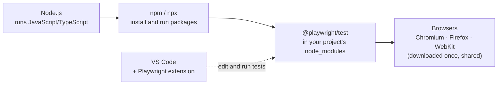

# Prerequisites

## P1 · Node.js, npm and npx in plain words

Playwright for TypeScript runs on **Node.js**. Three names come as a set:

| Name | Plain-English meaning | Analogy |
|---|---|---|
| **Node.js** | A program that runs JavaScript (and TypeScript) *outside* a browser — on your computer or a server | The engine of a car |
| **npm** (Node Package Manager) | Downloads and manages **packages** — ready-made code other people have published. It's installed together with Node.js | An app store for code |
| **npx** | Runs a command that lives *inside* a package, without installing that package for your whole computer | "Open this app" without putting it on your home screen |

Four more words you'll meet today:

| Name | What it is |
|---|---|
| **package** | A bundle of published code, e.g. `@playwright/test` |
| **`package.json`** | Your project's *ID card and shopping list*: its name, the packages it needs, and handy command shortcuts (**scripts**) |
| **`node_modules/`** | The folder where npm puts downloaded packages. Big and generated automatically — never edit it, never save it in Git |
| **`package-lock.json`** | Records the *exact* versions installed, so every teammate gets identical ones |

Packages a project needs are its **dependencies**. Those needed only while developing and testing — like Playwright — are **devDependencies**.

```quiz
id: d3-p1-q1
type: single
question: You download a teammate's project. It has package.json but no node_modules folder. What do you run?
options:
  - "`npx playwright test`"
  - "`npm install`"
  - "`node package.json`"
  - Copy node_modules from the teammate's laptop
answer: b
explanation: "`npm install` reads package.json (and package-lock.json) and downloads every dependency into node_modules. node_modules is always re-created, never shared."
```

```quiz
id: d3-p1-q2
type: single
question: What is the difference between npm and npx?
options:
  - They are the same program with two names
  - npm installs and manages packages; npx runs a command from a package
  - npx installs packages permanently; npm runs them once
  - npm is for JavaScript, npx is for TypeScript
answer: b
explanation: You'll use npm to install things (`npm install`) and npx to run them (`npx playwright test`).
```

## P2 · Terminal survival kit

The **terminal** (also called command line, shell or console) is a text window where you type commands. On this course platform it's the **Terminal** panel; on your own computer it's also built into VS Code (**View → Terminal**).

Everything in a terminal happens **inside a folder** — the *current folder*. Most commands act on the current folder, so knowing where you are is half the job.

| Task | Mac / Linux / this platform | Windows PowerShell |
|---|---|---|
| Where am I? | `pwd` | `pwd` |
| List files here | `ls` (add `-a` to show hidden files) | `ls` or `dir` |
| Go into a folder | `cd pw-course` | `cd pw-course` |
| Go up one level | `cd ..` | `cd ..` |
| Go to my home folder | `cd ~` | `cd ~` |
| Create a folder | `mkdir tests` | `mkdir tests` |
| Clear the screen | `clear` | `cls` or `clear` |
| Stop a running command | `Ctrl + C` | `Ctrl + C` |
| Repeat an earlier command | `↑` arrow | `↑` arrow |
| Complete a name | `Tab` | `Tab` |

Paths use `/` to separate folders: `tests/day1/tc101-login.spec.ts` means "the file `tc101-login.spec.ts`, inside `day1`, inside `tests`" — starting from the current folder. `..` means "the folder above", and `~` means "my home folder".

> [!TIP]
> Most "command not found", "no such file" or "missing script" errors mean you're in the **wrong folder**. Run `pwd`, then `cd` to the right place.

Try it in the terminal panel:

```bash terminal
pwd
mkdir practice-folder
cd practice-folder
pwd
cd ..
ls
```

```quiz
id: d3-p2-q1
type: single
question: "`pwd` prints `/home/learner/pw-course/tests`. You type `cd ..` and then `pwd`. What is printed?"
options:
  - "`/home/learner/pw-course/tests/..`"
  - "`/home/learner/pw-course`"
  - "`/home/learner`"
  - "`/`"
answer: b
explanation: "`..` moves up one folder: from tests to its parent, pw-course."
```

```quiz
id: d3-p2-q2
type: single
question: A command is stuck and you want to stop it. What do you press?
options:
  - "`Ctrl + Z`"
  - "`Ctrl + C`"
  - "`Esc`"
  - Close the browser
answer: b
explanation: "`Ctrl + C` interrupts the running command. You'll use it today to close the HTML report server."
```

## P3 · Reading version numbers

Software versions usually have three parts — **major.minor.patch** — for example Playwright `1.63.0` or Node.js `24.11.0`:

| Part | Changes when… | Risk of breaking your tests |
|---|---|---|
| **Major** (`24`.11.0) | Big changes; old things may stop working | Higher |
| **Minor** (24.`11`.0) | New features added, old ones still work | Low |
| **Patch** (24.11.`0`) | Bug fixes only | Very low |

Two conventions you'll see today:

- **Node.js LTS** — *Long-Term Support*. LTS versions get years of fixes, so **always install an LTS version**. Until now only even-numbered versions became LTS (22 and 24 are LTS today; 26 is still a "Current" release and becomes LTS in October 2026). From Node.js 27, every major version will become LTS after six months.
- **`^` in package.json** — `"@playwright/test": "^1.63.0"` means "1.63.0 or any newer **1.x**". npm may install newer minor and patch versions, but never 2.0.

```quiz
id: d3-p3-q1
type: single
question: "package.json says `\"@playwright/test\": \"^1.63.0\"`. Which version could npm install?"
options:
  - "1.62.0"
  - "1.64.2"
  - "2.0.0"
  - "0.9.0"
answer: b
explanation: "`^1.63.0` allows 1.63.0 and any newer 1.x — so 1.64.2 is fine, but not an older version or a new major version."
```

# Fundamentals

## F1 · What you need, and how the pieces fit



Playwright's official system requirements (always check [playwright.dev/docs/intro](https://playwright.dev/docs/intro) for the latest):

| Requirement | Supported |
|---|---|
| **Node.js** | Latest **22.x**, **24.x** or **26.x** (install the LTS — 24 today) |
| **Windows** | Windows 11+, Windows Server 2019+, or WSL |
| **macOS** | macOS 14 (Sonoma) or later |
| **Linux** | Debian 12/13, Ubuntu 22.04 / 24.04 / 26.04 (x86-64 or arm64) |

> [!NOTE]
> On this course platform everything is already installed. Read F2 for your own computer, and do today's hands-on steps in the platform's terminal.

```quiz
id: d3-f1-q1
type: single
question: A colleague has Node.js 18 installed and gets confusing errors installing Playwright. What is the most likely fix?
options:
  - Reinstall VS Code
  - Install a supported Node.js version — ideally the current LTS
  - Delete the tests folder
  - Use Firefox instead of Chromium
answer: b
explanation: Playwright supports Node.js 22, 24 and 26 only. Old versions cause installation and runtime errors.
```

## F2 · Installing the tools on your own computer

### Step 1 — Node.js (npm comes with it)

1. Go to [nodejs.org](https://nodejs.org) and download the **LTS** installer for your operating system (version 24 at the time of writing).
2. Run it and accept the defaults. On Windows, keep the **Add to PATH** feature selected (it lets the terminal find `node`), and leave **Tools for Native Modules** unticked — you don't need it.
3. Open a **new** terminal window and check:

```bash terminal
node -v
npm -v
```

```output terminal
v24.11.0
11.6.1
```

Your numbers will differ. Anything starting with `v22`, `v24` or `v26` works with Playwright.

> [!TIP]
> "command not found" right after installing? Close the terminal and open a new one — terminals read the list of installed programs only when they start.

> [!WARNING] Windows notes
> - Playwright officially supports **Windows 11**. Windows 10 usually works, but if you hit problems, use **WSL** (Windows Subsystem for Linux).
> - VS Code's terminal on Windows is **PowerShell**. If `npm` or `npx` fails with *"running scripts is disabled on this system"*, run this once: `Set-ExecutionPolicy -Scope CurrentUser RemoteSigned` — or switch the terminal to **Command Prompt** with the ⌄ arrow next to the + in the terminal panel.
> - A few commands differ in PowerShell: `ls -a` is `ls -Force`, and `cat` works but `rm -r` is `Remove-Item -Recurse`.

> [!NOTE] On a company laptop?
> Installing may need **admin rights** — ask IT for Node.js and VS Code. If browser downloads fail behind a company **proxy**, ask IT for the proxy address; Playwright reads it from the `HTTPS_PROXY` setting. Short on disk space? `npx playwright install chromium` downloads only Chromium.

### Step 2 — VS Code

Download it from [code.visualstudio.com](https://code.visualstudio.com), install it and open it. The five areas you'll use:

1. **Explorer** (left) — your project's files and folders
2. **Editor** (centre) — where you write code, one tab per file
3. **Terminal** (bottom; **View → Terminal**) — opens in your project folder
4. **Extensions** (left bar, squares icon) — add features
5. **Testing** (left bar, flask icon) — run and debug tests with a click, once the Playwright extension is installed

### Step 3 — The Playwright extension

1. Open **Extensions** (`Ctrl + Shift + X`, or `Cmd + Shift + X` on Mac).
2. Search **Playwright**. Choose **Playwright Test for VS Code**, published by **Microsoft**.
3. Click **Install**.

### Step 4 — Create a project on your computer

1. Create a folder, for example `Documents/pw-course`.
2. In VS Code: **File → Open Folder…** and choose it.
3. Open the terminal (**View → Terminal**) — it starts inside that folder.
4. Run `npm init playwright@latest` and answer the questions as in F3 below. (Or open the Command Palette with `Ctrl/Cmd + Shift + P` and run **Test: Install Playwright** — see F6.)

> [!TIP]
> Turn on **File → Auto Save** in VS Code. Otherwise a small white dot on a file's tab means "not saved yet" — and tests run the *saved* version.

> [!TESTER]
> Think of VS Code as your test-management tool, test editor and execution console in one window.

```quiz
id: d3-f2-q1
type: single
question: You installed Node.js, and `node -v` works in a new terminal. But in VS Code's terminal, opened earlier, it still says "command not found". Why?
options:
  - VS Code doesn't support Node.js
  - That terminal started before Node.js was installed; open a new terminal (or restart VS Code)
  - Node.js must be installed inside the project folder
  - The Playwright extension is missing
answer: b
explanation: Terminals — including VS Code's — pick up newly installed programs only when they start.
```

## F3 · Creating a project: `npm init playwright@latest`

One command creates a complete, working Playwright project:

```bash terminal
npm init playwright@latest
```

Reading the command:

| Part | Meaning |
|---|---|
| `npm init <name>` | Run the *project creator* package called `create-<name>` — here `create-playwright` |
| `@latest` | Use its newest version |

It asks a few questions:

| Question | Recommended answer | Why |
|---|---|---|
| TypeScript or JavaScript? | **TypeScript** (default) | This course uses TypeScript |
| Where to put your end-to-end tests? | **tests** (default) | Playwright will look for tests in this folder |
| Add a GitHub Actions workflow? | **N** for now | GitHub is a popular website for storing code; *GitHub Actions* is its service for running tests automatically on its servers (CI, Day 1) — a later topic |
| Install Playwright browsers? | **Y** (default) | Downloads Chromium, Firefox and WebKit |
| *(Linux only)* Install operating system dependencies? | **N** on this platform; **Y** on a fresh Linux machine | Installs system libraries the browsers need. It uses `sudo` ("run as administrator" on Linux), so it asks for your password |

Then it does three jobs:

1. **Installs packages** — `@playwright/test` and `@types/node` go into `node_modules/` and are listed in `package.json`.
2. **Writes starter files** — a settings file, an example test and a `.gitignore`.
3. **Downloads browsers** — a few hundred MB the first time.

### Where do the browsers go?

Not into your project. They go into a shared **cache** folder — a storage place for downloaded files — so every Playwright project on your computer can reuse them:

| OS | Browser folder |
|---|---|
| Windows | `%USERPROFILE%\AppData\Local\ms-playwright` |
| macOS | `~/Library/Caches/ms-playwright` |
| Linux | `~/.cache/ms-playwright` |

> [!TIP]
> Re-running `npm init playwright@latest` in an existing project is safe: for every file that already exists, it **asks** before overwriting (the default answer is No).

```quiz
id: d3-f3-q1
type: multiple
question: Which jobs does `npm init playwright@latest` do? (Select all that apply)
options:
  - Installs @playwright/test into the project
  - Writes a settings file and an example test
  - Downloads the browsers (if you answer Y)
  - Writes all the tests for your application
answer: [a, b, c]
explanation: It sets up the project and tools. Writing tests for your app is your job — you'll copy and adapt one today, and write them from scratch from Day 9.
```

## F4 · The generated project at a glance

After the command finishes, your project looks like this:

```text mode=read
pw-course/
├── .gitignore               ← tells Git which files NOT to save
├── package.json             ← project ID card: dependencies + scripts
├── package-lock.json        ← exact installed versions — don't edit by hand
├── playwright.config.ts     ← the settings file for all your tests
├── node_modules/            ← downloaded packages — never edit
└── tests/
    └── example.spec.ts      ← a sample test file with 2 tests
```

After your first test run, two more folders appear:

```text mode=read
├── test-results/            ← details of the last run: errors, traces, screenshots of failures
└── playwright-report/       ← the HTML report
```

Three things to know today (Day 10 goes through the config file in depth, and shows how a growing project is organised):

1. **Test files end in `.spec.ts` or `.test.ts`.** Playwright looks for them inside the tests folder, including its sub-folders. A file called `tests/login.ts` is **not** a test file and is ignored.
2. **`playwright.config.ts` controls how every test runs** — which browsers (the *projects* you met on Day 2), how many workers, retries, the report.
3. **`.gitignore` keeps generated things out of Git.** Git is the tool teams use to save and share versions of their code. `node_modules/`, `test-results/` and `playwright-report/` can always be re-created, so they're never saved in it.

```quiz
id: d3-f4-q1
type: single
question: You create `tests/checkout.ts` with a test in it, but Playwright doesn't run it. Why?
options:
  - Test files must be in the project's top folder
  - Test file names must end in `.spec.ts` or `.test.ts`
  - Playwright only runs example.spec.ts
  - You must restart the computer
answer: b
explanation: Rename it to `tests/checkout.spec.ts` and Playwright will find it.
```

```quiz
id: d3-f4-q2
type: multiple
question: Which should NOT be saved in Git? (Select all that apply)
options:
  - node_modules/
  - playwright.config.ts
  - playwright-report/
  - tests/example.spec.ts
answer: [a, c]
explanation: node_modules and the report are generated and already listed in .gitignore. Your settings and tests are the valuable work — always save them.
```

## F5 · Running tests: the commands you'll use every day

Three defaults to know, straight from the docs:

- Tests run **headless** — *no browser window opens while running the tests*.
- Tests **run in parallel** on several workers.
- The HTML report **opens automatically if some tests failed**; otherwise you open it yourself.

The core commands:

| Goal | Command |
|---|---|
| Run **all** tests, in every browser | `npx playwright test` |
| Watch the browser work | `npx playwright test --headed` |
| One browser only | `npx playwright test --project=chromium` |
| One file | `npx playwright test tests/example.spec.ts` |
| Files whose name contains a word | `npx playwright test example` |
| Tests whose **title** contains a phrase (upper/lower case doesn't matter) | `npx playwright test -g "has title"` |
| List tests without running them | `npx playwright test --list` |
| Open the last HTML report | `npx playwright show-report` |

Options can be combined: `npx playwright test tests/example.spec.ts --project=firefox --headed`.

```reference title="More run options, for later"
| Goal | Command |
|---|---|
| Several browsers | `npx playwright test --project=webkit --project=firefox` |
| A test at a particular line | `npx playwright test tests/example.spec.ts:10` |
| Run tests one at a time | `npx playwright test --workers=1` |
| Re-run only what failed last time | `npx playwright test --last-failed` |
| Step through with the Inspector | `npx playwright test --debug` |
| Visual UI Mode | `npx playwright test --ui` |
| Record a trace | `npx playwright test --trace on` |
| Record a new test by clicking | `npx playwright codegen https://your-site` |
| Show the installed version | `npx playwright --version` |
```

```quiz
id: d3-f5-q1
type: single
question: Which command runs ONLY the test titled "get started link", in Firefox, with the browser visible?
options:
  - "`npx playwright test --headed firefox get started link`"
  - "`npx playwright test -g \"get started link\" --project=firefox --headed`"
  - "`npx playwright show-report --project=firefox`"
  - "`npx playwright codegen \"get started link\"`"
answer: b
explanation: "`-g` filters by title, `--project` chooses the browser, and `--headed` shows the window."
```

## F6 · Running tests from VS Code

With the **Playwright Test for VS Code** extension installed, click the **Testing** (flask) icon in the left bar. Your tests appear in a tree, and you can:

| Feature | What it does |
|---|---|
| ▶ next to a test, file or folder | Run it |
| **Show browser** | Tick it to watch tests run (untick for headless) |
| **Pick locator** | Click any element in the browser and get the Playwright locator for it |
| **Record new** | Record a brand-new test by clicking through the site (Codegen inside VS Code) |
| **Record at cursor** | Add recorded steps into an existing test, where your cursor is |
| **Debug Test** | Pause at a *breakpoint* (a red dot you set next to a line) and inspect |
| **Show Trace Viewer** | Open a trace of every run automatically |

Green ✓ and red ✗ icons also appear next to each test in the editor.

> [!TIP]
> The extension can also create a project for you: open the Command Palette (`Ctrl/Cmd + Shift + P`) and run **Test: Install Playwright**. It does the same as `npm init playwright@latest`.

```quiz
id: d3-f6-q1
type: single
question: You want the exact Playwright locator for a button on a page. Which VS Code feature gives it to you?
options:
  - Show browser
  - Pick locator
  - Debug Test
  - Record at cursor
answer: b
explanation: Pick locator lets you click an element and copies the locator Playwright recommends for it.
```

## F7 · Updating Playwright and fixing common problems

Playwright releases a new version roughly every month or two. To update a project:

```bash mode=read
npm install -D @playwright/test@latest
npx playwright install --with-deps
npx playwright --version
```

The second command downloads the browser versions that the new Playwright needs. `--with-deps` also installs system libraries on Linux (it asks for your password); on Windows and Mac it makes no difference. **Don't run these on the course platform** — it's kept up to date for you.

Common problems and fixes:

| Message | Likely cause | Fix |
|---|---|---|
| `node: command not found` / `npx: command not found` | Node.js not installed, or the terminal was open before installing | Install Node.js LTS; open a new terminal |
| `No tests found` | Wrong folder, or file names don't end in `.spec.ts` | `pwd`, then `cd` to the project; rename the file |
| `Executable doesn't exist at …/ms-playwright/…` | Playwright was updated but its browsers weren't | `npx playwright install` |
| `Missing script: "test"` | You're outside the project folder, or the script doesn't exist | `cd pw-course`; check `package.json` |
| `npx playwright test` asks *"Need to install the following packages: playwright… Ok to proceed?"* | You're **outside** the project, so npx can't find the project's Playwright and offers to download a different one | Answer **n**, then `cd` into the project |
| `Serving HTML report at http://localhost:9323. Press Ctrl+C to quit.` and the terminal is stuck | The report opened automatically after a failure | Press `Ctrl + C` (I5 shows how to stop this happening) |
| Browser fails to start on Linux, mentioning missing libraries | System libraries missing | `npx playwright install --with-deps` |

```quiz
id: d3-f7-q1
type: single
question: After updating Playwright, every test fails with "Executable doesn't exist". What do you run?
options:
  - "`npm init playwright@latest` in a new folder"
  - "`npx playwright install`"
  - "`npm uninstall node`"
  - "`npx playwright show-report`"
answer: b
explanation: Each Playwright version needs its matching browser builds; `npx playwright install` downloads them.
```

# Implementation

## I1 · Check your tools

Open the **Terminal** panel and run:

```bash terminal
node -v
npm -v
pwd
```

You should see a Node.js version starting with `v22`, `v24` or `v26`, an npm version, and the folder you're in.

## I2 · Create your project

Create a folder for the course and generate a Playwright project inside it:

```bash terminal
mkdir pw-course
cd pw-course
npm init playwright@latest
```

Answer the questions: **TypeScript**, **tests**, **N** (no GitHub Actions), **Y** (install browsers) and, if asked, **N** for operating-system dependencies (the platform already has them).

```output terminal
Need to install the following packages:
create-playwright@1.17.x
Ok to proceed? (y) y

Getting started with writing end-to-end tests with Playwright:
Initializing project in '.'
✔ Do you want to use TypeScript or JavaScript? · TypeScript
✔ Where to put your end-to-end tests? · tests
✔ Add a GitHub Actions workflow? (y/N) · false
✔ Install Playwright browsers (can be done manually via 'npx playwright install')? (Y/n) · true
✔ Install Playwright operating system dependencies (requires sudo / root …)? (y/N) · false
Initializing NPM project (npm init -y)…
Installing Playwright Test (npm install --save-dev @playwright/test)…
Installing Types (npm install --save-dev @types/node)…
Writing playwright.config.ts.
Writing tests/example.spec.ts.
Writing package.json.
Downloading browsers (npx playwright install)…
✔ Success! Created a Playwright Test project at /home/learner/pw-course
```

Version numbers and paths will differ. Check the installed version:

```bash terminal
npx playwright --version
```

```output terminal
Version 1.63.0
```

> [!NOTE]
> From today, all your work lives in `pw-course`. Whenever you open a new terminal, `cd pw-course` first.

## I3 · Explore what was created

```bash terminal
ls -a
ls tests
cat package.json
```

```output terminal
.  ..  .gitignore  node_modules  package-lock.json  package.json  playwright.config.ts  tests
example.spec.ts
{
  "name": "pw-course",
  "version": "1.0.0",
  "description": "",
  "main": "index.js",
  "scripts": {},
  "keywords": [],
  "author": "",
  "license": "ISC",
  "devDependencies": {
    "@playwright/test": "^1.63.0",
    "@types/node": "^26.6.2"
  }
}
```

`cat` prints a file in the terminal. Notice `devDependencies` (P1) with the `^` versions (P3), and `scripts` — empty for now; you'll fill it in I8. (Newer npm versions also add a line `"type": "commonjs"` — that's fine.)

Now open `tests/example.spec.ts` in the editor. You met this style of test on Days 1 and 2:

```ts file=tests/example.spec.ts mode=read network=true
import { test, expect } from '@playwright/test';

test('has title', async ({ page }) => {
  await page.goto('https://playwright.dev/');

  // Expect a title "to contain" a substring.
  await expect(page).toHaveTitle(/Playwright/);
});

test('get started link', async ({ page }) => {
  await page.goto('https://playwright.dev/');

  // Click the get started link.
  await page.getByRole('link', { name: 'Get started' }).click();

  // Expects page to have a heading with the name of Installation.
  await expect(page.getByRole('heading', { name: 'Installation' })).toBeVisible();
});
```

Read it like a test case:

| Line | Reads as |
|---|---|
| `test('has title', …)` | Test case **has title** |
| `page.goto('https://playwright.dev/')` | Step: open the Playwright website |
| `expect(page).toHaveTitle(/Playwright/)` | Expected: the tab title **contains** "Playwright". The slashes `/…/` mean "contains this text" (upper/lower case must match) rather than "is exactly" |
| `page.getByRole('link', { name: 'Get started' }).click()` | Step: click the link named "Get started" |
| `expect(…heading 'Installation'…).toBeVisible()` | Expected: a heading "Installation" is visible |

Lines starting with `//` are **comments** — notes for people; Playwright ignores them.

```quiz
id: d3-i3-q1
type: single
question: How many tests are in example.spec.ts, and how many runs does `npx playwright test` report with the default 3 browser projects?
options:
  - 2 tests → 2 runs
  - 2 tests → 6 runs
  - 3 tests → 6 runs
  - 1 test → 3 runs
answer: b
explanation: 2 tests × 3 projects (chromium, firefox, webkit) = 6 runs.
```

## I4 · Your first run, and the HTML report

> [!NOTE]
> The example tests open playwright.dev, so they need an internet connection.

```bash terminal
npx playwright test
```

```output terminal
Running 6 tests using 3 workers
  6 passed (6.8s)

To open last HTML report run:

  npx playwright show-report
```

Six green runs: 2 tests × 3 browsers, headless and in parallel — the defaults from F5. (Your worker count may differ — it depends on your computer's CPU cores.) Now open the report:

```bash terminal
npx playwright show-report
```

The report opens in the browser pane, served at `http://localhost:9323` — `localhost` means "this computer", and `9323` is the *port*, like a door number for this one service. Try:

1. The filters at the top — **Passed**, **Failed**, **Flaky**, **Skipped** — and the browser labels.
2. Click a test to see each step and how long it took.

When you're done, go back to the terminal and press **`Ctrl + C`**. The terminal is busy serving the report until you do.

## I5 · One setting to change before you continue

Right now the settings file contains `reporter: 'html'`. With that setting, two things make learning harder:

- The terminal shows only a summary, not each test as it finishes.
- When a test **fails**, the report opens automatically and the terminal is **blocked** until you press `Ctrl + C`.

Open `playwright.config.ts` and find the `reporter` line. Replace it so it reads:

```ts mode=read
  // BEFORE
  reporter: 'html',

  // AFTER: a line per test in the terminal + the HTML report, opened only when you ask
  reporter: [['list'], ['html', { open: 'never' }]],
```

Save the file (`Ctrl/Cmd + S`) and run again, in Chromium only:

```bash terminal
npx playwright test --project=chromium
```

```output terminal
Running 2 tests using 2 workers

  ✓  1 [chromium] › tests/example.spec.ts:3:5 › has title (1.1s)
  ✓  2 [chromium] › tests/example.spec.ts:10:5 › get started link (1.6s)

  2 passed (2.5s)
```

That's the output style you saw on Days 1 and 2. Don't worry about the brackets in the new line — Day 10 explains every setting in this file.

> [!PLATFORM]
> The Days 1–2 workspace uses this same `reporter` line (see `platform/playwright.config.ts`), so the output learners saw there matches what they see from now on.

## I6 · Headed, one browser, one file, one title

Try each command and notice what changes:

```bash terminal
# watch the browser work
npx playwright test --project=chromium --headed

# only one file, in Firefox
npx playwright test tests/example.spec.ts --project=firefox

# only tests whose title contains "title", in WebKit
npx playwright test -g "title" --project=webkit

# list what WOULD run, without running anything
npx playwright test --list
```

```output terminal
Listing tests:
  [chromium] › example.spec.ts:3:5 › has title
  [chromium] › example.spec.ts:10:5 › get started link
  [firefox] › example.spec.ts:3:5 › has title
  [firefox] › example.spec.ts:10:5 › get started link
  [webkit] › example.spec.ts:3:5 › has title
  [webkit] › example.spec.ts:10:5 › get started link
Total: 6 tests in 1 file
```

`--list` is a quick way to check that your filters pick the tests you expect before a long run.

```quiz
id: d3-i6-q1
type: single
question: What does `npx playwright test -g "title" --project=webkit` run?
options:
  - Every test in every browser
  - Tests whose title contains "title", in WebKit only
  - Tests in files named "title"
  - Nothing — it only lists tests
answer: b
explanation: "`-g` filters by test title; `--project=webkit` limits the run to WebKit."
```

## I7 · Break it on purpose — and read the error

1. In `tests/example.spec.ts`, change `/Playwright/` to `/Selenium/` in the first test and save.
2. Run just that test:

```bash terminal
npx playwright test -g "has title" --project=chromium
```

```output terminal
Running 1 test using 1 worker

  ✘  1 [chromium] › tests/example.spec.ts:3:5 › has title (5.9s)

  1) [chromium] › tests/example.spec.ts:3:5 › has title ─────────────────────────

    Error: expect(page).toHaveTitle(expected) failed

    Expected pattern: /Selenium/
    Received string:  "Fast and reliable end-to-end testing for modern web apps | Playwright"
    Timeout: 5000ms

       4 |   await page.goto('https://playwright.dev/');
       5 |
       6 |   // Expect a title "to contain" a substring.
    >  7 |   await expect(page).toHaveTitle(/Selenium/);
         |                      ^
       8 | });

  1 failed
    [chromium] › tests/example.spec.ts:3:5 › has title ──────────────────────────
```

Read it top to bottom:

| Part | What it tells you |
|---|---|
| `✘ … has title (5.9s)` | Which test failed, in which browser |
| `Expected pattern: /Selenium/` | What the test expected |
| `Received string: "… \| Playwright"` | What the page actually had |
| `Timeout: 5000ms` | The web-first assertion kept checking for 5 seconds (Day 2 · F2) |
| `> 7 \| …` and `^` | The exact line and spot in your code |

3. Change `/Selenium/` back to `/Playwright/`, save, and run again — green.

Because of your change in I5, the report did **not** open by itself and the terminal is free. Open it with `npx playwright show-report` whenever you want to look.

> [!TESTER]
> When a test fails, first ask: is it a bug in the **application**, or a mistake in the **test**? Here it was the test — the expectation was wrong.

## I8 · Add npm script shortcuts

Typing long commands gets old. **Scripts** in `package.json` give them short names. Add four:

```bash terminal
npm pkg set scripts.test="playwright test"
npm pkg set scripts.test:headed="playwright test --headed"
npm pkg set scripts.test:chromium="playwright test --project=chromium"
npm pkg set scripts.report="playwright show-report"
```

`package.json` now contains:

```json mode=read
"scripts": {
  "test": "playwright test",
  "test:headed": "playwright test --headed",
  "test:chromium": "playwright test --project=chromium",
  "report": "playwright show-report"
}
```

Use them:

```bash terminal
npm test
npm run test:chromium
# pass extra options after --
npm run test:chromium -- -g "get started"
npm run report
```

| Rule | Example |
|---|---|
| `test` is special: `npm test` works without `run` | `npm test` |
| Every other script needs `npm run <name>` | `npm run report` |
| Extra options go after `--` | `npm run test:chromium -- -g "title"` |
| Inside scripts you don't need `npx` — npm finds `playwright` in `node_modules` by itself | `"test": "playwright test"` |

## I9 · (Your own computer) Run tests from VS Code

With the Playwright extension installed:

1. **File → Open Folder** and choose the project you created in F2 · Step 4.
2. Click the **Testing** (flask) icon in the left bar — your tests appear in a tree.
3. At the bottom of the Testing sidebar, find the **PLAYWRIGHT** panel and tick **Show browser**.
4. Click ▶ next to `has title` and watch it run. The browser stays open afterwards.
5. In the PLAYWRIGHT panel, click **Pick locator**, then click the "Get started" link in that browser. The locator `getByRole('link', { name: 'Get started' })` appears in the panel's locator box and is copied to your clipboard.
6. Click **Record new**, click around playwright.dev, then close the browser — a new test file appears with your recorded steps.

# Practice

## Quiz · Day 3 check

```quiz
id: d3-pr-q1
type: single
question: Which file lists your project's dependencies and npm scripts?
options:
  - playwright.config.ts
  - package.json
  - .gitignore
  - tests/example.spec.ts
answer: b
explanation: package.json is the project's ID card — name, devDependencies and scripts.
```

```quiz
id: d3-pr-q2
type: single
question: Where does `npm init playwright@latest` put the browsers it downloads?
options:
  - In the project's tests folder
  - In the project's node_modules folder
  - In a shared cache folder in your user account, reused by every project
  - Inside VS Code
answer: c
explanation: For example `~/.cache/ms-playwright` on Linux. That's why a second project doesn't download them again.
```

```quiz
id: d3-pr-q3
type: single
question: What does `npx playwright show-report` do?
options:
  - Runs the tests and prints a report
  - Serves the last HTML report so you can open it in a browser
  - Emails the report
  - Deletes old reports
answer: b
explanation: It starts a small local web server (port 9323) for the report. Press Ctrl + C to stop it.
```

```quiz
id: d3-pr-q4
type: single
question: "Why did we change the reporter to `[['list'], ['html', { open: 'never' }]]`?"
options:
  - To make tests run faster
  - To see each test in the terminal, and stop the report opening (and blocking the terminal) after a failure
  - To stop the HTML report being created
  - To run tests in Firefox
answer: b
explanation: The HTML report is still created — it just opens only when you ask. The list reporter shows each test as it finishes.
```

```quiz
id: d3-pr-q5
type: single
question: "`npm run test:chromium -- -g \"login\"` — what does the `--` do?"
options:
  - Comments out the rest of the line
  - Passes the options after it (`-g "login"`) on to the command inside the script
  - Runs the tests twice
  - Turns off Chromium
answer: b
explanation: Everything after `--` is added to the script's command, so it becomes `playwright test --project=chromium -g "login"`.
```

```quiz
id: d3-pr-q6
type: single
question: A test fails with "Expected pattern /Dashboard/, Received string 'Login'". What should you do FIRST?
options:
  - Report a bug to the developers immediately
  - Delete the test
  - Investigate whether the app is wrong or the test's expectation is wrong
  - Re-run it until it passes
answer: c
explanation: A failure is a clue, not a verdict. Check the app and the test — sometimes the login step failed, sometimes the expectation is outdated.
```

```quiz
id: d3-pr-q7
type: single
question: Which Node.js version should you install for Playwright?
options:
  - The newest odd-numbered version, for the latest features
  - The current LTS version (22 and 24 are LTS today; Playwright also supports 26)
  - Version 16, because it's been around longest
  - Any version works
answer: b
explanation: Playwright supports Node.js 22, 24 and 26. LTS versions get long-term fixes, so they're the safe choice.
```

```quiz
id: d3-pr-q8
type: single
question: "`npm test` works, but `npm headed` says \"Unknown command\". The script `test:headed` exists. What's wrong?"
options:
  - The script is broken
  - Scripts other than `test` must be run with `npm run`, and by their full name — `npm run test:headed`
  - You need to reinstall Playwright
  - Headed mode isn't supported on this computer
answer: b
explanation: Only a few names like `test` work without `run`. Everything else is `npm run <exact-name>`.
```

## Exercises

````exercise
id: d3-ex1
title: Write the command
level: easy
type: terminal
prompt: |
  Write — and run — the single command for each situation:

  1. Run every test, only in WebKit.
  2. Run only `tests/example.spec.ts`, in Chromium, with the browser visible.
  3. Run only tests whose title contains `link`, in every browser.
  4. Show which tests would run in Firefox, without running them.
  5. Re-run only the tests that failed last time.
hints:
  - "`--project=<name>` picks a browser; `-g` filters by title."
  - "`--list` lists tests; `--last-failed` re-runs failures (see the \"More run options\" table)."
solution: |
  npx playwright test --project=webkit
  npx playwright test tests/example.spec.ts --project=chromium --headed
  npx playwright test -g "link"
  npx playwright test --project=firefox --list
  npx playwright test --last-failed
````

````exercise
id: d3-ex2
title: Troubleshooting desk
level: medium
type: written
prompt: |
  Colleagues send you these problems. For each, give the most likely cause and the fix.

  1. `npx: command not found`
  2. `Error: No tests found` — their file is `tests/Login.ts`.
  3. `browserType.launch: Executable doesn't exist at …/ms-playwright/chromium-…` right after updating Playwright.
  4. They typed `npm test` in their home folder and got `Missing script: "test"`.
  5. After a failing run the terminal shows `Serving HTML report at http://localhost:9323. Press Ctrl+C to quit.` and won't accept commands.
modelAnswer: |
  1. Node.js (which includes npm and npx) isn't installed, or the terminal was opened before installing it. Install Node.js LTS and open a new terminal.
  2. Test files must end in `.spec.ts` or `.test.ts`. Rename it to `tests/login.spec.ts`.
  3. The new Playwright version needs matching browsers. Run `npx playwright install`.
  4. They're in the wrong folder — npm reads the `package.json` of the current folder. `cd pw-course` first (check with `pwd`).
  5. The HTML report opened automatically after the failure. Press `Ctrl + C`. To stop it happening, set `reporter: [['list'], ['html', { open: 'never' }]]` in `playwright.config.ts`.
````

````exercise
id: d3-ex3
title: Your own copy of the example
level: medium
type: code
prompt: |
  Create your first test file of your own:

  1. Create a folder `tests/day3` and, inside it, a new file `my-first.spec.ts`.
  2. Copy everything from `tests/example.spec.ts` into it.
  3. Rename the first test to `docs page has title` and the second to `get started opens installation`.
  4. Above every line inside the tests, add a `//` comment saying what that step does, in your own words.

  Run only your new file in Chromium: `npx playwright test tests/day3 --project=chromium`
file: tests/day3/my-first.spec.ts
run: npx playwright test tests/day3 --project=chromium
network: true
hints:
  - "Only the text inside `test('…'` changes for the names."
  - "Comments start with `//`."
solution: |
  import { test, expect } from '@playwright/test';

  test('docs page has title', async ({ page }) => {
    // Open the Playwright website
    await page.goto('https://playwright.dev/');
    // Check that the tab title contains the word "Playwright"
    await expect(page).toHaveTitle(/Playwright/);
  });

  test('get started opens installation', async ({ page }) => {
    // Open the Playwright website
    await page.goto('https://playwright.dev/');
    // Click the "Get started" link
    await page.getByRole('link', { name: 'Get started' }).click();
    // Check that the "Installation" heading is visible
    await expect(page.getByRole('heading', { name: 'Installation' })).toBeVisible();
  });
````

````exercise
id: d3-ex4
title: Predict the run count
level: medium
type: predict
prompt: |
  Your project has the three default browser projects. The tests folder contains `example.spec.ts` (2 tests) and your `day3/my-first.spec.ts` (2 tests). How many runs does each command report? Check your answers with `--list`.
codeLanguage: text
code: |
  A) npx playwright test
  B) npx playwright test --project=chromium
  C) npx playwright test tests/day3
  D) npx playwright test -g "title" --project=firefox
answer: |
  A) 4 tests × 3 browsers = **12**
  B) 4 tests × 1 browser = **4**
  C) 2 tests × 3 browsers = **6**
  D) Tests with "title" in their name: `has title` and `docs page has title` → 2 tests × 1 browser = **2**
````

````exercise
id: d3-ex5
title: "Challenge: your own shortcut"
level: challenge
type: terminal
prompt: |
  Add an npm script called `test:day3` that runs **only** the tests in `tests/day3`, in **Chromium**, with the **list** of tests printed first. (Hint: a script can run two commands in a row joined by `&&` — the second runs only if the first succeeds.)

  Then run it with `npm run test:day3`.
hints:
  - "The first command lists: `playwright test tests/day3 --project=chromium --list`"
  - "The second runs: `playwright test tests/day3 --project=chromium`"
solution: |
  npm pkg set scripts.test:day3="playwright test tests/day3 --project=chromium --list && playwright test tests/day3 --project=chromium"
  npm run test:day3
````

## Reflection

1. Explain `npm`, `npx` and `package.json` to a teammate in one sentence each.
2. Which three jobs does `npm init playwright@latest` do?
3. What are the three defaults of `npx playwright test` (browser window, speed, report)?
4. When a test fails, which three parts of the error do you read first?

> [!TIP] Coming up on Day 4
> Playwright tests are written in **TypeScript**. Tomorrow you'll learn what JavaScript and TypeScript are, write and run your first program, and learn to read TypeScript's error messages — the start of five days that turn you into someone who can read and write test code.
