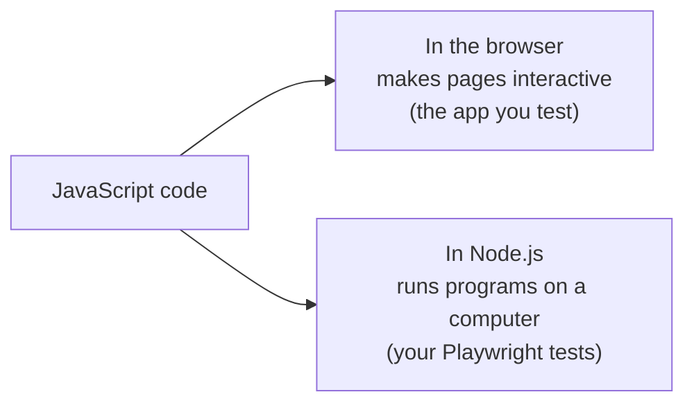
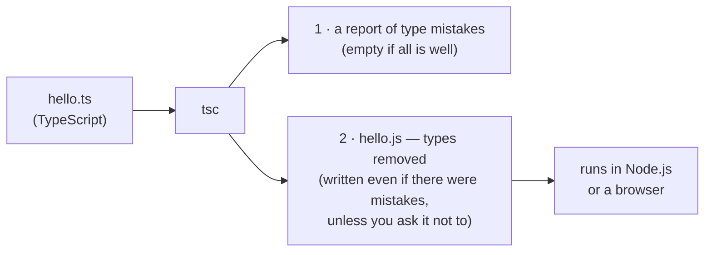
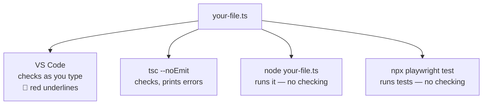

# Prerequisites

## P1 · What a program is

A **program** is a list of instructions that a computer carries out **from top to bottom**, one after another — just like the steps of a test case. Each instruction is called a **statement**.

```ts mode=read
console.log('Step 1: open the login page');
console.log('Step 2: enter the username');
console.log('Step 3: click Log in');
```

`console.log(…)` is the first instruction everyone learns: it **prints** whatever is inside the brackets. In our course platform, it appears in the terminal or console pane.

The things a program works with are **values**:

| Value | Kind of value |
|---|---|
| `'Log in'`, `"asha@example.com"` | Text |
| `42`, `3.5`, `30000` | Numbers |
| `true`, `false` | Yes/no answers |

A program can also *calculate*: `console.log(2 + 3)` prints `5`. With text, `+` **joins** instead: `console.log('Hello, ' + 'Asha')` prints `Hello, Asha`.

To use a value more than once, you give it a **name** with `const`:

```ts mode=read
const tester = 'Asha';               // the name "tester" now means 'Asha'
console.log('Tester: ' + tester);    // prints Tester: Asha
```

That's all you need today — Day 5 is entirely about named values (*variables*).

> [!TESTER]
> You already write programs — in plain English. A test case is a program for a human: ordered steps, specific inputs, expected outputs. Today you start writing them for a computer.

```quiz
id: d4-p1-q1
type: single
question: "In what order does a program run these statements? (1) `console.log('A')` (2) `console.log('B')` (3) `console.log('C')`"
options:
  - All at the same time
  - A, then B, then C — top to bottom
  - C, then B, then A
  - In a random order
answer: b
explanation: Statements run from top to bottom, one after another, unless the code says otherwise (you'll learn how on Days 7–8).
```

## P2 · The rules of writing code

Computers are strict readers. Five rules prevent most beginners' mistakes:

| Rule | Right | Wrong |
|---|---|---|
| **Text goes in quotes** — single `'…'` or double `"…"` (a third kind, backticks, comes on Day 5) | `'Log in'` | `Log in` |
| **Quotes and brackets come in pairs** | `console.log('Hi')` | `console.log('Hi)` |
| **Case matters** | `console.log` | `Console.Log` |
| **Comments are notes for people** — the computer ignores them | `// open the page` | — |
| **A semicolon ends a statement** (optional in most places, but we always write it) | `console.log('Hi');` | — |

Two kinds of comments:

```ts mode=read
// A one-line comment

/*
  A comment that spans
  several lines
*/
```

> [!WARNING] Straight quotes only
> Word processors, PDFs and chat apps often turn `'` into curly quotes `‘ ’`. Code needs straight quotes. If you see an "Invalid character" error after pasting, retype the quotes.

```quiz
id: d4-p2-q1
type: single
question: Which line is written correctly?
options:
  - "`Console.log('Test passed');`"
  - "`console.log('Test passed);`"
  - "`console.log('Test passed');`"
  - "`console.log(Test passed);`"
answer: c
explanation: "The wrong ones have a capital C in Console (case matters), a missing closing quote, or text without quotes."
```

## P3 · Errors are normal — and helpful

Every programmer sees errors all day. An error message is not a failure — it's the computer telling you exactly what it didn't understand, and where. Most messages have the same three parts:

```text mode=read
day4/example.ts(3,7): error TS2322: Type 'string' is not assignable to type 'number'.
└──── where ──┘ └┬─┘  └──┬──┘ └──────────────── what ─────────────────────────────┘
   file (line,column)  code
```

| Part | Meaning |
|---|---|
| `day4/example.ts(3,7)` | **Where** — the file, line 3, character 7 |
| `error TS2322` | The error's **code** — searchable online |
| `Type 'string' is not assignable…` | **What** went wrong, in (fairly) plain English |

> [!TESTER]
> Read an error the way you'd read a bug report: *where*, then *what*. You'll practise this all through today's Implementation.

# Fundamentals

## F1 · JavaScript: the language of the web

**JavaScript (JS)** was created in **1995** at Netscape, to make web pages interactive. Today it's the only programming language that **every web browser** runs. Whenever a page shows an error message without reloading, opens a menu, or loads more results as you scroll, that's JavaScript at work — the "electricity and plumbing" from Day 1.

For a long time JavaScript lived only inside browsers. In 2009 **Node.js** took it outside: Node.js runs JavaScript on computers and servers. That's what you installed on Day 3, and it's what runs Playwright.



JavaScript is standardised under the name **ECMAScript**, and a new edition comes out every year (ES2023, ES2024, …). You don't need to track editions — just know that "modern JavaScript" keeps gaining features.

**Why a tester cares:** the app you test runs JavaScript in the browser, and your tests run JavaScript in Node.js. Understanding the language helps on both sides — writing tests, and understanding why a page behaves the way it does.

```quiz
id: d4-f1-q1
type: single
question: Which program runs your Playwright tests on your computer?
options:
  - The web browser
  - Node.js
  - VS Code
  - npm
answer: b
explanation: Node.js runs JavaScript (and TypeScript) outside the browser. npm installs packages; VS Code is the editor; the browser is what the tests control.
```

## F2 · TypeScript: JavaScript plus types

**TypeScript (TS)** was released by **Microsoft in 2012**, designed by Anders Hejlsberg. It's open source and free.

TypeScript is a **superset** of JavaScript: it contains *all* of JavaScript and adds one big thing — **types**. A type says *what kind of value* something is: text, a number, true/false, a list of users, and so on. Any JavaScript code is allowed in a TypeScript file — though the type checker may point out mistakes in it that JavaScript would have let slip.

```ts mode=read
// In a JavaScript file:
const timeout = 30000;
```

```ts mode=read
// The same line in a TypeScript file, with a type added — ": number"
const timeout: number = 30000;
```

TypeScript files end in `.ts` (JavaScript files end in `.js`). That's why your test files are called `example.spec.ts`.

### The three parts of TypeScript

| Part | What it does |
|---|---|
| **The language** | JavaScript plus type syntax such as `: number` and `: string` |
| **The compiler (`tsc`)** | Checks your types for mistakes and reports them, and can turn TypeScript into plain JavaScript — because browsers and Node.js ultimately run JavaScript |
| **The language service** | Powers your editor: red underlines under mistakes, suggestions as you type (*IntelliSense*), "go to definition" |



> [!NOTE]
> "Compiling" TypeScript mostly means *checking* the types and then *removing* them. What's left is ordinary JavaScript. Note that the check doesn't *stop* the JavaScript being written — your job is to read the report and fix it.

```quiz
id: d4-f2-q1
type: single
question: Which statement about TypeScript is TRUE?
options:
  - TypeScript is a completely different language from JavaScript
  - Every valid JavaScript program is also valid TypeScript; TypeScript adds types on top
  - Browsers run TypeScript directly, without any conversion
  - TypeScript was created by Google
answer: b
explanation: TypeScript is a superset of JavaScript made by Microsoft. The types are checked and removed before the code runs as JavaScript.
```

```quiz
id: d4-f2-q2
type: single
question: Which part of TypeScript draws the red underlines and suggestions in your editor?
options:
  - The language
  - The compiler's JavaScript output
  - The language service
  - Node.js
answer: c
explanation: The language service gives editors like VS Code their error underlines and IntelliSense suggestions.
```

## F3 · Static vs dynamic typing — why types help

JavaScript is **dynamically typed**: types are only looked at while the program runs. If a value that should be a number arrives as text, nobody complains until something goes wrong *while the program is running* — maybe in front of a customer.

TypeScript is **statically typed**: types are checked **before** the program runs. If you put text where a number belongs, you're told immediately, with the file and line.

```ts mode=read
// A price that accidentally arrived as text
const price: number = '499';   // TypeScript: ❌ Type 'string' is not assignable to type 'number'
```

In plain JavaScript, that mistake slips through, and later `price + 1` gives `'4991'` instead of `500` — text glued together instead of added. You'll see this happen for real in Implementation I4.

| | Dynamic typing (JavaScript) | Static typing (TypeScript) |
|---|---|---|
| When type mistakes are found | While the program runs | While you write the code, before it runs |
| Where you find out | A crash — or worse, a silently wrong result | A red underline and an error message with file and line |
| Extra typing effort | None | A little (you add `: number` and similar) |
| Editor help | Limited | Strong: suggestions for everything you can type next |

### Why Playwright tests are written in TypeScript

| Benefit | What it means for you |
|---|---|
| **Mistakes caught early** | Typos and wrong values are underlined in red *before* you run a 10-minute suite |
| **Autocomplete** | Type `page.` and VS Code lists every action — `click`, `fill`, `goto`… |
| **Readable** | `function login(email: string, password: string)` documents itself |
| **The default** | `npm init playwright@latest` chooses TypeScript by default, and most examples online use it |

The costs are small: a little more to type, and one more concept (types) to learn — which is what Days 4–8 are for.

```quiz
id: d4-f3-q1
type: single
question: What is the main advantage of static typing?
options:
  - The program runs faster in the browser
  - Type mistakes are found while you write the code, before it runs
  - Type mistakes are found while the program runs, with a clearer crash message
  - The code no longer needs to be converted to JavaScript
answer: b
explanation: Static typing moves the discovery of type mistakes from "while running" to "while writing".
```

## F4 · How your TypeScript code actually runs

Three tools handle your `.ts` files. Only one of them checks the types — and it doesn't run anything. The other two run your code **without checking the types**. This is the single most important fact on today's list.

| Tool | Checks types? | What it does |
|---|---|---|
| **`tsc`** (the TypeScript compiler) | ✅ Yes | Reports every type mistake; can also produce `.js` files. It never *runs* your program |
| **Node.js** (22.18 and newer) — `node file.ts` | ❌ No | Removes the type annotations and runs what's left. Fast, but type mistakes slip through. (It can only remove simple annotations; a few rarer TypeScript features need other tools — this course avoids them.) |
| **Playwright** — `npx playwright test` | ❌ No | Converts your `.ts` test files to JavaScript on the fly and runs them, without checking types (so tests start fast) |

So who catches type mistakes? **Your editor**, which checks constantly as you type (the red underlines), and **`tsc`** when you run it.



> [!WARNING] Always fix the red underlines
> A test with a type mistake may still run — and fail in a confusing way, or pass when it shouldn't. Treat every red underline in VS Code as a bug in your test.

In today's playground you'll therefore use **two** commands for every file:

| You want to… | Command |
|---|---|
| **Run** the file and see its output | `node day4/hello.ts` |
| **Check** the file for type mistakes | `npm run check -- day4/hello.ts` (this runs `tsc` for you) |

```quiz
id: d4-f4-q1
type: truefalse
question: When you run `npx playwright test`, Playwright refuses to start if a test file has a type error.
answer: false
explanation: Playwright converts TypeScript to JavaScript without checking types. The mistake may cause a confusing failure at runtime — or no failure at all. Use your editor or `tsc` to catch it.
```

```quiz
id: d4-f4-q2
type: single
question: You run `node price.ts` and it prints a result — no errors. Can you be sure the file has no type mistakes?
options:
  - Yes — Node.js would have stopped
  - No — Node.js removes the types without checking them; run the type checker to be sure
  - Yes, if the output looks right
answer: b
explanation: Node.js only strips the types. The check has to come from `tsc` (or your editor).
```

## F5 · Values and types: string, number, boolean

Three types cover most everyday values:

| Type | Values | In testing |
|---|---|---|
| `string` | Text in quotes: `'Asha'`, `"Log in"` | Usernames, URLs, expected messages |
| `number` | Whole numbers and decimals: `42`, `3.5`, `-7` | Counts, prices, timeouts in milliseconds (`5000` = 5 s) |
| `boolean` | `true` or `false` | Is the box ticked? Did the test pass? |

JavaScript can tell you a value's type while running, with `typeof`:

```ts mode=read
console.log(typeof 'hello');   // string
console.log(typeof 42);        // number
console.log(typeof true);      // boolean
```

### Giving a value a name

To use a value more than once, give it a **name** with `const`:

```ts mode=read
const tester = 'Asha';       // the name "tester" now means 'Asha'
console.log(tester);         // prints Asha
```

(Tomorrow, Day 5, is all about these named values — *variables*. For today, `const name = value` is all you need.)

### Type annotations and type inference

There are two ways a name gets its type:

```ts mode=read
const tester: string = 'Asha';   // ANNOTATION: you write the type after a colon
const attempts = 3;              // INFERENCE: TypeScript works out "number" from the value
```

| | Type annotation | Type inference |
|---|---|---|
| Who decides the type | You write it: `: string` | TypeScript works it out from the value |
| Looks like | `const count: number = 3;` | `const count = 3;` |
| When to use it | When the type isn't obvious, or to document intent (you'll use it a lot for function inputs on Day 8) | When the value makes the type obvious |

Either way, the type is **fixed**: once TypeScript knows `attempts` is a number, it won't let you treat it as text.

> [!TIP] Hover to see a type
> In VS Code, hover your mouse over any name to see the type TypeScript has inferred for it.

```quiz
id: d4-f5-q1
type: single
question: "`const isLoggedIn = true;` — what type does TypeScript infer?"
options:
  - string
  - number
  - boolean
  - It has no type
answer: c
explanation: "`true` is a boolean value, so TypeScript infers `boolean`."
```

```quiz
id: d4-f5-q2
type: single
question: "`const retries: number = 'two';` — what happens when you type-check it?"
options:
  - It's fine — 'two' means 2
  - "An error: Type 'string' is not assignable to type 'number'"
  - TypeScript changes the type to string
  - The value becomes 0
answer: b
explanation: "The annotation says number, but 'two' is text. TypeScript reports the mismatch."
```

# Implementation

## I1 · Set up your TypeScript playground

You'll practise TypeScript in a small folder inside your course project, called `ts-basics`. It gets its own settings, separate from your Playwright tests. From the `pw-course` folder, run:

```bash terminal
mkdir ts-basics
cd ts-basics
npm init -y
npm pkg set type=module
npm pkg set scripts.check="tsc --noEmit --strict --target esnext --module nodenext --allowImportingTsExtensions --ignoreConfig --pretty false"
npm install -D typescript@7
mkdir day4 day5 day6 day7 day8
```

| Command | What it does |
|---|---|
| `npm init -y` | Creates a `package.json` for the playground (`-y` = accept the defaults) |
| `npm pkg set type=module` | Uses modern JavaScript file handling (needed on Day 8, when files share code) |
| `npm pkg set scripts.check=…` | Adds the `check` shortcut (explained below) |
| `npm install -D typescript@7` | Installs the TypeScript compiler, `tsc` — version 7, which this course was written with |
| `mkdir day4 … day8` | One folder per TypeScript day |

The `check` shortcut looks long, but you'll never type it — you'll type `npm run check -- day4/hello.ts`. The `--` passes the file name through to the command. The options inside it mean:

| Option | Meaning |
|---|---|
| `--noEmit` | Only check — don't write any `.js` files |
| `--strict` | Use TypeScript's strictest, most helpful checks |
| `--target esnext --module nodenext` | Assume modern JavaScript running in modern Node.js |
| `--allowImportingTsExtensions` | Allow files to share code the way Node.js expects (Day 8) |
| `--ignoreConfig` | Check exactly the file you name, even if a settings file is nearby |
| `--pretty false` | Print each error on one line — the same in every terminal |

Finally, create a small settings file so that **VS Code** checks your files with the same rules. Create `ts-basics/tsconfig.json`:

```json file=ts-basics/tsconfig.json mode=editor
{
  "compilerOptions": {
    "strict": true,
    "target": "esnext",
    "module": "nodenext",
    "noEmit": true,
    "allowImportingTsExtensions": true,
    "moduleDetection": "force"
  }
}
```

(`moduleDetection: force` makes VS Code treat every file separately, so a name used in two different practice files doesn't cause a false alarm.)

> [!NOTE]
> From now until Day 8, run all TypeScript commands from inside `pw-course/ts-basics`. If a command says it can't find a file, check with `pwd`.

## I2 · Your first program

Create `day4/hello.ts`:

```ts file=ts-basics/day4/hello.ts mode=editor run="node day4/hello.ts"
// My first TypeScript program
console.log('Hello from TypeScript!');
console.log('Today I start learning to write test code.');
console.log(2 + 3);
```

Run it, then check it:

```bash terminal
node day4/hello.ts
npm run check -- day4/hello.ts
```

```output console
Hello from TypeScript!
Today I start learning to write test code.
5
```

The check prints two lines that start with `>` — that's npm telling you which command it ran — and then **nothing else**. For a type check, silence means success: no mistakes found.

```output terminal
> ts-basics@1.0.0 check
> tsc --noEmit --strict --target esnext --module nodenext --allowImportingTsExtensions --ignoreConfig --pretty false day4/hello.ts

```

> [!NOTE] Older Node.js versions
> `node file.ts` works on Node.js 22.18 and newer. On Node.js 22.6–22.17, use `node --experimental-strip-types day4/hello.ts`. Older versions can't run `.ts` files directly — upgrade Node.js.

## I3 · See the compiler turn TypeScript into JavaScript

Create `day4/greeting.ts`, which uses a type annotation:

```ts file=ts-basics/day4/greeting.ts mode=editor run="node day4/greeting.ts"
// A named value with a type annotation
const course: string = 'Playwright with TypeScript';
console.log('Welcome to ' + course + '!');
```

```output console
Welcome to Playwright with TypeScript!
```

Now ask the compiler to produce the JavaScript version:

```bash terminal
npx tsc day4/greeting.ts --target esnext --ignoreConfig
cat day4/greeting.js
```

```output terminal
// A named value with a type annotation
const course = 'Playwright with TypeScript';
console.log('Welcome to ' + course + '!');
```

Compare the two files. The only difference is that `: string` is gone. That's all compiling did here: it **checked** the type, then **removed** it. Delete the `.js` file afterwards — you won't need it:

```bash terminal
rm day4/greeting.js
```

```quiz
id: d4-i3-q1
type: single
question: What did the compiler remove when it turned greeting.ts into greeting.js?
options:
  - The comment
  - "The type annotation `: string`"
  - The console.log line
  - Nothing — the files are identical
answer: b
explanation: Type annotations exist only for checking. The JavaScript output is the same program without them.
```

## I4 · A type mistake that Node.js doesn't notice

This file stores a price as **text** by mistake. Look closely at line 2:

```ts file=ts-basics/day4/runs-anyway.ts mode=editor expect=error run="node day4/runs-anyway.ts"
// A type mistake that Node.js does NOT notice
const price: number = '499';
const quantity: number = 2;
console.log('Total:', price * quantity);
console.log('Price + 1:', price + 1);
```

(`console.log` can print several things separated by commas; it puts a space between them.)

First **run** it:

```bash terminal
node day4/runs-anyway.ts
```

```output console
Total: 998
Price + 1: 4991
```

No error! The total even looks right — JavaScript quietly turned `'499'` into a number for the multiplication. But `price + 1` gave **4991**: with text, `+` *glues* instead of adding. A test using this value would check the wrong number, and nobody would know why.

Now **check** it:

```bash terminal
npm run check -- day4/runs-anyway.ts
```

```output terminal
> ts-basics@1.0.0 check
> tsc --noEmit --strict --target esnext --module nodenext --allowImportingTsExtensions --ignoreConfig --pretty false day4/runs-anyway.ts

day4/runs-anyway.ts(2,7): error TS2322: Type 'string' is not assignable to type 'number'.
```

The checker points straight at line 2. Fix it — change `'499'` to `499` (no quotes) — then check and run again. Now `Price + 1` prints `500`.

> [!TESTER]
> This is the whole case for TypeScript in one example: a *silent* wrong result is far worse than a loud error. It's also why you should never trust "it ran without errors" — check it.

## I5 · Read three kinds of errors

This file has **three mistakes**. Don't fix anything yet — check it first:

```ts file=ts-basics/day4/three-mistakes.ts mode=editor expect=error run="npm run check -- day4/three-mistakes.ts"
// This program has three mistakes. Check it and read each error.
const testerName: string = 'Asha';
const yearsOfTesting: number = 'four';
consol.log('Tester: ' + testerName.toUppercase());
console.log('Experience: ' + yearsOfTesting + ' years');
```

```bash terminal
npm run check -- day4/three-mistakes.ts
```

```output terminal
day4/three-mistakes.ts(3,7): error TS2322: Type 'string' is not assignable to type 'number'.
day4/three-mistakes.ts(4,1): error TS2552: Cannot find name 'consol'. Did you mean 'console'?
day4/three-mistakes.ts(4,36): error TS2551: Property 'toUppercase' does not exist on type 'string'. Did you mean 'toUpperCase'?
```

(Above the errors, npm prints its two `>` lines as before.)

| Error | Line | What it means | Fix |
|---|---|---|---|
| `TS2322` | 3 | Text `'four'` where a number was promised | `4` |
| `TS2552` | 4 | There's nothing called `consol` — a typo. TypeScript even suggests `console` | `console` |
| `TS2551` | 4 | Text has no ability called `toUppercase`. Case matters: it's `toUpperCase` | `toUpperCase` |

Fix all three, then check (silence!) and run:

```ts file=ts-basics/day4/three-fixed.ts mode=editor run="node day4/three-fixed.ts"
// The same program with all three mistakes fixed
const testerName: string = 'Asha';
const yearsOfTesting: number = 4;
console.log('Tester: ' + testerName.toUpperCase());
console.log('Experience: ' + yearsOfTesting + ' years');
```

```output console
Tester: ASHA
Experience: 4 years
```

`toUpperCase()` turns text into capitals. You'll meet more of these abilities (called *methods*) on Days 5 and 6.

### Three kinds of errors

What would have happened if you had *run* the broken file instead of checking it?

```bash terminal
node day4/three-mistakes.ts
```

```output terminal
file:///…/ts-basics/day4/three-mistakes.ts:4
consol.log('Tester: ' + testerName.toUppercase());
^

ReferenceError: consol is not defined
    at file:///…/ts-basics/day4/three-mistakes.ts:4:1
```

A **crash while running**. Node.js didn't notice line 3's type mistake at all; it only stopped when it reached something impossible on line 4. Programmers name three kinds of errors:

| Kind | When it's found | Example |
|---|---|---|
| **Syntax error** | Before anything else — the code can't even be read | A missing quote: `'TC-205;` → `error TS1002: Unterminated string literal.` |
| **Type error** | By the checker (`tsc`, VS Code), before running | `'four'` where a number was promised → `TS2322` |
| **Runtime error** | While the program runs — a crash | `ReferenceError: consol is not defined` |

The checker catches the first two kinds *before* you run anything. That's why you check first.

> [!TIP]
> In VS Code, all three mistakes are underlined in red the moment you type them, and the suggestions (`console`, `toUpperCase`) pop up as you type. VS Code uses its own built-in copy of TypeScript, so the wording of a message can differ slightly from the checker's — the mistakes it finds are the same.

```quiz
id: d4-i5-q1
type: single
question: "`error TS2552: Cannot find name 'consol'. Did you mean 'console'?` — what kind of mistake is this?"
options:
  - A wrong type
  - A typo in a name
  - A missing quote
  - A problem with Node.js
answer: b
explanation: The name `consol` doesn't exist. TypeScript suggests the closest real name.
```

## I6 · Types in action

A short program that uses all three everyday types, with both annotations and inference, and prints each value's type:

```ts file=ts-basics/day4/types.ts mode=editor run="node day4/types.ts"
// Annotated types — written by us
const testCaseId: string = 'TC-101';
const durationInSeconds: number = 4.2;
const passed: boolean = true;

// Inferred types — TypeScript works them out from the values
const browser = 'chromium';
const retries = 0;
const isHeadless = false;

// typeof tells us the type while the program runs
console.log(testCaseId, '->', typeof testCaseId);
console.log(durationInSeconds, '->', typeof durationInSeconds);
console.log(passed, '->', typeof passed);
console.log(browser, '->', typeof browser);
console.log(retries, '->', typeof retries);
console.log(isHeadless, '->', typeof isHeadless);
```

```bash terminal
node day4/types.ts
npm run check -- day4/types.ts
```

```output console
TC-101 -> string
4.2 -> number
true -> boolean
chromium -> string
0 -> number
false -> boolean
```

**Try it:** add the line `const timeout: boolean = 5000;` at the end, and check the file. Read the error, predict it before you look, then remove the line.

## I7 · (Your own computer) Let VS Code catch mistakes as you type

1. In VS Code, **File → Open Folder** and open your `pw-course` folder. Open `ts-basics/day4/types.ts`.
2. **Hover** over `browser` on line 7. A box shows `const browser: "chromium"` — the type TypeScript worked out. (It's even more precise than `string`: it knows the exact text. You'll see why that's useful on Day 6.)
3. On a new line, type `console.` — a list of everything `console` can do pops up. That's the *language service* from F2.
4. Type `const x: number = 'oops';` — a red squiggle appears at once. Hover over it to read the same TS2322 message the checker prints.
5. Delete the line. The squiggle disappears.

# Practice

## Quiz · Day 4 check

```quiz
id: d4-pr-q1
type: single
question: A colleague says, "My test file ran with npx playwright test, so it has no TypeScript mistakes." What's the best reply?
options:
  - "Right — Playwright would have refused to run it"
  - "Not necessarily — Playwright runs tests without checking types; check the red underlines or run tsc"
  - "Only if it ran in all three browsers"
  - "Only if the HTML report is green"
answer: b
explanation: Playwright converts TypeScript to JavaScript without checking types. A test can run — and even pass — with type mistakes in it.
```

```quiz
id: d4-pr-q2
type: single
question: What does "TypeScript is a superset of JavaScript" mean?
options:
  - TypeScript is faster than JavaScript
  - TypeScript contains all of JavaScript, plus types
  - TypeScript replaces JavaScript in browsers
  - TypeScript is a smaller, simpler JavaScript
answer: b
explanation: Everything that is valid JavaScript is valid TypeScript; TypeScript adds type syntax on top.
```

```quiz
id: d4-pr-q3
type: multiple
question: Which of these check your types? (Select all that apply)
options:
  - "`tsc` (e.g. `npm run check -- file.ts`)"
  - VS Code, as you type
  - "`node file.ts`"
  - "`npx playwright test`"
answer: [a, b]
explanation: Node.js and Playwright run TypeScript without checking types. The compiler and the editor's language service do the checking.
```

```quiz
id: d4-pr-q4
type: single
question: "What does `console.log(typeof 'false');` print?"
options:
  - boolean
  - string
  - "false"
  - undefined
answer: b
explanation: "'false' is in quotes, so it's text that happens to contain the word false."
```

```quiz
id: d4-pr-q5
type: single
question: "`day5/login.ts(12,3): error TS2322: …` — where is the problem?"
options:
  - Line 3, character 12
  - Line 12, character 3
  - Error number 12
  - In the file TS2322
answer: b
explanation: The numbers in brackets are (line, character).
```

```quiz
id: d4-pr-q6
type: single
question: Which is a type ANNOTATION?
options:
  - "`const count = 3;`"
  - "`const count: number = 3;`"
  - "`console.log(typeof count);`"
  - "`// count is a number`"
answer: b
explanation: "The `: number` after the name is an annotation. `const count = 3;` relies on inference, and `// count is a number` is only a comment."
```

```quiz
id: d4-pr-q7
type: single
question: "Why is `const price: number = '499';` dangerous if nobody checks it?"
options:
  - It crashes the program on that line
  - It can produce silently wrong results — for example `price + 1` gives 4991
  - Node.js refuses to run the file
  - It turns the price into 0
answer: b
explanation: "With text, `+` glues instead of adds. The program runs, but the answer is wrong — the worst kind of bug."
```

```quiz
id: d4-pr-q8
type: single
question: Your test file has a red underline in VS Code, but `npx playwright test` runs it. What should you do?
options:
  - Ignore it — the test ran, so it must be fine
  - Fix the underlined mistake; the test may be doing something different from what you think
  - Run the test in headed mode to make the underline go away
  - Run the test twice to be sure
answer: b
explanation: Playwright doesn't type-check. The red underline is a real mistake that can make a test fail confusingly — or pass when it shouldn't.
```

## Predict the output

````exercise
id: d4-pr-p1
title: Predict — numbers and text
level: easy
type: predict
prompt: Without running it, write down the four lines this program prints. Then run it with `node` to check.
code: |
  console.log(10 + 5);
  console.log('10' + 5);
  console.log(typeof 10);
  console.log(typeof '10');
answer: |
  15
  105
  number
  string

  With a number, `+` adds. With text on either side, `+` glues: `'10' + 5` becomes `'105'`.
````

````exercise
id: d4-pr-p2
title: Predict — what does the checker say?
level: medium
type: predict
prompt: This file runs with `node` without any error. Will `npm run check` report a problem? If so, on which line, and why?
code: |
  const firstName: string = 'Ravi';
  const age: number = 31;
  const isAdmin: boolean = 'no';
  console.log(firstName, age, isAdmin);
answer: |
  Yes — line 3: `Type 'string' is not assignable to type 'boolean'`.

  `'no'` is text, but `isAdmin` was declared as a boolean, so it must be `true` or `false`. Node.js runs the file anyway (it prints `Ravi 31 no`) because it never checks types.
````

## Exercises

````exercise
id: d4-ex1
title: A test-run banner
level: easy
type: code
prompt: |
  Create `day4/banner.ts` that prints exactly these four lines, using one `console.log` per line:
  ```
  =====================
  Nightly regression run
  Browsers: 3
  =====================
  ```
  Then run the type check — it must print nothing after npm's two `>` lines.
file: ts-basics/day4/banner.ts
run: node day4/banner.ts
starter: |
  // Print the four banner lines here
hints:
  - "Text goes in quotes; the number 3 can be part of the text ('Browsers: 3') or joined with + ('Browsers: ' + 3)."
solution: |
  // A banner for the start of a test run
  console.log('=====================');
  console.log('Nightly regression run');
  console.log('Browsers: ' + 3);
  console.log('=====================');
expectedOutput: |
  =====================
  Nightly regression run
  Browsers: 3
  =====================
````

````exercise
id: d4-ex2
title: Fix four mistakes
level: medium
type: code
prompt: |
  Save this as `day4/fix-me.ts`, run `npm run check -- day4/fix-me.ts`, and fix every mistake until the check is silent. Then run it — it must print:
  ```
  Test: TC-205
  Passed: true
  Duration: 3.5 seconds
  ```
file: ts-basics/day4/fix-me.ts
run: node day4/fix-me.ts
starter: |
  const testId: string = 'TC-205;
  const didPass: boolean = 'true';
  const duration: number = 3.5;
  Console.log('Test: ' + testId);
  console.log('Passed: ' + didpass);
  console.log('Duration: ' + duration + ' seconds');
hints:
  - Look for a missing closing quote on line 1 — fix that first, because it confuses the checker about everything after it.
  - "Booleans are written without quotes: `true`, not `'true'`."
  - Case matters — in `Console` and in `didpass`.
solution: |
  const testId: string = 'TC-205';          // fix 1: closing quote
  const didPass: boolean = true;            // fix 2: a boolean, not text
  const duration: number = 3.5;
  console.log('Test: ' + testId);           // fix 3: lowercase console
  console.log('Passed: ' + didPass);        // fix 4: didPass, with a capital P
  console.log('Duration: ' + duration + ' seconds');
expectedOutput: |
  Test: TC-205
  Passed: true
  Duration: 3.5 seconds
````

````exercise
id: d4-ex3
title: Annotate everything
level: easy
type: code
prompt: |
  Create `day4/annotated.ts`. Declare these named values **with type annotations**, then print each one with its type using `typeof`, like I6:

  - `siteUrl` — `'https://shop.example.com'`
  - `maxWaitMs` — `5000`
  - `runHeaded` — `false`

  Expected output:
  ```
  https://shop.example.com -> string
  5000 -> number
  false -> boolean
  ```
file: ts-basics/day4/annotated.ts
run: node day4/annotated.ts
hints:
  - "An annotation goes after the name: `const siteUrl: string = …`"
  - "Print like this: `console.log(siteUrl, '->', typeof siteUrl);`"
solution: |
  // Three named values, each with a type annotation
  const siteUrl: string = 'https://shop.example.com';
  const maxWaitMs: number = 5000;
  const runHeaded: boolean = false;

  // Print each value and its type
  console.log(siteUrl, '->', typeof siteUrl);
  console.log(maxWaitMs, '->', typeof maxWaitMs);
  console.log(runHeaded, '->', typeof runHeaded);
expectedOutput: |
  https://shop.example.com -> string
  5000 -> number
  false -> boolean
````

````exercise
id: d4-ex4
title: JavaScript or TypeScript?
level: medium
type: written
prompt: |
  Explain to a manual-testing colleague, in 4–6 sentences:

  1. what JavaScript is and where it runs,
  2. what TypeScript adds,
  3. why Playwright tests are usually written in TypeScript, and
  4. the one thing they must remember: which tools check types and which don't.
modelAnswer: |
  JavaScript is the programming language every web browser runs — it makes pages interactive — and Node.js runs it outside the browser, which is how our Playwright tests run. TypeScript is JavaScript plus types: it lets us say what kind of value something is, like text, a number or true/false. The TypeScript checker finds mistakes such as a price stored as text before the code runs, and VS Code underlines them in red and suggests what to type next. That's why Playwright tests are usually written in TypeScript: fewer silly mistakes, better autocomplete, and easier-to-read tests. The catch is that Node.js and Playwright run TypeScript *without* checking the types, so we must fix every red underline in the editor (or run `tsc`) ourselves.
````

````exercise
id: d4-ex5
title: "Challenge: a silent bug"
level: challenge
type: code
prompt: |
  This file runs with `node` and prints a wrong answer without any error. It contains **two** separate mistakes — the type checker finds only one of them. Save it as `day4/silent-bug.ts`.

  1. Run it and note the wrong line.
  2. Run the type check, read the error and fix it. Run again — is the output right now?
  3. Find and fix the second mistake, so that the output is:
  ```
  Items in cart: 3
  After adding one more: 4
  ```
file: ts-basics/day4/silent-bug.ts
run: node day4/silent-bug.ts
starter: |
  // The number of items was read from the page as text
  const itemsInCart: number = '3';
  console.log('Items in cart: ' + itemsInCart);
  console.log('After adding one more: ' + itemsInCart + 1);
hints:
  - "After fixing the type, the second line still prints 31. Why? `+` works from left to right: first `'After adding one more: ' + 3` makes text, then that text + 1 glues a 1 on."
  - Brackets make part of a calculation happen first — just like in maths.
solution: |
  // The number of items, stored as a real number
  const itemsInCart: number = 3;
  console.log('Items in cart: ' + itemsInCart);
  console.log('After adding one more: ' + (itemsInCart + 1));   // brackets: add first, then join
expectedOutput: |
  Items in cart: 3
  After adding one more: 4
````

## Reflection

1. What is the difference between JavaScript and TypeScript, in one sentence?
2. Name the three parts of TypeScript and what each one does.
3. Which tools check types, and which run code without checking?
4. What's the difference between a type annotation and type inference?
5. In `day4/x.ts(7,12): error TS2322`, what do 7 and 12 mean?

> [!TIP] Coming up on Day 5
> Variables and operators: storing values with `let` and `const`, naming them well, and calculating, comparing and combining values — the building blocks of every test.
