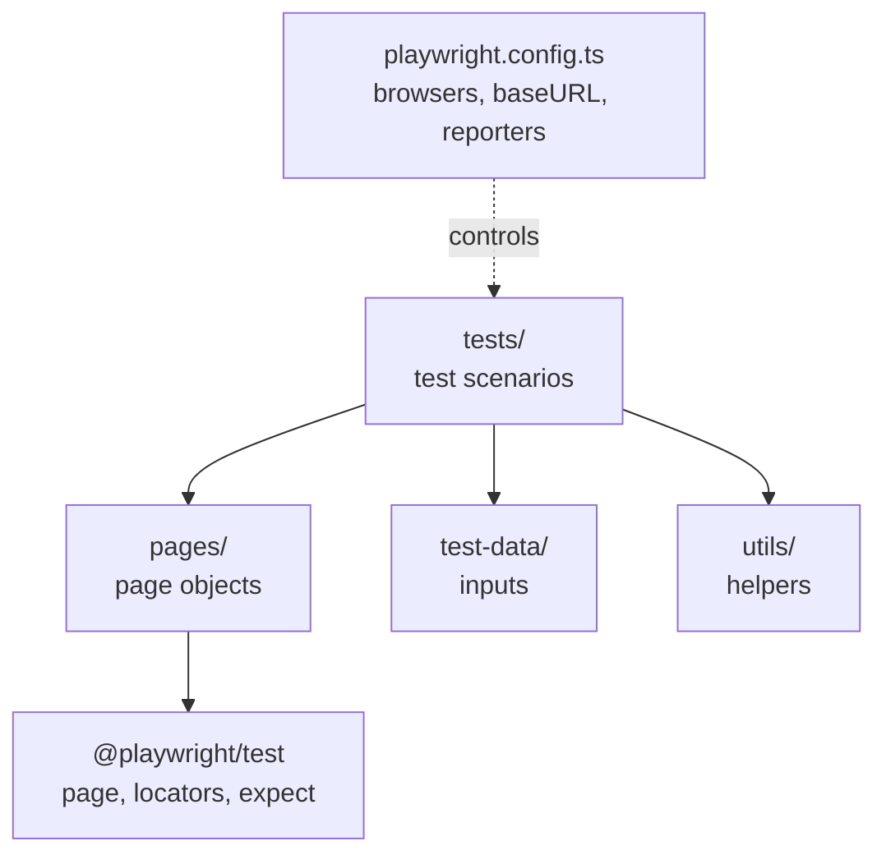

# Prerequisites

## P1 · Checklist before you start

You're ready for today if all of these are true (revisit the Day 3 lesson in brackets if not):

- [ ] `pw-course/` exists with `package.json`, `playwright.config.ts` and `tests/example.spec.ts` (Day 3 · I2–I3)
- [ ] `npx playwright test` ran 6 green runs and `npx playwright show-report` opened the report (Day 3 · I4)
- [ ] You know what `node_modules/` is and why it is never committed (Day 3 · P1, F4)
- [ ] You can use `cd`, `ls`, `pwd` and `Ctrl + C` in the terminal (Day 3 · P2)

Quick check:

```quiz
id: d4-p1-q1
type: single
question: You cloned a project that has package.json but no node_modules. What do you run first?
options:
  - "`npx playwright test`"
  - "`npm install`"
  - "`node package.json`"
answer: b
explanation: "`npm install` downloads every dependency listed in package.json into node_modules."
```

```quiz
id: d4-p1-q2
type: single
question: With the default 3 browser projects, how many runs does example.spec.ts (2 tests) produce?
options:
  - "2"
  - "3"
  - "6"
answer: c
explanation: Every test runs once per project — 2 × 3 = 6.
```

# Fundamentals

## F1 · `playwright.config.ts` explained

This file controls **how** all your tests run. Here is the generated file with the comments shortened (the full file has more commented-out examples):

```ts mode=read
import { defineConfig, devices } from '@playwright/test';

export default defineConfig({
  testDir: './tests',                        // where to look for *.spec.ts files
  fullyParallel: true,                       // run tests in parallel, even inside one file
  forbidOnly: !!process.env.CI,              // on CI, fail if someone left test.only in the code
  retries: process.env.CI ? 2 : 0,           // retry failed tests twice on CI, never locally
  workers: process.env.CI ? 1 : undefined,   // 1 worker on CI; locally Playwright decides (half your CPU cores)
  reporter: 'html',                          // produce the HTML report

  use: {                                     // settings shared by every test
    // baseURL: 'http://localhost:3000',     // lets you write page.goto('/login')
    trace: 'on-first-retry',                 // record a trace when a test is retried
  },

  projects: [                                // one "project" per browser
    { name: 'chromium', use: { ...devices['Desktop Chrome'] } },
    { name: 'firefox',  use: { ...devices['Desktop Firefox'] } },
    { name: 'webkit',   use: { ...devices['Desktop Safari'] } },
    // Commented examples: 'Mobile Chrome' (Pixel 5), 'Mobile Safari' (iPhone 12),
    // branded 'Microsoft Edge' and 'Google Chrome' via channel: 'msedge' / 'chrome'
  ],

  // webServer: { ... }                      // optionally start your app before the tests
});
```

**Learn these four now** — you'll touch them this week:

1. **`testDir`** — the folder Playwright searches for test files.
2. **`projects`** — one entry per browser (or device). Every test runs once per project. `devices['Desktop Chrome']` is a ready-made preset (engine, screen size, user agent).
3. **`reporter`** — how results are shown: `'list'` in the terminal, `'html'` for the report.
4. **`use`** — default options for every test, such as `baseURL` and `headless`.

Everything else can wait until you need it:

```reference title="The rest of the settings, for later"
| Setting | In one line |
|---|---|
| `fullyParallel` | `true` = tests inside the same file may also run at the same time |
| `retries` | How many times to re-run a failed test before calling it failed |
| `workers` | How many tests run at the same time (each worker is a separate process) |
| `forbidOnly` | Fail the run if a `test.only` was left in the code (used on CI) |
| `timeout` | Time limit per test (default 30 s) |
| `use.trace` / `use.screenshot` / `use.video` | What to record for debugging: `'on'`, `'off'`, `'on-first-retry'`, `'only-on-failure'`… |
| `use.viewport` | Browser window size, e.g. `{ width: 1280, height: 720 }` |
| `webServer` | Start your app before the tests and stop it afterwards |
| Reporter names | `'list'`, `'line'`, `'dot'`, `'html'`, `'json'`, `'junit'`, `'github'` |
```

> [!NOTE] What is `process.env.CI`?
> CI servers (GitHub Actions, Jenkins, Azure DevOps…) set an environment variable called `CI`. The config uses it to behave differently on the build server (retries, one worker) than on your laptop. You'll learn the `condition ? a : b` syntax on Day 5.

```quiz
id: d4-f5-q1
type: single
question: You want every test to use `https://staging.shop.com` as its starting address so tests can write `page.goto('/login')`. Which setting do you use?
options:
  - "`testDir`"
  - "`use: { baseURL: 'https://staging.shop.com' }`"
  - "`projects: ['https://staging.shop.com']`"
  - "`reporter: 'https://staging.shop.com'`"
answer: b
explanation: "`baseURL` inside `use` is prepended to relative URLs, so `page.goto('/login')` opens `https://staging.shop.com/login`."
```

```quiz
id: d4-f5-q2
type: single
question: "The config has 3 projects and `retries: process.env.CI ? 2 : 0`. On your LAPTOP, a test fails once. What happens?"
options:
  - It is retried twice
  - It is reported as failed immediately (0 retries)
  - It is skipped
  - It runs on a 4th browser
answer: b
explanation: "Your laptop doesn't set the `CI` variable, so `retries` is 0. On a CI server the same test would be retried up to 2 times."
```

## F2 · Running tests — the command cheat sheet

| Goal | Command |
|---|---|
| Run **all** tests, all projects, headless | `npx playwright test` |
| Watch the browser | `npx playwright test --headed` |
| One browser only | `npx playwright test --project=chromium` |
| One file | `npx playwright test tests/example.spec.ts` |
| Files whose path contains a word | `npx playwright test example` |
| One line in a file | `npx playwright test tests/example.spec.ts:3` |
| Tests whose **title** matches | `npx playwright test -g "has title"` |
| List tests without running them | `npx playwright test --list` |
| Run tests one at a time | `npx playwright test --workers=1` |
| Only re-run what failed last time | `npx playwright test --last-failed` |
| Step through with the Inspector | `npx playwright test --debug` |
| Visual UI Mode | `npx playwright test --ui` |
| Open the last HTML report | `npx playwright show-report` |
| Record a test by clicking | `npx playwright codegen https://playwright.dev` |

Options can be combined: `npx playwright test tests/example.spec.ts --project=firefox --headed`.

```quiz
id: d4-f6-q1
type: single
question: Which command runs ONLY the test titled "get started link", in Firefox, with the browser visible?
options:
  - "`npx playwright test --headed firefox get started link`"
  - "`npx playwright test -g \"get started link\" --project=firefox --headed`"
  - "`npx playwright show-report --project=firefox`"
  - "`npx playwright codegen \"get started link\"`"
answer: b
explanation: "`-g` filters by test title, `--project` picks the browser project, and `--headed` shows the window."
```

## F3 · Framework structure overview — where you're heading

The generated project is the *starting point*. Real automation frameworks add layers so that hundreds of tests stay easy to maintain. Over the coming weeks you'll build this structure:

```text mode=read
pw-course/
├── playwright.config.ts        ← global settings: browsers, baseURL, retries, reporters
├── package.json                ← dependencies + npm scripts (npm test, npm run test:headed)
├── tests/                      ← WHAT to test: spec files grouped by feature
│   ├── auth/login.spec.ts
│   └── cart/checkout.spec.ts
├── pages/                      ← HOW to use each page (Page Object Model — later weeks)
│   ├── LoginPage.ts
│   └── CartPage.ts
├── fixtures/                   ← reusable setup, e.g. "a logged-in page" (later weeks)
├── test-data/                  ← input data: users.json, products.json
└── utils/                      ← small helpers: random emails, date formatting
```



The rule of thumb: **tests describe *what* the user does and expects; everything else describes *how*.** When the login page changes, you fix one page object instead of 50 tests.

> [!TESTER]
> This mirrors good manual-testing practice: test cases (tests/) are separate from test data (test-data/) and from detailed navigation instructions (pages/).

```quiz
id: d4-f7-q1
type: single
question: The "Log in" button's text changes to "Sign in". In a well-structured framework, where would you ideally update this — once?
options:
  - In every test file that logs in
  - In the login page object (pages/LoginPage.ts)
  - In package.json
  - In .gitignore
answer: b
explanation: Page objects hold the "how" (locators and steps for a page). Change it once there and every test that uses it keeps working.
```

# Implementation

## I1 · Tune the config for learning

Two small changes make the next weeks smoother:

1. See **each test** in the terminal as it finishes (the `list` reporter) *and* still get the HTML report.
2. Stop the HTML report from **opening automatically** after a failure (it would block your terminal until you press `Ctrl + C`).

In `playwright.config.ts`, replace the `reporter` line:

```ts mode=read
  // BEFORE
  reporter: 'html',

  // AFTER: list in the terminal + HTML report on demand
  reporter: [['list'], ['html', { open: 'never' }]],
```

Run again, this time only on Chromium:

```bash terminal
npx playwright test --project=chromium
```

```output terminal
Running 2 tests using 2 workers

  ✓  1 [chromium] › tests/example.spec.ts:3:5 › has title (1.1s)
  ✓  2 [chromium] › tests/example.spec.ts:10:5 › get started link (1.6s)

  2 passed (2.5s)
```

> [!PLATFORM]
> Use this same `reporter` line in the pre-loaded Days 1–2 workspace, so the output learners saw there matches what they see from now on.

## I2 · Headed, one file, one test, one browser

Try each command and notice the difference:

```bash terminal
# watch the browser work
npx playwright test --project=chromium --headed

# only one file
npx playwright test tests/example.spec.ts --project=firefox

# only tests whose title contains "title"
npx playwright test -g "title" --project=webkit

# list what WOULD run, without running anything
npx playwright test --list
```

```output terminal
Listing tests:
  [chromium] › example.spec.ts:3:5 › has title
  [chromium] › example.spec.ts:10:5 › get started link
  [firefox] › example.spec.ts:3:5 › has title
  [firefox] › example.spec.ts:10:5 › get started link
  [webkit] › example.spec.ts:3:5 › has title
  [webkit] › example.spec.ts:10:5 › get started link
Total: 6 tests in 1 file
```

```quiz
id: d4-i6-q1
type: single
question: What does `npx playwright test --list` do?
options:
  - Runs all tests and lists failures
  - Shows which tests would run (per project) without running them
  - Lists installed browsers
  - Opens the HTML report
answer: b
explanation: "`--list` is a quick way to check that your filters (`-g`, `--project`, file names) select the tests you expect."
```

## I3 · Break it on purpose — and read the error

A tester's superpower is reading failures. Let's create one.

1. In `tests/example.spec.ts`, change `/Playwright/` to `/Selenium/` in the first test.
2. Run just that test:

```bash terminal
npx playwright test -g "has title" --project=chromium
```

```output terminal
Running 1 test using 1 worker

  ✘  1 [chromium] › tests/example.spec.ts:3:5 › has title (5.9s)

  1) [chromium] › tests/example.spec.ts:3:5 › has title ─────────────────────────

    Error: expect(page).toHaveTitle(expected) failed

    Expected pattern: /Selenium/
    Received string:  "Fast and reliable end-to-end testing for modern web apps | Playwright"
    Timeout: 5000ms

    Call log:
      - Expect "toHaveTitle" with timeout 5000ms
        9 × locator resolved to <html lang="en" dir="ltr" …>…</html>
          - unexpected value "Fast and reliable end-to-end testing for modern web apps | Playwright"

       4 |   await page.goto('https://playwright.dev/');
       5 |   // Expect a title "to contain" a substring.
    >  6 |   await expect(page).toHaveTitle(/Selenium/);
         |                      ^
       7 | });

  1 failed
    [chromium] › tests/example.spec.ts:3:5 › has title ──────────────────────────
```

How to read it — top to bottom:

| Part | What it tells you |
|---|---|
| `✘ … has title (5.9s)` | Which test failed and on which browser |
| `Expected pattern: /Selenium/` | What the test expected |
| `Received string: "… | Playwright"` | What the page actually had |
| `Timeout: 5000ms` / `9 × … unexpected value` | Playwright retried the check for 5 seconds before giving up (web-first assertion!) |
| `> 6 | … ^` | The exact line and position in your code |

3. Change `/Selenium/` back to `/Playwright/` and run again — green.

> [!TESTER]
> This is a defect report written for you: **expected**, **actual**, **where**. When a test fails, first decide: is it a bug in the app, or a problem in the test?

## I4 · Add npm script shortcuts

Typing long commands gets old. Add **scripts** to `package.json` with the terminal (or edit the file by hand):

```bash terminal
npm pkg set scripts.test="playwright test"
npm pkg set scripts.test:headed="playwright test --headed"
npm pkg set scripts.test:chromium="playwright test --project=chromium"
npm pkg set scripts.report="playwright show-report"
```

Your `package.json` now contains:

```json mode=read
"scripts": {
  "test": "playwright test",
  "test:headed": "playwright test --headed",
  "test:chromium": "playwright test --project=chromium",
  "report": "playwright show-report"
}
```

Use them:

```bash terminal
npm test
npm run test:chromium
# pass extra options after --
npm run test:chromium -- -g "get started"
npm run report
```

> [!NOTE]
> `test` is special — `npm test` works without `run`. Every other script needs `npm run <name>`. Inside scripts you don't need `npx`; npm finds the `playwright` command in `node_modules` automatically.

## I5 · Prepare your framework folders

Create the folders from lesson F3 so your project is ready to grow (they'll stay empty until Day 9):

```bash terminal
mkdir -p pages fixtures test-data utils tests/day9 tests/day10
ls
```

> [!NOTE]
> `mkdir -p` creates several folders at once (and nested ones such as `tests/day5`) without complaining if one already exists. In Windows PowerShell, `mkdir pages, fixtures, test-data, utils, tests/day9, tests/day10` does the same.

## I6 · (Own computer) Run tests from VS Code

With the **Playwright Test for VS Code** extension installed:

1. Open the `pw-course` folder in VS Code (**File → Open Folder**)
2. Click the **Testing** (flask) icon — your tests appear in a tree
3. Click ▶ next to a test to run it; tick **Show browser** at the bottom of the panel to watch it
4. Green ✓ / red ✗ icons also appear next to each `test(...)` line in the editor
5. **Record new** opens a browser and records your clicks into a new test file (Codegen)

# Practice

## Quiz · Day 4 check

```quiz
id: d4-pr-q3
type: single
question: In the config, what does a "project" usually represent?
options:
  - A Git repository
  - A browser or device configuration that every test runs against
  - A single test file
  - A team of testers
answer: b
explanation: Projects are sets of settings — typically one per browser/device. Each test runs once per project.
```

```quiz
id: d4-pr-q6
type: single
question: "You run `npm run test:chromium -- -g \"login\"`. What does the `--` do?"
options:
  - Comments out the rest of the line
  - Passes the options after it (`-g "login"`) on to the Playwright command inside the script
  - Runs the tests twice
  - Disables Chromium
answer: b
explanation: Everything after `--` is forwarded to the script's command, so it becomes `playwright test --project=chromium -g "login"`.
```

```quiz
id: d4-pr-q7
type: multiple
question: "The failure output says: Expected pattern: /Dashboard/, Received string: \"Login\", Timeout: 5000ms. What can you conclude? (Select all that apply)"
options:
  - The page title was "Login" instead of containing "Dashboard"
  - Playwright retried the assertion for about 5 seconds
  - The test definitely found a real bug in the app
  - The login step may have failed, or the test's expectation may be wrong — investigate
answer: [a, b, d]
explanation: The message shows expected vs actual and that the assertion retried for 5 s. Whether it's an app bug or a test problem needs investigation — never assume.
```

## Exercises

````exercise
id: d4-ex1
title: Write the command
level: easy
type: terminal
prompt: |
  Write the single command for each situation (run them to check):

  1. Run every test, only in WebKit.
  2. Run only `tests/example.spec.ts`, in Chromium, with the browser visible.
  3. Run only tests whose title contains `link`, in all browsers.
  4. Show which tests would run in Firefox without running them.
  5. Re-run only the tests that failed in the previous run.
hints:
  - "`--project=<name>` picks a browser project."
  - "`-g` filters by title; `--list` lists; `--last-failed` re-runs failures."
solution: |
  npx playwright test --project=webkit
  npx playwright test tests/example.spec.ts --project=chromium --headed
  npx playwright test -g "link"
  npx playwright test --project=firefox --list
  npx playwright test --last-failed
````

````exercise
id: d4-ex3
title: Customise the config
level: medium
type: code
prompt: |
  Edit `playwright.config.ts` so that:

  1. Only **chromium** and **firefox** projects remain (remove or comment out webkit).
  2. Failed tests are retried **once** locally and **twice** on CI.
  3. Tests run **headed** by default (hint: `headless: false` inside `use`).

  Then run `npx playwright test --list` and check that only 4 runs are listed (2 tests × 2 projects). Afterwards, set `headless` back (or remove the line) so tests run headless again.
file: playwright.config.ts
hints:
  - "`retries` uses the same `process.env.CI ? a : b` pattern that is already there — just change the numbers."
  - "Projects are objects inside the `projects: [ … ]` list. Put `//` in front of lines to comment them out."
solution: |
  import { defineConfig, devices } from '@playwright/test';

  export default defineConfig({
    testDir: './tests',
    fullyParallel: true,
    forbidOnly: !!process.env.CI,
    retries: process.env.CI ? 2 : 1,          // 2 on CI, 1 locally
    workers: process.env.CI ? 1 : undefined,
    reporter: [['list'], ['html', { open: 'never' }]],
    use: {
      trace: 'on-first-retry',
      headless: false,                         // show the browser for every run
    },
    projects: [
      { name: 'chromium', use: { ...devices['Desktop Chrome'] } },
      { name: 'firefox', use: { ...devices['Desktop Firefox'] } },
      // { name: 'webkit', use: { ...devices['Desktop Safari'] } },
    ],
  });
````

````exercise
id: d4-ex5
title: Record a test with Codegen (own computer)
level: challenge
type: terminal
prompt: |
  On your own computer, run `npx playwright codegen https://playwright.dev`.

  1. In the browser that opens, click **Docs**, then use the search box to search for `locators`.
  2. Watch the Playwright Inspector window write code as you click.
  3. Copy the generated code into `tests/day4/recorded.spec.ts` and run it.
  4. Write down two things in the generated code you *don't* understand yet — you'll recognise them by the end of Day 9.
hints:
  - Close the Codegen browser window when you're finished recording.
  - Codegen code often needs small clean-ups; that's normal.
solution: |
  npx playwright codegen https://playwright.dev
  # …record, copy the code into tests/day4/recorded.spec.ts, then:
  npx playwright test tests/day4/recorded.spec.ts --project=chromium --headed
````

## Reflection

1. Which file would you open to add a fourth browser, change retries, or set a base URL?
2. When a test fails, which three pieces of information in the error do you look at first?
3. What goes into `tests/`, `pages/` and `test-data/` in a well-structured framework?

> [!TIP] Coming up on Day 5
> Playwright tests are written in **TypeScript**. Over the next four days you'll learn exactly enough programming to read and write them confidently — starting with your first program, variables and simple data types.

## Week 1 wrap-up

You started the week as a manual tester. You can now:

- ✅ Explain what test automation is for and which tests to automate
- ✅ Describe how a web page is built and how Playwright finds elements in it
- ✅ Explain Playwright's architecture and why it reduces flaky tests
- ✅ Create a Playwright project, explain every file, run tests in many ways and read a failure

Week 2 is where you start writing code yourself.
