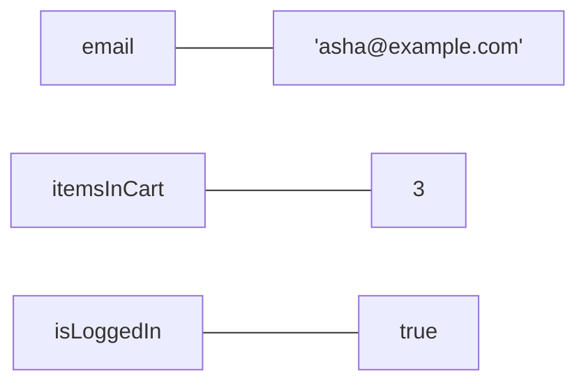

# Prerequisites

## P1 · Quick recap from Day 4

Before starting, make sure you can do each of these (the Day 4 lesson is in brackets):

- [ ] Run a file with `node day5/file.ts` and type-check it with `npm run check -- day5/file.ts`, from inside `pw-course/ts-basics` (Day 4 · I1–I2)
- [ ] Explain why Node.js and Playwright don't catch type mistakes, but `tsc` and VS Code do (Day 4 · F4)
- [ ] Read an error like `day5/x.ts(3,7): error TS2322: …` — file, line, character, code, message (Day 4 · P3)

```quiz
id: d5-p1-q1
type: single
question: "`const retries = 2;` — which type does TypeScript infer, and how?"
options:
  - string, because everything is text in JavaScript
  - number, worked out from the value 2 (type inference)
  - boolean, because 2 is "true"
  - No type until you write one
answer: b
explanation: With no annotation, TypeScript infers the type from the value. 2 is a number.
```

```quiz
id: d5-p1-q2
type: single
question: "What does `console.log('5' + 5);` print?"
options:
  - "10"
  - "55"
  - An error
  - "5 5"
answer: b
explanation: When either side of `+` is text, `+` joins instead of adding. You'll learn to avoid this trap today.
```

## P2 · Why tests need variables

Look at any manual test case and you'll find values that are used more than once, values that change, and values worked out from other values:

| In a test case | Example | In code |
|---|---|---|
| **Test data** used in several steps | The email `asha@example.com` is typed in step 2 and appears on the profile page in step 7 | A variable that stores it once |
| **Things that change** during the test | The number of items in the cart goes from 0 to 3 | A variable that's updated |
| **Values worked out** from others | Expected total = price × quantity | A variable calculated with operators |
| **Settings** | The site's address, a time limit | A variable that never changes |

A **variable** is a named box that holds a value. You give the box a name, put a value in it, and use the name wherever you need the value.



> [!TESTER]
> A variable is like a named cell in your test-data spreadsheet. Change the cell once, and every step that refers to it uses the new value — no hunting for copies.

An **operator** is a symbol that does something with values: `+` adds, `>` compares, `&&` combines true/false answers. A piece of code that produces a value — like `price * quantity` or `age >= 18` — is called an **expression**.

```quiz
id: d5-p2-q1
type: single
question: "Which of these is an expression (it produces a value)?"
options:
  - "`price * quantity`"
  - "`const price`"
  - "`// price times quantity`"
  - "`let total;`"
answer: a
explanation: "`price * quantity` calculates a value. `const price` and `let total;` only create a name (a declaration), and a comment is ignored."
```

# Fundamentals

## F1 · Declaring variables

Creating a variable is called **declaring** it. The full form has five parts:

```text mode=read
let   passedTests :  number  =  0 ;
└┬┘   └────┬────┘   └──┬──┘    └┬┘
keyword   name        type    value
```

- **keyword** — `let` or `const` (F2 explains which)
- **name** — how you'll refer to it
- **type** — optional; TypeScript infers it from the value if you leave it out (Day 4 · F5)
- **value** — the first value you put in the box

There are four ways to write a declaration:

| Form | Example | Result |
|---|---|---|
| Type **and** value | `let status: string = 'passed';` | A string box holding `'passed'` |
| Value only (type inferred) | `let status = 'passed';` | Same — TypeScript infers `string` |
| Type only, value later | `let status: string;` then `status = 'passed';` | Must be given a value before it's used |
| Neither | `let status;` | Avoid — it's unclear what the box is for |

### Assigning and reassigning

`=` means **"put this value in the box"** — it's not "equals" as in maths.

```ts mode=read
let itemsInCart = 0;    // declare, with a first value
itemsInCart = 1;        // reassign: put a new value in the same box
itemsInCart = 2;        // and again
```

Only the first line has `let`. After that you just use the name. Writing `let` again with the same name is an error — the box already exists.

### Using a variable before it has a value

```ts mode=read
let status: string;
console.log(status);    // ❌ error TS2454: Variable 'status' is used before being assigned.
```

TypeScript notices that the box is still empty. A running program would print `undefined` — JavaScript's word for "no value yet" (more on Day 6).

```quiz
id: d5-f1-q1
type: single
question: "What does `=` do in `score = score + 10;`?"
options:
  - It checks whether score equals score + 10
  - It works out score + 10, then puts the result into score
  - It is a syntax error
  - It creates a second variable called score
answer: b
explanation: "The right-hand side is worked out first, then `=` stores the result in the variable on the left."
```

## F2 · `const`, `let` — and why not `var`

| Keyword | Can the value be replaced? | Use it for |
|---|---|---|
| `const` | ❌ No — "constant" | Values that shouldn't change: test data, URLs, expected messages. **Use by default.** |
| `let` | ✅ Yes | Values that must change: counters, running totals, results |
| `var` | ✅ Yes | **Nothing** — the old keyword from before 2015. Avoid it |

```ts mode=read
const siteUrl = 'https://shop.example.com';
siteUrl = 'https://other.example.com';     // ❌ error TS2588: Cannot assign to 'siteUrl' because it is a constant.

let attempts = 1;
attempts = 2;                               // ✅ fine — let allows it
```

**Rule of thumb:** start with `const`. Change it to `let` only when you find you need to replace the value. Code full of `const` is easier to trust — you know those values never change halfway through a test.

### Why not `var`?

`var` was JavaScript's only keyword until 2015, when `let` and `const` arrived. It has surprising behaviours:

| `var` problem | What happens | `let` / `const` |
|---|---|---|
| **Redeclaring is allowed** | `var browser = 'chromium';` … later `var browser = 'firefox';` silently replaces the first — even if someone else wrote it far away | ❌ error: *Cannot redeclare…* |
| **Ignores blocks** | A `var` created inside `{ … }` leaks out and is visible outside it | Stays inside its block (F3) |
| **Usable before its line** | It exists — as `undefined` — even before the line that declares it, so typos in order go unnoticed | ❌ error: *used before its declaration* |

You'll still see `var` in old tutorials and old test code. Read it as "an old `let`", and write `let` or `const` yourself.

```quiz
id: d5-f2-q1
type: single
question: Which declaration will cause an error?
options:
  - "`let count = 1; count = 2;`"
  - "`const url = 'https://a.com'; url = 'https://b.com';`"
  - "`let name: string; name = 'Asha';`"
  - "`const maxRetries = 3;`"
answer: b
explanation: A `const` can't be given a new value. Use `let` if the value must change.
```

```quiz
id: d5-f2-q2
type: single
question: You store the expected page title for a test. It never changes during the test. Which keyword?
options:
  - "`const`"
  - "`let`"
  - "`var`"
  - "`let`, in case the title changes one day"
answer: a
explanation: A value that never changes is a `const`. Storing it once also means you change it in one place if the title changes.
```

## F3 · Scope and naming

### Scope: where a variable exists

Curly braces `{ }` make a **block** — a group of statements. A `let` or `const` declared **inside** a block exists **only inside** that block. That area is the variable's **scope**.

```ts mode=read
const suite = 'Checkout';            // outside any block: visible to everything below

{
  const step = 'Enter card details';   // only exists inside these braces
  console.log(suite, step);            // ✅ both visible here
}

console.log(step);                     // ❌ error TS2304: Cannot find name 'step'.
```

You'll see blocks everywhere from Day 7 — after `if`, around loops, as the body of functions and Playwright tests. Block scope keeps each block's variables private, so two tests can both have a variable called `email` without clashing.

> [!NOTE]
> Indenting the code inside a block (moving it right) is a convention that makes blocks easy to see. The computer ignores it — but people don't.

### Naming rules — what's allowed

| ✅ Allowed | ❌ Not allowed |
|---|---|
| Letters, digits, `_` and `$`: `user1`, `max_retries`, `$price` | Starting with a digit: `2ndUser` |
| Any length | Spaces or hyphens: `user name`, `user-name` |
| | Reserved words: `let`, `const`, `class`, `return`, `if`… |

Names are **case-sensitive**: `userName` and `username` are two different variables.

### Naming conventions — what's good

| Convention | Example |
|---|---|
| **camelCase**: first word lower-case, each following word capitalised | `loginButton`, `expectedPageTitle`, `maxRetryCount` |
| Say what it holds — clarity beats brevity | `expectedTotal` rather than `t` or `x2` |
| Yes/no values read like a question | `isLoggedIn`, `hasItems`, `shouldRetry` |
| Include units when it helps | `timeoutMs`, `priceInRupees` |

> [!TESTER]
> Good names make a test readable by someone who has never seen it — like a good test-case title. `expect(cartTotal).toBe(expectedTotal)` explains itself; `expect(a).toBe(b)` doesn't.

```quiz
id: d5-f3-q1
type: multiple
question: Which names are valid AND follow the camelCase convention? (Select all that apply)
options:
  - "`loginButton`"
  - "`login-button`"
  - "`expectedPageTitle`"
  - "`2ndUser`"
answer: [a, c]
explanation: Hyphens aren't allowed, and names can't start with a digit.
```

```quiz
id: d5-f3-q2
type: single
question: "A variable `token` is declared with `const` inside `{ … }`. Where can you use it?"
options:
  - Anywhere in the file
  - Only inside those braces, after the line that declares it
  - Only on the line where it's declared
  - Anywhere, but only after the braces close
answer: b
explanation: "`let` and `const` are block-scoped: they exist inside their block, from their declaration onward."
```

## F4 · Building text with template literals

On Day 4 you joined text with `+`. It works, but gets messy:

```ts mode=read
const firstName = 'Asha';
const items = 3;
console.log('Welcome back, ' + firstName + '! You have ' + items + ' items in your cart.');
```

A **template literal** is text written between **backticks** `` ` `` (the key under `Esc` on most keyboards). Inside it, `${ … }` inserts any value or expression:

```ts mode=read
console.log(`Welcome back, ${firstName}! You have ${items} items in your cart.`);
console.log(`Next week you'll have ${items + 2} items.`);    // any expression works inside ${ }
```

Both print `Welcome back, Asha! You have 3 items in your cart.` — the template literal is simply easier to read and harder to get wrong (no missing spaces or `+` signs).

Template literals appear constantly in Playwright tests:

```ts mode=read
const baseUrl = 'https://shop.example.com';
const productId = 42;
const productUrl = `${baseUrl}/products/${productId}`;      // https://shop.example.com/products/42
const searchTerm = 'wireless mouse';
const expectedHeading = `Results for "${searchTerm}"`;     // Results for "wireless mouse"
```

A few handy tools that every piece of text has. You write them after a dot; the ones with brackets are called *methods*, and `.length` (no brackets) is a *property* — a stored fact about the text:

| Method | Example | Result |
|---|---|---|
| `.length` (no brackets) | `'Asha'.length` | `4` |
| `.toUpperCase()` / `.toLowerCase()` | `'Asha'.toUpperCase()` | `'ASHA'` |
| `.trim()` | `'  a@b.com  '.trim()` | `'a@b.com'` — spaces removed from both ends |
| `.includes('…')` | `'Order confirmed'.includes('confirmed')` | `true` |

```quiz
id: d5-f4-q1
type: single
question: "`const user = 'Ravi';` — what does `` console.log(`Hi ${user}, you have ${2 * 3} messages`) `` print?"
options:
  - "`Hi ${user}, you have ${2 * 3} messages`"
  - "`Hi Ravi, you have 6 messages`"
  - "`Hi user, you have 2 * 3 messages`"
  - An error
answer: b
explanation: Inside backticks, `${ }` is replaced by the value of what's inside — the variable's value, or the result of the calculation.
```

## F5 · Arithmetic and assignment operators

### Arithmetic

| Operator | Meaning | Example | Result |
|---|---|---|---|
| `+` | add | `7 + 2` | `9` |
| `-` | subtract | `7 - 2` | `5` |
| `*` | multiply | `7 * 2` | `14` |
| `/` | divide | `7 / 2` | `3.5` |
| `%` | remainder (*modulo*) | `7 % 2` | `1` |
| `**` | power | `2 ** 10` | `1024` |

`*`, `/` and `%` happen before `+` and `-`, just like in maths: `2 + 3 * 4` is `14`. **Brackets go first**: `(2 + 3) * 4` is `20`. When in doubt, add brackets — they make the order obvious to readers too.

Two surprises worth knowing:

- Decimals aren't always exact: `0.1 + 0.2` gives `0.30000000000000004`. Round for display with `.toFixed(2)` → `'0.30'` (note: it gives *text*).
- Dividing a number by zero gives `Infinity`, and converting text that isn't a number with `Number(…)` gives `NaN` ("Not a Number") — see F6.

### Assignment shortcuts

| Shortcut | Same as | Typical use |
|---|---|---|
| `x += 5` | `x = x + 5` | Add to a running total |
| `x -= 5` | `x = x - 5` | Subtract from stock |
| `x *= 2` | `x = x * 2` | Double a wait time |
| `x /= 2` | `x = x / 2` | Halve something |
| `x++` | `x = x + 1` | Count one more pass |
| `x--` | `x = x - 1` | Count down attempts |

These all *change* the variable — so they only work on `let`, never on `const`.

```quiz
id: d5-f5-q1
type: single
question: "What does `console.log(10 % 3);` print?"
options:
  - "3.33"
  - "3"
  - "1"
  - "30"
answer: c
explanation: "`%` gives the remainder: 10 ÷ 3 = 3, remainder 1."
```

```quiz
id: d5-f5-q2
type: single
question: "`let total = 100; total += 50; total -= 30;` — what is total now?"
options:
  - "100"
  - "120"
  - "150"
  - "180"
answer: b
explanation: 100 + 50 = 150, then 150 − 30 = 120.
```

## F6 · Comparison operators

Comparisons always produce `true` or `false` — exactly what an assertion needs.

| Operator | Meaning | Example | Result |
|---|---|---|---|
| `===` | equal (value **and** type) | `3 === 3` | `true` |
| `!==` | not equal | `3 !== 4` | `true` |
| `>` / `<` | greater / less than | `5 > 3` | `true` |
| `>=` / `<=` | greater or equal / less or equal | `18 >= 18` | `true` |
| `==` / `!=` | "loose" equal / not equal — converts types first | `'3' == 3` | `true` (!) |

### Always use `===` and `!==`

In plain JavaScript, the loose `==` quietly converts values before comparing, so `'3' == 3` is `true` and `'' == 0` is `true`. That hides bugs: a page showing the text `"3"` would pass a check for the number `3` by accident. The strict `===` compares **value and type**, so `'3' === 3` is `false` — no surprises.

TypeScript goes one step further: when the two sides clearly have different types, it flags the comparison — with `==` *or* `===` — before you even run the code (you'll see it in I4). But values without a known type (for example data read from a file) slip past that check, so make `===` your habit.

### Text read from a page is always text

When a test reads what's on the screen — a price, a count, a badge — it usually gets **text**, even if it looks like a number. To compare it with a number, convert it:

| Conversion | Example | Result |
|---|---|---|
| Text → number | `Number('1499')` | `1499` |
| Text that isn't a number | `Number('₹1,499')` | `NaN` — clean it up first (Day 6) |
| Empty text | `Number('')` | `0` — careful! An empty badge silently becomes 0, not NaN |
| Number → text | `String(3)` | `'3'` |
| Which type is it? | `typeof badgeText` | `'string'` — the `typeof` operator from Day 4 gives the type's name, e.g. `'string'`, `'number'`, `'boolean'` |

### Comparing text

Text is compared letter by letter, and **case matters**: `'Login' === 'login'` is `false`. When the case shouldn't matter, compare lower-cased versions: `a.toLowerCase() === b.toLowerCase()`.

```quiz
id: d5-f6-q1
type: single
question: Why should you prefer `===` over `==`?
options:
  - "`===` runs faster"
  - "`===` doesn't convert types, so `'5' === 5` is false"
  - "`==` doesn't work in TypeScript"
  - "`===` ignores upper/lower case"
answer: b
explanation: "`==` converts types before comparing, which hides bugs. `===` is strict and predictable."
```

```quiz
id: d5-f6-q2
type: single
question: "A test reads the cart count from the page as `countText = '3'`. How do you check it equals the number 3?"
options:
  - "`countText === 3`"
  - "`Number(countText) === 3`"
  - "`countText == 3`"
  - "`countText + 0 === 3`"
answer: b
explanation: "Convert the text to a number first, then compare strictly. (`countText + 0` would give `'30'` — text joined with 0.)"
```

## F7 · Logical operators and the ternary operator

### Combining true/false values

| Operator | Name | `true` when… | Example |
|---|---|---|---|
| `&&` | AND | **both** sides are true | `isLoggedIn && hasItems` |
| `\|\|` | OR | **at least one** side is true | `isAdmin \|\| isManager` |
| `!` | NOT | flips true ↔ false | `!isLoggedIn` |

Their full "truth tables":

| A | B | `A && B` | `A \|\| B` | `!A` |
|---|---|---|---|---|
| true | true | true | true | false |
| true | false | false | true | false |
| false | true | false | true | true |
| false | false | false | false | true |

Business rules are full of these: *"Show the Checkout button if the user is logged in **and** the cart isn't empty."*

```ts mode=read
const isLoggedIn = true;
const itemsInCart = 0;
const showCheckout = isLoggedIn && itemsInCart > 0;   // true && false → false
```

### The ternary operator — a one-line either/or

`condition ? valueIfTrue : valueIfFalse`

```ts mode=read
const failedTests: number = 0;
const status = failedTests === 0 ? 'PASS' : 'FAIL';   // 'PASS'
```

Read it as: *"Is `failedTests === 0`? If yes, `'PASS'`; otherwise `'FAIL'`."* (The `: number` tells TypeScript that `failedTests` could be any number — without it, TypeScript sees it's always 0 and would call the comparison pointless. I3 explains this.)

On Day 10 you'll meet this line in Playwright's settings file: `retries: process.env.CI ? 2 : 0` — "on a CI server, 2 retries; otherwise 0".

```quiz
id: d5-f7-q1
type: single
question: "`const age = 16; const hasConsent = true;` — what is `age >= 18 || hasConsent`?"
options:
  - "true"
  - "false"
  - "16"
  - An error
answer: a
explanation: "`age >= 18` is false, but `hasConsent` is true. With OR, one true side is enough."
```

```quiz
id: d5-f7-q2
type: single
question: "`const passed: number = 8; const total: number = 10;` — what is `passed === total ? 'All green' : 'Some failed'`?"
options:
  - "'All green'"
  - "'Some failed'"
  - "true"
  - "false"
answer: b
explanation: 8 === 10 is false, so the ternary gives the value after the colon.
```

# Implementation

All files today go in `ts-basics/day5`. Run each with `node day5/<file>.ts` and check it with `npm run check -- day5/<file>.ts`, from inside `pw-course/ts-basics`.

## I1 · Test data and values built from it

A registration test needs test data, plus values worked out from it. Everything here is a `const` — none of it changes during the test.

```ts file=ts-basics/day5/test-data.ts mode=editor run="node day5/test-data.ts"
// Test data for a registration test
const firstName = 'Meera';
const lastName = 'Iyer';
const email = '  Meera.Iyer@Example.com  ';   // typed by a user, with extra spaces and capitals
const age: number = 27;
const acceptsTerms = true;

// Values built from the test data
const fullName = `${firstName} ${lastName}`;
const cleanEmail = email.trim().toLowerCase();          // what a good app should store
const expectedWelcome = `Welcome, ${firstName}!`;
const profileUrl = `https://shop.example.com/users/${cleanEmail}`;

// Print a summary
console.log(`Full name: ${fullName} (${fullName.length} characters)`);
console.log(`Clean email: ${cleanEmail}`);
console.log(`Adult: ${age >= 18}`);
console.log(`Terms accepted: ${acceptsTerms}`);
console.log(`Expected message: ${expectedWelcome}`);
console.log(`Profile page: ${profileUrl}`);
```

```bash terminal
node day5/test-data.ts
npm run check -- day5/test-data.ts
```

```output console
Full name: Meera Iyer (10 characters)
Clean email: meera.iyer@example.com
Adult: true
Terms accepted: true
Expected message: Welcome, Meera!
Profile page: https://shop.example.com/users/meera.iyer@example.com
```

Notice `email.trim().toLowerCase()`: methods can be **chained** — `trim()` runs first, then `toLowerCase()` runs on its result.

**Try it:** change `firstName` to `'Priya'` and run again. Three lines change, because three values were built from it — that's the "change the cell once" benefit from P2.

## I2 · Counting results with `let`

This program tracks a test run as it happens, so its counters must be `let`:

```ts file=ts-basics/day5/counters.ts mode=editor run="node day5/counters.ts"
// Counting results as a test run progresses
let passed = 0;
let failed = 0;
let totalTimeMs = 0;

// Test 1: login — passed in 1200 ms
passed++;
totalTimeMs += 1200;

// Test 2: search — failed in 5300 ms
failed++;
totalTimeMs += 5300;

// Test 3: checkout — passed in 2500 ms
passed += 1;
totalTimeMs = totalTimeMs + 2500;

// Summary
const total = passed + failed;
console.log(`Ran ${total} tests: ${passed} passed, ${failed} failed`);
console.log(`Total time: ${totalTimeMs} ms (${totalTimeMs / 1000} seconds)`);
console.log(`Average per test: ${totalTimeMs / total} ms`);
```

```output console
Ran 3 tests: 2 passed, 1 failed
Total time: 9000 ms (9 seconds)
Average per test: 3000 ms
```

`passed++`, `passed += 1` and `passed = passed + 1` all do the same thing — use whichever reads best.

**Try it:** change `let passed = 0;` to `const passed = 0;` and check the file. Read the errors (one for each line that changes `passed`), then change it back.

## I3 · Test-run metrics and a release decision

Arithmetic, comparison, logical and ternary operators together — the kind of numbers you'd put in a test-summary report:

```ts file=ts-basics/day5/metrics.ts mode=editor run="node day5/metrics.ts"
// Results from a test run (typed as number: in real life they come from a report)
const total: number = 48;
const passed: number = 42;
const failed: number = 4;
const skipped = total - passed - failed;          // whatever is left over

// Percentages
const passRate = (passed / total) * 100;          // brackets first, then × 100
const passRateText = passRate.toFixed(1);         // round to 1 decimal place (gives text)

// Decisions
const allPassed = failed === 0;
const releaseReady = passRate >= 90 && failed <= 5;   // both rules must be true
const status = allPassed ? 'GREEN' : 'RED';

console.log(`Total: ${total} | Passed: ${passed} | Failed: ${failed} | Skipped: ${skipped}`);
console.log(`Pass rate: ${passRateText}%`);
console.log(`Status: ${status}`);
console.log(`Ready for release? ${releaseReady}`);
```

```output console
Total: 48 | Passed: 42 | Failed: 4 | Skipped: 2
Pass rate: 87.5%
Status: RED
Ready for release? false
```

> [!NOTE] Why `: number` on the first three lines?
> Without it, TypeScript would notice that `failed` is *always* exactly 4, and flag `failed === 0` as a comparison that can never be true. Real results come from a report and can be any number, so we tell TypeScript "this is some number".

**Try it:** change `passed` to `44` and `failed` to `2`. Predict all four lines *before* running.

```quiz
id: d5-i3-q1
type: single
question: With passed = 44, failed = 2 and total = 48 (a pass rate of about 91.7%), what is `releaseReady`?
options:
  - "true"
  - "false — because some tests failed"
  - "false — because the pass rate is below 95"
  - An error
answer: a
explanation: 91.7 >= 90 is true and 2 <= 5 is true; true && true is true. Failures don't matter as long as there are at most 5.
```

## I4 · The text-versus-number trap

A test reads the cart badge from the page. The badge shows **3** — but text read from a page is always a string. Check this file before running it:

```ts file=ts-basics/day5/compare-trap.ts mode=editor expect=error run="npm run check -- day5/compare-trap.ts"
// The cart badge on the page shows "3". Text read from a page is always a string.
const badgeText = '3';
const expectedItems = 3;

console.log(badgeText === expectedItems);
```

```bash terminal
npm run check -- day5/compare-trap.ts
```

```output terminal
day5/compare-trap.ts(5,13): error TS2367: This comparison appears to be unintentional because the types 'string' and 'number' have no overlap.
```

TypeScript spotted that a string can **never** be strictly equal to a number — the check would always be `false`, and the test would fail for the wrong reason. The fix is to convert first:

```ts file=ts-basics/day5/compare-fixed.ts mode=editor run="node day5/compare-fixed.ts"
// Convert text from the page to a number before comparing
const badgeText = '3';
const expectedItems = 3;
const badgeNumber = Number(badgeText);            // '3' → 3

console.log(badgeNumber === expectedItems);       // now both are numbers
console.log(typeof badgeText, typeof badgeNumber);

// Conversions you'll need when reading prices and counts
console.log(Number('1499') + 1);                  // a real number: adds
console.log(Number('₹1,499'));                    // not a plain number: NaN
console.log(String(expectedItems) + ' items');    // number → text
```

```output console
true
string number
1500
NaN
3 items
```

> [!TESTER]
> `NaN` is a classic source of confusing test failures. If a price on the page includes a currency symbol or a comma, remove them before converting — you'll learn how to clean text on Day 6.

## I5 · Fix three variable mistakes

This file has three classic variable mistakes. Check it and read each error:

```ts file=ts-basics/day5/scope-errors.ts mode=editor expect=error run="npm run check -- day5/scope-errors.ts"
// Three variable mistakes. Check this file and read each error.
const baseUrl = 'https://shop.example.com';
baseUrl = 'https://staging.shop.example.com';

console.log(attempts);
let attempts = 0;

{
  const secretToken = 'abc123';
}
console.log(secretToken);
```

```bash terminal
npm run check -- day5/scope-errors.ts
```

```output terminal
day5/scope-errors.ts(3,1): error TS2588: Cannot assign to 'baseUrl' because it is a constant.
day5/scope-errors.ts(5,13): error TS2448: Block-scoped variable 'attempts' used before its declaration.
day5/scope-errors.ts(5,13): error TS2454: Variable 'attempts' is used before being assigned.
day5/scope-errors.ts(11,13): error TS2304: Cannot find name 'secretToken'.
```

| Line | Mistake | Fix |
|---|---|---|
| 3 | Reassigning a `const` | Use `let` if it must change — or, better, make a second `const` with a different name |
| 5 | Using `attempts` before the line that creates it (two errors for the same mistake) | Move the `console.log` below the declaration |
| 11 | `secretToken` only exists inside its block | Use it inside the block, or declare it outside |

The fixed version:

```ts file=ts-basics/day5/scope-fixed.ts mode=editor run="node day5/scope-fixed.ts"
// The same program, fixed
const baseUrl = 'https://shop.example.com';
const stagingUrl = 'https://staging.shop.example.com';   // a second const instead of reassigning

let attempts = 0;
console.log(attempts);                                    // used after it's declared

const secretToken = 'abc123';                             // declared outside the block
{
  console.log(`Inside the block: ${secretToken}`);
}
console.log(`Outside the block: ${secretToken}`);
console.log(baseUrl, stagingUrl);
```

```output console
0
Inside the block: abc123
Outside the block: abc123
https://shop.example.com https://staging.shop.example.com
```

Notice that a block can see variables from **outside** it — scope only stops variables leaking *out*.

# Practice

## Quiz · Day 5 check

```quiz
id: d5-pr-q1
type: single
question: Which keyword should you use by default for a new variable?
options:
  - "`var`"
  - "`let`"
  - "`const`"
  - "`let` for text, `const` for numbers"
answer: c
explanation: Use `const` by default and switch to `let` only when the value must change. Avoid `var`.
```

```quiz
id: d5-pr-q2
type: single
question: "`let x = 5; let x = 6;` in the same block — what happens?"
options:
  - x becomes 6
  - An error — `let` doesn't allow declaring the same name twice
  - x becomes 11
  - Both values are kept
answer: b
explanation: "Redeclaring is an error with `let` and `const`. To change the value, just write `x = 6;`. (Old `var` would have allowed it silently.)"
```

```quiz
id: d5-pr-q3
type: single
question: "What does `console.log(2 + 3 * 4);` print?"
options:
  - "20"
  - "14"
  - "24"
  - "9"
answer: b
explanation: Multiplication happens before addition — 3 × 4 = 12, then 2 + 12 = 14. Use brackets `(2 + 3) * 4` for 20.
```

```quiz
id: d5-pr-q4
type: single
question: "`const product = 'Mouse'; const price = 799;` — which line prints `Mouse costs ₹799`?"
options:
  - "`` console.log('${product} costs ₹${price}'); ``"
  - "`` console.log(`${product} costs ₹${price}`); ``"
  - "`` console.log(`product costs ₹price`); ``"
  - "`` console.log(${product} + ' costs ₹' + ${price}); ``"
answer: b
explanation: "`${ }` only works inside backticks. Inside single quotes it's printed literally."
```

```quiz
id: d5-pr-q5
type: single
question: "What is `true && !false`?"
options:
  - "true"
  - "false"
  - An error
  - "undefined"
answer: a
explanation: "`!false` is true, and true && true is true."
```

```quiz
id: d5-pr-q6
type: single
question: "`Number('12 items')` gives…"
options:
  - "12"
  - "'12 items'"
  - "NaN"
  - "0"
answer: c
explanation: The whole text must be a number. Anything extra — words, currency symbols, commas — gives NaN.
```

```quiz
id: d5-pr-q7
type: single
question: "Which error do you get for `const limit = 5; limit++;`?"
options:
  - "Cannot find name 'limit'"
  - "Cannot assign to 'limit' because it is a constant"
  - "limit is used before being assigned"
  - No error — ++ is allowed on constants
answer: b
explanation: "`limit++` means `limit = limit + 1`, which changes the variable. A const can't change."
```

```quiz
id: d5-pr-q8
type: multiple
question: "`const isLoggedIn = true; const cartCount: number = 2;` — which of these are true? (Select all that apply)"
options:
  - "`isLoggedIn && cartCount > 0`"
  - "`!isLoggedIn || cartCount === 0`"
  - "`cartCount >= 2`"
  - "`cartCount !== 2`"
answer: [a, c]
explanation: "`isLoggedIn && cartCount > 0` is true && true. `!isLoggedIn || cartCount === 0` is false || false. `cartCount >= 2` is true. `cartCount !== 2` is false."
```

## Predict the output

````exercise
id: d5-pr-p1
title: Predict — text and numbers
level: easy
type: predict
prompt: Write down the four lines this program prints, then run it to check.
code: |
  const a = 10;
  const b = '10';
  console.log(a + 5);
  console.log(b + 5);
  console.log(a === Number(b));
  console.log(`${a} items`);
answer: |
  15
  105
  true
  10 items

  `b + 5` joins text ('10' + 5 → '105'). `Number(b)` turns '10' into 10, so the strict comparison is true.
````

````exercise
id: d5-pr-p2
title: Predict — let and shortcuts
level: easy
type: predict
prompt: What is printed?
code: |
  let count = 1;
  count += 4;
  count--;
  count *= 2;
  const label = count > 6 ? 'many' : 'few';
  console.log(count, label);
answer: |
  `8 many`

  count: 1 → 5 (`+= 4`) → 4 (`--`) → 8 (`*= 2`). 8 > 6 is true, so label is 'many'.
````

````exercise
id: d5-pr-p3
title: Predict — the order of operations
level: medium
type: predict
prompt: What is printed?
code: |
  const price = 200;
  const qty = 3;
  console.log('Total: ' + price * qty);
  console.log('Total: ' + price + qty);
  console.log('Total: ' + (price + qty));
answer: |
  Total: 600
  Total: 2003
  Total: 203

  Line 1: `*` happens before `+`, so 200 × 3 = 600, then it's joined to the text. Line 2: `+` works left to right — the text joins 200, then joins 3. Line 3: the brackets add 200 + 3 first.
````

## Exercises

````exercise
id: d5-ex1
title: Tester profile card
level: easy
type: code
prompt: |
  Create `day5/profile.ts`. Declare **constants** for your name (string), years of testing experience (number), favourite browser (string) and whether you've used automation before (boolean).

  Print exactly this format, using **one template literal per line** (with your own values):
  ```
  Tester: Priya Sharma
  Experience: 3 years
  Favourite browser: firefox
  Automation before: false
  ```
file: ts-basics/day5/profile.ts
run: node day5/profile.ts
starter: |
  // 1. Declare your four constants here

  // 2. Print the four lines with template literals
hints:
  - "A template literal uses backticks: `` console.log(`Tester: ${testerName}`); ``"
solution: |
  // 1. Four constants
  const testerName = 'Priya Sharma';
  const yearsOfExperience = 3;
  const favouriteBrowser = 'firefox';
  const usedAutomation = false;

  // 2. Print with template literals
  console.log(`Tester: ${testerName}`);
  console.log(`Experience: ${yearsOfExperience} years`);
  console.log(`Favourite browser: ${favouriteBrowser}`);
  console.log(`Automation before: ${usedAutomation}`);
expectedOutput: |
  Tester: Priya Sharma
  Experience: 3 years
  Favourite browser: firefox
  Automation before: false
````

````exercise
id: d5-ex2
title: Shopping-cart calculator
level: medium
type: code
prompt: |
  Create `day5/cart.ts`. A cart has: unit price **1299**, quantity **3**, a **10%** discount, and shipping of **99**, which is **free when the discounted amount is 3000 or more**.

  Print:
  ```
  Subtotal: 3897
  Discount: 389.7
  After discount: 3507.3
  Shipping: 0
  Total to pay: 3507.30
  ```
  Use `const` for everything, arithmetic operators for the maths, a **ternary** for shipping, and `.toFixed(2)` for the last line.
file: ts-basics/day5/cart.ts
run: node day5/cart.ts
hints:
  - "discount = subtotal × discountPercent / 100"
  - "`const shipping = afterDiscount >= 3000 ? 0 : 99;`"
solution: |
  // Inputs
  const unitPrice = 1299;
  const quantity = 3;
  const discountPercent = 10;

  // Calculations
  const subtotal = unitPrice * quantity;                   // 3897
  const discount = (subtotal * discountPercent) / 100;     // 389.7
  const afterDiscount = subtotal - discount;               // 3507.3
  const shipping = afterDiscount >= 3000 ? 0 : 99;         // free above 3000
  const totalToPay = afterDiscount + shipping;

  // Output
  console.log(`Subtotal: ${subtotal}`);
  console.log(`Discount: ${discount}`);
  console.log(`After discount: ${afterDiscount}`);
  console.log(`Shipping: ${shipping}`);
  console.log(`Total to pay: ${totalToPay.toFixed(2)}`);
expectedOutput: |
  Subtotal: 3897
  Discount: 389.7
  After discount: 3507.3
  Shipping: 0
  Total to pay: 3507.30
````

````exercise
id: d5-ex3
title: Check the page's numbers
level: medium
type: code
prompt: |
  A test read three values from an order page — all as **text**:
  ```ts
  const itemCountText = '4';
  const unitPriceText = '250';
  const totalText = '1000';
  ```
  Create `day5/order-check.ts` that converts them to numbers, calculates the expected total (item count × unit price), and prints:
  ```
  Expected total: 1000
  Page total: 1000
  Totals match: true
  ```
  Use `Number(…)` and `===`. The type check must pass.
file: ts-basics/day5/order-check.ts
run: node day5/order-check.ts
hints:
  - "Convert each text value with `Number(itemCountText)` and so on, into new constants."
  - Compare the page total (as a number) with your calculated total using `===`.
solution: |
  // Values read from the page — always text
  const itemCountText = '4';
  const unitPriceText = '250';
  const totalText = '1000';

  // Convert to numbers
  const itemCount = Number(itemCountText);
  const unitPrice = Number(unitPriceText);
  const pageTotal = Number(totalText);

  // Calculate and compare
  const expectedTotal = itemCount * unitPrice;
  console.log(`Expected total: ${expectedTotal}`);
  console.log(`Page total: ${pageTotal}`);
  console.log(`Totals match: ${pageTotal === expectedTotal}`);
expectedOutput: |
  Expected total: 1000
  Page total: 1000
  Totals match: true
````

````exercise
id: d5-ex4
title: Fix the settings file
level: medium
type: code
prompt: |
  This file mimics settings from `playwright.config.ts` but has **four** mistakes. Save it as `day5/settings.ts`, check it, and fix it until the check is silent and it prints:
  ```
  Retries: 0 | Workers: 4 | Headless: true | Base URL: http://localhost:3000
  ```
file: ts-basics/day5/settings.ts
run: node day5/settings.ts
starter: |
  const isCI: boolean = 'false';
  const retries = isCI ? 2 : 0;
  const workers = isCI ? 1 : 4;
  const headless: boolean = true;
  headless = !isCI;
  const baseUrl = http://localhost:3000;
  console.log(`Retries: ${retries} | Workers: ${workers} | Headless: ${headless} | Base URL: ${baseURL}`);
hints:
  - "The checker reports *syntax* mistakes (like missing quotes) first. Fix those, check again, and the *type* mistakes appear — errors can come in waves."
  - Booleans are written without quotes.
  - A const can't be reassigned — do you need that line at all? (What is `!isCI` when isCI is false?)
  - Text needs quotes, and names are case-sensitive.
solution: |
  const isCI: boolean = false;                 // fix 1: a boolean, not text
  const retries = isCI ? 2 : 0;
  const workers = isCI ? 1 : 4;
  const headless: boolean = !isCI;             // fix 2: set it once instead of reassigning a const
  const baseUrl = 'http://localhost:3000';     // fix 3: text needs quotes
  console.log(`Retries: ${retries} | Workers: ${workers} | Headless: ${headless} | Base URL: ${baseUrl}`);   // fix 4: baseUrl, not baseURL
expectedOutput: |
  Retries: 0 | Workers: 4 | Headless: true | Base URL: http://localhost:3000
````

````exercise
id: d5-ex5
title: "Challenge: build a URL and a test title"
level: challenge
type: code
prompt: |
  Create `day5/url-builder.ts`. Given:
  ```ts
  const baseUrl = 'https://shop.example.com';
  const category = 'Laptops';
  const brand = 'Acme Tech';
  const page = 2;
  const sortBy = 'price';
  ```
  1. Make a URL-friendly **brand slug**: lower-case, and the space replaced by `-` → `acme-tech`. (Text has a method `.replace(' ', '-')` that replaces the first space.)
  2. Build: `https://shop.example.com/c/laptops?brand=acme-tech&page=2&sort=price` (note the category is lower-cased too).
  3. Build a test title: `[P2] Laptops by Acme Tech, sorted by price`.
  4. Print the URL, then the title.
file: ts-basics/day5/url-builder.ts
run: node day5/url-builder.ts
hints:
  - "`brand.toLowerCase().replace(' ', '-')` chains two methods."
  - "Build both lines with template literals: `${baseUrl}/c/${…}?brand=${…}&page=${page}&sort=${sortBy}`"
solution: |
  const baseUrl = 'https://shop.example.com';
  const category = 'Laptops';
  const brand = 'Acme Tech';
  const page = 2;
  const sortBy = 'price';

  // 1. URL-friendly pieces
  const brandSlug = brand.toLowerCase().replace(' ', '-');   // 'acme-tech'
  const categorySlug = category.toLowerCase();                // 'laptops'

  // 2 + 3. Build the URL and the title with template literals
  const url = `${baseUrl}/c/${categorySlug}?brand=${brandSlug}&page=${page}&sort=${sortBy}`;
  const title = `[P${page}] ${category} by ${brand}, sorted by ${sortBy}`;

  // 4. Print
  console.log(url);
  console.log(title);
expectedOutput: |
  https://shop.example.com/c/laptops?brand=acme-tech&page=2&sort=price
  [P2] Laptops by Acme Tech, sorted by price
````

## Reflection

1. When do you choose `let` instead of `const` — and why never `var`?
2. What is block scope? Give an example of a variable you can't use outside its block.
3. Rewrite `'Hello ' + name + ', you have ' + n + ' items'` as a template literal.
4. Why is `'5' === 5` false, and why is that a good thing?
5. A test reads the price "₹1,499" from a page. What will `Number()` give, and why?

> [!TIP] Coming up on Day 6
> Data types in depth: the rest of the simple types (`null`, `undefined`), and the ones you'll store test data in — arrays for lists, objects for records, tuples, union and literal types — plus why `any` is a trap.
