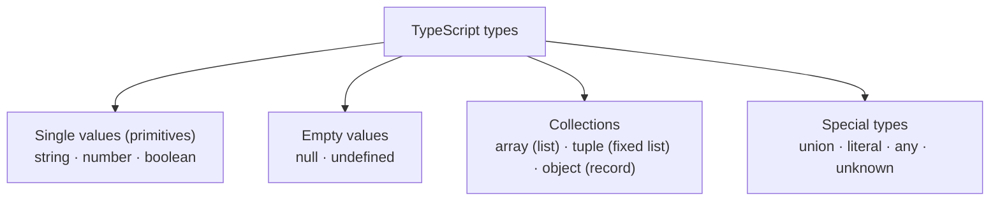

# Prerequisites

## P1 · Quick recap from Day 5

- [ ] Declare values with `const` by default and `let` when they must change (Day 5 · F2)
- [ ] Build text with template literals: `` `Hello, ${name}` `` (Day 5 · F4)
- [ ] Compare with `===`, and convert page text with `Number(…)` before comparing (Day 5 · F6)

```quiz
id: d6-p1-q1
type: single
question: "`let total = 10; total *= 3; total -= 5;` — what is total?"
options:
  - "25"
  - "15"
  - "35"
  - "10"
answer: a
explanation: 10 × 3 = 30, then 30 − 5 = 25.
```

```quiz
id: d6-p1-q2
type: single
question: "Which line causes a type error?"
options:
  - "`const a = 1; console.log(a + 1);`"
  - "`const url = 'https://a.com'; url = 'https://b.com';`"
  - "`let n = 1; n++;`"
  - "`` const t = `${1 + 1} items`; ``"
answer: b
explanation: A `const` can't be reassigned.
```

## P2 · The shapes of test data

Open any test-data spreadsheet and you'll see three shapes of data:

| Shape | Spreadsheet equivalent | Example | TypeScript |
|---|---|---|---|
| **A single value** | One cell | `'asha@example.com'`, `3`, `true` | string, number, boolean |
| **A list** | A column | All the browsers to test on; all the product names on a page | **array** |
| **A record** | A row with named columns | One user: name, email, age, is admin | **object** |

And there's a fourth situation every tester knows: **the empty cell** — a value that's missing on purpose, or hasn't been filled in yet. TypeScript has types for that too.



Today covers each branch of this tree, using test data as the example throughout.

> [!TESTER]
> Choosing the right shape for test data is a skill you already have: a list of browsers is a column, one user is a row. Today you learn how to write those shapes down so TypeScript can check them.

```quiz
id: d6-p2-q1
type: single
question: You need to store all six product names shown on a search results page. Which shape?
options:
  - A single string
  - A list (array)
  - A record (object) with six properties
  - A boolean
answer: b
explanation: Several values of the same kind, in order — that's a list, an array.
```

# Fundamentals

## F1 · The simple types, completed

On Day 4 you met the three everyday simple types (**primitives**): `string`, `number` and `boolean`. There are a few more facts worth knowing:

| Type | Notes |
|---|---|
| `string` | Text, in single quotes, double quotes or backticks |
| `number` | Whole numbers *and* decimals — there is one number type. Includes the special values `NaN` and `Infinity` (Day 5) |
| `boolean` | Only `true` or `false` |
| `null` | "Empty on purpose" — see F2 |
| `undefined` | "No value (yet)" — see F2 |
| `bigint`, `symbol` | Very large whole numbers and unique ids. You won't need them for testing |

Primitives are **single, simple values**. You can replace a variable's primitive value, but you can't change the value itself: `'asha'.toUpperCase()` gives you a *new* text, `'ASHA'`, and leaves the original alone.

> [!NOTE] What about `enum`?
> Other tutorials use `enum` for a fixed set of named values. This course uses literal types instead (F6): they do a similar job, and they also work with Node.js's built-in TypeScript support, which rejects `enum`. (Playwright itself handles `enum` fine, so you may see it in test code.)

## F2 · `null` and `undefined` — the empty values

JavaScript has two ways of saying "nothing here":

| | `undefined` | `null` |
|---|---|---|
| Meaning | **No value has been given (yet)** | **Deliberately empty** |
| Who sets it | Usually JavaScript itself | Usually a programmer, on purpose |
| When you see it | A `let` declared without a value; an optional property that's missing; reading past the end of a list | A field the user cleared; "no manager assigned" |
| `typeof` | `'undefined'` | `'object'` — a famous old JavaScript mistake, kept for compatibility |

With TypeScript's strict checks, `null` and `undefined` aren't allowed just anywhere: you must say when a value **might** be missing, using `|` ("or"):

```ts mode=read
let couponCode: string | undefined;     // a string, or not set yet
let middleName: string | null = null;   // a string, or deliberately none
```

### Fallbacks with `??`

The **nullish coalescing operator** `??` means *"use this value — or, if it's `null`/`undefined`, use the fallback"*:

```ts mode=read
let couponCode: string | undefined;
console.log(couponCode ?? 'no coupon');   // no coupon
couponCode = 'WELCOME10';
console.log(couponCode ?? 'no coupon');   // WELCOME10
```

`??` only steps in for `null` and `undefined`. A real value such as `0` or empty text `''` is kept — which is usually what a test wants (a quantity of `0` is still a quantity).

```quiz
id: d6-f2-q1
type: single
question: "`let coupon: string | undefined;` — what does `console.log(coupon ?? 'none')` print?"
options:
  - "undefined"
  - "none"
  - "null"
  - An error
answer: b
explanation: coupon was never given a value, so it's undefined, and `??` uses the fallback.
```

```quiz
id: d6-f2-q2
type: single
question: Which value is "deliberately empty", usually set by a programmer?
options:
  - "undefined"
  - "null"
  - "0"
  - "NaN"
answer: b
explanation: null means "empty on purpose". undefined usually means "never set".
```

## F3 · Arrays — ordered lists

An **array** is an ordered list of values, written in square brackets:

```ts mode=read
const browsers: string[] = ['chromium', 'firefox', 'webkit'];   // a list of strings
const retryDelays: number[] = [1000, 2000, 4000];                // a list of numbers
const flags = [true, false, true];                               // type inferred: boolean[]
```

The type `string[]` means *"a list of strings"*. (You may also see the long form `Array<string>` — it means exactly the same.) For a list of literal values, give the literal type a name first and add `[]`: `BrowserName[]` (F6).

### Positions start at 0

Each item has a numbered position — its **index** — and counting starts at **0**:

| Index | 0 | 1 | 2 |
|---|---|---|---|
| Value | `'chromium'` | `'firefox'` | `'webkit'` |

| You want… | Write | Result |
|---|---|---|
| The first item | `browsers[0]` | `'chromium'` |
| The third item | `browsers[2]` | `'webkit'` |
| How many items | `browsers.length` | `3` |
| The last item | `browsers[browsers.length - 1]` | `'webkit'` |
| An item that doesn't exist | `browsers[5]` | `undefined` — no error, and TypeScript doesn't warn you either (it assumes the item is there) |

### Changing and searching arrays

| Method | What it does | Example | Result |
|---|---|---|---|
| `.push(value)` | Adds to the end | `browsers.push('msedge')` | 4 items |
| `.pop()` | Removes the last item and gives it back | `browsers.pop()` | `'msedge'` |
| `.includes(value)` | Is it in the list? | `browsers.includes('firefox')` | `true` |
| `.indexOf(value)` | Where is it? (`-1` if absent) | `browsers.indexOf('webkit')` | `2` |
| `.join(separator)` | Joins the items into one text | `browsers.join(', ')` | `'chromium, firefox, webkit'` |

TypeScript keeps lists consistent: `retryDelays.push('5000')` is an error — text can't go into a list of numbers.

> [!NOTE] `const` arrays can still change
> `const browsers = [...]` means the **name** always points to the same list. You can still `push` into that list. What you can't do is make `browsers` point to a *different* list.

Text has a matching tool: `.split(separator)` cuts text into an array of pieces. `'a,b,c'.split(',')` gives `['a', 'b', 'c']`.

```quiz
id: d6-f3-q1
type: single
question: "`const cities = ['Delhi', 'Kolkata', 'Hyderabad'];` — what is `cities[1]`?"
options:
  - "'Delhi'"
  - "'Kolkata'"
  - "'Hyderabad'"
  - "undefined"
answer: b
explanation: Positions start at 0. Index 0 is 'Delhi', index 1 is 'Kolkata'.
```

```quiz
id: d6-f3-q2
type: single
question: "`const tags = ['@smoke', '@login'];` — what is `tags[2]`?"
options:
  - "'@login'"
  - "An error"
  - "undefined"
  - "'@smoke'"
answer: c
explanation: There's no item at index 2 (the last index is 1). Reading past the end quietly gives undefined — a common source of confusing bugs.
```

## F4 · Tuples — lists with a fixed shape

A **tuple** is an array with a **fixed number** of items and a **known type at each position**:

```ts mode=read
const credentials: [string, string] = ['asha@example.com', 'Secret@123'];   // [email, password]
const lineItem: [string, number, boolean] = ['Keyboard', 1499, true];        // [name, price, in stock]

lineItem[1] = 'free';     // ❌ position 1 must be a number
```

Use a tuple for small, fixed groups where the position has a meaning — like a pair of login details. For anything bigger, an object (F5) with named properties is clearer.

### Destructuring: unpacking into variables

**Destructuring** takes the items out of a list and puts them into separate variables in one line:

```ts mode=read
const credentials: [string, string] = ['asha@example.com', 'Secret@123'];
const [email, password] = credentials;   // email = 'asha@example.com', password = 'Secret@123'
```

```quiz
id: d6-f4-q1
type: single
question: "`const item: [string, number] = ['Mouse', 799];` — which line causes a type error?"
options:
  - "`item[0] = 'Keyboard';`"
  - "`item[1] = 1499;`"
  - "`item[1] = 'cheap';`"
  - "`const [name, price] = item;`"
answer: c
explanation: Position 1 of this tuple must be a number, so 'cheap' is rejected.
```

## F5 · Objects — records with named properties

An **object** groups related values under **property names** — like a spreadsheet row with named columns:

```ts mode=read
const user = {
  name: 'Asha Verma',        // property "name" with the value 'Asha Verma'
  email: 'asha@example.com',
  age: 29,
  isAdmin: false,
};
```

### Describing an object's shape: type aliases and interfaces

When many objects share a shape — every test user, every product — describe the shape **once** and give it a name:

```ts mode=read
// A type alias
type User = {
  name: string;
  email: string;
  age: number;
  isAdmin: boolean;
  phone?: string;            // ? = optional: may be missing
};

// An interface — another way to describe the same shape
interface Product {
  name: string;
  price: number;
  inStock: boolean;
}
```

For objects, `type` and `interface` do almost the same job. Many teams use `interface` for object shapes and `type` for everything else; you'll meet both in Playwright code. This course mostly uses `type`.

Now TypeScript checks every object against its shape:

```ts mode=read
const admin: User = { name: 'Ravi', email: 'ravi@example.com', age: 31, isAdmin: true };   // ✅
const broken: User = { name: 'Meera', email: 'meera@example.com', age: '27' };
// ❌ age must be a number   ❌ isAdmin is missing
```

### Typos in property names are caught

With a shape declared, a misspelt property name is an error too — a great safety net for test data:

```ts mode=read
const typo: User = { name: 'Asha', emial: 'asha@example.com', age: 29, isAdmin: false };
// ❌ Object literal may only specify known properties … 'emial' does not exist in type 'User'
```

### Reading and changing properties

| You want… | Write |
|---|---|
| Read a property | `user.email` (or `user['email']`) |
| Change a property | `user.age = 30;` |
| Read an optional property | `user.phone` → the value, or `undefined` if missing |

Just like arrays, a `const` object's **properties** can change; the name just can't point to a different object.

### Safe access with `?.`

If a property is optional, TypeScript won't let you use it as if it were definitely there:

```ts mode=read
const customer: User = { name: 'Meera', email: 'meera@example.com', age: 27, isAdmin: false };

console.log(customer.phone.length);        // ❌ error TS18048: 'customer.phone' is possibly 'undefined'.
console.log(customer.phone?.length);       // ✅ ?. — "if phone exists, its length; otherwise undefined"
console.log(customer.phone?.length ?? 0);  // ✅ with a fallback: 0 when there's no phone
```

The **optional chaining** operator `?.` stops safely at a missing value instead of crashing, and pairs naturally with `??` for a fallback.

### Object destructuring — the key to `{ page }`

Objects can be unpacked by **property name**:

```ts mode=read
const { name, email } = user;     // two new constants: name and email
```

This is exactly what every Playwright test does. Playwright hands your test an object full of ready-made tools (the fixtures), and `{ page }` unpacks just the page:

```ts mode=read
test('login works', async ({ page }) => { … });
//                          └──┬──┘
//         "from the object Playwright gives me, take the property called page"
```

```quiz
id: d6-f5-q1
type: single
question: "In `type Product = { name: string; price: number; discount?: number };`, what does the `?` mean?"
options:
  - discount can be null
  - discount is optional — a Product may leave it out
  - discount can be any type
  - discount must be checked with ?. every time it is set
answer: b
explanation: A `?` after the property name makes it optional. If it's missing, reading it gives undefined.
```

```quiz
id: d6-f5-q2
type: single
question: "`const { email } = { name: 'Asha', email: 'asha@example.com' };` — what is `email`?"
options:
  - "{ email: 'asha@example.com' }"
  - "'asha@example.com'"
  - "'Asha'"
  - "undefined"
answer: b
explanation: Object destructuring takes the property with that name and puts its value in a new variable.
```

## F6 · Union and literal types

### Union types — "this OR that"

A **union type** allows more than one type, joined with `|`:

```ts mode=read
let orderId: string | number;
orderId = 1045;             // ✅
orderId = 'ORD-1045';       // ✅
orderId = true;             // ❌ boolean isn't one of the options
```

A value read from somewhere else might be either:

You've already used unions for empty values: `string | undefined`, `string | null`.

With a union, TypeScript only lets you do what's safe for **every** option. To use string-only abilities, check first — TypeScript then knows which one you have:

```ts mode=read
// Imagine this value came from a file: it could be either type
const incomingId: string | number = Math.random() > 0.5 ? 'ord-7' : 7;

const label = typeof incomingId === 'string'
  ? incomingId.toUpperCase()       // here TypeScript knows it's a string
  : `ORD-${incomingId}`;           // and here, a number
```

This "check first, then TypeScript knows" behaviour is called **narrowing**. You'll use it a lot with `if` on Day 7.

### Literal types — only these exact values

A **literal type** allows only specific values:

```ts mode=read
type BrowserName = 'chromium' | 'firefox' | 'webkit';

let target: BrowserName = 'firefox';   // ✅
target = 'safari';                     // ❌ '"safari"' is not assignable to type 'BrowserName'
```

Literal types turn typos into errors and give you autocomplete. Playwright uses them everywhere — `browserName` is typed exactly as `'chromium' | 'firefox' | 'webkit'`, and roles in `getByRole('button', …)` are a literal union too, so VS Code can list every valid role as you type.

```quiz
id: d6-f6-q1
type: single
question: "Given `type Status = 'passed' | 'failed' | 'skipped';`, which assignment is an error?"
options:
  - "`let s: Status = 'passed';`"
  - "`let s: Status = 'skipped';`"
  - "`let s: Status = 'flaky';`"
  - "`let s: Status = 'failed';`"
answer: c
explanation: A literal-union type accepts only the listed values; 'flaky' isn't one of them.
```

## F7 · `any` and `unknown` — escape hatches

Sometimes you don't know a value's type — for example, data read from a file. TypeScript has two "could be anything" types:

| Type | Meaning | Advice |
|---|---|---|
| `any` | "Stop checking this value" — anything goes, anything can be done with it | **Avoid.** It silently switches TypeScript off and turns it back into plain JavaScript |
| `unknown` | "Could be anything — **check before using it**" | The safe choice when you truly don't know |

```ts mode=read
let fromFile: any = 'hello';
fromFile.toFixed(2);            // no error from TypeScript… crashes when it runs

let safer: unknown = 'hello';
safer.toFixed(2);               // ❌ TypeScript refuses until you check what it is

const shown = typeof safer === 'string' ? safer.toUpperCase() : 'not text';   // ✅ checked first
```

> [!WARNING]
> You'll find `any` in code copied from the internet. Treat every `any` as a question: *"what type should this really be?"*

```quiz
id: d6-f7-q1
type: single
question: Why is using `any` everywhere a bad idea?
options:
  - It makes the program run slower
  - It switches off type checking for those values, so TypeScript can no longer catch mistakes
  - Playwright refuses to run files that contain it
  - It forces you to check the value's type before every use
answer: b
explanation: "`any` tells TypeScript to trust you blindly — you lose the main benefit of TypeScript."
```

# Implementation

All files today go in `ts-basics/day6`. Run with `node day6/<file>.ts`, check with `npm run check -- day6/<file>.ts`.

## I1 · A test-data record

One registration test case, described by a type alias and stored as an object:

```ts file=ts-basics/day6/registration.ts mode=editor run="node day6/registration.ts"
// The shape of one registration test case
type Registration = {
  fullName: string;
  email: string;
  age: number;
  country: string;
  acceptsTerms: boolean;
  phone?: string;              // optional: some users leave it empty
};

const newCustomer: Registration = {
  fullName: 'Meera Iyer',
  email: 'meera.iyer@example.com',
  age: 27,
  country: 'India',
  acceptsTerms: true,
};

// Read properties with a dot (or square brackets)
console.log(`Name: ${newCustomer.fullName}`);
console.log(`Email: ${newCustomer['email']}`);

// Change a property: the object is const, but its contents can change
newCustomer.age = 28;
console.log(`Age next year: ${newCustomer.age}`);

// An optional property that wasn't given is undefined
console.log(`Phone: ${newCustomer.phone}`);
console.log(`Phone to type: ${newCustomer.phone ?? '(leave empty)'}`);

// Destructuring: take out the properties you need
const { fullName, country } = newCustomer;
console.log(`${fullName} lives in ${country}`);
```

```output console
Name: Meera Iyer
Email: meera.iyer@example.com
Age next year: 28
Phone: undefined
Phone to type: (leave empty)
Meera Iyer lives in India
```

**Try it:** change `age: 27` to `age: '27'` and check the file. Then remove the `country` line from the object and check again. Read both errors before undoing your changes.

## I2 · A list of test cases

Data-driven tests store many test cases as an **array of objects** — a whole test-data sheet. (On Day 7 you'll loop through them; today you read them by position.)

```ts file=ts-basics/day6/login-cases.ts mode=editor run="node day6/login-cases.ts"
// The shape of one login test case
type LoginCase = {
  id: string;
  username: string;
  password: string;
  shouldSucceed: boolean;
  expectedError?: string;      // only failing cases have one
};

// The whole test-data sheet: an array of LoginCase objects
const loginCases: LoginCase[] = [
  { id: 'TC-01', username: 'standard_user', password: 'secret_sauce', shouldSucceed: true },
  { id: 'TC-02', username: 'locked_out_user', password: 'secret_sauce', shouldSucceed: false,
    expectedError: 'Sorry, this user has been locked out.' },
  { id: 'TC-03', username: 'standard_user', password: 'wrong', shouldSucceed: false,
    expectedError: 'Username and password do not match.' },
];

console.log(`${loginCases.length} login cases`);

const firstCase = loginCases[0];
const lastCase = loginCases[loginCases.length - 1];
console.log(`First: ${firstCase.id} (${firstCase.username}) should succeed: ${firstCase.shouldSucceed}`);
console.log(`Last: ${lastCase.id} expects "${lastCase.expectedError}"`);
console.log(`TC-01 error: ${firstCase.expectedError ?? 'none expected'}`);

// Add one more case to the sheet
loginCases.push({ id: 'TC-04', username: '', password: '', shouldSucceed: false,
  expectedError: 'Username is required' });
console.log(`Now ${loginCases.length} cases; the newest is ${loginCases[3].id}`);
```

```output console
3 login cases
First: TC-01 (standard_user) should succeed: true
Last: TC-03 expects "Username and password do not match."
TC-01 error: none expected
Now 4 cases; the newest is TC-04
```

> [!TESTER]
> This is your test-data spreadsheet in code: the type is the column headers, each object is a row, and TypeScript refuses rows with missing or wrongly typed cells.

## I3 · A test matrix with literal types and tuples

```ts file=ts-basics/day6/matrix.ts mode=editor run="node day6/matrix.ts"
// Only these three browser names are allowed
type BrowserName = 'chromium' | 'firefox' | 'webkit';

// The browsers we test on
const browsers: BrowserName[] = ['chromium', 'firefox'];
browsers.push('webkit');                           // add one more

// Login credentials as a tuple: [email, password]
const validLogin: [string, string] = ['asha@example.com', 'Secret@123'];
const [email, password] = validLogin;              // unpack the tuple

// Pages to check on every browser
const pagesToCheck: string[] = ['/home', '/products', '/cart'];
const runsNeeded = browsers.length * pagesToCheck.length;

console.log(`Browsers: ${browsers.join(', ')}`);
console.log(`Logging in as ${email} (password has ${password.length} characters)`);
console.log(`First page: ${pagesToCheck[0]}, last page: ${pagesToCheck[pagesToCheck.length - 1]}`);
console.log(`Is /cart in the list? ${pagesToCheck.includes('/cart')}`);
console.log(`Total page checks: ${runsNeeded}`);
```

```output console
Browsers: chromium, firefox, webkit
Logging in as asha@example.com (password has 10 characters)
First page: /home, last page: /cart
Is /cart in the list? true
Total page checks: 9
```

**Try it:** add `browsers.push('safari');` and check the file. Why does TypeScript refuse? Remove the line afterwards.

## I4 · Clean up text read from a page

On Day 5, `Number('₹1,499')` gave `NaN`. With text methods and arrays you can clean page text into useful values:

```ts file=ts-basics/day6/clean-text.ts mode=editor run="node day6/clean-text.ts"
// Text read from an order page (page text often has stray spaces)
const priceText = '  ₹1,499 ';
const orderUrl = 'https://shop.example.com/orders/10452?tab=details';

// Clean the price: remove the currency symbol and every comma, then convert
const cleaned = priceText.trim().replace('₹', '').replaceAll(',', '');
const price = Number(cleaned);
console.log(`Cleaned: "${cleaned}" = ${price} (${typeof price})`);
console.log(`With 18% tax: ${(price * 1.18).toFixed(2)}`);

// Split text into an array of parts
const parts = orderUrl.split('/');
console.log(parts);
const orderId = parts[4].split('?')[0];            // '10452?tab=details' → '10452'
console.log(`Order id: ${orderId}`);

// A value that may be missing
let coupon: string | undefined;                    // no coupon applied yet
console.log(`Coupon: ${coupon ?? 'none'}`);
coupon = 'WELCOME10';
console.log(`Coupon: ${coupon ?? 'none'}`);
```

```output console
Cleaned: "1499" = 1499 (number)
With 18% tax: 1768.82
[ 'https:', '', 'shop.example.com', 'orders', '10452?tab=details' ]
Order id: 10452
Coupon: none
Coupon: WELCOME10
```

| Method | What it did |
|---|---|
| `.trim()` | Removed the spaces at both ends (Day 5) |
| `.replace('₹', '')` | Replaced the **first** `₹` with nothing |
| `.replaceAll(',', '')` | Replaced **every** comma with nothing (`₹1,00,000` has two) |
| `.split('/')` | Cut the URL at every `/` into an array (the empty `''` is between the two slashes of `//`) |
| `parts[4].split('?')[0]` | Took piece 4, cut it at `?`, kept the first half |

## I5 · Type detective — five mistakes in test data

This file has **five** type mistakes. Check it first:

```ts file=ts-basics/day6/detective.ts mode=editor expect=error run="npm run check -- day6/detective.ts"
// Five type mistakes in test data. Check this file and read each error.
type Product = {
  name: string;
  price: number;
  inStock: boolean;
  discount?: number;
};
type BrowserName = 'chromium' | 'firefox' | 'webkit';

const keyboard: Product = {
  name: 'Mechanical Keyboard',
  price: '2499',
  inStock: true,
};

const mouse: Product = {
  name: 'Wireless Mouse',
  price: 799,
};

const browsers: BrowserName[] = ['chromium', 'firefox'];
browsers.push('safari');

const login: [string, string] = ['asha@example.com', 12345];

const sizes: number[] = [38, 40, 42];
sizes.push('44');
```

```bash terminal
npm run check -- day6/detective.ts
```

```output terminal
day6/detective.ts(12,3): error TS2322: Type 'string' is not assignable to type 'number'.
day6/detective.ts(16,7): error TS2741: Property 'inStock' is missing in type '{ name: string; price: number; }' but required in type 'Product'.
day6/detective.ts(22,15): error TS2345: Argument of type '"safari"' is not assignable to parameter of type 'BrowserName'.
day6/detective.ts(24,54): error TS2322: Type 'number' is not assignable to type 'string'.
day6/detective.ts(27,12): error TS2345: Argument of type 'string' is not assignable to parameter of type 'number'.
```

Two words in these messages: an **argument** is the value you hand to a method in brackets — `'safari'` in `push('safari')` — and a **parameter** is the slot the method expects it in. Day 8 covers both.

| Line | Mistake |
|---|---|
| 12 | A price given as text |
| 16 | A required property (`inStock`) is missing — `discount` is optional, so it's fine to leave out |
| 22 | `'safari'` isn't one of the allowed browser names |
| 24 | Position 1 of the tuple must be a string (a password) |
| 27 | Text pushed into a list of numbers |

Fix all five, check until silent, and run:

```ts file=ts-basics/day6/detective-fixed.ts mode=editor run="node day6/detective-fixed.ts"
// The same test data, fixed
type Product = {
  name: string;
  price: number;
  inStock: boolean;
  discount?: number;
};
type BrowserName = 'chromium' | 'firefox' | 'webkit';

const keyboard: Product = { name: 'Mechanical Keyboard', price: 2499, inStock: true };
const mouse: Product = { name: 'Wireless Mouse', price: 799, inStock: false, discount: 10 };

const browsers: BrowserName[] = ['chromium', 'firefox'];
browsers.push('webkit');

const login: [string, string] = ['asha@example.com', '12345'];

const sizes: number[] = [38, 40, 42];
sizes.push(44);

console.log(`${keyboard.name}: ₹${keyboard.price}, in stock: ${keyboard.inStock}`);
console.log(`${mouse.name}: ₹${mouse.price}, discount: ${mouse.discount ?? 0}%`);
console.log(`Browsers: ${browsers.length}, login: ${login[0]}, sizes: ${sizes.join('/')}`);
```

```output console
Mechanical Keyboard: ₹2499, in stock: true
Wireless Mouse: ₹799, discount: 10%
Browsers: 3, login: asha@example.com, sizes: 38/40/42/44
```

# Practice

## Quiz · Day 6 check

```quiz
id: d6-pr-q1
type: single
question: "`const tags = ['@smoke', '@regression'];` — what is `tags.length`?"
options:
  - "1"
  - "2"
  - "3"
  - "0"
answer: b
explanation: The array has two items. (Its last index is 1, but its length is 2.)
```

```quiz
id: d6-pr-q2
type: single
question: "What does `['a', 'b', 'c'].join('-')` give?"
options:
  - "'abc'"
  - "'a-b-c'"
  - "['a-b-c']"
  - "'a, b, c'"
answer: b
explanation: "`join` combines the items into one text, with the separator between them."
```

```quiz
id: d6-pr-q3
type: single
question: "`type User = { name: string; phone?: string };` and `const u: User = { name: 'Asha' };` — which line is an error?"
options:
  - "`console.log(u.name.length);`"
  - "`console.log(u.phone?.length);`"
  - "`console.log(u.phone.length);`"
  - "`console.log(u.phone ?? 'none');`"
answer: c
explanation: "phone is optional, so it may be undefined. TypeScript requires `?.` or a fallback before using it."
```

```quiz
id: d6-pr-q4
type: multiple
question: Which statements about null and undefined are true? (Select all that apply)
options:
  - "`undefined` usually means a value was never given"
  - "`null` usually means \"deliberately empty\""
  - "`typeof null` is 'null'"
  - "`??` gives the fallback for both null and undefined"
answer: [a, b, d]
explanation: "`typeof null` is 'object' — a long-standing JavaScript quirk."
```

```quiz
id: d6-pr-q5
type: single
question: "When should you use a tuple instead of an object?"
options:
  - For any list of more than 10 items
  - For a small, fixed group where each position has a clear meaning, like [email, password]
  - Whenever the values have different types, however many there are
  - When you want to name each value, like email and password
answer: b
explanation: Tuples suit small fixed pairs or triples. For more, named object properties are clearer.
```

```quiz
id: d6-pr-q6
type: single
question: "In a Playwright test, `async ({ page }) => { … }` — what is `{ page }` doing?"
options:
  - Creating a new object with a page in it
  - Destructuring — taking the `page` property out of the object Playwright passes in
  - Declaring a tuple
  - Importing page from another file
answer: b
explanation: Playwright passes one object full of fixtures; object destructuring picks out `page`.
```

```quiz
id: d6-pr-q7
type: single
question: "`let id: string | number = 7;` — which is allowed?"
options:
  - "`id = true;`"
  - "`id = 'ORD-7';`"
  - "`id = null;`"
  - "`id = ['7'];`"
answer: b
explanation: The union allows only a string or a number.
```

```quiz
id: d6-pr-q8
type: single
question: Why is `unknown` safer than `any`?
options:
  - It lets you call any method without errors
  - TypeScript makes you check what the value is before you use it
  - It's automatically converted to the right type
  - It can only hold null or undefined
answer: b
explanation: "`any` switches checking off; `unknown` keeps it on and asks you to check first."
```

## Predict the output

````exercise
id: d6-pr-p1
title: Predict — arrays and objects
level: medium
type: predict
prompt: What is printed?
code: |
  const results = ['pass', 'fail', 'pass'];
  const summary = { suite: 'Checkout', total: results.length };
  results.push('skip');
  console.log(results.length, summary.total, results[results.length - 1]);
answer: |
  `4 3 skip`

  `summary.total` stored the length (3) when the object was created; pushing later doesn't change it. The array now has 4 items, and the last one is 'skip'.
````

````exercise
id: d6-pr-p2
title: Predict — missing values
level: medium
type: predict
prompt: What is printed?
code: |
  const sizes = [38, 40, 42];
  type Person = { name: string; nickname?: string };
  const user: Person = { name: 'Ravi' };
  console.log(sizes[3]);
  console.log(sizes[3] ?? 'no size');
  console.log(user.nickname ?? user.name);
answer: |
  undefined
  no size
  Ravi

  There's no index 3 (the last is 2), so it's undefined, and `??` then uses the fallback. nickname is missing, so `??` falls back to the name.
````

````exercise
id: d6-pr-p3
title: Predict — split and join
level: easy
type: predict
prompt: What is printed?
code: |
  const path = '/products/laptops/42';
  const parts = path.split('/');
  console.log(parts.length);
  console.log(parts[2]);
  console.log(parts.join(' > '));
answer: |
  4
  laptops
  " > products > laptops > 42"

  The text starts with `/`, so the first piece is the empty text `''`: `['', 'products', 'laptops', '42']` — 4 pieces. Joining puts `' > '` between them — so the line starts with a space and `>` (after the empty first piece). The quotes above just show where the line begins.
````

## Exercises

````exercise
id: d6-ex1
title: A product catalogue
level: easy
type: code
prompt: |
  Create `day6/catalogue.ts`:

  1. Define a type alias `Product` with `name` (string), `price` (number) and an optional `badge` (string).
  2. Create an array `products` of type `Product[]` with three products: `Monitor` (8999, badge `Bestseller`), `Webcam` (2499, no badge), `Headset` (1799, badge `New`).
  3. Print:
  ```
  3 products
  First: Monitor - ₹8999 [Bestseller]
  Second: Webcam - ₹2499 [no badge]
  Last: Headset - ₹1799 [New]
  ```
  Use `??` for the missing badge.
file: ts-basics/day6/catalogue.ts
run: node day6/catalogue.ts
hints:
  - "Optional property: `badge?: string;`"
  - "`${products[1].badge ?? 'no badge'}`"
solution: |
  // The shape of one product
  type Product = {
    name: string;
    price: number;
    badge?: string;     // optional
  };

  const products: Product[] = [
    { name: 'Monitor', price: 8999, badge: 'Bestseller' },
    { name: 'Webcam', price: 2499 },
    { name: 'Headset', price: 1799, badge: 'New' },
  ];

  const first = products[0];
  const second = products[1];
  const last = products[products.length - 1];

  console.log(`${products.length} products`);
  console.log(`First: ${first.name} - ₹${first.price} [${first.badge ?? 'no badge'}]`);
  console.log(`Second: ${second.name} - ₹${second.price} [${second.badge ?? 'no badge'}]`);
  console.log(`Last: ${last.name} - ₹${last.price} [${last.badge ?? 'no badge'}]`);
expectedOutput: |
  3 products
  First: Monitor - ₹8999 [Bestseller]
  Second: Webcam - ₹2499 [no badge]
  Last: Headset - ₹1799 [New]
````

````exercise
id: d6-ex2
title: Login test data
level: medium
type: code
prompt: |
  Create `day6/login-data.ts`:

  1. Define a type alias `LoginCase` with `id`, `username`, `password` (all strings), `shouldSucceed` (boolean) and an **optional** `expectedError` (string).
  2. Create two constants of that type:
     - `validCase`: `TC-01`, `standard_user`, `secret_sauce`, succeeds
     - `lockedCase`: `TC-02`, `locked_out_user`, `secret_sauce`, fails with `Sorry, this user has been locked out.`
  3. Put both in an array `loginCases` (type `LoginCase[]`) and print:
  ```
  2 login cases
  TC-01 standard_user expects success: true
  TC-02 locked_out_user expects error: Sorry, this user has been locked out.
  ```
  The type check must pass.
file: ts-basics/day6/login-data.ts
run: node day6/login-data.ts
hints:
  - "Optional property: `expectedError?: string;`"
  - "Read items with `loginCases[0]` and `loginCases[1]`."
solution: |
  // The shape of one login test case
  type LoginCase = {
    id: string;
    username: string;
    password: string;
    shouldSucceed: boolean;
    expectedError?: string;   // only needed for failing cases
  };

  const validCase: LoginCase = {
    id: 'TC-01',
    username: 'standard_user',
    password: 'secret_sauce',
    shouldSucceed: true,
  };

  const lockedCase: LoginCase = {
    id: 'TC-02',
    username: 'locked_out_user',
    password: 'secret_sauce',
    shouldSucceed: false,
    expectedError: 'Sorry, this user has been locked out.',
  };

  const loginCases: LoginCase[] = [validCase, lockedCase];

  console.log(`${loginCases.length} login cases`);
  console.log(`${loginCases[0].id} ${loginCases[0].username} expects success: ${loginCases[0].shouldSucceed}`);
  console.log(`${loginCases[1].id} ${loginCases[1].username} expects error: ${loginCases[1].expectedError}`);
expectedOutput: |
  2 login cases
  TC-01 standard_user expects success: true
  TC-02 locked_out_user expects error: Sorry, this user has been locked out.
````

````exercise
id: d6-ex3
title: Destructure the test settings
level: medium
type: code
prompt: |
  Create `day6/settings.ts` with this object:
  ```ts
  const credentials: [string, string] = ['qa@example.com', 'Test@123'];
  const settings = {
    baseUrl: 'https://staging.shop.example.com',
    browsers: ['chromium', 'webkit'],
    retries: 2,
    credentials,          // short for credentials: credentials
  };
  ```
  (An object can hold arrays and tuples as property values, just like any other value.)
  Using **object destructuring** for the first three properties and **array destructuring** for the credentials, print:
  ```
  Testing https://staging.shop.example.com on 2 browsers (chromium, webkit)
  Retries: 2
  User: qa@example.com
  ```
file: ts-basics/day6/settings.ts
run: node day6/settings.ts
hints:
  - "`const { baseUrl, browsers, retries } = settings;`"
  - "`const [user] = credentials;` takes just the first item — you only need the email."
solution: |
  const credentials: [string, string] = ['qa@example.com', 'Test@123'];
  const settings = {
    baseUrl: 'https://staging.shop.example.com',
    browsers: ['chromium', 'webkit'],
    retries: 2,
    credentials,          // short for credentials: credentials
  };

  // Object destructuring: pull properties out by name
  const { baseUrl, browsers, retries } = settings;
  // Array destructuring: pull items out by position
  const [user] = settings.credentials;

  console.log(`Testing ${baseUrl} on ${browsers.length} browsers (${browsers.join(', ')})`);
  console.log(`Retries: ${retries}`);
  console.log(`User: ${user}`);
expectedOutput: |
  Testing https://staging.shop.example.com on 2 browsers (chromium, webkit)
  Retries: 2
  User: qa@example.com
````

````exercise
id: d6-ex4
title: Clean the order summary
level: medium
type: code
prompt: |
  A test read this text from an order-summary page:
  ```ts
  const summaryText = 'Items: 3 | Total: ₹12,450 | Status: Shipped';
  ```
  Create `day6/summary.ts` that uses `split`, `replace`/`replaceAll` and `Number` to print:
  ```
  Items: 3
  Total: 12450
  Status: Shipped
  Average item price: 4150
  ```
  where `Items` and `Total` are real **numbers** (the average is calculated from them).
file: ts-basics/day6/summary.ts
run: node day6/summary.ts
hints:
  - "`summaryText.split(' | ')` gives `['Items: 3', 'Total: ₹12,450', 'Status: Shipped']`."
  - "Each piece can be split again at `': '` — the value is at index 1."
  - "Clean the total with `.replace('₹', '').replaceAll(',', '')` before `Number(…)`."
solution: |
  const summaryText = 'Items: 3 | Total: ₹12,450 | Status: Shipped';

  // Cut into the three parts
  const parts = summaryText.split(' | ');           // ['Items: 3', 'Total: ₹12,450', 'Status: Shipped']

  // Take the value after ': ' in each part
  const itemsText = parts[0].split(': ')[1];        // '3'
  const totalText = parts[1].split(': ')[1];        // '₹12,450'
  const status = parts[2].split(': ')[1];           // 'Shipped'

  // Convert to numbers
  const items = Number(itemsText);
  const total = Number(totalText.replace('₹', '').replaceAll(',', ''));

  console.log(`Items: ${items}`);
  console.log(`Total: ${total}`);
  console.log(`Status: ${status}`);
  console.log(`Average item price: ${total / items}`);
expectedOutput: |
  Items: 3
  Total: 12450
  Status: Shipped
  Average item price: 4150
````

````exercise
id: d6-ex5
title: "Challenge: model a test run"
level: challenge
type: code
prompt: |
  Create `day6/test-run.ts` that models a finished test run with types:

  1. `type Status = 'passed' | 'failed' | 'skipped';`
  2. `type TestResult = { title: string; status: Status; durationMs: number; error?: string };`
  3. `type TestRun = { browser: 'chromium' | 'firefox' | 'webkit'; results: TestResult[] };`
  4. Create a `run` for `firefox` with three results: `login works` (passed, 1200), `search works` (failed, 5300, error `Timeout 5000ms exceeded`), `profile edits` (skipped, 0).
  5. Print (reading by position — no loops yet):
  ```
  Browser: firefox, 3 results
  2nd test: search works - failed after 5.3s
  Its error: Timeout 5000ms exceeded
  1st test error: none
  ```
  Then try adding a result with status `'flaky'` and read the check error — then remove it.
file: ts-basics/day6/test-run.ts
run: node day6/test-run.ts
hints:
  - "An object can contain an array of objects: `results: [ { … }, { … } ]`."
  - "Convert ms to seconds with `/ 1000`."
  - "`run.results[0].error ?? 'none'`"
solution: |
  // Types that describe a test run
  type Status = 'passed' | 'failed' | 'skipped';
  type TestResult = { title: string; status: Status; durationMs: number; error?: string };
  type TestRun = { browser: 'chromium' | 'firefox' | 'webkit'; results: TestResult[] };

  // One finished run
  const run: TestRun = {
    browser: 'firefox',
    results: [
      { title: 'login works', status: 'passed', durationMs: 1200 },
      { title: 'search works', status: 'failed', durationMs: 5300, error: 'Timeout 5000ms exceeded' },
      { title: 'profile edits', status: 'skipped', durationMs: 0 },
    ],
  };

  const second = run.results[1];
  console.log(`Browser: ${run.browser}, ${run.results.length} results`);
  console.log(`2nd test: ${second.title} - ${second.status} after ${second.durationMs / 1000}s`);
  console.log(`Its error: ${second.error ?? 'none'}`);
  console.log(`1st test error: ${run.results[0].error ?? 'none'}`);
expectedOutput: |
  Browser: firefox, 3 results
  2nd test: search works - failed after 5.3s
  Its error: Timeout 5000ms exceeded
  1st test error: none
````

## Reflection

1. Which shape would you use for: all product names on a page; one customer; an email-and-password pair?
2. What's the difference between `null` and `undefined`, and what does `??` do with them?
3. Why does `user.phone.length` cause an error when `phone` is optional — and how do you fix it?
4. What does `{ page }` in a Playwright test do?
5. Why is `'chromium' | 'firefox' | 'webkit'` better than just `string` for a browser name?

> [!TIP] Coming up on Day 7
> Conditions and loops: your code starts making decisions (`if`, `switch`) and repeating work (`for`, `while`) — so you can finally run through that array of test cases one by one.
