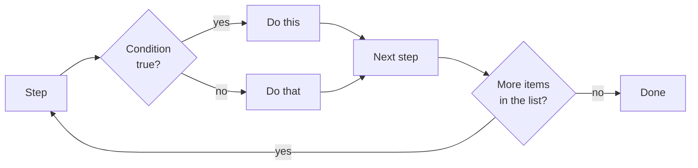

# Prerequisites

## P1 · Quick recap from Days 5 and 6

- [ ] Compare with `===` and `!==`, and combine answers with `&&`, `||` and `!` (Day 5 · F6–F7)
- [ ] Pick one of two values with the ternary: `condition ? valueIfTrue : valueIfFalse` (Day 5 · F7)
- [ ] Curly braces `{ }` make a **block**, and `let`/`const` inside it stay inside it (Day 5 · F3)
- [ ] Store lists in arrays and records in objects; read an optional property with `?.` or `??` (Day 6)

```quiz
id: d7-p1-q1
type: single
question: "`const isLoggedIn = true; const cartCount: number = 0;` — what is `isLoggedIn && cartCount > 0`?"
options:
  - "false"
  - "true"
  - "0"
  - "undefined"
answer: a
explanation: "`cartCount > 0` is false, and true && false is false."
```

```quiz
id: d7-p1-q2
type: single
question: "`const results = ['pass', 'fail', 'pass'];` — how do you read the LAST item, however long the list is?"
options:
  - "`results[3]`"
  - "`results[results.length]`"
  - "`results[results.length - 1]`"
  - "`results.last`"
answer: c
explanation: "Indexes start at 0, so the last index is always one less than the length."
```

## P2 · Decisions and repetition — you already write them

Read any manual test case and you'll find two kinds of instruction that a straight list of steps can't express:

| In a manual test case | In code | Today's section |
|---|---|---|
| "**If** a cookie banner appears, dismiss it" | a **condition** — `if` | F2 |
| "**Depending on** the user's role, check the right menu" | a choice among many — `switch` | F4 |
| "**Repeat** steps 2–5 for each browser" | a **loop** — `for...of` | F6 |
| "Refresh **until** the order says *Shipped* (give up after 5 tries)" | a **loop with a stop condition** — `while` | F7 |
| "From the results, **list only** the failed tests" | an **array method** — `filter` | F8 |



So far your programs ran every line once, top to bottom. Today they learn to **skip** lines (conditions) and **repeat** lines (loops). Together these are called **control flow**.

> [!TESTER]
> A data-driven test is exactly this: *for each row in the test-data sheet, do the steps; if the result matches the expected value, mark it passed, otherwise failed.* By the end of today you'll write one.

```quiz
id: d7-p2-q1
type: single
question: "\"Repeat the checkout steps for each of the 3 payment methods.\" Which tool from today fits?"
options:
  - A single if statement
  - A loop over the list of payment methods
  - An `if` / `else` statement
  - A ternary operator
answer: b
explanation: Doing the same steps once for every item in a list is a loop.
```

# Fundamentals

## F1 · Truthy and falsy — what counts as "true"

An `if` needs a yes-or-no answer. Usually you give it a real boolean — `age >= 18` is `true` or `false`. But JavaScript lets you put **any** value in a condition, and quietly treats it as true or false:

| Falsy — treated as **false** | Truthy — treated as **true** |
|---|---|
| `false` | `true` |
| `0` (and `-0`) | Every other number: `1`, `-5`, `0.5` |
| `''` (empty text) | Any non-empty text: `'a'`, `' '`, even `'false'` and `'0'` |
| `null`, `undefined` | Every array and object — even empty ones: `[]`, `{}` |
| `NaN` | |

The falsy list is short — **just these six** (`-0` counts as `0`; there's also a rare `0n` you won't meet in tests). Everything else is truthy.

This is handy for "is there anything here?" checks:

```ts mode=read
const couponCode: string = '';
if (couponCode) {
  console.log(`Apply ${couponCode}`);
} else {
  console.log('No coupon to apply');      // '' is falsy, so this runs
}
```

### The trap: `0` and `''` are real values

`||` (Day 5) uses the same rule: `a || b` gives `b` whenever `a` is **falsy**. That's a problem when `0` or `''` is a legitimate value:

```ts mode=read
const retries: number = 0;          // the tester deliberately set 0 retries
console.log(retries || 3);          // 3  ❌ the 0 was thrown away
console.log(retries ?? 3);          // 0  ✅ ?? only replaces null and undefined (Day 6)
```

> [!TIP]
> For a fallback, prefer `??`. Use `||` or a bare `if (value)` only when `0` and `''` really should count as "nothing".

```quiz
id: d7-f1-q1
type: multiple
question: Which values are falsy? (Select all that apply)
options:
  - "`0`"
  - "`'0'`"
  - "`''`"
  - "`[]`"
answer: [a, c]
explanation: "The number 0 and empty text are falsy. The text '0' isn't empty, and every array — even an empty one — is truthy."
```

```quiz
id: d7-f1-q2
type: single
question: "`const quantity: number = 0;` — what does `quantity || 1` give?"
options:
  - "0"
  - "1"
  - "true"
  - "false"
answer: b
explanation: "0 is falsy, so `||` falls back to 1. `quantity ?? 1` would keep the 0."
```

## F2 · `if`, `else if`, `else`

### `if` — do something only when a condition is true

```ts mode=read
if (condition) {
  // runs only when condition is true (or truthy)
}
```

The condition goes in round brackets; the code to run goes in a **block** in curly braces.

### `else` — otherwise

```ts mode=read
const stockCount: number = 0;

if (stockCount > 0) {
  console.log('Add to cart is enabled');
} else {
  console.log('Show "Out of stock"');        // this runs
}
```

### `else if` — more than two possibilities

```ts mode=read
const loadTimeMs: number = 1850;

if (loadTimeMs < 1000) {
  console.log('fast');
} else if (loadTimeMs < 3000) {
  console.log('acceptable');                 // this runs
} else {
  console.log('too slow');
}
```

The conditions are checked **top to bottom**, and **only the first one that's true** runs. Once a branch runs, the rest are skipped — even if they would also be true. (If you added `else if (loadTimeMs < 5000)` at the end, 1850 would match it too — but it would never get there, because `< 3000` already won.) So put the most specific conditions first.

`else if` and `else` are both optional, and you can have as many `else if` branches as you need.

### Combining and nesting conditions

Use `&&` and `||` to combine checks in one condition, or put an `if` inside another `if` (**nesting**):

```ts mode=read
const isLoggedIn: boolean = true;
const cartCount: number = 2;

if (isLoggedIn && cartCount > 0) {
  console.log('Show the checkout button');
}

if (isLoggedIn) {
  if (cartCount === 0) {
    console.log('Your cart is empty');
  }
} else {
  console.log('Please sign in');
}
```

Nesting more than two levels deep gets hard to read — like a test case with sub-sub-steps. Combining with `&&` is often clearer.

> [!NOTE] Braces and indentation
> Always use `{ }` after `if` and `else`, even for one line, and indent the code inside. JavaScript allows leaving the braces out for a single line, but that's a well-known source of bugs when someone later adds a second line.

```quiz
id: d7-f2-q1
type: single
question: "`const score: number = 95;` — what does this print? `if (score > 50) { console.log('pass'); } else if (score > 90) { console.log('distinction'); } else { console.log('fail'); }`"
options:
  - "pass"
  - "distinction"
  - "pass, then distinction"
  - "fail"
answer: a
explanation: "95 > 50 is true, so the first branch runs and the rest are skipped. To print 'distinction', the `score > 90` check must come first."
```

```quiz
id: d7-f2-q2
type: single
question: When does the `else` block run?
options:
  - Always, after the if block
  - Only when none of the conditions above it were true
  - Only when the first condition was true
  - When the condition causes an error
answer: b
explanation: "`else` is the \"none of the above\" branch."
```

## F3 · Conditions that narrow types

On Day 6 you saw that TypeScript won't let you use a value that **might** be missing, or might be the wrong type. An `if` is the everyday way to check first — and inside the block, TypeScript **knows** what you have. This is called **narrowing**.

### Checking that an optional value is there

```ts mode=read
type LoginCase = { id: string; expectedError?: string };
const testCase: LoginCase = { id: 'TC-02', expectedError: 'Locked out' };

console.log(testCase.expectedError.length);        // ❌ 'testCase.expectedError' is possibly 'undefined'

if (testCase.expectedError !== undefined) {
  console.log(testCase.expectedError.length);      // ✅ in here it's definitely a string
}

if (testCase.expectedError) {                       // a truthiness check narrows too
  console.log(testCase.expectedError.toUpperCase());
}
```

### Checking which type of a union you have

```ts mode=read
const orderId: string | number = Math.random() > 0.5 ? 'ORD-7' : 7;

if (typeof orderId === 'string') {
  console.log(orderId.toLowerCase());     // TypeScript knows: string
} else {
  console.log(orderId.toFixed(0));        // and here: number
}
```

`typeof value` gives the type's name as text: `'string'`, `'number'`, `'boolean'`, `'undefined'`, `'object'` (Days 4 and 6).

> [!TESTER]
> Narrowing is the code version of a precondition: "**given** the error message is shown, **then** check its text". TypeScript refuses to let you skip the "given".

```quiz
id: d7-f3-q1
type: single
question: "`type User = { name: string; phone?: string };` — inside which block is `user.phone.length` allowed?"
options:
  - "`if (user.name) { … }`"
  - "`if (user.phone !== undefined) { … }`"
  - "`if (user.phone === undefined) { … }`"
  - "`if (typeof user === 'object') { … }`"
answer: b
explanation: "Only a check on phone itself tells TypeScript that phone is a string inside the block."
```

## F4 · `switch` — choosing among many fixed values

When you compare **one value** against a list of possible values, `switch` reads more cleanly than a long `else if` ladder:

```ts mode=read
type Role = 'admin' | 'editor' | 'viewer';
type User = { name: string; role: Role };
const user: User = { name: 'Ravi', role: 'editor' };

switch (user.role) {
  case 'admin':
    console.log('Check the Settings menu is visible');
    break;
  case 'editor':
    console.log('Check the Edit button is visible');     // this runs
    break;
  default:
    console.log('Check the page is read-only');
}
```

| Part | Meaning |
|---|---|
| `switch (user.role)` | The value being checked |
| `case 'admin':` | "If it equals `'admin'`, start running here" (compared with `===`) |
| `break;` | "Stop — leave the switch" |
| `default:` | Runs when no `case` matched — like the final `else` (optional) |

### Forgetting `break` — fall-through

Without `break`, the code **keeps running into the next case**, whether it matches or not. This is called **fall-through**:

```ts mode=read
const status: string = 'failed';
switch (status) {
  case 'failed':
    console.log('Investigate');      // runs
  case 'passed':
    console.log('All good');         // ALSO runs — there was no break above!
    break;
}
```

Fall-through is almost always a bug — with one useful exception: stacking cases on purpose so they **share** a block:

```ts mode=read
switch (status) {
  case 'failed':
  case 'timedOut':                   // 'failed' or 'timedOut' both land here
    console.log('Open the trace');
    break;
}
```

### Which one to use?

| Situation | Use |
|---|---|
| One yes/no decision, or ranges (`< 1000`, `>= 18`) | `if` / `else` |
| One value compared with several **exact** values | `switch` |
| Choosing between two **values** in one line | the ternary `? :` (Day 5) |

With literal types (Day 6), TypeScript even checks your `case` labels: `case 'superuser':` is an error when `user.role` can only be `'admin' | 'editor' | 'viewer'`.

```quiz
id: d7-f4-q1
type: single
question: "What does `break` do inside a `switch`?"
options:
  - It stops the whole program
  - It leaves the switch, so the following cases don't run
  - It skips to the default case
  - It restarts the switch from the top
answer: b
explanation: "Without break, execution falls through into the next case."
```

```quiz
id: d7-f4-q2
type: single
question: "Which is the best fit for: \"show 'Adult' if age is 18 or more, otherwise 'Minor'\" stored in a variable?"
options:
  - A switch with a case for every age
  - "A ternary: `const group = age >= 18 ? 'Adult' : 'Minor';`"
  - "`const group = age >= 18 && 'Adult';`"
  - An `if` with no `else`, setting the value only for adults
answer: b
explanation: "Choosing between two values based on one condition is exactly what the ternary is for. `age >= 18 && 'Adult'` gives false (not 'Minor') for a minor, and an if without else leaves minors with no value."
```

## F5 · The `for` loop — counting

A **loop** runs the same block again and again. The classic `for` loop counts:

```ts mode=read
for (let i = 0; i < 3; i++) {
  console.log(`Run ${i + 1}`);
}
// Run 1
// Run 2
// Run 3
```

The brackets hold three parts, separated by semicolons:

| Part | Here | When it runs |
|---|---|---|
| **Start** | `let i = 0` | Once, before the loop begins |
| **Condition** | `i < 3` | Before every round — if it's false, the loop ends |
| **Update** | `i++` (add 1 to i) | After every round |

Tracing it step by step:

| Round | `i` at start | `i < 3`? | Prints | `i` after `i++` |
|---|---|---|---|---|
| 1 | 0 | true | Run 1 | 1 |
| 2 | 1 | true | Run 2 | 2 |
| 3 | 2 | true | Run 3 | 3 |
| — | 3 | **false** → stop | | |

Each round of a loop is called an **iteration**. `i` is a traditional name for a counter (short for *index*).

### Looping over an array by index

Because array indexes start at 0 and the last one is `length - 1`, the standard pattern is:

```ts mode=read
const browsers: string[] = ['chromium', 'firefox', 'webkit'];
for (let i = 0; i < browsers.length; i++) {
  console.log(`${i}: ${browsers[i]}`);
}
```

Note the `<` — not `<=`. With `i <= browsers.length` the loop runs one extra time and reads `browsers[3]`, which is `undefined`. This **off-by-one** mistake is the most common loop bug of all.

```quiz
id: d7-f5-q1
type: single
question: "How many times does `for (let i = 1; i <= 4; i++) { … }` run its block?"
options:
  - "3"
  - "4"
  - "5"
  - "It never stops"
answer: b
explanation: "i takes the values 1, 2, 3 and 4. When i becomes 5, `5 <= 4` is false and the loop ends."
```

```quiz
id: d7-f5-q2
type: single
question: "`const items = ['a', 'b', 'c'];` — which loop prints `undefined` as its last line?"
options:
  - "`for (let i = 0; i < items.length; i++) { console.log(items[i]); }`"
  - "`for (let i = 0; i <= items.length; i++) { console.log(items[i]); }`"
  - "`for (let i = 1; i < items.length; i++) { console.log(items[i]); }`"
  - "`for (let i = 0; i < 2; i++) { console.log(items[i]); }`"
answer: b
explanation: "`<=` lets i reach 3, and items[3] doesn't exist. (Starting at 1 skips 'a', and `i < 2` stops early — both wrong, but neither prints undefined.)"
```

## F6 · `for...of` — one round per item

Most of the time you don't need the index — you just want **each item**. `for...of` gives you them one by one:

```ts mode=read
const browsers: string[] = ['chromium', 'firefox', 'webkit'];

for (const browser of browsers) {
  console.log(`Testing on ${browser}`);
}
// Testing on chromium
// Testing on firefox
// Testing on webkit
```

Read it as *"for each `browser` of the list `browsers`"*. Each round, `browser` holds the next item. It can be a `const` because every round gets a fresh variable. There's no counter to get wrong, so no off-by-one bugs.

`for...of` works on anything that holds a sequence — arrays, and text too (one character per round):

```ts mode=read
for (const ch of 'Hi!') {
  console.log(ch);           // H, then i, then !
}
```

This is the loop you'll use most in Playwright tests — for example, "for each product card on the page, check it has a price".

### Looping over an object's properties

An object isn't a list, so `for...of` doesn't work on it directly. `Object.entries(obj)` turns it into a list of `[name, value]` pairs, which you can unpack with destructuring (Day 6):

```ts mode=read
const settings = { retries: 2, workers: 4, timeoutMs: 30000 };

for (const [key, value] of Object.entries(settings)) {
  console.log(`${key} = ${value}`);
}
// retries = 2
// workers = 4
// timeoutMs = 30000
```

> [!WARNING] `for...in` is not `for...of`
> There's a look-alike, `for...in`, which gives property **names** (keys) instead of values. On an array, that means the indexes — as **text**: `'0'`, `'1'`, `'2'`. Writing `in` when you meant `of` is an easy slip. For arrays, always use `for...of`.

```quiz
id: d7-f6-q1
type: single
question: "`for (const tag of ['@smoke', '@login']) { console.log(tag); }` — what's printed?"
options:
  - "@smoke and @login"
  - "The whole array, once"
  - "'0' and '1'"
  - "Nothing — for...of needs a counter"
answer: a
explanation: "for...of gives the items themselves. (for...in would give the indexes '0' and '1'.)"
```

## F7 · `while`, `do...while`, `break` and `continue`

### `while` — repeat as long as a condition holds

Use `while` when you **don't know in advance** how many rounds you need — "keep checking until it's ready":

```ts mode=read
let attempt = 0;
let pageReady = false;

while (!pageReady && attempt < 5) {
  attempt++;
  pageReady = attempt === 3;       // pretend the page becomes ready on the 3rd check
}
console.log(`Ready after ${attempt} checks`);   // Ready after 3 checks
```

The condition is checked **before** every round. If it's false at the very start, the block never runs at all.

> [!WARNING] Infinite loops
> If nothing inside the loop ever makes the condition false, it runs forever and your program freezes. Always make sure each round moves towards the end — here, `attempt++` and the `attempt < 5` limit guarantee it stops. If it does happen, press **Stop** (or **Ctrl+C** in the terminal).

### `do...while` — run at least once

`do...while` checks the condition **after** each round, so the block always runs at least once:

```ts mode=read
let tries = 0;
do {
  tries++;
  console.log(`Try ${tries}`);
} while (tries < 0);        // false straight away — but "Try 1" was already printed
```

It's rarer than `while`; you'll mostly read it rather than write it.

### `break` and `continue`

These work in every kind of loop:

| Keyword | Effect | Tester's version |
|---|---|---|
| `break` | Leave the loop **now** | "Stop testing — a blocker was found" |
| `continue` | Skip the **rest of this round**, go to the next one | "Skip this row, it's marked N/A" |

```ts mode=read
const statuses: string[] = ['passed', 'skipped', 'passed', 'failed', 'passed'];

for (const status of statuses) {
  if (status === 'skipped') {
    continue;                 // ignore skipped tests
  }
  if (status === 'failed') {
    console.log('Failure found - stopping');
    break;                    // no need to look further
  }
  console.log(status);
}
// passed
// passed
// Failure found - stopping
```

> [!TESTER]
> "Keep retrying until it passes, at most N times" is a `while` loop with a limit — and it's what Playwright's auto-waiting and web-first assertions (Day 2) do for you behind the scenes, so in real tests you'll rarely write it yourself.

```quiz
id: d7-f7-q1
type: single
question: What's the key difference between `while` and `do...while`?
options:
  - "`do...while` is faster"
  - "`do...while` always runs its block at least once; `while` may run it zero times"
  - "`while` can't use break"
  - "`do...while` can only count upwards"
answer: b
explanation: "`while` checks first; `do...while` runs first and checks afterwards."
```

```quiz
id: d7-f7-q2
type: single
question: "In a loop over test results, you want to ignore rows whose status is 'skipped' but carry on with the rest. Which keyword?"
options:
  - "`break`"
  - "`continue`"
  - "`return`"
  - "`default`"
answer: b
explanation: "`continue` skips the rest of the current round only. `break` would end the whole loop."
```

## F8 · Array methods — loops with a purpose

Arrays come with methods that do common loop jobs in one line. Each one takes a small **function** that says what to do with one item. You'll learn functions properly on Day 8; for now, you only need to read this shape:

```ts mode=read
(result) => result.status === 'failed'
// "given one result, give back: is its status 'failed'?"
```

- `(result)` — a name for the current item (you choose the name)
- `=>` — "gives back"
- after the arrow — what to work out for that item
- with two names, `(item, index)`, the method also hands you the item's position
- with `{ }` after the arrow, the function can hold several statements, like an `if` block

This is called an **arrow function**. The array method runs it once for every item.

| Method | Question it answers | Gives back |
|---|---|---|
| `.forEach(fn)` | "Do this with every item" | nothing (`undefined`) |
| `.map(fn)` | "Turn every item into something else" | a **new array**, same length |
| `.filter(fn)` | "Which items match?" | a **new array** with only the matching items |
| `.find(fn)` | "Which is the **first** item that matches?" | that item, or `undefined` |
| `.some(fn)` | "Does **at least one** item match?" | `true` / `false` |
| `.every(fn)` | "Do **all** items match?" | `true` / `false` |

```ts mode=read
const prices: number[] = [499, 1299, 2599, 799];

const expensive = prices.filter((price) => price > 1000);     // [1299, 2599]
const labels = prices.map((price) => `₹${price}`);             // ['₹499', '₹1299', '₹2599', '₹799']
const firstOver2000 = prices.find((price) => price > 2000);    // 2599
const anyFree = prices.some((price) => price === 0);           // false
const allPositive = prices.every((price) => price > 0);        // true

prices.forEach((price, index) => {                             // forEach also gives the index
  console.log(`Item ${index + 1}: ₹${price}`);
});
```

None of these change the original array — `filter` and `map` give you a **new** one.

> [!NOTE] Loop or method?
> Anything these methods do, a `for...of` loop can do too; the methods are just shorter and say their purpose in their name. One important exception for later: in Playwright tests, where each step must **wait** (`await`), use `for...of`, not `forEach` — `forEach` doesn't wait. Day 8 shows why.

```quiz
id: d7-f8-q1
type: single
question: "`const codes = [200, 404, 200, 500];` — what is `codes.filter((c) => c >= 400)`?"
options:
  - "[404, 500]"
  - "true"
  - "404"
  - "[false, true, false, true]"
answer: a
explanation: "filter keeps the matching items in a new array. (find would give just the first, 404; map would give the true/false list.)"
```

```quiz
id: d7-f8-q2
type: single
question: "You want to know whether ANY test in a list failed. Which method fits best?"
options:
  - "`.map()`"
  - "`.some()`"
  - "`.every()`"
  - "`.forEach()`"
answer: b
explanation: "`some` answers \"does at least one item match?\" with true or false."
```

# Implementation

All files today go in `ts-basics/day7`. Run with `node day7/<file>.ts`, check with `npm run check -- day7/<file>.ts`.

## I1 · Rate page-load times, and triage results

`if` ladders inside a `for...of` loop, then a `switch` inside another:

```ts file=ts-basics/day7/timing.ts mode=editor run="node day7/timing.ts"
// Page-load times measured by a performance check (milliseconds)
const loadTimesMs: number[] = [420, 1850, 5200];

// for...of: run the block once for each value in the list
for (const timeMs of loadTimesMs) {
  // if / else if / else: the first condition that is true wins
  let rating: string;
  if (timeMs < 1000) {
    rating = 'fast';
  } else if (timeMs < 3000) {
    rating = 'acceptable';
  } else {
    rating = 'too slow';
  }
  console.log(`${timeMs} ms: ${rating}`);
}

// switch: choose an action for each result status
type Status = 'passed' | 'failed' | 'skipped' | 'timedOut';
const statuses: Status[] = ['passed', 'failed', 'timedOut', 'skipped'];

for (const status of statuses) {
  switch (status) {
    case 'passed':
      console.log('passed: nothing to do');
      break;
    case 'failed':
    case 'timedOut':                          // two cases share one block
      console.log(`${status}: open the trace and investigate`);
      break;
    default:                                   // anything not listed above
      console.log(`${status}: check why it was skipped`);
  }
}
```

```output console
420 ms: fast
1850 ms: acceptable
5200 ms: too slow
passed: nothing to do
failed: open the trace and investigate
timedOut: open the trace and investigate
skipped: check why it was skipped
```

Notice `let rating: string;` is declared **without** a value: every branch of the `if` ladder assigns one, and TypeScript checks that. Delete the `else` branch and check the file — TypeScript reports `Variable 'rating' is used before being assigned.`, because 5200 would get no rating.

**Try it:** add `case 'flaky':` inside the switch and check the file. Why is it rejected?

## I2 · A mini data-driven test

This is Day 6's login test-data sheet, with one more row — and now actually **run**. For each test case, the code works out what the app would do, compares it with what the case expects, and reports PASS or FAIL:

```ts file=ts-basics/day7/login-runner.ts mode=editor run="node day7/login-runner.ts"
// A mini data-driven test: check every login case against the app's rules
type LoginCase = {
  id: string;
  username: string;
  password: string;
  shouldSucceed: boolean;
  expectedError?: string;
};

const loginCases: LoginCase[] = [
  { id: 'TC-01', username: 'standard_user', password: 'secret_sauce', shouldSucceed: true },
  { id: 'TC-02', username: 'locked_out_user', password: 'secret_sauce', shouldSucceed: false,
    expectedError: 'Sorry, this user has been locked out.' },
  { id: 'TC-03', username: 'standard_user', password: 'wrong', shouldSucceed: false,
    expectedError: 'Username and password do not match.' },
  { id: 'TC-04', username: '', password: 'secret_sauce', shouldSucceed: false,
    expectedError: 'Username is required' },
  { id: 'TC-05', username: 'standard_user', password: '', shouldSucceed: false,
    expectedError: 'Password is required.' },
];

let passed = 0;
let failed = 0;

for (const testCase of loginCases) {
  // 1. Pretend to be the app: which error would it show? (undefined = logged in)
  let actualError: string | undefined;
  if (testCase.username === '') {
    actualError = 'Username is required';
  } else if (testCase.password === '') {
    actualError = 'Password is required';
  } else if (testCase.username === 'locked_out_user') {
    actualError = 'Sorry, this user has been locked out.';
  } else if (testCase.password !== 'secret_sauce') {
    actualError = 'Username and password do not match.';
  }

  // 2. Compare what happened with what the test case expected
  const loggedIn = actualError === undefined;
  if (loggedIn === testCase.shouldSucceed && actualError === testCase.expectedError) {
    passed++;
    console.log(`PASS ${testCase.id}`);
  } else {
    failed++;
    console.log(`FAIL ${testCase.id}: expected "${testCase.expectedError ?? 'login'}", got "${actualError ?? 'login'}"`);
  }
}

console.log(`${passed} passed, ${failed} failed`);
```

```output console
PASS TC-01
PASS TC-02
PASS TC-03
PASS TC-04
FAIL TC-05: expected "Password is required.", got "Password is required"
4 passed, 1 failed
```

TC-05 fails because of a single full stop. Just like in real testing, the question is: is the **app** wrong, or the **test data**? Here the test data has a typo — remove the `.` and run again for 5 passes.

> [!TESTER]
> Everything a data-driven Playwright test does is here: a typed test-data sheet, a loop over its rows, a check per row, and a pass/fail count. On Day 9 the "pretend to be the app" part is replaced by a real browser.

## I3 · A password-rules checker

Nested loops, `continue`, and collecting problems in an array:

```ts file=ts-basics/day7/passwords.ts mode=editor run="node day7/passwords.ts"
// Check candidate passwords against the sign-up rules
const candidates: string[] = ['Secret@123', 'short1A', 'alllowercase1', 'NoDigitsHere', ''];

for (const password of candidates) {
  if (password === '') {
    console.log('(empty) -> skipped: nothing to check');
    continue;                                  // jump straight to the next password
  }

  // Look at each character once
  let hasDigit = false;
  let hasUpper = false;
  for (const ch of password) {
    if ('0123456789'.includes(ch)) {
      hasDigit = true;
    } else if (ch !== ch.toLowerCase()) {     // only upper-case letters change when lower-cased
      hasUpper = true;
    }
  }

  // Collect every rule that fails
  const problems: string[] = [];
  if (password.length < 8) {
    problems.push('at least 8 characters');
  }
  if (!hasDigit) {
    problems.push('a digit');
  }
  if (!hasUpper) {
    problems.push('an upper-case letter');
  }

  const verdict = problems.length === 0 ? 'valid' : `needs ${problems.join(', ')}`;
  console.log(`${password} -> ${verdict}`);
}
```

```output console
Secret@123 -> valid
short1A -> needs at least 8 characters
alllowercase1 -> needs an upper-case letter
NoDigitsHere -> needs a digit
(empty) -> skipped: nothing to check
```

Two things to notice:

- The rules are three **separate** `if`s, not an `else if` ladder — a password can break several rules at once, and we want to report all of them.
- The inner loop runs completely for each password: a loop inside a loop is called a **nested loop**.

**Try it:** add a fourth rule — the password must not contain a space (`password.includes(' ')`) — and a candidate `'Has Space 1'` to test it.

## I4 · Retry until it works — `while` with a limit

```ts file=ts-basics/day7/retry.ts mode=editor run="node day7/retry.ts"
// Retry a flaky check until it succeeds, but never more than maxAttempts times
const maxAttempts: number = 5;
const serverReplies: string[] = ['timeout', 'timeout', 'ok'];   // what happens on each attempt

let attempt = 0;
let succeeded = false;

while (attempt < maxAttempts) {
  const reply = serverReplies[attempt] ?? 'ok';   // past the end of the list? assume 'ok'
  attempt++;
  console.log(`Attempt ${attempt}: ${reply}`);
  if (reply === 'ok') {
    succeeded = true;
    break;                                        // stop looping: we're done
  }
}

console.log(succeeded ? `Succeeded after ${attempt} attempts` : `Gave up after ${maxAttempts} attempts`);

// do...while: the body always runs at least once
let pagesVisited = 0;
do {
  pagesVisited++;
  console.log(`Visited page ${pagesVisited}`);
} while (pagesVisited < 1);
```

```output console
Attempt 1: timeout
Attempt 2: timeout
Attempt 3: ok
Succeeded after 3 attempts
Visited page 1
```

**Try it:** change `serverReplies` to `['timeout', 'timeout', 'timeout', 'timeout', 'timeout', 'timeout']` and run again. The loop stops at 5 attempts — the limit is what prevents an infinite loop.

## I5 · A test-run report with array methods

```ts file=ts-basics/day7/report.ts mode=editor run="node day7/report.ts"
// Build a test-run report with array methods
type Status = 'passed' | 'failed' | 'skipped';
type TestResult = { title: string; status: Status; durationMs: number };

const results: TestResult[] = [
  { title: 'login works', status: 'passed', durationMs: 1200 },
  { title: 'search works', status: 'failed', durationMs: 5300 },
  { title: 'add to cart', status: 'passed', durationMs: 2100 },
  { title: 'checkout', status: 'failed', durationMs: 7400 },
  { title: 'profile edits', status: 'skipped', durationMs: 0 },
];

// forEach: do something with every item (here: print a numbered list)
results.forEach((result, index) => {
  console.log(`${index + 1}. ${result.title} - ${result.status}`);
});

// filter: keep only the items that match
const failures = results.filter((result) => result.status === 'failed');

// map: turn every item into something else (here: just its title)
const failedTitles = failures.map((result) => result.title);
console.log(`Failed (${failures.length}): ${failedTitles.join(', ')}`);

// find: the FIRST item that matches, or undefined
const firstSlow = results.find((result) => result.durationMs > 5000);
console.log(`First slow test: ${firstSlow?.title ?? 'none'}`);

// some / every: yes-or-no questions about the whole list
const anyFailed = results.some((result) => result.status === 'failed');
const allUnder10s = results.every((result) => result.durationMs < 10000);
console.log(`Any failed? ${anyFailed}. All under 10 s? ${allUnder10s}`);

// A plain loop still works for totals
let totalMs = 0;
for (const result of results) {
  totalMs += result.durationMs;
}
console.log(`Total time: ${totalMs / 1000} s`);
```

```output console
1. login works - passed
2. search works - failed
3. add to cart - passed
4. checkout - failed
5. profile edits - skipped
Failed (2): search works, checkout
First slow test: search works
Any failed? true. All under 10 s? true
Total time: 16 s
```

`find` may find nothing, so its result's type is `TestResult | undefined` — which is why the code reads it with `?.` and `??` (Day 6). Change `5000` to `9000` and run: the line becomes `First slow test: none`.

## I6 · Spot the loop bugs

This file type-checks **and** runs — but the output isn't what the comments say it should be. That's the hardest kind of bug: no error message, just wrong behaviour. Run it:

```ts file=ts-basics/day7/loop-bugs.ts mode=editor run="node day7/loop-bugs.ts"
// Three loop bugs. Run this file and compare the output with the comments.
const browsers: string[] = ['chromium', 'firefox', 'webkit'];

// Intended: print each browser once, numbered 0 to 2
for (let i = 0; i <= browsers.length; i++) {
  console.log(`Browser ${i}: ${browsers[i]}`);
}

// Intended: print the browser NAMES
for (const browser in browsers) {
  console.log(`Testing on ${browser}`);
}

// Intended: a failed test prints only "Investigate"
const status: string = 'failed';
switch (status) {
  case 'failed':
    console.log('Investigate');
  case 'passed':
    console.log('All good');
    break;
}
```

```output console
Browser 0: chromium
Browser 1: firefox
Browser 2: webkit
Browser 3: undefined
Testing on 0
Testing on 1
Testing on 2
Investigate
All good
```

| Symptom | Bug | Fix |
|---|---|---|
| `Browser 3: undefined` | Off-by-one: `<=` | `i < browsers.length` |
| `Testing on 0`, `1`, `2` | `for...in` gives indexes | `for (const browser of browsers)` |
| `All good` after `Investigate` | Missing `break` — fall-through | Add `break;` after `console.log('Investigate');` |

Fix all three, then compare with the corrected version:

```ts file=ts-basics/day7/loop-bugs-fixed.ts mode=editor run="node day7/loop-bugs-fixed.ts"
// The same three loops, fixed
const browsers: string[] = ['chromium', 'firefox', 'webkit'];

for (let i = 0; i < browsers.length; i++) {
  console.log(`Browser ${i}: ${browsers[i]}`);
}

for (const browser of browsers) {
  console.log(`Testing on ${browser}`);
}

const status: string = 'failed';
switch (status) {
  case 'failed':
    console.log('Investigate');
    break;
  case 'passed':
    console.log('All good');
    break;
}
```

```output console
Browser 0: chromium
Browser 1: firefox
Browser 2: webkit
Testing on chromium
Testing on firefox
Testing on webkit
Investigate
```

# Practice

## Quiz · Day 7 check

```quiz
id: d7-pr-q1
type: single
question: "`const name: string = '';` — what does `` name ? `Hi ${name}` : 'Hi guest' `` give?"
options:
  - "'Hi '"
  - "'Hi guest'"
  - "An error"
  - "'Hi undefined'"
answer: b
explanation: Empty text is falsy, so the ternary takes the value after the colon.
```

```quiz
id: d7-pr-q2
type: single
question: "In an `if / else if / else` chain, how many blocks run?"
options:
  - Every block whose condition is true
  - At most one — the first one whose condition is true (or the else)
  - Always all of them
  - The first true one, and then the else as well
answer: b
explanation: Once one branch runs, the rest of the chain is skipped.
```

```quiz
id: d7-pr-q3
type: single
question: "Which loop is the best fit for \"check each product in the `products` array\"?"
options:
  - "`for (const product of products) { … }`"
  - "`for (const product in products) { … }`"
  - "`for (let i = 1; i < products.length; i++) { … }`"
  - "`for (let i = 0; i <= products.length; i++) { … }`"
answer: a
explanation: "for...of gives each item in turn. for...in gives the indexes as text; starting at 1 skips the first product; `<=` runs one round too many."
```

```quiz
id: d7-pr-q4
type: single
question: "What does `[1200, 5300, 800].map((ms) => ms / 1000)` give?"
options:
  - "[1.2, 5.3, 0.8]"
  - "7.3"
  - "[5300]"
  - "true"
answer: a
explanation: "map turns every item into a new value and gives back a new array of the same length."
```

```quiz
id: d7-pr-q5
type: single
question: "`const users = [{ name: 'Asha', admin: false }, { name: 'Ravi', admin: true }];` — what is `users.find((u) => u.admin)?.name`?"
options:
  - "'Asha'"
  - "'Ravi'"
  - "true"
  - "undefined"
answer: b
explanation: "find gives the first item whose check is truthy — Ravi's object — and `?.name` reads its name."
```

```quiz
id: d7-pr-q6
type: multiple
question: Which of these can stop a loop from running forever? (Select all that apply)
options:
  - A condition that eventually becomes false
  - A `break` that is reached
  - A `continue` in every round
  - An attempt limit, like `attempt < maxAttempts`
answer: [a, b, d]
explanation: "`continue` only skips to the next round — the loop keeps going."
```

```quiz
id: d7-pr-q7
type: single
question: "`const tags: string[] = [];` — what is `tags.every((t) => t.includes('@'))`?"
options:
  - "false — there are no tags"
  - "true — no item breaks the rule"
  - "undefined"
  - "An error"
answer: b
explanation: "every asks \"is there any item that fails the check?\" In an empty list there isn't one, so it's true. (some on an empty list is false.) Worth remembering: an empty list makes `every` true."
```

```quiz
id: d7-pr-q8
type: single
question: "In a switch, what happens when no `case` matches and there's no `default`?"
options:
  - The first case runs
  - An error is thrown
  - Nothing — the switch is skipped
  - The last case runs
answer: c
explanation: "Without a matching case or a default, none of the switch's code runs."
```

## Predict the output

````exercise
id: d7-pr-p1
title: Predict — break and continue
level: medium
type: predict
prompt: What is printed?
code: |
  for (let i = 1; i <= 5; i++) {
    if (i === 2) {
      continue;
    }
    if (i === 4) {
      break;
    }
    console.log(i);
  }
answer: |
  1
  3

  i = 1 is printed. i = 2 is skipped by `continue`. i = 3 is printed. At i = 4, `break` ends the loop, so 4 and 5 are never printed.
````

````exercise
id: d7-pr-p2
title: Predict — truthy, falsy and fallbacks
level: medium
type: predict
prompt: What is printed?
code: |
  const retries = 0;
  const name = '';
  console.log(retries || 3);
  console.log(retries ?? 3);
  console.log(name ? `Hi ${name}` : 'Hi guest');
answer: |
  3
  0
  Hi guest

  0 is falsy, so `||` falls back to 3. `??` only replaces null or undefined, so it keeps the 0. Empty text is falsy, so the ternary picks 'Hi guest'.
````

````exercise
id: d7-pr-p3
title: Predict — a switch without breaks
level: medium
type: predict
prompt: What is printed?
code: |
  const level: string = 'warning';
  switch (level) {
    case 'error':
      console.log('E');
    case 'warning':
      console.log('W');
    case 'info':
      console.log('I');
      break;
    default:
      console.log('D');
  }
answer: |
  W
  I

  The switch starts at the matching case, 'warning', and prints W. There's no break, so it falls through into 'info' and prints I. The break there stops it before default.
````

````exercise
id: d7-pr-p4
title: Predict — filter then map
level: easy
type: predict
prompt: What is printed?
code: |
  const doubled = [3, 8, 12, 5].filter((n) => n > 4).map((n) => n * 2);
  console.log(doubled);
  console.log(doubled.length);
answer: |
  [ 16, 24, 10 ]
  3

  filter keeps 8, 12 and 5 (3 isn't greater than 4). map doubles each: 16, 24, 10. Node.js prints arrays with spaces inside the brackets.
````

## Exercises

````exercise
id: d7-ex1
title: A smoke-test checklist
level: easy
type: code
prompt: |
  Create `day7/smoke.ts` with:
  ```ts
  const smokePages: string[] = ['/', '/products', '/cart', '/account'];
  ```
  Loop over the list and print a numbered checklist. The `/account` page needs a login, so add ` (login needed)` to that line only:
  ```
  Step 1: open /
  Step 2: open /products
  Step 3: open /cart
  Step 4: open /account (login needed)
  4 pages in the smoke checklist
  ```
file: ts-basics/day7/smoke.ts
run: node day7/smoke.ts
hints:
  - "You need both the position and the page: a counting `for` loop, or `forEach((page, index) => …)`."
  - "Step numbers start at 1, indexes at 0: print `index + 1`."
  - "A ternary can build the note: `const note = page === '/account' ? ' (login needed)' : '';`"
solution: |
  const smokePages: string[] = ['/', '/products', '/cart', '/account'];

  for (let i = 0; i < smokePages.length; i++) {
    const page = smokePages[i];
    const note = page === '/account' ? ' (login needed)' : '';
    console.log(`Step ${i + 1}: open ${page}${note}`);
  }

  console.log(`${smokePages.length} pages in the smoke checklist`);
expectedOutput: |
  Step 1: open /
  Step 2: open /products
  Step 3: open /cart
  Step 4: open /account (login needed)
  4 pages in the smoke checklist
````

````exercise
id: d7-ex2
title: Classify HTTP status codes
level: medium
type: code
prompt: |
  API tests check **status codes**. Create `day7/status-codes.ts` with:
  ```ts
  const codes: number[] = [200, 201, 301, 404, 500, 503];
  ```
  For each code, print its category using an `if / else if / else` ladder:

  | Range | Category |
  |---|---|
  | 200–299 | success |
  | 300–399 | redirect |
  | 400–499 | client error |
  | 500 and above | server error |

  Also count how many codes are errors (400 or above) and print:
  ```
  200 -> success
  201 -> success
  301 -> redirect
  404 -> client error
  500 -> server error
  503 -> server error
  Errors: 3
  ```
file: ts-basics/day7/status-codes.ts
run: node day7/status-codes.ts
hints:
  - "A range check combines two comparisons: `code >= 200 && code < 300`."
  - "Order your checks from lowest to highest range, so each `else if` only needs the upper limit."
  - "Declare `let errors = 0;` before the loop and do `errors++` inside an `if`."
solution: |
  const codes: number[] = [200, 201, 301, 404, 500, 503];
  let errors = 0;

  for (const code of codes) {
    let category: string;
    if (code >= 200 && code < 300) {
      category = 'success';
    } else if (code >= 300 && code < 400) {
      category = 'redirect';
    } else if (code >= 400 && code < 500) {
      category = 'client error';
    } else {
      category = 'server error';
    }

    if (code >= 400) {
      errors++;
    }
    console.log(`${code} -> ${category}`);
  }

  console.log(`Errors: ${errors}`);
expectedOutput: |
  200 -> success
  201 -> success
  301 -> redirect
  404 -> client error
  500 -> server error
  503 -> server error
  Errors: 3
````

````exercise
id: d7-ex3
title: Question the product list
level: medium
type: code
prompt: |
  Create `day7/products.ts` with:
  ```ts
  type Product = { name: string; price: number; inStock: boolean };
  const products: Product[] = [
    { name: 'Monitor', price: 8999, inStock: true },
    { name: 'Webcam', price: 2499, inStock: false },
    { name: 'Headset', price: 1799, inStock: true },
    { name: 'Laptop Stand', price: 1299, inStock: true },
  ];
  ```
  Using **array methods** (no `for` loops), print:
  ```
  In stock: Monitor, Headset, Laptop Stand
  First under 2000: Headset
  Any out of stock? true
  All priced? true
  ```
  "All priced" means every price is greater than 0.
file: ts-basics/day7/products.ts
run: node day7/products.ts
hints:
  - "`filter` keeps the in-stock products; `map` turns them into names; `join(', ')` makes one line."
  - "`find` gives a product or undefined — use `?.name ?? 'none'`."
  - "Out of stock means `!product.inStock` — use `some`."
solution: |
  type Product = { name: string; price: number; inStock: boolean };
  const products: Product[] = [
    { name: 'Monitor', price: 8999, inStock: true },
    { name: 'Webcam', price: 2499, inStock: false },
    { name: 'Headset', price: 1799, inStock: true },
    { name: 'Laptop Stand', price: 1299, inStock: true },
  ];

  const inStockNames = products.filter((product) => product.inStock).map((product) => product.name);
  const firstCheap = products.find((product) => product.price < 2000);
  const anyOutOfStock = products.some((product) => !product.inStock);
  const allPriced = products.every((product) => product.price > 0);

  console.log(`In stock: ${inStockNames.join(', ')}`);
  console.log(`First under 2000: ${firstCheap?.name ?? 'none'}`);
  console.log(`Any out of stock? ${anyOutOfStock}`);
  console.log(`All priced? ${allPriced}`);
expectedOutput: |
  In stock: Monitor, Headset, Laptop Stand
  First under 2000: Headset
  Any out of stock? true
  All priced? true
````

````exercise
id: d7-ex4
title: Wait for the order to ship
level: medium
type: code
prompt: |
  A test refreshes an order page until its status is `Shipped`, giving up after `maxChecks` checks. Create `day7/order-status.ts` with:
  ```ts
  const maxChecks: number = 5;
  const statusOnEachCheck: string[] = ['Pending', 'Pending', 'Processing', 'Shipped'];
  ```
  Use a `while` loop to "check" the status one at a time (read the next item of the list each round), stopping as soon as it's `Shipped` or after `maxChecks` checks. Print:
  ```
  Check 1: Pending
  Check 2: Pending
  Check 3: Processing
  Check 4: Shipped
  Shipped after 4 checks
  ```
  If it never ships within the limit, the last line should instead be `Still not shipped after N checks`, where N is `maxChecks`. Test it by changing `maxChecks` to `3` (you should see `Still not shipped after 3 checks`), then set it back.
file: ts-basics/day7/order-status.ts
run: node day7/order-status.ts
hints:
  - "Keep a counter `let checks = 0;` and a variable for the latest status."
  - "`statusOnEachCheck[checks] ?? 'Pending'` safely reads past the end of the list."
  - "After the loop, a ternary on `status === 'Shipped'` picks the last line."
solution: |
  const maxChecks: number = 5;
  const statusOnEachCheck: string[] = ['Pending', 'Pending', 'Processing', 'Shipped'];

  let checks = 0;
  let status = '';

  while (checks < maxChecks && status !== 'Shipped') {
    status = statusOnEachCheck[checks] ?? 'Pending';
    checks++;
    console.log(`Check ${checks}: ${status}`);
  }

  console.log(status === 'Shipped' ? `Shipped after ${checks} checks` : `Still not shipped after ${checks} checks`);
expectedOutput: |
  Check 1: Pending
  Check 2: Pending
  Check 3: Processing
  Check 4: Shipped
  Shipped after 4 checks
````

````exercise
id: d7-ex5
title: "Challenge: the release decision"
level: challenge
type: code
prompt: |
  Create `day7/release.ts` with this test run:
  ```ts
  type Status = 'passed' | 'failed' | 'skipped';
  type TestResult = { title: string; status: Status; durationMs: number };
  const results: TestResult[] = [
    { title: 'login', status: 'passed', durationMs: 1200 },
    { title: 'search', status: 'passed', durationMs: 2300 },
    { title: 'filters', status: 'skipped', durationMs: 0 },
    { title: 'add to cart', status: 'passed', durationMs: 1900 },
    { title: 'checkout', status: 'failed', durationMs: 7400 },
    { title: 'payment', status: 'passed', durationMs: 3100 },
    { title: 'invoice', status: 'skipped', durationMs: 0 },
    { title: 'logout', status: 'passed', durationMs: 600 },
  ];
  ```
  1. In **one** `for...of` loop, count each status with a `switch`, and track the slowest test.
  2. Calculate the pass rate as passed ÷ (passed + failed) × 100 — skipped tests didn't run, so they don't count.
  3. The release is `approved` only if the pass rate is at least 90 **and** no more than 2 tests were skipped; otherwise `blocked`.

  Print:
  ```
  passed: 5, failed: 1, skipped: 2
  Pass rate: 83.3%
  Slowest: checkout (7.4 s)
  Release: blocked
  ```
file: ts-basics/day7/release.ts
run: node day7/release.ts
hints:
  - "Declare `let passed = 0; let failed = 0; let skipped = 0;` before the loop."
  - "Track the slowest with `let slowest = results[0];` and replace it inside the loop when `result.durationMs > slowest.durationMs`."
  - "`.toFixed(1)` rounds the pass rate to one decimal place."
solution: |
  type Status = 'passed' | 'failed' | 'skipped';
  type TestResult = { title: string; status: Status; durationMs: number };
  const results: TestResult[] = [
    { title: 'login', status: 'passed', durationMs: 1200 },
    { title: 'search', status: 'passed', durationMs: 2300 },
    { title: 'filters', status: 'skipped', durationMs: 0 },
    { title: 'add to cart', status: 'passed', durationMs: 1900 },
    { title: 'checkout', status: 'failed', durationMs: 7400 },
    { title: 'payment', status: 'passed', durationMs: 3100 },
    { title: 'invoice', status: 'skipped', durationMs: 0 },
    { title: 'logout', status: 'passed', durationMs: 600 },
  ];

  let passed = 0;
  let failed = 0;
  let skipped = 0;
  let slowest = results[0];

  for (const result of results) {
    switch (result.status) {
      case 'passed':
        passed++;
        break;
      case 'failed':
        failed++;
        break;
      case 'skipped':
        skipped++;
        break;
    }
    if (result.durationMs > slowest.durationMs) {
      slowest = result;
    }
  }

  const passRate = (passed / (passed + failed)) * 100;
  const release = passRate >= 90 && skipped <= 2 ? 'approved' : 'blocked';

  console.log(`passed: ${passed}, failed: ${failed}, skipped: ${skipped}`);
  console.log(`Pass rate: ${passRate.toFixed(1)}%`);
  console.log(`Slowest: ${slowest.title} (${slowest.durationMs / 1000} s)`);
  console.log(`Release: ${release}`);
expectedOutput: |
  passed: 5, failed: 1, skipped: 2
  Pass rate: 83.3%
  Slowest: checkout (7.4 s)
  Release: blocked
````

## Reflection

1. Name the six falsy values. Why is `??` safer than `||` for a fallback?
2. When would you choose `switch` over an `if / else if` ladder — and what goes wrong without `break`?
3. What's the difference between `for...of` and `for...in` on an array?
4. How do you make sure a `while` loop can't run forever?
5. Which array method would you use to: list only the failed tests; check that every price is positive; get the first out-of-stock product?

> [!TIP] Coming up on Day 8
> Functions: package steps into reusable, named actions (like `login(user)`), learn `async`/`await` — the keyword on every line of a Playwright test — and split your code into modules with `import` and `export`.
