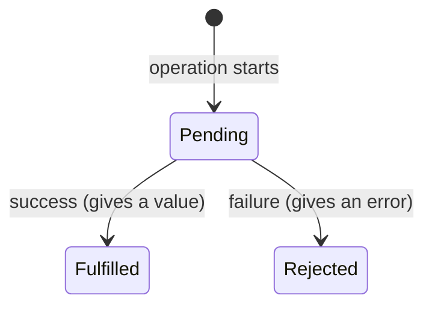

# Prerequisites

## P1 · Quick recap from Day 7

Day 8 leans on functions and callbacks from Day 7. Check yourself:

```quiz
id: d8-p1-q1
type: single
question: "`const double = (n: number) => n * 2;` — what is `double(4)`?"
options:
  - "8"
  - "'44'"
  - undefined
answer: a
explanation: "A one-expression arrow function returns the expression's value: 4 * 2 = 8."
```

```quiz
id: d8-p1-q2
type: single
question: "`runStep('Log in', () => console.log('typing…'));` — what is the second argument?"
options:
  - A string
  - A callback function that runStep can call whenever it wants
  - The result of console.log
answer: b
explanation: A function passed to another function is a callback. `runStep` decides when to run it — exactly how Playwright's `test(title, callback)` works.
```

```quiz
id: d8-p1-q3
type: single
question: How many times does the body run? `for (const r of ['pass', 'fail']) { … }`
options:
  - "1"
  - "2"
  - "3"
answer: b
explanation: Once per item in the array.
```

# Fundamentals

## F1 · Interfaces, destructuring and spread

### Interfaces — another way to describe an object

An **interface** describes an object's shape, just like the `type` aliases from Day 6. For objects, both work; many teams use `interface` for objects and `type` for unions.

```ts mode=read
interface Product {
  name: string;
  price: number;
  inStock: boolean;
}

const mouse: Product = { name: 'Wireless Mouse', price: 799, inStock: true };
```

### Object destructuring — unpack properties into variables

```ts file=ts-basics/day8/destructuring.ts mode=editor run="node day8/destructuring.ts"
interface TestContext {
  page: string;
  browserName: string;
  retry: number;
}

const context: TestContext = { page: 'Page#1', browserName: 'firefox', retry: 0 };

// Long way
const page1 = context.page;

// Destructuring: pull out the properties you need, by name
const { page, browserName } = context;
console.log(page1, page, browserName);

// Destructuring directly in a function's parameter list
function runTest({ page, browserName }: TestContext): void {
  console.log(`Running on ${browserName} with ${page}`);
}
runTest(context);
```

```output console
Page#1 Page#1 firefox
Running on firefox with Page#1
```

> [!TESTER] Now you can read `async ({ page }) => {…}`
> Playwright calls your test function with an object full of ready-made tools (**fixtures**): `page`, `context`, `browser`, `browserName`, `request`… Writing `({ page })` destructures that object and takes only the `page`. Writing `({ page, browserName })` takes two.

### Spread `...` — copy properties or items into a new object/array

```ts mode=read
const defaults = { headless: true, timeout: 30000 };
const debugSettings = { ...defaults, headless: false };   // copy defaults, then override headless
// → { headless: false, timeout: 30000 }

const coreBrowsers = ['chromium', 'firefox'];
const allBrowsers = [...coreBrowsers, 'webkit'];          // → ['chromium', 'firefox', 'webkit']
```

That's what this config line from Day 4 does: `use: { ...devices['Desktop Chrome'] }` — copy all the settings of the "Desktop Chrome" preset into `use`.

```quiz
id: d8-f4-q1
type: single
question: "In `test('checkout', async ({ page, browserName }) => { … })`, what does `{ page, browserName }` do?"
options:
  - Creates a new page and a new browser
  - Destructures the fixtures object Playwright passes in, taking only `page` and `browserName`
  - Declares two global variables
  - Imports page and browserName from a file
answer: b
explanation: Playwright passes one object containing all fixtures; destructuring picks the ones your test needs.
```

## F2 · Asynchronous code: Promises, `async` and `await`

This is the **most important concept for Playwright**. Every browser action takes time, so almost every Playwright line starts with `await`.

### Synchronous vs asynchronous — the coffee-shop analogy

- **Synchronous:** you order a coffee and stand frozen at the counter until it's ready. Nothing else happens.
- **Asynchronous:** you order, get a **token**, and the barista calls you when it's ready. The token is a **Promise** — a promise of a future result.

In code, slow operations — loading a page, clicking and waiting for a response, reading a file — return a **Promise**. A Promise is in one of three states:



### `await` — wait for the Promise, then continue

`await` pauses the current function until the Promise is finished, then gives you its value. You can only use `await` inside a function marked **`async`** (or at the top level of a module file).

```ts file=ts-basics/day8/async-basics.ts mode=editor run="node day8/async-basics.ts"
// A helper that returns a Promise which finishes after `ms` milliseconds.
// (You won't write Promises by hand in Playwright — its methods return them for you.)
const wait = (ms: number) => new Promise<void>((resolve) => setTimeout(resolve, ms));

// Pretend browser action: takes 300 ms, then returns the page title
async function loadPage(url: string): Promise<string> {
  await wait(300);                     // pause here until 300 ms have passed
  return `Title of ${url}`;
}

async function main(): Promise<void> {
  console.log('1. Opening page…');
  const title = await loadPage('/home'); // wait for the result
  console.log(`2. Loaded: ${title}`);
  console.log('3. Now we can check the title safely');
}

main();
```

```output console
1. Opening page…
2. Loaded: Title of /home
3. Now we can check the title safely
```

Notice the return type `Promise<string>`: an `async` function **always** returns a Promise. The value inside is a `string`.

### The #1 Playwright bug: a missing `await`

```ts file=ts-basics/day8/missing-await.ts mode=editor run="node day8/missing-await.ts"
const wait = (ms: number) => new Promise<void>((resolve) => setTimeout(resolve, ms));

async function click(label: string): Promise<void> {
  await wait(200);                     // clicking takes a moment
  console.log(`   clicked "${label}"`);
}

async function withoutAwait(): Promise<void> {
  console.log('WITHOUT await:');
  click('Log in');                     // ❌ no await — we don't wait for the click
  console.log('   checking the dashboard…   ← too early!');
}

async function withAwait(): Promise<void> {
  console.log('WITH await:');
  await click('Log in');               // ✅ wait until the click is done
  console.log('   checking the dashboard…   ← correct order');
}

async function main(): Promise<void> {
  await withoutAwait();
  await wait(300);                     // let the forgotten click finish printing
  await withAwait();
}

main();
```

```output console
WITHOUT await:
   checking the dashboard…   ← too early!
   clicked "Log in"
WITH await:
   clicked "Log in"
   checking the dashboard…   ← correct order
```

Without `await`, the program **doesn't wait** — it rushes on and checks the dashboard before the click happened. In a real test that gives random ("flaky") failures or false passes.

> [!WARNING] Rule for the rest of the course
> If a Playwright method **does something in the browser** or **checks something that may take time** — `goto`, `click`, `fill`, `expect(…).toBeVisible()` — put `await` in front of it. VS Code's Playwright extension and linters (ESLint's `no-floating-promises` rule) can warn you when you forget.

### Handling failures: `try / catch / finally`

When an awaited Promise is **rejected** (fails), it throws an error. You can catch it:

```ts file=ts-basics/day8/try-catch.ts mode=editor run="node day8/try-catch.ts"
const wait = (ms: number) => new Promise<void>((resolve) => setTimeout(resolve, ms));

async function findElement(name: string): Promise<string> {
  await wait(100);
  if (name !== 'Log in') {
    throw new Error(`Element "${name}" not found`);   // reject the Promise with an error
  }
  return `<button>${name}</button>`;
}

async function main(): Promise<void> {
  try {
    const found = await findElement('Log in');
    console.log('Found:', found);
    await findElement('Sign up');                      // this one fails…
    console.log('This line is skipped');
  } catch (error) {
    console.log('Caught:', (error as Error).message);  // …so we jump here
  } finally {
    console.log('Clean-up always runs');               // runs whether it failed or not
  }
}

main();
```

```output console
Found: <button>Log in</button>
Caught: Element "Sign up" not found
Clean-up always runs
```

> [!NOTE]
> In Playwright tests you rarely write `try/catch` yourself: when an action or assertion fails, the error travels up to the test runner, which marks the test as **failed** and shows the message. That's what you want.

`(error as Error)` is a **type assertion**: in strict mode a caught error has the type `unknown`, and `as Error` tells TypeScript "treat it as an Error object" so we can read `.message`.

```quiz
id: d8-f5-q1
type: single
question: What does an `async` function always return?
options:
  - A string
  - A Promise
  - undefined
  - Whatever type you like, without a Promise
answer: b
explanation: An async function always returns a Promise — `Promise<string>`, `Promise<void>`, etc. Use `await` to get the value inside.
```

```quiz
id: d8-f5-q2
type: single
question: "A test does `page.getByRole('button', { name: 'Save' }).click();` (no await) and then immediately checks for a success message. What is the likely result?"
options:
  - Always passes — Playwright auto-waits anyway
  - "Unreliable: the check may run before the click finished, causing random failures or false passes"
  - A syntax error
  - The click happens twice
answer: b
explanation: Auto-waiting happens INSIDE the click — but without `await`, your test doesn't wait for the click to finish before moving on.
```

```quiz
id: d8-f5-q3
type: truefalse
question: You can use `await` inside any normal (non-async) function.
answer: false
explanation: "`await` only works inside functions marked `async` (or at the top level of a module). That's why Playwright tests are written as `async ({ page }) => { … }`."
```

## F3 · Modules: `export` and `import`

As a project grows, you split code across files. Each file is a **module**. A module **exports** what others may use; other modules **import** it.

```ts mode=read
// file: utils/format.ts
export function formatPrice(amount: number): string {   // named export
  return `₹${amount.toFixed(2)}`;
}
export const CURRENCY = 'INR';                            // another named export

// file: tests/cart.ts
import { formatPrice, CURRENCY } from '../utils/format';  // import by name, with curly braces
```

| Kind | Export | Import |
|---|---|---|
| **Named** (many per file) | `export function login() {}` | `import { login } from './auth';` |
| **Default** (one per file) | `export default class LoginPage {}` | `import LoginPage from './LoginPage';` (no braces, any name) |

Path rules: `'./x'` = same folder, `'../x'` = one folder up. A name **without** `./` (like `'@playwright/test'`) means an installed package from `node_modules`.

### Decoding the first line of every Playwright test

```ts mode=read
import { test, expect } from '@playwright/test';
//      └─ named imports ─┘      └─ installed package in node_modules
```

"From the installed package `@playwright/test`, bring in the two things called `test` and `expect`."

> [!NOTE] File extensions in imports
> In the `ts-basics` playground (plain Node.js) you must write the extension: `import { x } from './utils.ts'`. Inside Playwright test files you normally leave it out — `import { x } from '../utils/helpers'` — because the Playwright runner resolves it for you.

```quiz
id: d8-f6-q1
type: single
question: "`utils/data.ts` contains `export const adminUser = { … };`. How do you import it into `tests/admin.spec.ts`?"
options:
  - "`import adminUser from 'utils/data';`"
  - "`import { adminUser } from '../utils/data';`"
  - "`require adminUser;`"
  - "`import { adminUser } from '@playwright/test';`"
answer: b
explanation: It's a named export, so use curly braces. From tests/ you go up one level (`../`) and into utils/.
```

# Implementation

## I1 · Simulate a test flow with `async`/`await`

These pretend "browser actions" behave like Playwright's: they take time and return Promises. Read the flow — it looks a lot like a real test.

```ts file=ts-basics/day8/fake-browser.ts mode=editor run="node day8/fake-browser.ts"
const wait = (ms: number) => new Promise<void>((resolve) => setTimeout(resolve, ms));

// --- pretend browser API (Playwright gives you real versions of these) ---
let currentUrl = 'about:blank';

async function goto(url: string): Promise<void> {
  await wait(150);
  currentUrl = url;
  console.log(`  goto ${url}`);
}

async function fill(field: string, value: string): Promise<void> {
  await wait(50);
  console.log(`  fill ${field} = ${value}`);
}

async function click(button: string): Promise<void> {
  await wait(100);
  if (button === 'Log in') {
    currentUrl = '/dashboard';           // clicking Log in takes us to the dashboard
  }
  console.log(`  click ${button}`);
}

// --- the "test" ---
async function loginTest(): Promise<void> {
  console.log('TEST: user can log in');
  await goto('/login');
  await fill('Email', 'asha@example.com');
  await fill('Password', 'Secret@123');
  await click('Log in');

  // the "assertion"
  if (currentUrl === '/dashboard') {
    console.log('✓ PASSED — landed on /dashboard');
  } else {
    console.log(`✗ FAILED — expected /dashboard but was ${currentUrl}`);
  }
}

loginTest();
```

```output console
TEST: user can log in
  goto /login
  fill Email = asha@example.com
  fill Password = Secret@123
  click Log in
✓ PASSED — landed on /dashboard
```

**Try it:** remove the `await` in front of `click('Log in')` and run it again. The "assertion" runs before the click finishes and the test **fails** — the missing-await bug from F2, reproduced.

## I2 · Organise code into modules

Move reusable helpers into their own file and import them.

First the helper module:

```ts file=ts-basics/day8/helpers.ts mode=editor
// Reusable helpers for our "tests"

// Build a unique-looking test email from a name and a number
export function buildEmail(name: string, id: number, domain: string = 'example.com'): string {
  return `${name.toLowerCase()}.${id}@${domain}`;
}

// Turn milliseconds into readable text: 1500 → "1.5s"
export function formatDuration(ms: number): string {
  return ms < 1000 ? `${ms}ms` : `${ms / 1000}s`;
}

// A default export: the main settings object of this module
const settings = {
  baseUrl: 'https://shop.example.com',
  defaultTimeout: 30000,
};
export default settings;
```

Then a file that uses it:

```ts file=ts-basics/day8/use-helpers.ts mode=editor run="node day8/use-helpers.ts"
// default import (no braces) + named imports (with braces)
import settings, { buildEmail, formatDuration } from './helpers.ts';

const users = ['Asha', 'Ravi'];

for (let i = 0; i < users.length; i++) {
  console.log(buildEmail(users[i], i + 1));
}
console.log(buildEmail('Meera', 3, 'test.org'));

console.log(`Open ${settings.baseUrl}/login`);
console.log(`Default timeout: ${formatDuration(settings.defaultTimeout)}`);
console.log(`Quick action: ${formatDuration(250)}`);
```

```bash terminal
node day8/use-helpers.ts
npm run check -- day8/use-helpers.ts
```

```output console
asha.1@example.com
ravi.2@example.com
meera.3@test.org
Open https://shop.example.com/login
Default timeout: 30s
Quick action: 250ms
```

## I3 · Build your own mini test runner

Time to put **everything** from Days 5–8 together. You'll build a tiny version of what Playwright Test does: register tests with a title and an async callback, run them, catch failures and print a report. After this, Playwright's test runner will feel familiar.

```ts file=ts-basics/day8/mini-runner.ts mode=editor run="node day8/mini-runner.ts"
// ---------- the mini "framework" ----------
type TestFunction = () => Promise<void>;          // a test body: an async function

interface RegisteredTest {
  title: string;
  body: TestFunction;
}

const registeredTests: RegisteredTest[] = [];

// 1. test(): register a test — it does NOT run it yet (same idea as Playwright)
function test(title: string, body: TestFunction): void {
  registeredTests.push({ title, body });
}

// 2. expectEqual(): a tiny assertion — throws an Error when the values differ
function expectEqual(actual: unknown, expected: unknown): void {
  if (actual !== expected) {
    throw new Error(`Expected ${JSON.stringify(expected)} but received ${JSON.stringify(actual)}`);
  }
}

// 3. run(): execute every registered test, one after another, and report
async function run(): Promise<void> {
  let passed = 0;
  for (const t of registeredTests) {             // for...of works with await
    try {
      await t.body();                            // run the test body and wait for it
      console.log(`  ✓ ${t.title}`);
      passed++;
    } catch (error) {
      console.log(`  ✘ ${t.title}`);
      console.log(`      ${(error as Error).message}`);
    }
  }
  console.log(`\n  ${passed} passed, ${registeredTests.length - passed} failed`);
}

// ---------- the "tests" ----------
const wait = (ms: number) => new Promise<void>((resolve) => setTimeout(resolve, ms));

test('cart total adds up', async () => {
  const prices = [499, 1299, 250];
  let total = 0;
  for (const price of prices) {
    total += price;
  }
  expectEqual(total, 2048);
});

test('page title is correct', async () => {
  await wait(100);                               // pretend the page is loading
  const title = 'My Shop – Home';
  expectEqual(title, 'My Shop – Home');
});

test('discount is applied', async () => {
  const price = 1000;
  const discounted = price * 0.9;
  expectEqual(discounted, 850);                  // wrong expectation → this test fails
});

run();
```

```output console
  ✓ cart total adds up
  ✓ page title is correct
  ✘ discount is applied
      Expected 850 but received 900

  2 passed, 1 failed
```

Compare your runner with real Playwright code you'll write tomorrow (Day 9):

| Your mini runner | Playwright Test |
|---|---|
| `test('title', async () => { … })` | `test('title', async ({ page }) => { … })` |
| `expectEqual(total, 2048)` | `expect(total).toBe(2048)` / `await expect(locator).toHaveText('…')` |
| Tests registered first, run later by `run()` | Tests registered in `*.spec.ts` files, run by `npx playwright test` |
| `try/catch` marks a test as failed and continues | The runner catches failures, marks the test failed and continues |
| Runs tests one by one | Runs files in parallel with workers, one fresh page per test |

```quiz
id: d8-i4-q1
type: single
question: In the mini runner, why does `run()` use `for...of` instead of `registeredTests.forEach(...)`?
options:
  - "`forEach` doesn't exist on arrays"
  - "`for...of` works with `await`, so each test finishes before the next starts; `forEach` doesn't wait"
  - "`for...of` is faster to type"
  - No reason — they behave identically here
answer: b
explanation: "`forEach` ignores the Promise returned by an async callback. `for...of` inside an async function awaits each test in turn."
```

# Practice

## Quiz · Day 8 check

```quiz
id: d8-pr-q5
type: single
question: "`const { name } = { name: 'Asha', role: 'admin' };` — what is `name`?"
options:
  - "{ name: 'Asha' }"
  - "'Asha'"
  - "'admin'"
  - undefined
answer: b
explanation: Object destructuring pulls out the property called `name`.
```

```quiz
id: d8-pr-q6
type: multiple
question: Which lines in a Playwright test NEED `await`? (Select all that apply)
options:
  - "`page.goto('/login')`"
  - "`page.getByRole('button', { name: 'Log in' }).click()`"
  - "`await expect(page).toHaveURL(/dashboard/)` — the `expect(...)` web-first assertion"
  - "`const email = 'asha@example.com'`"
answer: [a, b, c]
explanation: Browser actions and web-first assertions return Promises and must be awaited. Assigning a plain string doesn't.
```

```quiz
id: d8-pr-q7
type: single
question: "What does `{ ...devices['Desktop Chrome'] }` do in playwright.config.ts?"
options:
  - Deletes the Desktop Chrome preset
  - Copies all properties of the Desktop Chrome preset into a new object
  - Launches three Chrome windows
  - Imports Chrome from node_modules
answer: b
explanation: The spread operator `...` copies properties from one object into another.
```

## Predict the output

````exercise
id: d8-pr-p2
title: Predict — async order
level: medium
type: predict
prompt: In which order are the letters printed?
code: |
  const wait = (ms: number) => new Promise<void>((r) => setTimeout(r, ms));

  async function step(letter: string, ms: number) {
    await wait(ms);
    console.log(letter);
  }

  async function main() {
    console.log('A');
    step('B', 200);          // no await!
    await step('C', 100);
    console.log('D');
    await wait(200);
  }
  main();
answer: |
  A
  C
  D
  B

  'B' starts but isn't awaited. `await step('C', 100)` waits 100 ms → prints C, then D. B finishes at 200 ms, so it prints last (the final `await wait(200)` keeps the program alive long enough).
````

## Exercises

````exercise
id: d8-ex4
title: Retry a flaky action
level: hard
type: code
prompt: |
  Create `day8/retry.ts`. The function `flakyCheck()` below fails the first **two** times it is called and succeeds on the third — like a flaky service.

  Write `async function retry(action: () => Promise<string>, maxAttempts: number): Promise<string>` that:
  - calls `await action()` inside `try/catch`,
  - prints `Attempt N failed: <message>` on failure and tries again,
  - returns the result as soon as it succeeds,
  - throws `new Error('Gave up after N attempts')` if every attempt fails.

  Run it with `maxAttempts = 3` and print the final result.

  Expected output:
  ```
  Attempt 1 failed: Service unavailable
  Attempt 2 failed: Service unavailable
  Result: OK on call 3
  ```
file: ts-basics/day8/retry.ts
run: node day8/retry.ts
starter: |
  const wait = (ms: number) => new Promise<void>((resolve) => setTimeout(resolve, ms));

  let calls = 0;
  async function flakyCheck(): Promise<string> {
    calls++;
    await wait(50);
    if (calls < 3) {
      throw new Error('Service unavailable');
    }
    return `OK on call ${calls}`;
  }

  // TODO: write retry() here

  async function main(): Promise<void> {
    const result = await retry(flakyCheck, 3);
    console.log(`Result: ${result}`);
  }
  main();
hints:
  - Use a classic `for (let attempt = 1; attempt <= maxAttempts; attempt++)` loop.
  - "`return` inside the `try` exits both the loop and the function on success."
  - After the loop ends, every attempt has failed — `throw` the "Gave up" error there.
solution: |
  const wait = (ms: number) => new Promise<void>((resolve) => setTimeout(resolve, ms));

  let calls = 0;
  async function flakyCheck(): Promise<string> {
    calls++;
    await wait(50);
    if (calls < 3) {
      throw new Error('Service unavailable');
    }
    return `OK on call ${calls}`;
  }

  // Try an async action up to maxAttempts times
  async function retry(action: () => Promise<string>, maxAttempts: number): Promise<string> {
    for (let attempt = 1; attempt <= maxAttempts; attempt++) {
      try {
        return await action();                                        // success → leave immediately
      } catch (error) {
        console.log(`Attempt ${attempt} failed: ${(error as Error).message}`);
      }
    }
    throw new Error(`Gave up after ${maxAttempts} attempts`);         // every attempt failed
  }

  async function main(): Promise<void> {
    const result = await retry(flakyCheck, 3);
    console.log(`Result: ${result}`);
  }
  main();
expectedOutput: |
  Attempt 1 failed: Service unavailable
  Attempt 2 failed: Service unavailable
  Result: OK on call 3
````

````exercise
id: d8-ex5
title: "Challenge: upgrade the mini runner"
level: challenge
type: code
prompt: |
  Copy `day8/mini-runner.ts` to `day8/mini-runner-v2.ts` and add three features that Playwright Test also has:

  1. `beforeEach(fn)` — registers **one** async function that runs before **every** test (store it in a variable).
  2. `test.skip`-style skipping: a function `skip(title, body)` that registers a test which is **not run** and is reported as `- title (skipped)`.
  3. A summary line: `2 passed, 1 failed, 1 skipped`.

  Use these tests:
  ```ts
  let cart: number[] = [];
  beforeEach(async () => { cart = []; });            // fresh cart for every test
  test('adds one item', async () => { cart.push(499); expectEqual(cart.length, 1); });
  test('cart starts empty', async () => { expectEqual(cart.length, 0); });
  skip('applies coupon', async () => { expectEqual(1, 2); });
  test('total is right', async () => { cart.push(100, 200); expectEqual(cart.length, 3); });
  ```
  Expected output:
  ```
    ✓ adds one item
    ✓ cart starts empty
    - applies coupon (skipped)
    ✘ total is right
        Expected 3 but received 2

    2 passed, 1 failed, 1 skipped
  ```
  Notice how `beforeEach` gives each test a clean cart — the same idea as Playwright's fresh page per test.
file: ts-basics/day8/mini-runner-v2.ts
run: node day8/mini-runner-v2.ts
hints:
  - "Add a `skipped: boolean` property to `RegisteredTest`."
  - "Store the hook: `let beforeEachHook: TestFunction | undefined;` and call it with `if (beforeEachHook) { await beforeEachHook(); }`."
  - The skipped test must still appear in its original position, so keep it in the same array.
solution: |
  type TestFunction = () => Promise<void>;

  interface RegisteredTest {
    title: string;
    body: TestFunction;
    skipped: boolean;
  }

  const registeredTests: RegisteredTest[] = [];
  let beforeEachHook: TestFunction | undefined;      // no hook until beforeEach() is called

  function test(title: string, body: TestFunction): void {
    registeredTests.push({ title, body, skipped: false });
  }

  function skip(title: string, body: TestFunction): void {
    registeredTests.push({ title, body, skipped: true });
  }

  function beforeEach(fn: TestFunction): void {
    beforeEachHook = fn;
  }

  function expectEqual(actual: unknown, expected: unknown): void {
    if (actual !== expected) {
      throw new Error(`Expected ${JSON.stringify(expected)} but received ${JSON.stringify(actual)}`);
    }
  }

  async function run(): Promise<void> {
    let passed = 0;
    let failed = 0;
    let skippedCount = 0;

    for (const t of registeredTests) {
      if (t.skipped) {                                // don't run skipped tests
        console.log(`  - ${t.title} (skipped)`);
        skippedCount++;
        continue;
      }
      try {
        if (beforeEachHook) {
          await beforeEachHook();                     // fresh state before every test
        }
        await t.body();
        console.log(`  ✓ ${t.title}`);
        passed++;
      } catch (error) {
        console.log(`  ✘ ${t.title}`);
        console.log(`      ${(error as Error).message}`);
        failed++;
      }
    }
    console.log(`\n  ${passed} passed, ${failed} failed, ${skippedCount} skipped`);
  }

  // ---------- the tests ----------
  let cart: number[] = [];
  beforeEach(async () => { cart = []; });
  test('adds one item', async () => { cart.push(499); expectEqual(cart.length, 1); });
  test('cart starts empty', async () => { expectEqual(cart.length, 0); });
  skip('applies coupon', async () => { expectEqual(1, 2); });
  test('total is right', async () => { cart.push(100, 200); expectEqual(cart.length, 3); });

  run();
expectedOutput: |2
    ✓ adds one item
    ✓ cart starts empty
    - applies coupon (skipped)
    ✘ total is right
        Expected 3 but received 2

    2 passed, 1 failed, 1 skipped
````

## Reflection

1. In one sentence: what does `await` do, and what happens if you forget it before `page.click()`?
2. Read this line aloud in plain English: `test('login', async ({ page }) => { … });`
3. What is the difference between a named export and a default export?

> [!TIP] Coming up on Day 9
> You've built a mini test runner. Tomorrow you'll use the real one: `test`, `expect`, fixtures, locators, assertions, `describe` and hooks — and write a complete suite for a practice web page.
