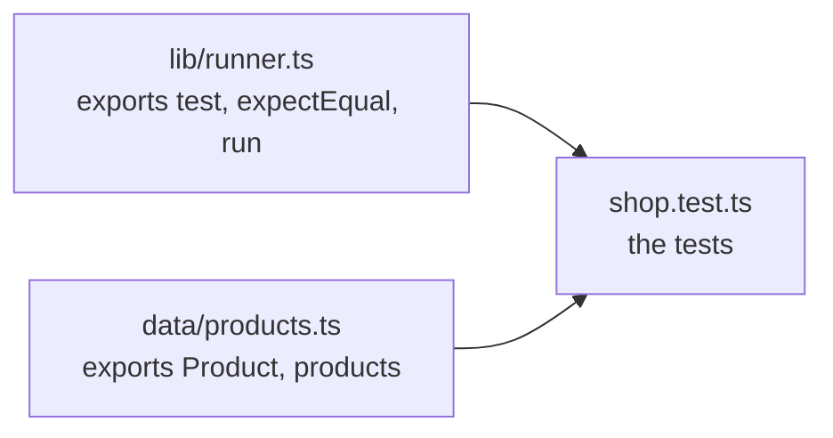

# Prerequisites

## P1 · Quick recap from Day 7

- [ ] Make decisions with `if / else if / else` and `switch` (Day 7 · F2, F4)
- [ ] Repeat work for each item with `for...of` (Day 7 · F6)
- [ ] Filter and question lists: `results.filter((r) => r.status === 'failed')` (Day 7 · F8)

```quiz
id: d8-p1-q1
type: single
question: "What does `[1200, 4500, 800].filter((ms) => ms > 1000)` give?"
options:
  - "[1200, 4500]"
  - "[4500]"
  - "true"
  - "1200"
answer: a
explanation: filter keeps every item that passes the check, in a new array.
```

```quiz
id: d8-p1-q2
type: single
question: "How many times does `for (const b of ['chromium', 'firefox']) { … }` run its block?"
options:
  - "1"
  - "2"
  - "3"
  - "0"
answer: b
explanation: for...of runs once per item, and the list has two items.
```

## P2 · Shared steps and waiting — two ideas you already use

**Shared steps.** In a test-management tool, you don't retype "Log in as a standard user" in 40 test cases. You write it once as a **shared step** and reference it everywhere. When the login screen changes, you fix one place. In code, a shared step is a **function**.

**Waiting.** When you test manually, you click *Log in* and **wait** for the dashboard before checking it. You'd never check the dashboard while the page is still loading. Code needs to be told to wait for slow work like that — that's what **async/await** is for.

| Manual testing idea | Code | Today |
|---|---|---|
| A shared step, like "Log in as `<user>`" | A function: `login(user)` | F1–F3 |
| A step that takes time — page load, save, search | An asynchronous function, with `await` | F4–F5 |
| "If the step fails, record the error and move on" | `try` / `catch` | F6 |
| A shared library of steps and test data | Modules: `export` and `import` | F7 |

Every line of a Playwright test uses today's ideas:

```ts mode=read
import { test, expect } from '@playwright/test';          // a module import      (F7)

test('user can log in', async ({ page }) => {              // an async arrow function, passed to test()   (F3, F5)
  await page.goto('https://example.com/login');            // wait for a slow step (F5)
  await page.getByLabel('Email').fill('asha@example.com');  // calling functions with arguments (F1)
});
```

By the end of today, you'll be able to read every symbol in that code.

```quiz
id: d8-p2-q1
type: single
question: Your test case "Checkout as a guest" and 12 others all start with the same 5 login steps. In code, what's the best way to handle those 5 steps?
options:
  - Copy and paste them into all 13 tests
  - Put them in one function and call it from each test
  - Put them in a loop that runs 13 times
  - Leave them out; Playwright logs in automatically
answer: b
explanation: A function is a shared step — written once, called anywhere. When the login screen changes, you fix one place.
```

# Fundamentals

## F1 · Functions — named, reusable steps

A **function** is a named block of code that you can run whenever you need it. You've already **used** many built-in functions and methods — `console.log(…)`, `Number(…)`, `text.trim()`, `list.push(…)`. Now you'll write your own.

### Declaring a function

```ts mode=read
function buildEmail(name: string, id: number): string {
  return `${name.toLowerCase()}.${id}@example.com`;
}
```

| Part | Here | Meaning |
|---|---|---|
| `function` | | "I'm declaring a function" |
| Name | `buildEmail` | What you'll call it (camelCase, usually a verb: `build…`, `parse…`, `check…`) |
| **Parameters** | `(name: string, id: number)` | The inputs it needs, each with a type |
| **Return type** | `: string` | The type of value it gives back |
| Body | `{ … }` | The steps it runs |
| `return` | `return …;` | Gives the result back to whoever called it |

Declaring a function **doesn't run it**. It's like writing a shared step in the test-management tool: nothing happens until a test uses it.

### Calling a function

```ts mode=read
const email = buildEmail('Asha', 1);     // runs the function: email = 'asha.1@example.com'
console.log(buildEmail('Ravi', 2));      // ravi.2@example.com
```

The values you pass in — `'Asha'` and `1` — are the **arguments**. Inside the function, they arrive in the **parameters** `name` and `id`.

| Word | What it is | Example |
|---|---|---|
| **Parameter** | The named slot in the declaration | `name: string` |
| **Argument** | The actual value passed in the call | `'Asha'` |

TypeScript checks every call against the declaration:

```ts mode=read
buildEmail('Asha');          // ❌ error TS2554: Expected 2 arguments, but got 1.
buildEmail('Asha', '1');     // ❌ error TS2345: Argument of type 'string' is not assignable to parameter of type 'number'.
```

### `return` — giving back a result

`return` sends a value back **and ends the function immediately**. Anything after it in the same run is skipped:

```ts mode=read
function formatDuration(ms: number): string {
  if (ms < 1000) {
    return `${ms} ms`;          // for short durations, the function ends here…
  }
  return `${ms / 1000} s`;      // …so this line only runs for 1000 ms or more
}
```

Returning early like this — "if the input is a special case, answer straight away" — is a common and readable pattern.

### `void` — functions that just *do* something

Some functions perform an action and give nothing back. Their return type is **`void`** ("nothing"):

```ts mode=read
function logStep(step: number, action: string): void {
  console.log(`Step ${step}: ${action}`);
}
```

### Variables inside functions stay inside

A function's body is a block, so `let` and `const` declared inside it only exist inside it (Day 5 · F3). Each call gets fresh variables — two calls can't mess up each other's values.

> [!TIP] One job per function
> A good function does one clear thing, and its name says what: `parsePrice`, `buildEmail`, `validatePassword`. If you need "and" to describe it, it probably wants to be two functions.

```quiz
id: d8-f1-q1
type: single
question: "In `function greet(name: string): string { … }` and the call `greet('Meera')`, which is the argument?"
options:
  - "`name`"
  - "`'Meera'`"
  - "`string`"
  - "`greet`"
answer: b
explanation: "The argument is the actual value passed in the call. `name` is the parameter — the slot that receives it."
```

```quiz
id: d8-f1-q2
type: single
question: "`function check(n: number): string { if (n > 0) { return 'positive'; } return 'not positive'; }` — what does `check(5)` give?"
options:
  - "'positive'"
  - "'not positive'"
  - "'positive', then 'not positive'"
  - "undefined"
answer: a
explanation: "return ends the function immediately, so the second return is never reached for 5."
```

```quiz
id: d8-f1-q3
type: single
question: "What does a return type of `void` mean?"
options:
  - The function returns an empty string
  - The function gives no value back — it just performs an action
  - The function returns null
  - It returns `undefined`, so you can't call it
answer: b
explanation: "void means \"returns nothing useful\". Calling it still runs its steps."
```

## F2 · Parameters: optional, default and rest

By default every parameter is **required**, and the call must give exactly one argument per parameter. Three variations make functions more flexible:

### Optional parameters — `?`

```ts mode=read
function greet(name: string, title?: string): string {
  return title ? `Hello, ${title} ${name}` : `Hello, ${name}`;
}
greet('Asha');            // 'Hello, Asha'           — title is undefined
greet('Rao', 'Dr.');      // 'Hello, Dr. Rao'
```

Like optional properties (Day 6), an optional parameter that isn't passed is `undefined`, and its type is `string | undefined` — so TypeScript makes you check it before using it.

### Default parameters — `= value`

```ts mode=read
function buildEmail(name: string, id: number, domain: string = 'example.com'): string {
  return `${name.toLowerCase()}.${id}@${domain}`;
}
buildEmail('Asha', 1);               // 'asha.1@example.com'  — the default is used
buildEmail('Ravi', 2, 'test.org');   // 'ravi.2@test.org'     — the default is overridden
```

A default is often better than optional: inside the function the value is never `undefined`, so there's nothing to check.

### Rest parameters — `...` for "any number of"

```ts mode=read
function tagTitle(title: string, ...tags: string[]): string {
  return `${title} ${tags.join(' ')}`;
}
tagTitle('checkout works', '@smoke', '@payments');   // tags = ['@smoke', '@payments']
```

The three dots collect all the remaining arguments into one array.

### The ordering rule

An optional (`?`) parameter can't come before a required one — TypeScript reports error TS1016. Put default parameters last too; otherwise callers must pass `undefined` to skip them. A rest parameter must always be **last**. (Otherwise, how would TypeScript know which argument goes where?)

> [!NOTE] Objects as parameters
> When a function needs many values, pass **one object** instead of a long list — `login(user)` rather than `login(email, password, rememberMe, role)`. You'll see this constantly in Playwright: `page.goto(url, { timeout: 10000 })`, `getByRole('button', { name: 'Log in' })` — the second argument is an options object.

```quiz
id: d8-f2-q1
type: single
question: "`` function price(amount: number, currency: string = 'INR'): string { return `${amount} ${currency}`; } `` — what does `price(500)` give?"
options:
  - "'500 undefined'"
  - "'500 INR'"
  - "An error: 2 arguments expected"
  - "'500'"
answer: b
explanation: The default value INR is used when no second argument is passed.
```

```quiz
id: d8-f2-q2
type: single
question: "Which declaration is NOT allowed?"
options:
  - "`function f(a: string, b?: number) {}`"
  - "`function f(a?: string, b: number) {}`"
  - "`function f(a: string, ...rest: number[]) {}`"
  - "`function f(a: string, b: number = 1) {}`"
answer: b
explanation: "A required parameter can't come after an optional one — TypeScript reports error TS1016."
```

## F3 · Arrow functions and callbacks

### Arrow functions

On Day 7 you used little functions like `(result) => result.status === 'failed'`. These are **arrow functions** — a shorter way to write a function, often stored in a `const`:

```ts mode=read
// A function declaration…
function isSlow(ms: number): boolean {
  return ms > 3000;
}

// …and the same thing as an arrow function
const isSlowArrow = (ms: number): boolean => ms > 3000;
```

| Shape | Example | Notes |
|---|---|---|
| One expression after `=>` | `(ms: number) => ms > 3000` | The result is returned automatically — no `return`, no braces |
| A block after `=>` | `` (ms: number) => { const s = ms / 1000; return `${s} s`; } `` | Several statements, so you write `return` yourself |
| No parameters | `() => console.log('done')` | Empty brackets are still needed |

Both forms are functions; you call them the same way: `isSlowArrow(4500)`. Most Playwright code uses arrow functions.

### Functions are values — callbacks

A function can be stored in a variable and **passed to another function**, just like a number or a string. A function you hand to another function, for it to call later, is a **callback**:

```ts mode=read
const durations: number[] = [1200, 4500, 800];

durations.filter(isSlowArrow);              // pass the function itself (no brackets!) → [4500]
durations.filter((ms) => ms > 3000);        // or write it on the spot → [4500]
```

Note `filter(isSlowArrow)` with **no brackets**: you hand over the function for `filter` to call, once per item. `filter(isSlowArrow())` would call it immediately yourself — not what you want.

Here, TypeScript already knows `ms` must be a number (because `durations` is a `number[]`), so the callback doesn't need a type annotation.

### Function types

To describe a function as a *type* — "a function that takes a number and returns a boolean" — write its shape with an arrow:

```ts mode=read
type DurationCheck = (ms: number) => boolean;
type TestBody = () => Promise<void>;     // takes nothing, returns a Promise
```

You'll meet `Promise` in F4 — for now, read `Promise<void>` as "finishes later".

### The Playwright test is a callback

Now you can read a Playwright test's structure:

```ts mode=read
test('user can log in', async ({ page }) => {
  // …steps…
});
```

`test` is a function with **two arguments**: a title (a string) and a callback (an `async` arrow function, F5). Playwright stores the callback and calls it later, when it runs the test — handing it an object from which `{ page }` is destructured (Day 6).

```quiz
id: d8-f3-q1
type: single
question: "What does `const double = (n: number) => n * 2;` give for `double(21)`?"
options:
  - "21"
  - "42"
  - "undefined — there's no return"
  - "An error"
answer: b
explanation: "With a single expression after the arrow, its value is returned automatically."
```

```quiz
id: d8-f3-q2
type: single
question: "In `test('checkout works', async ({ page }) => { … })`, what is the second argument?"
options:
  - The page
  - The test's result
  - A callback function that Playwright calls when it runs the test
  - A string describing the steps
answer: c
explanation: "test() receives the title and a function; Playwright calls that function later, passing in the fixtures such as page."
```

## F4 · Asynchronous code — why tests must wait

### Synchronous code: one line at a time

Everything you've written so far is **synchronous**: each line finishes completely before the next one starts. Adding numbers, joining text and looping over an array are all instant.

### Asynchronous work: things that take time

Browser automation is different. Opening a page, clicking a button, waiting for a search result — each takes an unknown amount of time, from milliseconds to seconds. JavaScript doesn't freeze while it waits: it **starts** the slow work and carries on. Code like this is called **asynchronous** (async).

You can see this with `setTimeout`, which runs a callback after a delay:

```ts mode=read
console.log('1. Order placed');
setTimeout(() => console.log('3. Order delivered'), 1000);   // run this callback in 1 second
console.log('2. Carry on with other work');
// Prints 1, 2 … and a second later, 3
```

JavaScript didn't wait for the delivery; it scheduled it and moved on.

### Promises — "the result will arrive later"

A slow operation gives you back a **Promise** straight away: an object that stands for a result that isn't ready yet. Think of an order-tracking number — you hold it now, and the parcel arrives later (or doesn't).

| Promise state | Meaning | Order analogy |
|---|---|---|
| **pending** | Still working | "Out for delivery" |
| **fulfilled** | Finished, with a value | "Delivered" — here's the parcel |
| **rejected** | Failed, with an error | "Delivery failed" — here's why |

Its type says what it will deliver: `Promise<string>` will deliver a string; `Promise<void>` delivers nothing — it just says "done".

Every Playwright action returns a Promise: `page.goto(…)`, `locator.click()`, `expect(locator).toBeVisible()`.

### Decoding the waiting line from Day 2

On Day 2 you copied this line to make a pretend server slow. Now it makes sense:

```ts mode=read
await new Promise((resolve) => setTimeout(resolve, 2000));
```

"Create a Promise that `setTimeout` fulfils (`resolve`s) after 2000 ms — and `await` it." `new Promise(…)` creates a Promise. You give it a function; JavaScript hands that function a `resolve` function, and calling `resolve()` marks the Promise as fulfilled. `setTimeout(resolve, 2000)` calls it after 2 seconds. (`new` always means "create a fresh object of this kind" — you'll see `new Error(…)` in F6.)

So the line is a pause, and it's so useful that today's examples wrap it in a function:

```ts mode=read
function sleep(ms: number): Promise<void> {
  return new Promise((resolve) => setTimeout(resolve, ms));
}
```

`sleep` isn't marked `async` (F5), but it returns a Promise — and `await` works on any Promise.

> [!WARNING] `sleep` is for learning, not for tests
> Fixed waits make real tests slow and flaky (Day 2). Playwright waits automatically for the page; you'll only use `sleep` today to **pretend** that something takes time.

```quiz
id: d8-f4-q1
type: single
question: Why is browser automation asynchronous?
options:
  - Because TypeScript requires it for every program
  - Because browser actions take an unknown amount of time, and the program must not freeze while they happen
  - Because browsers can only run one test at a time
  - To make tests run in a random order
answer: b
explanation: "Page loads and clicks take time. Asynchronous code lets the program start the work and be told when it's done."
```

```quiz
id: d8-f4-q2
type: single
question: "What does the type `Promise<number>` describe?"
options:
  - A number that might be null
  - A list of numbers
  - A result that will arrive later — when it succeeds, it's a number
  - A function that takes a number
answer: c
explanation: "A Promise stands for a future result; the type in angle brackets is the result's type."
```

## F5 · `async` and `await`

Two keywords make asynchronous code read like normal step-by-step code:

| Keyword | Where | Meaning |
|---|---|---|
| `async` | Before a function | "This function does slow work." It always returns a Promise |
| `await` | Before a Promise | "Pause **this function** until the Promise finishes, then give me the result." Other work that was already started keeps running |

On an arrow function, `async` goes before the brackets: `async () => { … }`, `async ({ page }) => { … }`.

```ts mode=read
async function getPageTitle(): Promise<string> {
  await sleep(100);             // pretend the page takes 100 ms to load
  return 'My Shop – Home';      // an async function's return value arrives wrapped in a Promise
}

const title = await getPageTitle();   // await unwraps Promise<string> into a string
console.log(title);                    // My Shop – Home
```

`await` only works inside an `async` function — or at the top level of a module file, like the files in `ts-basics` (the `"type": "module"` setting from Day 4 makes them modules). That's why every Playwright test body is written `async ({ page }) => { … }`: it needs `await` inside.

### The #1 Playwright bug: a missing `await`

Forget `await`, and the program **doesn't wait**. It starts the step and rushes straight on to the next line:

```ts mode=read
click('Log in');                 // ❌ starts the click… and doesn't wait for it
checkDashboard();                // runs while the click is still happening

await click('Log in');           // ✅ the click finishes first
await checkDashboard();
```

In a real test that leads to random failures, or worse, tests that pass without checking anything. TypeScript usually **doesn't** warn you: calling a function without `await` is perfectly legal code. You'll see it happen in I4.

### `forEach` doesn't wait

Day 7 promised an explanation. `forEach` calls its callback for every item, but it **ignores** the Promises that async callbacks return. It starts them all at once and moves on without waiting. A `for...of` loop with `await` inside does wait, one item at a time:

```ts mode=read
// ❌ doesn't wait: the next line runs before any page is checked
pages.forEach(async (page) => { await checkPage(page); });

// ✅ waits for each check before starting the next
for (const page of pages) {
  await checkPage(page);
}
```

> [!WARNING] Rule for the rest of the course
> If a Playwright method **does something in the browser** or **checks something that may take time** — `goto`, `click`, `fill`, `expect(…).toBeVisible()` — put `await` in front of it. Inside loops, use `for...of`, not `forEach`.

```quiz
id: d8-f5-q1
type: single
question: What does an `async` function always return?
options:
  - A string
  - A Promise
  - undefined
  - Whatever type you declare, without a Promise
answer: b
explanation: "An async function always returns a Promise — `Promise<string>`, `Promise<void>` and so on. Use await to get the value inside."
```

```quiz
id: d8-f5-q2
type: single
question: "A test runs `page.getByRole('button', { name: 'Save' }).click();` with no `await`, then immediately checks for a success message. What's the likely result?"
options:
  - It always passes — Playwright auto-waits anyway
  - "It's unreliable: the check may run before the click has finished"
  - TypeScript refuses to run the file
  - The click happens twice
answer: b
explanation: "Auto-waiting happens INSIDE the click, but without await your test doesn't wait for the click to finish before moving on."
```

```quiz
id: d8-f5-q3
type: single
question: "You need to check 5 product pages, one after another, in a Playwright test. Which loop is correct?"
options:
  - "`products.forEach(async (p) => { await check(p); });`"
  - "`for (const p of products) { await check(p); }`"
  - "`for (const p in products) { await check(p); }`"
  - "`products.map((p) => check(p));`"
answer: b
explanation: "for...of with await waits for each check in turn. forEach and map start them all without waiting, and for...in gives indexes, not products."
```

## F6 · Errors — `throw`, `try`, `catch`, `finally`

### Throwing an error

When a function hits a problem it can't handle, it **throws** an error. That stops it immediately — like `return`, but signalling failure:

```ts mode=read
function parsePrice(text: string): number {
  const price = Number(text.replace('₹', '').replaceAll(',', ''));
  if (Number.isNaN(price)) {                          // true when price is NaN
    throw new Error(`Not a price: "${text}"`);        // create an Error with a message, and throw it
  }
  return price;
}
```

(`Number.isNaN(value)` checks for `NaN`. You can't use `=== NaN`, because `NaN` isn't even equal to itself.)

If nothing catches the error, the program stops and prints it — the same kind of red error message you read on Day 4.

### Catching an error

Wrap risky code in `try { … }`. If anything inside throws, the program jumps straight to `catch`:

```ts mode=read
try {
  const price = parsePrice('call for price');   // throws…
  console.log(price);                           // …so this line is skipped
} catch (error) {
  if (error instanceof Error) {
    console.log(`Could not read price: ${error.message}`);
  }
} finally {
  console.log('Price check finished');          // always runs, error or not
}
```

| Block | Runs… |
|---|---|
| `try` | First. It stops at the first error |
| `catch (error)` | Only if something in `try` threw; `error` holds what was thrown |
| `finally` (optional) | Always, at the end — good for clean-up |

**Why `instanceof Error`?** JavaScript lets you throw *anything* — not just Error objects — so in strict mode, the caught `error` has the type `unknown` (Day 6). `error instanceof Error` checks that it really is an Error object, which **narrows** it (Day 7) so you can read `.message`. You'll also see `(error as Error).message` in other people's code; `as` tells TypeScript "trust me", without checking.

### Errors in async code

A `throw` inside an `async` function **rejects** the Promise that function returned. And when an awaited Promise is rejected, `await` turns that back into a thrown error — so the same `try/catch` works:

```ts mode=read
try {
  await findButton('Sign up');      // if this Promise is rejected…
} catch (error) {
  // …we land here
}
```

> [!TESTER]
> This is how Playwright tests fail. When an assertion like `await expect(page).toHaveTitle('Shop')` doesn't match, it keeps retrying until its timeout (5 seconds by default, Day 2), then **throws** an error. Playwright's runner catches it, marks the test as failed, records the message and moves on to the next test. So in tests you rarely write `try/catch` yourself — letting the error reach the runner is exactly what you want. You'll build a runner that does this in I6.

```quiz
id: d8-f6-q1
type: single
question: "`try { A(); B(); } catch (e) { C(); } finally { D(); }` — A() throws an error. Which run?"
options:
  - A, B, C, D
  - A, C, D
  - A, C
  - A, D
answer: b
explanation: "A throws, so B is skipped and catch runs C. finally always runs D."
```

```quiz
id: d8-f6-q2
type: single
question: "Why does TypeScript make you check `error instanceof Error` before reading `error.message` in a catch?"
options:
  - Because a catch block can't read properties at all
  - "Because anything can be thrown, so the caught value has the type unknown"
  - Because Error objects don't have a message
  - It doesn't — error is always an Error
answer: b
explanation: "JavaScript allows throwing any value, so TypeScript types it as unknown until you check it."
```

## F7 · Modules — `export` and `import`

As a project grows, you split it into files: tests in one place, test data in another, helpers in a third. Each file is a **module**. A module **exports** what it wants to share, and other modules **import** it.

```ts mode=read
// file: data/products.ts
export type Product = { name: string; price: number };
export const products: Product[] = [{ name: 'Monitor', price: 8999 }];
export function findProduct(name: string): Product | undefined {
  return products.find((p) => p.name === name);
}
```

```ts mode=read
// file: shop.test.ts
import { products, findProduct } from './data/products.ts';

console.log(products.length);
console.log(findProduct('Monitor')?.price);
```

Anything **not** exported stays private to its file.

### Paths

| Import from | Means |
|---|---|
| `'./products.ts'` | A file in the **same** folder |
| `'./data/products.ts'` | A file in the `data` sub-folder |
| `'../data/products.ts'` | Go **up** one folder first, then into `data` |
| `'@playwright/test'` (no `./`) | An installed **package** in `node_modules` |

### Named and default exports

| Kind | Export | Import |
|---|---|---|
| **Named** — any number per file | `export function login() {}` | `import { login } from './auth.ts';` — with braces, same name |
| **Default** — at most one per file | `export default function login() {}` | `import login from './auth.ts';` — no braces, any name |

Most Playwright code uses named exports; you'll meet a default export on Day 10, in `playwright.config.ts`.

### Importing types: `import type`

Types exist only for TypeScript's checks. They're removed before the code runs (Day 4). So when you import a **type**, say so:

```ts mode=read
import { products, type Product } from './data/products.ts';   // one value, one type
import type { Product } from './data/products.ts';             // only types
```

If you import a type **without** marking it, TypeScript's check passes, but running the file with Node.js fails: `SyntaxError: The requested module './data/products.ts' does not provide an export named 'Product'`. Node looked for `Product` in the running code, and there's no such thing. (Inside Playwright tests both forms work, but marking types is a good habit.)

> [!NOTE] File extensions
> In the `ts-basics` playground, imports of your own files include `.ts`: `'./data/products.ts'`. That's what Node.js requires (and why the `check` command has `--allowImportingTsExtensions`). In Playwright projects you normally leave the extension out — `'../data/products'` — because Playwright finds the file for you.

### Decoding the first line of every Playwright test

```ts mode=read
import { test, expect } from '@playwright/test';
//      └── named imports ─┘      └── an installed package (no ./)
```

*"From the installed package `@playwright/test`, bring in the two named exports `test` and `expect`."*

```quiz
id: d8-f7-q1
type: single
question: "`utils/data.ts` contains `export const adminUser = { … };`. How do you import it into `tests/admin.spec.ts` in a Playwright project?"
options:
  - "`import adminUser from 'utils/data';`"
  - "`import { adminUser } from '../utils/data';`"
  - "`import { adminUser } from './utils/data';`"
  - "`import { adminUser } from '@playwright/test';`"
answer: b
explanation: "It's a named export, so use braces. From the tests folder, go up one level (../) and then into utils. './utils' would look inside tests."
```

```quiz
id: d8-f7-q2
type: single
question: "A file has `const secretKey = 'abc';` with no `export`. Can another file import it?"
options:
  - Yes, with import { secretKey }
  - Yes, but only as a default import
  - No — only exported names can be imported
  - Only if both files are in the same folder
answer: c
explanation: "Anything not exported is private to its module."
```

# Implementation

All files today go in `ts-basics/day8`. Run with `node day8/<file>.ts`, check with `npm run check -- day8/<file>.ts`.

## I1 · A toolbox of helper functions

```ts file=ts-basics/day8/helpers-demo.ts mode=editor run="node day8/helpers-demo.ts"
// Turn price text from a page, like '₹1,499', into the number 1499
function parsePrice(text: string): number {
  const cleaned = text.trim().replace('₹', '').replaceAll(',', '');
  return Number(cleaned);
}

// Build a test email address. domain has a default value.
function buildEmail(name: string, id: number, domain: string = 'example.com'): string {
  return `${name.toLowerCase()}.${id}@${domain}`;
}

// Show a duration in readable form. Two different return statements.
function formatDuration(ms: number): string {
  if (ms < 1000) {
    return `${ms} ms`;           // return ends the function here…
  }
  return `${ms / 1000} s`;       // …so this line only runs for 1000 ms or more
}

// A function that does something but gives nothing back: void
function logStep(step: number, action: string): void {
  console.log(`Step ${step}: ${action}`);
}

// Calling the functions
const price = parsePrice(' ₹1,499 ');
console.log(price + 1);                               // a real number now
console.log(parsePrice('₹12,450') > 10000);
console.log(buildEmail('Asha', 1));                   // uses the default domain
console.log(buildEmail('Ravi', 2, 'test.org'));       // overrides it
console.log(formatDuration(450), '|', formatDuration(2500));
logStep(1, 'Open the login page');
```

```output console
1500
true
asha.1@example.com
ravi.2@test.org
450 ms | 2.5 s
Step 1: Open the login page
```

`console.log` can take several arguments; it prints them separated by spaces.

On Day 6 you cleaned one price with a chain of text methods. Now `parsePrice` does it for **any** price text — and if the site changes its currency format, you fix one function.

**Try it:** call `buildEmail('Meera')` and check the file. Read the error, then fix the call.

## I2 · Extra practice (optional): refactor the password checker into functions

Day 7's password checker lived inside a loop. Moved into functions, the same logic is easier to read, test and reuse:

```ts file=ts-basics/day8/password-check.ts mode=editor run="node day8/password-check.ts"
// One job per function: small, named, reusable checks

// Does the text contain at least one digit?
function hasDigit(text: string): boolean {
  return text.split('').some((ch) => '0123456789'.includes(ch));
}

// Does the text contain at least one upper-case letter?
function hasUpperCase(text: string): boolean {
  return text.split('').some((ch) => ch !== ch.toLowerCase());
}

// Return every rule the password breaks (an empty list = valid)
function validatePassword(password: string): string[] {
  if (password === '') {
    return ['a password'];                  // early return: nothing else to check
  }
  const problems: string[] = [];
  if (password.length < 8) {
    problems.push('at least 8 characters');
  }
  if (!hasDigit(password)) {
    problems.push('a digit');
  }
  if (!hasUpperCase(password)) {
    problems.push('an upper-case letter');
  }
  return problems;
}

// Test data: each case says what we EXPECT
type PasswordCase = { input: string; shouldBeValid: boolean };
const cases: PasswordCase[] = [
  { input: 'Secret@123', shouldBeValid: true },
  { input: 'short1A', shouldBeValid: false },
  { input: 'alllowercase1', shouldBeValid: false },
  { input: '', shouldBeValid: false },
  { input: 'Valid2Password', shouldBeValid: true },
];

let passed = 0;
for (const testCase of cases) {
  const problems = validatePassword(testCase.input);
  const isValid = problems.length === 0;
  const ok = isValid === testCase.shouldBeValid;   // did reality match the expectation?
  if (ok) {
    passed++;
  }
  const details = isValid ? 'valid' : `needs ${problems.join(', ')}`;
  console.log(`${ok ? 'PASS' : 'FAIL'} "${testCase.input}" -> ${details}`);
}
console.log(`${passed}/${cases.length} cases behaved as expected`);
```

```output console
PASS "Secret@123" -> valid
PASS "short1A" -> needs at least 8 characters
PASS "alllowercase1" -> needs an upper-case letter
PASS "" -> needs a password
PASS "Valid2Password" -> valid
5/5 cases behaved as expected
```

`text.split('')` splits text into single characters, so `.some(…)` can ask "is any character a digit?".

**Try it:** add `{ input: 'Abcdefg1', shouldBeValid: true }` — predict the output line first, then run.

## I3 · A pretend browser test with `async`/`await`

These pretend browser actions behave like Playwright's: each one takes time and returns a Promise. Read the test at the bottom — it looks very much like a real Playwright test:

```ts file=ts-basics/day8/fake-browser.ts mode=editor run="node day8/fake-browser.ts"
// A pretend browser. Like Playwright's, every action takes time and returns a Promise.
function sleep(ms: number): Promise<void> {
  return new Promise((resolve) => setTimeout(resolve, ms));
}

let currentUrl = 'about:blank';

async function goto(url: string): Promise<void> {
  await sleep(150);                       // loading a page takes a while
  currentUrl = url;
  console.log(`goto ${url}`);
}

async function fill(field: string, value: string): Promise<void> {
  await sleep(50);
  console.log(`fill ${field} = ${value}`);
}

async function click(button: string): Promise<void> {
  await sleep(100);
  if (button === 'Log in') {
    currentUrl = '/dashboard';           // clicking Log in opens the dashboard
  }
  console.log(`click ${button}`);
}

async function getUrl(): Promise<string> {
  await sleep(10);
  return currentUrl;                      // async functions can give back a value too
}

// The "test": each step waits for the one before it
console.log('TEST: user can log in');
await goto('/login');
await fill('Email', 'asha@example.com');
await fill('Password', 'Secret@123');
await click('Log in');

const url = await getUrl();               // await unwraps Promise<string> into a string
console.log(url === '/dashboard' ? 'PASSED: on /dashboard' : `FAILED: on ${url}`);
```

```output console
TEST: user can log in
goto /login
fill Email = asha@example.com
fill Password = Secret@123
click Log in
PASSED: on /dashboard
```

**Try it:** delete the `await` in front of `click('Log in')` and run it again. The check runs before the click has finished, and the "test" fails — the missing-await bug, reproduced.

## I4 · See the missing-`await` bug and the `forEach` trap

```ts file=ts-basics/day8/missing-await.ts mode=editor run="node day8/missing-await.ts"
function sleep(ms: number): Promise<void> {
  return new Promise((resolve) => setTimeout(resolve, ms));
}

async function click(label: string): Promise<void> {
  await sleep(200);                               // clicking takes a moment
  console.log(`  clicked "${label}"`);
}

// 1. Without await: the program doesn't wait for the click
console.log('WITHOUT await:');
click('Log in');                                  // ❌ no await
console.log('  checking the dashboard   <- too early!');
await sleep(300);                                 // (give the forgotten click time to finish)

// 2. With await: each step finishes before the next starts
console.log('WITH await:');
await click('Log in');                            // ✅
console.log('  checking the dashboard   <- right order');

// 3. forEach doesn't wait for async callbacks
console.log('forEach:');
const pages: string[] = ['home', 'cart'];
pages.forEach(async (page) => {
  await sleep(100);
  console.log(`  checked ${page}`);
});
console.log('  all pages checked?     <- printed first!');
await sleep(200);

// 4. for...of with await does wait
console.log('for...of:');
for (const page of pages) {
  await sleep(100);
  console.log(`  checked ${page}`);
}
console.log('  all pages checked      <- right order');
```

```output console
WITHOUT await:
  checking the dashboard   <- too early!
  clicked "Log in"
WITH await:
  clicked "Log in"
  checking the dashboard   <- right order
forEach:
  all pages checked?     <- printed first!
  checked home
  checked cart
for...of:
  checked home
  checked cart
  all pages checked      <- right order
```

Now check the file with `npm run check -- day8/missing-await.ts`. It passes: TypeScript is **silent** about the missing `await`, because the code is legal. That's what makes this bug dangerous. (In real projects, a linter rule called `no-floating-promises` can flag it; the Playwright docs recommend it.)

## I5 · Catching errors

```ts file=ts-basics/day8/errors.ts mode=editor run="node day8/errors.ts"
function sleep(ms: number): Promise<void> {
  return new Promise((resolve) => setTimeout(resolve, ms));
}

// A pretend "find a button" step that fails for unknown buttons
async function findButton(name: string): Promise<string> {
  await sleep(100);
  if (name !== 'Log in') {
    throw new Error(`Button "${name}" not found`);   // stop and report a problem
  }
  return `<button>${name}</button>`;
}

try {
  const button = await findButton('Log in');
  console.log(`Found: ${button}`);
  await findButton('Sign up');                       // this one throws…
  console.log('This line is skipped');
} catch (error) {
  // …so the program jumps here. error has the type unknown: check it first.
  if (error instanceof Error) {
    console.log(`Caught: ${error.message}`);
  }
} finally {
  console.log('Clean-up always runs');               // runs whether it failed or not
}

console.log('The program carries on');
```

```output console
Found: <button>Log in</button>
Caught: Button "Sign up" not found
Clean-up always runs
The program carries on
```

**Try it:** remove the `try {`, the whole `catch` block and the `finally` block (keep the lines inside `try`), then run. There's nothing to catch the error, so the program stops with a red error message and `The program carries on` is never printed.

## I6 · Build your own mini test runner — with modules

Time to put everything together. You'll build a tiny version of Playwright Test, split across three modules:



**1. The runner** — registers tests, runs them one by one, and turns thrown errors into failed tests:

```ts file=ts-basics/day8/lib/runner.ts mode=editor
// A tiny test runner: the same idea as Playwright Test, in about 30 lines

// A test body: a function that takes nothing and returns a Promise
type TestBody = () => Promise<void>;
type RegisteredTest = { title: string; body: TestBody };

const registeredTests: RegisteredTest[] = [];

// test(): register a test. It does NOT run yet.
export function test(title: string, body: TestBody): void {
  registeredTests.push({ title, body });        // short for { title: title, body: body }
}

// expectEqual(): a tiny assertion. It throws when the values differ.
export function expectEqual(actual: unknown, expected: unknown): void {
  if (actual !== expected) {
    throw new Error(`Expected ${String(expected)}, received ${String(actual)}`);
  }
}

// run(): run every registered test, one after another, and report
export async function run(): Promise<void> {
  let passed = 0;
  for (const registered of registeredTests) {
    try {
      await registered.body();                  // run the test and wait for it
      passed++;
      console.log(`  ✓ ${registered.title}`);
    } catch (error) {                           // a failed check lands here
      const message = error instanceof Error ? error.message : String(error);
      console.log(`  ✘ ${registered.title}`);
      console.log(`      ${message}`);
    }
  }
  console.log(`${passed} passed, ${registeredTests.length - passed} failed`);
}
```

**2. The test data** — shared by any test file that needs it:

```ts file=ts-basics/day8/data/products.ts mode=editor
// Test data, shared by any test file that imports it
export type Product = { name: string; price: number; inStock: boolean };

export const products: Product[] = [
  { name: 'Monitor', price: 8999, inStock: true },
  { name: 'Webcam', price: 2499, inStock: false },
  { name: 'Headset', price: 1799, inStock: true },
];
```

**3. The tests** — import both, register three tests, and run:

```ts file=ts-basics/day8/shop.test.ts mode=editor run="node day8/shop.test.ts"
// Import the runner's functions, and the shared test data
import { test, expectEqual, run } from './lib/runner.ts';
import { products, type Product } from './data/products.ts';

function sleep(ms: number): Promise<void> {
  return new Promise((resolve) => setTimeout(resolve, ms));
}

test('cart total adds up', async () => {
  let total = 0;
  for (const product of products) {
    total += product.price;
  }
  expectEqual(total, 13297);
});

test('headset is found by name', async () => {
  await sleep(100);                                  // pretend the search takes time
  const found: Product | undefined = products.find((p) => p.name === 'Headset');
  expectEqual(found?.price, 1799);
});

test('every product is in stock', async () => {
  const allInStock = products.every((p) => p.inStock);
  expectEqual(allInStock, true);                     // the Webcam isn't: this test fails
});

await run();
```

```output console
  ✓ cart total adds up
  ✓ headset is found by name
  ✘ every product is in stock
      Expected true, received false
2 passed, 1 failed
```

The failing test threw an error, the runner caught it, reported it, and **carried on**. That's exactly how Playwright Test behaves. Compare:

| Your mini runner | Playwright Test (Day 9) |
|---|---|
| `import { test, expectEqual, run } from './lib/runner.ts'` | `import { test, expect } from '@playwright/test'` |
| `test('title', async () => { … })` | `test('title', async ({ page }) => { … })` |
| `expectEqual(total, 13297)` | `expect(total).toBe(13297)` |
| Tests are registered first, then run by `run()` | Tests are registered in `*.spec.ts` files, then run by `npx playwright test` |
| `try/catch` turns a thrown error into a failed test | The same — and it adds a report, screenshots and traces |
| Runs tests one after another | Runs test files in parallel, with a fresh browser page for every test (tests inside one file run in order by default) |

**Try it:** change the `import { products, type Product }` line to `import { products, Product }` (without `type`) and run the file. Read the `SyntaxError`, then put `type` back.

```quiz
id: d8-i6-q1
type: single
question: "In the mini runner, why does `run()` use `for...of` instead of `registeredTests.forEach(…)`?"
options:
  - "`forEach` doesn't exist on arrays"
  - "`for...of` works with await, so each test finishes before the next starts"
  - "`for...of` catches errors automatically"
  - No reason — they behave the same here
answer: b
explanation: "forEach ignores the Promises returned by async callbacks, so the tests would all start at once and the summary would print before any of them finished."
```

# Practice

## Quiz · Day 8 check

```quiz
id: d8-pr-q1
type: single
question: "`function area(w: number, h: number = 5): number { return w * h; }` — what is `area(4)`?"
options:
  - "4"
  - "20"
  - "NaN"
  - "An error: 2 arguments expected"
answer: b
explanation: "h has the default value 5, so area(4) is 4 × 5."
```

```quiz
id: d8-pr-q2
type: single
question: "Which arrow function returns the price with 18% tax?"
options:
  - "`const withTax = (p: number) => { p * 1.18 };`"
  - "`const withTax = (p: number) => p * 1.18;`"
  - "`const withTax = p: number => p * 1.18;`"
  - "`const withTax => (p: number) p * 1.18;`"
answer: b
explanation: "With braces, you must write return yourself — the version with `{ p * 1.18 }` in braces returns undefined. A typed parameter needs brackets around it."
```

```quiz
id: d8-pr-q3
type: single
question: "`async function getCount(): Promise<number> { return 3; }` — what is `getCount()` (called without await)?"
options:
  - "3"
  - A Promise that will deliver 3
  - undefined
  - An error
answer: b
explanation: "An async function always returns a Promise. `await getCount()` would give 3."
```

```quiz
id: d8-pr-q4
type: multiple
question: Which lines need `await` in a Playwright test? (Select all that apply)
options:
  - "`page.goto('/login')`"
  - "`page.getByRole('button', { name: 'Log in' }).click()`"
  - "`const total = 499 + 1299;`"
  - "`expect(page).toHaveTitle('Shop')`"
answer: [a, b, d]
explanation: "Browser actions and web-first assertions take time and return Promises. Plain arithmetic is instant."
```

```quiz
id: d8-pr-q5
type: single
question: "When does the `finally` block run?"
options:
  - Only when an error was thrown
  - Only when no error was thrown
  - Always, after try (and catch, if it ran)
  - Only if catch didn't return
answer: c
explanation: "finally always runs — which makes it the place for clean-up."
```

```quiz
id: d8-pr-q6
type: single
question: "`import { test, expect } from '@playwright/test';` — what does the missing `./` tell you?"
options:
  - The file is in the same folder
  - It's an installed package in node_modules
  - It's a default import
  - The import is optional
answer: b
explanation: "Paths starting with ./ or ../ are your own files. A bare name like @playwright/test is an installed package."
```

```quiz
id: d8-pr-q7
type: single
question: "A file imports `import { LoginCase } from './data.ts';` where LoginCase is a type. `npm run check` passes, but `node` fails with a SyntaxError. What's the fix?"
options:
  - "Rename the file to data.js"
  - "`import type { LoginCase } from './data.ts';`"
  - "Remove the .ts extension"
  - "Add `export default` to LoginCase"
answer: b
explanation: "Types are removed before the code runs, so Node can't find LoginCase. Node removes `import type` lines along with the other types, so it never looks for it."
```

```quiz
id: d8-pr-q8
type: single
question: "In a Playwright test, how does a failing `await expect(…)` make the test fail?"
options:
  - It returns false, and the runner checks the return value
  - It throws an error; the runner catches it and marks the test as failed
  - It prints a warning and continues the test
  - It stops the whole test run
answer: b
explanation: "Assertions throw on failure. The runner catches the error, records it and moves on to the next test."
```

## Predict the output

````exercise
id: d8-pr-p1
title: Predict — default and optional parameters
level: easy
type: predict
prompt: What is printed?
code: |
  function label(name: string, count: number = 1, unit?: string): string {
    return `${count} ${unit ?? 'x'} ${name}`;
  }
  console.log(label('Mouse'));
  console.log(label('Cable', 3, 'm'));
answer: |
  1 x Mouse
  3 m Cable

  In the first call, count uses its default (1) and unit is undefined, so `??` gives 'x'. In the second, both are passed.
````

````exercise
id: d8-pr-p2
title: Predict — a forgotten await
level: challenge
type: predict
prompt: "What is printed, and in what order? (`sleep(ms)` waits for ms milliseconds.)"
code: |
  const sleep = (ms: number) => new Promise((resolve) => setTimeout(resolve, ms));
  async function step(name: string, ms: number): Promise<void> {
    await sleep(ms);
    console.log(name);
  }
  console.log('A');
  step('B', 200);
  await step('C', 100);
  console.log('D');
answer: |
  A
  C
  D
  B

  A prints at once. step('B', 200) starts but isn't awaited, so the program moves straight on. It awaits step('C', 100): after 100 ms, C prints, then D. B's 200 ms finish last.
````

````exercise
id: d8-pr-p3
title: Predict — try, catch and finally
level: medium
type: predict
prompt: What is printed?
code: |
  function check(value: number): string {
    try {
      if (value < 0) {
        throw new Error('negative');
      }
      return 'ok';
    } catch (error) {
      return 'caught';
    } finally {
      console.log(`checked ${value}`);
    }
  }
  console.log(check(5));
  console.log(check(-1));
answer: |
  checked 5
  ok
  checked -1
  caught

  finally runs even when try or catch returns, and it runs before the returned value reaches console.log. So each "checked" line appears before the result.
````

## Exercises

````exercise
id: d8-ex1
title: Cart total with an optional discount
level: easy
type: code
prompt: |
  Create `day8/total.ts` with a function `calculateTotal(prices: number[], discountPercent: number = 0): number` that adds up the prices and subtracts the discount percentage.

  Call it three times and print:
  ```
  Total: 2000
  With 10% off: 1800
  Empty cart: 0
  ```
  using the cart `[499, 1299, 202]` for the first two lines and an empty array `[]` for the third.
file: ts-basics/day8/total.ts
run: node day8/total.ts
hints:
  - "Add up with a for...of loop into `let total = 0`."
  - "The discount amount is `total * discountPercent / 100`."
  - "The default of 0 means the first call needs only one argument."
solution: |
  // Add up prices and apply an optional discount (in percent)
  function calculateTotal(prices: number[], discountPercent: number = 0): number {
    let total = 0;
    for (const price of prices) {
      total += price;
    }
    return total - (total * discountPercent) / 100;
  }

  const cart: number[] = [499, 1299, 202];
  console.log(`Total: ${calculateTotal(cart)}`);
  console.log(`With 10% off: ${calculateTotal(cart, 10)}`);
  console.log(`Empty cart: ${calculateTotal([])}`);
expectedOutput: |
  Total: 2000
  With 10% off: 1800
  Empty cart: 0
````

````exercise
id: d8-ex2
title: Fill the cart, one item at a time
level: medium
type: code
prompt: |
  Create `day8/add-items.ts`:

  1. Copy the `sleep` function from I3.
  2. Write `async function addToCart(item: string): Promise<void>` that waits 100 ms and then prints `added <item>`.
  3. Write `async function fillCart(items: string[]): Promise<number>` that adds every item **in order** and returns how many it added.
  4. Call `fillCart(['Monitor', 'Webcam', 'Headset'])` and print the result:
  ```
  added Monitor
  added Webcam
  added Headset
  3 items in the cart
  ```
  Then try it with `forEach` instead of `for...of` inside `fillCart`, to see what goes wrong. Change it back afterwards.
file: ts-basics/day8/add-items.ts
run: node day8/add-items.ts
hints:
  - "Inside fillCart: `for (const item of items) { await addToCart(item); }`."
  - "At the top level of the file: `const count = await fillCart([...]);`."
solution: |
  function sleep(ms: number): Promise<void> {
    return new Promise((resolve) => setTimeout(resolve, ms));
  }

  async function addToCart(item: string): Promise<void> {
    await sleep(100);
    console.log(`added ${item}`);
  }

  async function fillCart(items: string[]): Promise<number> {
    for (const item of items) {
      await addToCart(item);
    }
    return items.length;
  }

  const count = await fillCart(['Monitor', 'Webcam', 'Headset']);
  console.log(`${count} items in the cart`);
expectedOutput: |
  added Monitor
  added Webcam
  added Headset
  3 items in the cart
````

````exercise
id: d8-ex3
title: Reject bad quantities
level: medium
type: code
prompt: |
  Create `day8/quantities.ts`:

  1. Write `parseQuantity(text: string): number`. It converts the text with `Number(…)` and **throws** an Error:
     - `Not a number: "<text>"` when the result is NaN
     - `Quantity must be at least 1, got <n>` when it's less than 1
  2. Loop over `const inputs: string[] = ['2', 'abc', '0', '5'];`. Use `try/catch` so that one bad input doesn't stop the loop, and add up the good quantities:
  ```
  OK: 2
  Rejected: Not a number: "abc"
  Rejected: Quantity must be at least 1, got 0
  OK: 5
  Total quantity: 7
  ```
file: ts-basics/day8/quantities.ts
run: node day8/quantities.ts
hints:
  - "`Number.isNaN(quantity)` is true for NaN."
  - "Put the `try { … } catch (error) { … }` inside the for...of loop."
  - "In catch: `` if (error instanceof Error) { console.log(`Rejected: ${error.message}`); } ``"
solution: |
  // Turn text into a whole-number quantity, or throw an error
  function parseQuantity(text: string): number {
    const quantity = Number(text);
    if (Number.isNaN(quantity)) {
      throw new Error(`Not a number: "${text}"`);
    }
    if (quantity < 1) {
      throw new Error(`Quantity must be at least 1, got ${quantity}`);
    }
    return quantity;
  }

  const inputs: string[] = ['2', 'abc', '0', '5'];
  let total = 0;

  for (const input of inputs) {
    try {
      const quantity = parseQuantity(input);
      total += quantity;
      console.log(`OK: ${quantity}`);
    } catch (error) {
      if (error instanceof Error) {
        console.log(`Rejected: ${error.message}`);
      }
    }
  }
  console.log(`Total quantity: ${total}`);
expectedOutput: |
  OK: 2
  Rejected: Not a number: "abc"
  Rejected: Quantity must be at least 1, got 0
  OK: 5
  Total quantity: 7
````

````exercise
id: d8-ex4
title: "Optional challenge: add skip to the mini runner"
level: challenge
type: code
prompt: |
  Playwright lets you **skip** a test with `test.skip(…)`. Add the same feature to a copy of the runner.

  Create `day8/runner-plus.ts` — **one** file holding the runner code from `lib/runner.ts` (without the `export` keywords) plus the tests:

  1. Add a `skipped: boolean` property to each registered test.
  2. Add a function `skip(title, body)` that registers a test with `skipped: true`.
  3. In `run()`, don't run skipped tests: print `  - <title> (skipped)` and count them.
  4. Register these three tests:
     - `test('discount is 10%', …)` checking that `1000 * 0.9` equals `900`
     - `skip('payment by UPI', …)` with any body — it must not run
     - `test('free shipping over 999', …)` where `const shipping = 1200 > 999 ? 0 : 49;` and the test (wrongly) expects `49`
  5. Run them. The output must be:
  ```
    ✓ discount is 10%
    - payment by UPI (skipped)
    ✘ free shipping over 999
        Expected 49, received 0
  1 passed, 1 failed, 1 skipped
  ```
file: ts-basics/day8/runner-plus.ts
run: node day8/runner-plus.ts
hints:
  - "`type RegisteredTest = { title: string; body: TestBody; skipped: boolean };`"
  - "Keep three counters in run(): passed, failed and skipped."
  - "In the loop: `if (registered.skipped) { skipped++; console.log(…); continue; }`"
solution: |
  type TestBody = () => Promise<void>;
  type RegisteredTest = { title: string; body: TestBody; skipped: boolean };

  const registeredTests: RegisteredTest[] = [];

  function test(title: string, body: TestBody): void {
    registeredTests.push({ title, body, skipped: false });
  }

  // Register a test that should NOT run (like Playwright's test.skip)
  function skip(title: string, body: TestBody): void {
    registeredTests.push({ title, body, skipped: true });
  }

  function expectEqual(actual: unknown, expected: unknown): void {
    if (actual !== expected) {
      throw new Error(`Expected ${String(expected)}, received ${String(actual)}`);
    }
  }

  async function run(): Promise<void> {
    let passed = 0;
    let failed = 0;
    let skipped = 0;
    for (const registered of registeredTests) {
      if (registered.skipped) {
        skipped++;
        console.log(`  - ${registered.title} (skipped)`);
        continue;
      }
      try {
        await registered.body();
        passed++;
        console.log(`  ✓ ${registered.title}`);
      } catch (error) {
        failed++;
        const message = error instanceof Error ? error.message : String(error);
        console.log(`  ✘ ${registered.title}`);
        console.log(`      ${message}`);
      }
    }
    console.log(`${passed} passed, ${failed} failed, ${skipped} skipped`);
  }

  test('discount is 10%', async () => {
    expectEqual(1000 * 0.9, 900);
  });
  skip('payment by UPI', async () => {
    expectEqual('not built yet', 'done');
  });
  test('free shipping over 999', async () => {
    const shipping = 1200 > 999 ? 0 : 49;
    expectEqual(shipping, 49);
  });

  await run();
expectedOutput: |2
    ✓ discount is 10%
    - payment by UPI (skipped)
    ✘ free shipping over 999
        Expected 49, received 0
  1 passed, 1 failed, 1 skipped
````

## Reflection

1. What's the difference between a parameter and an argument?
2. When would you give a parameter a default value instead of making it optional?
3. In your own words: what is a Promise, and what does `await` do with it?
4. Why is a missing `await` so dangerous — and why doesn't TypeScript catch it?
5. How does a failing assertion make a Playwright test fail, and why don't tests usually need `try/catch`?
6. Read `import { test, expect } from '@playwright/test';` aloud as a sentence.

> [!TIP] Coming up on Day 9
> The real thing: Playwright Test. You'll write tests with `test` and `expect`, find elements with locators, act on them and assert the results — against practice pages in a real browser.
