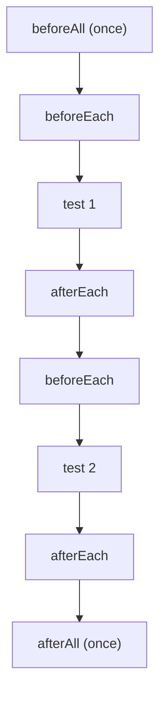

# Prerequisites

## P1 · Checklist before you start

You're ready for today if you can tick all of these. If not, revisit the lesson in brackets.

- [ ] I can open the terminal in `pw-course` and run `npx playwright test --project=chromium` (Day 3 · I4, Day 4 · I2)
- [ ] My `playwright.config.ts` uses `reporter: [['list'], ['html', { open: 'never' }]]` (Day 4 · I1)
- [ ] I can read `async ({ page }) => { … }` as "an async arrow function that destructures `page`" (Day 7 · F3, Day 8 · F1)
- [ ] I know why every browser action needs `await` (Day 8 · F2)
- [ ] I can import a named export from another file (Day 8 · F3)

## P2 · HTML roles — how Playwright "sees" a page

Playwright's recommended way to find elements is the way **users and assistive technologies** (screen readers) see them: by **role** and **accessible name**.

Most HTML elements have a built-in role:

| HTML | Role | Accessible name comes from… |
|---|---|---|
| `<button>Sign in</button>` | `button` | its text → "Sign in" |
| `<a href="/help">Help</a>` | `link` | its text → "Help" |
| `<h1>Dashboard</h1>` (also h2–h6) | `heading` | its text → "Dashboard" |
| `<input type="text">` / `type="email"` with a `<label>` | `textbox` | its label → e.g. "Email" |
| `<input type="checkbox">` | `checkbox` | its label → e.g. "Remember me" |
| `<select>` | `combobox` | its label → e.g. "Course" |
| `<ul>` / `<li>` | `list` / `listitem` | — |
| `<p role="alert">` | `alert` | its text |

So `page.getByRole('button', { name: 'Sign in' })` means: *the button whose accessible name is "Sign in"* — exactly how you'd describe it in a manual test case.

> [!NOTE]
> A **password** input (`type="password"`) has no ARIA role, so `getByRole('textbox')` won't find it — find it by its label instead: `page.getByLabel('Password')`.

```quiz
id: d9-p2-q1
type: single
question: "Which locator finds `<a href=\"/pricing\">See pricing</a>`?"
options:
  - "`page.getByRole('button', { name: 'See pricing' })`"
  - "`page.getByRole('link', { name: 'See pricing' })`"
  - "`page.getByRole('heading', { name: 'pricing' })`"
  - "`page.getByLabel('See pricing')`"
answer: b
explanation: An `<a href>` element has the role `link`, and its accessible name is its text.
```

## P3 · The practice website for Days 9–10

Real websites change, go down, or need a VPN — not ideal for learning. For the next two days you'll test two small **practice pages** that live inside your project as HTML text, and load them with `page.setContent(html)` instead of `page.goto(url)`. Everything you learn works the same on real sites.

Create the file `tests/day9/practice-pages.ts`. It's a normal module (Day 8!) that **exports** two HTML strings. Because its name doesn't end in `.spec.ts`, Playwright won't treat it as a test file.

```ts file=tests/day9/practice-pages.ts mode=editor
// Practice web pages for Days 9–10.
// Each constant holds the HTML of one page. Tests load it with: await page.setContent(loginPage);

// ---------------------------------------------------------------------------
// Page 1: QA Academy sign-in
//   Valid user:   student@qa.academy / Learn@123  → "Signing in…" then (0.8 s later) the Dashboard
//   Empty fields: "Please enter your email and password"
//   Wrong login:  "Invalid email or password"
// ---------------------------------------------------------------------------
export const loginPage = `
<!DOCTYPE html>
<html lang="en">
<head><title>QA Academy - Sign in</title></head>
<body>
  <h1>Sign in to QA Academy</h1>
  <form id="login-form">
    <label for="email">Email</label>
    <input id="email" type="email" placeholder="you@example.com">

    <label for="password">Password</label>
    <input id="password" type="password" placeholder="Your password">

    <label><input id="remember" type="checkbox"> Remember me</label>

    <button type="submit">Sign in</button>
  </form>
  <p id="message" role="alert" data-testid="login-message"></p>

  <script>
    const form = document.getElementById('login-form');
    const message = document.getElementById('message');

    form.addEventListener('submit', (event) => {
      event.preventDefault();
      const email = document.getElementById('email').value.trim();
      const password = document.getElementById('password').value;

      if (email === '' || password === '') {
        message.textContent = 'Please enter your email and password';
      } else if (email === 'student@qa.academy' && password === 'Learn@123') {
        message.textContent = 'Signing in…';
        setTimeout(showDashboard, 800);          // pretend the server is slow
      } else {
        message.textContent = 'Invalid email or password';
      }
    });

    function showDashboard() {
      document.title = 'QA Academy - Dashboard';
      document.body.innerHTML =
        '<h1>Dashboard</h1>' +
        '<p>Welcome back, Student!</p>' +
        '<ul><li>Weeks 1-2 - Fundamentals</li><li>Week 3 - Locators</li><li>Week 4 - Page Objects</li></ul>' +
        '<button id="logout">Log out</button>';
      document.getElementById('logout').addEventListener('click', () => {
        document.title = 'QA Academy - Signed out';
        document.body.innerHTML = '<h1>Signed out</h1><p>See you soon!</p>';
      });
    }
  </script>
</body>
</html>
`;

// ---------------------------------------------------------------------------
// Page 2: QA Academy course enrolment (used in the Day 10 mini-project)
// ---------------------------------------------------------------------------
export const enrolPage = `
<!DOCTYPE html>
<html lang="en">
<head><title>QA Academy - Enrol</title></head>
<body>
  <h1>Enrol in a course</h1>
  <form id="enrol-form">
    <label for="name">Full name</label>
    <input id="name" placeholder="e.g. Asha Verma">

    <label for="enrol-email">Email</label>
    <input id="enrol-email" type="text" placeholder="you@example.com">

    <label for="course">Course</label>
    <select id="course">
      <option value="">-- choose a course --</option>
      <option value="pw">Playwright Basics</option>
      <option value="api">API Testing</option>
      <option value="perf">Performance Testing</option>
    </select>

    <label><input id="terms" type="checkbox"> I accept the terms</label>

    <button type="submit" disabled>Enrol now</button>
  </form>
  <p data-testid="seats">Seats left: 12</p>
  <p id="result" role="status"></p>

  <script>
    let seats = 12;
    const terms = document.getElementById('terms');
    const submit = document.querySelector('button[type=submit]');
    const result = document.getElementById('result');

    // The Enrol button is enabled only while the terms box is ticked
    terms.addEventListener('change', () => {
      submit.disabled = !terms.checked;
    });

    document.getElementById('enrol-form').addEventListener('submit', (event) => {
      event.preventDefault();
      const name = document.getElementById('name').value.trim();
      const email = document.getElementById('enrol-email').value.trim();
      const course = document.getElementById('course');

      if (name === '') { result.textContent = 'Name is required'; return; }
      if (!email.includes('@')) { result.textContent = 'Enter a valid email'; return; }
      if (course.value === '') { result.textContent = 'Please choose a course'; return; }

      seats = seats - 1;
      document.querySelector('[data-testid=seats]').textContent = 'Seats left: ' + seats;
      const courseName = course.options[course.selectedIndex].text;
      const firstName = name.split(' ')[0];
      result.textContent = 'Thanks, ' + firstName + '! You are enrolled in ' + courseName + '.';
    });
  </script>
</body>
</html>
`;
```

> [!TESTER]
> Read the comments at the top of each page like a requirements document. Your tests will check each rule — just as you'd derive manual test cases from requirements.

# Fundamentals

## F1 · Anatomy of a Playwright test

```ts mode=read
import { test, expect } from '@playwright/test';          // 1. import the tools

test('valid user can sign in', async ({ page }) => {      // 2. test(title, async callback)
  await page.setContent(loginPage);                        // 3. ARRANGE — get to the start state
  await page.getByLabel('Email').fill('student@qa.academy');   // 4. ACT — do what a user does
  await page.getByLabel('Password').fill('Learn@123');
  await page.getByRole('button', { name: 'Sign in' }).click();
  await expect(page.getByRole('heading')).toHaveText('Dashboard');   // 5. ASSERT — check the result
});
```

| Part | Meaning |
|---|---|
| `import { test, expect } from '@playwright/test'` | Bring in the test-declaring function and the assertion function |
| `test('valid user can sign in', …)` | Register a test with a **title** that reads like a test-case name |
| `async ({ page }) => { … }` | The test body: an **async** callback. Playwright calls it and passes **fixtures**; we destructure `page` |
| `await page.…` | Each browser step returns a Promise — `await` it |
| `await expect(…).toHaveText(…)` | An **assertion** — the expected result |

The **Arrange → Act → Assert** pattern (also called *Given / When / Then*) keeps tests readable: set up, perform the action, check the outcome.

> [!TIP] Good test titles
> Write titles as behaviour: `'shows an error for a wrong password'`, not `'test2'`. The title is what you'll read in reports at 2 a.m. when something breaks.

```quiz
id: d9-f1-q1
type: single
question: Why is the test body written as `async ({ page }) => { … }`?
options:
  - "`async` makes the test run faster"
  - It's an async callback, so it can use `await`; Playwright passes a fixtures object and `{ page }` destructures the page from it
  - "`page` is a global variable that must be declared this way"
  - It's required by the TypeScript compiler for all functions
answer: b
explanation: The callback must be `async` to use `await`, and `{ page }` picks the page fixture out of the object Playwright passes in.
```

## F2 · Fixtures: tools the runner hands you

**Fixtures** are ready-made objects that Playwright creates **before** your test and cleans up **after** it. You ask for them by name in the callback's parameters.

| Fixture | What you get | Typical use |
|---|---|---|
| `page` | A fresh tab in a fresh context | 95% of UI tests |
| `context` | The browser context that `page` belongs to | Open a second tab, set cookies/permissions |
| `browser` | The shared browser instance | Create extra contexts (multi-user tests), `beforeAll` |
| `browserName` | `'chromium'`, `'firefox'` or `'webkit'` | Browser-specific skips or expectations |
| `request` | An API client — no browser needed | API tests, creating test data via API |

```ts mode=read
test('fixtures demo', async ({ page, context, browserName }) => {
  console.log(`Running on ${browserName}`);
  const secondTab = await context.newPage();   // another tab in the SAME context as page
  // …
});
```

Playwright only creates the fixtures you ask for — and because each test gets its **own** `page` and `context`, tests are isolated from each other (Day 2 · F2).

```quiz
id: d9-f2-q1
type: single
question: A test must check that an admin and a customer see different menus at the same time. Which fixture helps you create two separate sessions?
options:
  - "`browserName`"
  - "`browser` — to create two new contexts"
  - "`request`"
  - Two `page` fixtures in the same test
answer: b
explanation: "`browser.newContext()` twice gives two isolated sessions (admin and customer) in one test — like Day 2's contexts demo."
```

## F3 · Finding elements and acting on them

Week 3 is all about locators. For now, learn the core set.

### Getting to a page

| Method | Use |
|---|---|
| `await page.goto('https://shop.example.com/login')` | Open a URL (with `baseURL` in the config you can write `page.goto('/login')`) |
| `await page.setContent(html)` | Load HTML directly — used for today's practice pages |
| `await page.title()` / `page.url()` | Read the current title / URL |

### Locators — "how to find the element"

Prefer them in this order (user-facing first):

| Locator | Finds… | Example |
|---|---|---|
| `getByRole(role, { name })` | By role + accessible name | `page.getByRole('button', { name: 'Sign in' })` |
| `getByLabel(text)` | Form field by its label | `page.getByLabel('Email')` |
| `getByPlaceholder(text)` | Input by placeholder | `page.getByPlaceholder('you@example.com')` |
| `getByText(text)` | Element by visible text | `page.getByText('Welcome back')` |
| `getByTestId(id)` | By `data-testid` attribute | `page.getByTestId('login-message')` |
| `locator(css)` | By CSS selector (fallback) | `page.locator('#email')` |

Text matching is **case-insensitive and matches part of the text** by default: `getByText('welcome')` finds "Welcome back, Student!". Add `{ exact: true }` for an exact match.

A locator is a **recipe**, not the element itself: creating it doesn't touch the page (so no `await`). The search happens when you act or assert — and that's when auto-waiting kicks in.

```ts mode=read
const signIn = page.getByRole('button', { name: 'Sign in' });   // just a recipe — no await
await signIn.click();                                             // now it finds, waits, clicks
```

### Actions

| Action | Example |
|---|---|
| Click | `await page.getByRole('button', { name: 'Sign in' }).click()` |
| Type into a field (replaces its value) | `await page.getByLabel('Email').fill('student@qa.academy')` |
| Press a key | `await page.getByLabel('Password').press('Enter')` |
| Tick / untick a checkbox | `await page.getByLabel('Remember me').check()` / `.uncheck()` |
| Choose from a `<select>` | `await page.getByLabel('Course').selectOption('API Testing')` |
| Clear a field | `await page.getByLabel('Email').clear()` |

```quiz
id: d9-f3-q1
type: single
question: Which line needs NO `await`?
options:
  - "`page.getByLabel('Email').fill('a@b.com')`"
  - "`const email = page.getByLabel('Email')`"
  - "`page.getByRole('button', { name: 'Save' }).click()`"
  - "`page.setContent(html)`"
answer: b
explanation: Creating a locator only describes how to find the element — it doesn't talk to the browser yet. Actions like fill, click and setContent do, so they're awaited.
```

## F4 · Assertions with `expect`

### Web-first assertions — auto-retrying (use `await`!)

These keep checking the page until the condition is true or the timeout expires (**5 seconds** by default).

**Learn these five now** — they cover most of what a test checks:

1. `await expect(locator).toBeVisible()` — the element is on screen.
2. `await expect(locator).toHaveText('Dashboard')` — its text **equals** this (a regex such as `/Dash/` matches part of it).
3. `await expect(locator).toContainText('Welcome')` — its text **contains** this.
4. `await expect(page).toHaveTitle(/Dashboard/)` — the tab title matches.
5. `await expect(page).toHaveURL(/dashboard/)` — the URL matches.

The others follow the same pattern — open this when you need one:

```reference title="More web-first assertions"
| Assertion | Passes when… |
|---|---|
| `await expect(locator).toBeHidden()` | it's hidden or doesn't exist |
| `await expect(locator).toHaveValue('a@b.com')` | an input's current value is this |
| `await expect(locator).toBeEmpty()` | an input/element has no value or text |
| `await expect(locator).toBeChecked()` | a checkbox/radio is ticked |
| `await expect(locator).toBeEnabled()` / `.toBeDisabled()` | the element is (not) enabled |
| `await expect(locator).toHaveCount(3)` | the locator matches exactly 3 elements |
| `await expect(locator).toHaveAttribute('type', 'email')` | an attribute has this value |
| `await expect(locator).toHaveClass(/active/)` | the class attribute matches |
| `await expect(locator).toBeFocused()` | the element has keyboard focus |
```

Add `.not` to invert: `await expect(page.getByRole('alert')).not.toBeEmpty()`, `await expect(button).not.toBeVisible()`.

### Generic assertions — check a plain value once (no `await`)

For values you already have in a variable — no retrying:

| Assertion | Example |
|---|---|
| `toBe` (strict equal, like `===`) | `expect(total).toBe(3)` |
| `toEqual` (same content — for objects/arrays) | `expect(tags).toEqual(['@smoke', '@login'])` |
| `toContain` | `expect(title).toContain('Academy')` |
| `toBeTruthy` / `toBeFalsy` | `expect(isVisible).toBeTruthy()` |
| `toBeGreaterThan` / `toBeLessThan` | `expect(price).toBeGreaterThan(0)` |
| `toHaveLength` | `expect(items).toHaveLength(3)` |

```ts mode=read
// ❌ Flaky: reads the text ONCE, maybe before the page updated
const text = await page.getByRole('alert').textContent();
expect(text).toBe('Invalid email or password');

// ✅ Reliable: retries until the text matches (up to 5 s)
await expect(page.getByRole('alert')).toHaveText('Invalid email or password');
```

> [!WARNING]
> Prefer **web-first** assertions for anything on the page. Use generic assertions only for plain values (numbers you calculated, arrays, API data).

You can add a custom message that appears in the report when the assertion fails:

```ts mode=read
await expect(page.getByRole('heading'), 'user should land on the dashboard').toHaveText('Dashboard');
```

```quiz
id: d9-f4-q1
type: single
question: After clicking "Sign in" with a wrong password, the page's script shows "Invalid email or password" — on a slow machine this can take a moment. Which assertion is reliable?
options:
  - "`expect(await page.getByRole('alert').textContent()).toBe('Invalid email or password')`"
  - "`await expect(page.getByRole('alert')).toHaveText('Invalid email or password')`"
  - "`expect(page.getByRole('alert')).toHaveText('Invalid email or password')` without await"
  - "`page.waitForTimeout(800)` then a generic toBe"
answer: b
explanation: The web-first assertion retries until it matches. Option A reads the text once (maybe too early). Option C forgets await. Fixed waits (D) are slow and still flaky.
```

```quiz
id: d9-f4-q2
type: single
question: What's the difference between `toHaveText('Welcome')` and `toContainText('Welcome')`?
options:
  - None
  - "`toHaveText` needs the whole text to match; `toContainText` passes if 'Welcome' appears anywhere in it"
  - "`toContainText` is case-sensitive, `toHaveText` isn't"
  - "`toHaveText` only works on headings"
answer: b
explanation: For "Welcome back, Student!", `toContainText('Welcome')` passes but `toHaveText('Welcome')` fails (with a plain string, toHaveText compares the full text).
```

## F5 · Grouping tests and sharing setup: `describe` and hooks

### `test.describe` — a group (like a test suite / folder in a test-management tool)

```ts mode=read
test.describe('Sign in page', () => {
  test('valid user reaches the dashboard', async ({ page }) => { /* … */ });
  test('wrong password shows an error', async ({ page }) => { /* … */ });
});
```

Report titles include the group: `Sign in page › wrong password shows an error`. Groups can be nested.

### Hooks — run code around tests

| Hook | Runs | Gets `page`? | Typical use |
|---|---|---|---|
| `test.beforeEach` | before **each** test in the file/group | ✅ yes | open the page, log in |
| `test.afterEach` | after **each** test | ✅ yes | extra clean-up, logging |
| `test.beforeAll` | **once** before all tests in the file/group (per worker) | ❌ no — use `browser` | expensive one-time setup, e.g. create test data via API |
| `test.afterAll` | **once** after all tests (per worker) | ❌ no | delete test data |



Hooks declared **inside** a `describe` apply only to tests in that group; hooks at the top of the file apply to every test in the file.

> [!NOTE] "Per worker"
> With parallel workers, each worker process runs its **own** `beforeAll`/`afterAll` for the tests it receives. Don't rely on `beforeAll` to share state between tests — each test should be able to run on its own.

```quiz
id: d9-f5-q1
type: single
question: A file has `beforeAll`, `beforeEach` and 3 tests, all run by ONE worker. How many times does each hook run?
options:
  - beforeAll 3, beforeEach 3
  - beforeAll 1, beforeEach 3
  - beforeAll 1, beforeEach 1
  - beforeAll 3, beforeEach 1
answer: b
explanation: beforeAll runs once per worker for the file; beforeEach runs before every test.
```

```quiz
id: d9-f5-q2
type: single
question: "Why does `test.beforeAll(async ({ page }) => { … })` throw an error?"
options:
  - beforeAll cannot be async
  - The `page` fixture is created per test, so it isn't available in beforeAll — use `browser` instead
  - beforeAll must be inside a describe
  - Hooks can't receive fixtures at all
answer: b
explanation: "`page` belongs to a single test. `beforeAll` runs outside any single test, so it can only use worker-level fixtures such as `browser`."
```

# Implementation

## I1 · Your first test from scratch

Make sure `tests/day9/practice-pages.ts` exists (Prerequisites · P3). Now create `tests/day9/first.spec.ts`:

```ts file=tests/day9/first.spec.ts mode=editor run="npx playwright test tests/day9/first.spec.ts --project=chromium --headed"
import { test, expect } from '@playwright/test';
import { loginPage } from './practice-pages';   // our practice page (no .ts needed in test files)

test('valid user can sign in', async ({ page }) => {
  // Arrange: open the sign-in page
  await page.setContent(loginPage);
  await expect(page).toHaveTitle('QA Academy - Sign in');

  // Act: sign in like a user would
  await page.getByLabel('Email').fill('student@qa.academy');
  await page.getByLabel('Password').fill('Learn@123');
  await page.getByRole('button', { name: 'Sign in' }).click();

  // Assert: the dashboard appears (after ~0.8 s — Playwright waits for it)
  await expect(page.getByRole('heading', { name: 'Dashboard' })).toBeVisible();
  await expect(page.getByText('Welcome back')).toBeVisible();
  await expect(page).toHaveTitle(/Dashboard/);
});
```

```bash terminal
npx playwright test tests/day9/first.spec.ts --project=chromium --headed
```

```output terminal
Running 1 test using 1 worker

  ✓  1 [chromium] › tests/day9/first.spec.ts:4:5 › valid user can sign in (1.2s)

  1 passed (1.9s)
```

Watch the browser pane: the form fills in, "Signing in…" shows briefly, then the Dashboard appears.

**Try it:** change `'Learn@123'` to `'learn@123'` (lowercase L) and run again. Read the error — which line failed, what was expected, what was received? Then change it back.

## I2 · A complete suite with `describe`, `beforeEach` and tags

Now test **every rule** of the sign-in page. Opening the page is the same for every test, so it moves into `beforeEach` (lesson F5). The tests also carry **tags** such as `{ tag: '@smoke' }` — labels you'll use to run subsets on Day 10; for now just notice them.

```ts file=tests/day9/login.spec.ts mode=editor run="npx playwright test tests/day9/login.spec.ts --project=chromium"
import { test, expect } from '@playwright/test';
import { loginPage } from './practice-pages';

test.describe('Sign in page', () => {
  // Runs before EACH test in this group: every test starts on a fresh sign-in page
  test.beforeEach(async ({ page }) => {
    await page.setContent(loginPage);
  });

  test('shows the sign-in form', { tag: '@smoke' }, async ({ page }) => {
    await expect(page.getByRole('heading', { name: 'Sign in to QA Academy' })).toBeVisible();
    await expect(page.getByLabel('Email')).toBeEmpty();
    await expect(page.getByPlaceholder('you@example.com')).toHaveAttribute('type', 'email');
    await expect(page.getByRole('button', { name: 'Sign in' })).toBeEnabled();
  });

  test('valid user reaches the dashboard', { tag: '@smoke' }, async ({ page }) => {
    await page.getByLabel('Email').fill('student@qa.academy');
    await page.getByLabel('Password').fill('Learn@123');
    await page.getByRole('button', { name: 'Sign in' }).click();

    await expect(page.getByRole('alert')).toHaveText('Signing in…');
    await expect(page.getByRole('heading', { name: 'Dashboard' })).toBeVisible();
    await expect(page.getByRole('listitem')).toHaveCount(3);   // three course weeks listed
  });

  test('wrong password shows an error', { tag: '@regression' }, async ({ page }) => {
    await page.getByLabel('Email').fill('student@qa.academy');
    await page.getByLabel('Password').fill('wrong-password');
    await page.getByRole('button', { name: 'Sign in' }).click();

    await expect(page.getByRole('alert')).toHaveText('Invalid email or password');
    await expect(page.getByRole('heading', { name: 'Dashboard' })).toBeHidden();
  });

  test('empty form shows a validation message', { tag: '@regression' }, async ({ page }) => {
    await page.getByRole('button', { name: 'Sign in' }).click();
    await expect(page.getByTestId('login-message')).toHaveText('Please enter your email and password');
  });

  test('pressing Enter submits the form', { tag: '@regression' }, async ({ page }) => {
    await page.getByLabel('Email').fill('student@qa.academy');
    await page.getByLabel('Password').fill('Learn@123');
    await page.getByLabel('Password').press('Enter');   // keyboard instead of mouse
    await expect(page.getByRole('heading', { name: 'Dashboard' })).toBeVisible();
  });

  test('remember-me can be ticked and unticked', { tag: '@regression' }, async ({ page }) => {
    const rememberMe = page.getByRole('checkbox', { name: 'Remember me' });   // a locator in a variable
    await expect(rememberMe).not.toBeChecked();
    await rememberMe.check();
    await expect(rememberMe).toBeChecked();
    await rememberMe.uncheck();
    await expect(rememberMe).not.toBeChecked();
  });
});
```

```bash terminal
npx playwright test tests/day9/login.spec.ts --project=chromium
```

```output terminal
Running 6 tests using 4 workers

  ✓  1 [chromium] › tests/day9/login.spec.ts:10:7 › Sign in page › shows the sign-in form @smoke (240ms)
  ✓  2 [chromium] › tests/day9/login.spec.ts:27:7 › Sign in page › wrong password shows an error @regression (260ms)
  ✓  3 [chromium] › tests/day9/login.spec.ts:36:7 › Sign in page › empty form shows a validation message @regression (180ms)
  ✓  4 [chromium] › tests/day9/login.spec.ts:17:7 › Sign in page › valid user reaches the dashboard @smoke (1.1s)
  ✓  5 [chromium] › tests/day9/login.spec.ts:41:7 › Sign in page › pressing Enter submits the form @regression (1.0s)
  ✓  6 [chromium] › tests/day9/login.spec.ts:48:7 › Sign in page › remember-me can be ticked and unticked @regression (150ms)

  6 passed (2.4s)
```

Notice: `fullyParallel: true` lets tests from the same file run at the same time, so they may finish in a different order each run. That's fine — every test is independent thanks to `beforeEach` and fresh pages.

```quiz
id: d9-i2-q1
type: single
question: Why is `await page.setContent(loginPage)` in `beforeEach` and not in a `beforeAll`?
options:
  - "`beforeAll` is slower"
  - "`beforeAll` can't use the `page` fixture, and every test needs its own fresh page anyway"
  - "`beforeEach` runs only once"
  - There is no difference
answer: b
explanation: Each test gets its own new page, so opening the practice page must happen per test — in beforeEach, which also has access to `page`.
```

# Practice

## Quiz · Day 9 check

```quiz
id: d9-pr-q1
type: single
question: Which file names will Playwright pick up as tests in `tests/`? (Choose the best answer)
options:
  - Any .ts file
  - Files ending in .spec.ts or .test.ts
  - Only example.spec.ts
  - Files that start with "test"
answer: b
explanation: That's why `practice-pages.ts` is treated as a normal module, not a test file.
```

```quiz
id: d9-pr-q2
type: single
question: Which assertion checks that an input field contains the text the user typed?
options:
  - "`toHaveText`"
  - "`toHaveValue`"
  - "`toContainText`"
  - "`toHaveTitle`"
answer: b
explanation: An input's typed content is its *value*, not its text. Use `await expect(locator).toHaveValue('…')`.
```

```quiz
id: d9-pr-q6
type: single
question: "`getByText('welcome')` — does it match an element with the text \"Welcome back, Student!\"?"
options:
  - No — it's case-sensitive and needs the whole text
  - Yes — by default text matching is case-insensitive and matches a substring
  - Only if you add `{ exact: true }`
  - Only inside a describe
answer: b
explanation: "Default text matching is case-insensitive and partial. `{ exact: true }` makes it case-sensitive and whole-string."
```

```quiz
id: d9-pr-q8
type: single
question: What is the MAIN purpose of `beforeEach` in a Playwright test file?
options:
  - To run the tests faster
  - To put shared setup (like opening the page) in one place so every test starts from the same state
  - To share a single page between all tests
  - To skip tests
answer: b
explanation: It removes repetition and guarantees each test begins from a known state — while each test still gets its own fresh page.
```

## Exercises

````exercise
id: d9-ex1
title: Test the log-out flow
level: easy
type: code
prompt: |
  Create `tests/day9/logout.spec.ts` with one test, `user can log out`:

  1. Sign in as `student@qa.academy` / `Learn@123`.
  2. Wait for the Dashboard heading.
  3. Click **Log out**.
  4. Assert the heading **Signed out** is visible, the text **See you soon!** is visible, and the title contains `Signed out`.
file: tests/day9/logout.spec.ts
run: npx playwright test tests/day9/logout.spec.ts --project=chromium --headed
hints:
  - "`page.getByRole('button', { name: 'Log out' })`"
  - "`await expect(page).toHaveTitle(/Signed out/)`"
solution: |
  import { test, expect } from '@playwright/test';
  import { loginPage } from './practice-pages';

  test('user can log out', async ({ page }) => {
    // Sign in
    await page.setContent(loginPage);
    await page.getByLabel('Email').fill('student@qa.academy');
    await page.getByLabel('Password').fill('Learn@123');
    await page.getByRole('button', { name: 'Sign in' }).click();
    await expect(page.getByRole('heading', { name: 'Dashboard' })).toBeVisible();

    // Log out
    await page.getByRole('button', { name: 'Log out' }).click();

    // Check the signed-out page
    await expect(page.getByRole('heading', { name: 'Signed out' })).toBeVisible();
    await expect(page.getByText('See you soon!')).toBeVisible();
    await expect(page).toHaveTitle(/Signed out/);
  });
````

````exercise
id: d9-ex2
title: Data-driven sign-in errors
level: medium
type: code
prompt: |
  Use a **loop** (Day 7!) to create one test per row of test data. Create `tests/day9/login-data.spec.ts`:

  ```ts
  const invalidLogins = [
    { email: '', password: '', message: 'Please enter your email and password' },
    { email: 'student@qa.academy', password: '', message: 'Please enter your email and password' },
    { email: 'nobody@qa.academy', password: 'Learn@123', message: 'Invalid email or password' },
    { email: 'student@qa.academy', password: 'learn@123', message: 'Invalid email or password' },
  ];
  ```

  For each row, register a test titled like `rejects "nobody@qa.academy" / "Learn@123"` that fills the fields, clicks **Sign in** and checks the alert text. Put all tests inside `test.describe('Invalid sign-in')` with a `beforeEach` that loads the page.

  Run with `--project=chromium` — you should see **4** tests.
file: tests/day9/login-data.spec.ts
run: npx playwright test tests/day9/login-data.spec.ts --project=chromium
hints:
  - "Put `for (const data of invalidLogins) { test(`rejects ...`, async ({ page }) => { … }); }` inside the describe."
  - Test titles must be unique — including the email and password makes them unique.
  - "`fill('')` is fine for empty fields."
solution: |
  import { test, expect } from '@playwright/test';
  import { loginPage } from './practice-pages';

  // Test data: one row = one test
  const invalidLogins = [
    { email: '', password: '', message: 'Please enter your email and password' },
    { email: 'student@qa.academy', password: '', message: 'Please enter your email and password' },
    { email: 'nobody@qa.academy', password: 'Learn@123', message: 'Invalid email or password' },
    { email: 'student@qa.academy', password: 'learn@123', message: 'Invalid email or password' },
  ];

  test.describe('Invalid sign-in', () => {
    test.beforeEach(async ({ page }) => {
      await page.setContent(loginPage);
    });

    // Create one test per data row
    for (const data of invalidLogins) {
      test(`rejects "${data.email}" / "${data.password}"`, async ({ page }) => {
        await page.getByLabel('Email').fill(data.email);
        await page.getByLabel('Password').fill(data.password);
        await page.getByRole('button', { name: 'Sign in' }).click();
        await expect(page.getByRole('alert')).toHaveText(data.message);
      });
    }
  });
````

## Reflection

1. Name the five parts of a Playwright test (from `import` to `expect`).
2. Which fixture would you use to open a second tab in the same session? And to make two separate logged-in users?
3. Why do web-first assertions need `await` while `expect(total).toBe(3)` does not?

> [!TIP] Coming up on Day 10
> Annotations and tags, what the runner does under the hood (workers, timeouts, retries), filtering from the command line, debugging failures, the HTML report — and your Week 2 mini-project.
