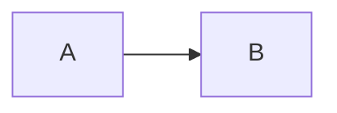

# Course Content Format — Week 1

The **Markdown files are the source of truth**. `tools/build_json.py` converts them into JSON that the course webpage loads. Edit the Markdown, then rebuild the JSON:

```bash
python3 tools/build_json.py          # writes json/day1.json … day5.json and json/week1.json
python3 tools/verify_code.py         # runs every runnable code sample and exercise solution
```

## 1. File layout

```
markdown/day1.md … day5.md   ← author here
json/day1.json … day5.json   ← generated (one per day)
json/week1.json              ← generated (all 5 days in one file)
json/schema.json             ← JSON Schema for the generated files
tools/build_json.py          ← Markdown → JSON converter + validator
tools/verify_code.py         ← runs code samples (needs Node 22.18+ and Playwright)
```

## 2. Structure of one day file

```markdown
---                       ← YAML front matter: day metadata
day: 1
title: Why Playwright & How It Works
...
---

# Prerequisites           ← H1 = section (exactly these four, in this order)
## P1 · How the web works ← H2 = lesson (becomes a page/tab in the UI)
### Sub-heading           ← H3+ stays inside the lesson as normal Markdown
...
# Fundamentals
# Implementation
# Practice
```

Section ids in JSON: `prerequisites`, `fundamentals`, `implementation`, `practice`.
Lesson ids are generated as `d{day}-{section}-{n}` (e.g. `d1-fundamentals-2`).

## 3. Special blocks

Everything that is not one of the blocks below is emitted as a `markdown` block.

### Code for the editor

````markdown
```ts file=tests/day5/login.spec.ts mode=editor run="npx playwright test tests/day5/login.spec.ts --headed"
// code…
```
````

| Attribute | Meaning |
|---|---|
| `file=` | Path relative to the learner's workspace root (`pw-course/`). The UI can pre-create this file in the editor. |
| `mode=editor` | "Open in editor / Try it" block — runnable. |
| `mode=read` | Display only (snippets, partial code, pseudo-code). Default when `mode` is missing. |
| `run="…"` | Command the UI should run in the terminal for this file (cwd = `pw-course/`). |
| `expect=error` | The sample is *supposed* to fail (type error or failing test) — used for teaching. |
| `network=true` | Needs internet (e.g. opens playwright.dev). |

### Terminal commands

````markdown
```bash terminal
npx playwright test --headed
```
````
→ `{ "type": "terminal", "commands": [...] }`. Lines starting with `#` are kept as comments.

### Expected output

````markdown
```output console
Asha is 25
```
````
`console` = exact program output (verified by `verify_code.py`); `terminal` = illustrative terminal output (timings/paths vary). An output block directly after a code block is also attached to that code block as `expectedOutput`.

### Diagrams

````markdown

````
→ `{ "type": "diagram", "format": "mermaid", ... }` — render with mermaid.js.

### Callouts

```markdown
> [!TIP] Optional title
> Body text
```
Variants: `TIP`, `NOTE`, `WARNING`, `TESTER` (manual tester's lens — links the idea to manual-testing experience), `DEEPDIVE` (optional, for curious learners), `PLATFORM` (note for the course platform developers; hide from learners).

### Quiz (inline or in Practice)

````markdown
```quiz
id: d1-q1
type: single            # single | multiple | truefalse
question: Which engine powers Safari?
options:
  - Blink
  - WebKit
  - Gecko
answer: b               # letter(s) by option position; list for multiple: [a, c]; true/false for truefalse
explanation: Safari is built on WebKit.
```
````

### Exercise (mostly in Practice)

````markdown
```exercise
id: d3-ex1
title: Build a tester profile
level: easy             # easy | medium | hard | challenge
type: code              # code | terminal | written | predict
prompt: |
  What the learner must do (Markdown allowed).
file: ts-basics/day3/ex1.ts
run: node day3/ex1.ts   # cwd for ts-basics exercises is pw-course/ts-basics
starter: |
  // starting code shown in the editor
hints:
  - First hint
solution: |
  // model solution
expectedOutput: |
  exact console output of the solution
```
````
In JSON the exercise kind is stored as `exerciseType` (the block `type` is always `exercise`). `written` exercises use `modelAnswer` instead of `solution`. `predict` exercises show `code` and reveal `answer`.

## 4. Learner workspace assumed by the content

```
pw-course/                 ← created on Day 2 by `npm init playwright@latest`
├── package.json
├── playwright.config.ts
├── tests/
│   ├── example.spec.ts
│   ├── day1/ …            ← Day 1 demo tests (pre-loaded by the platform)
│   └── day5/ …
└── ts-basics/             ← created on Day 3 (own package.json with "type": "module")
    ├── package.json
    ├── day3/ …
    └── day4/ …
```

## 5. Platform requirements (from the content)

- Node.js 22.18+ (or 24.x / 26.x) in the runtime — Day 3–4 run `.ts` files directly with `node file.ts` (built-in type stripping).
- Playwright browsers installed (`npx playwright install`) — Chromium at minimum; Firefox + WebKit for the cross-browser lessons.
- **Day 1 runs before learners install anything** → pre-load a workspace with Playwright and the Day 1 demo tests (`tests/day1/*.spec.ts`).
- The "custom browser" pane should show the headed browser (or a screencast of it) when commands include `--headed`.
- Internet access is needed only for blocks marked `network=true` (they open playwright.dev). Everything else uses `page.setContent()` and runs offline.
