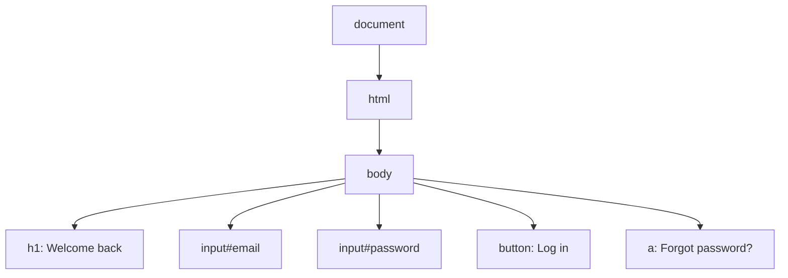
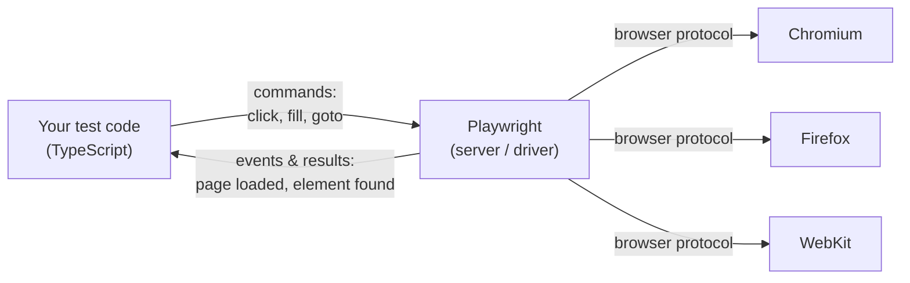
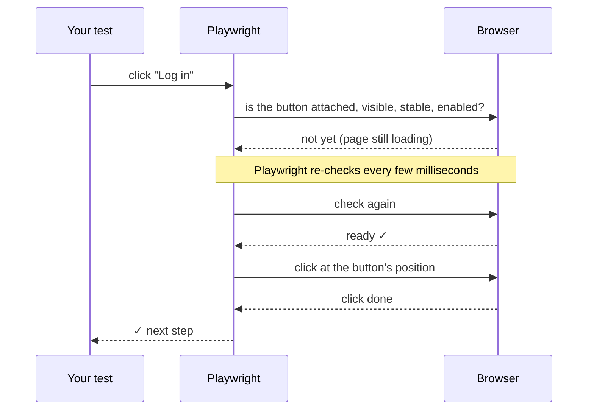
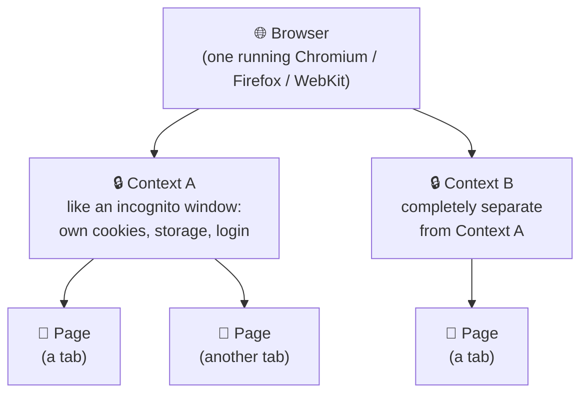

# Prerequisites

## P1 · Manual testing vs test automation

You already know how to test software. You read a requirement, write test cases, open the application, click through the steps and compare what you see with what you expected.

**Test automation** means writing those same steps as a script so that a computer can repeat them — fast, the same way every time, as often as you like.

| | Manual testing | Automated testing |
|---|---|---|
| Who performs the steps | A human tester | A script run by a tool |
| Speed | Minutes per test case | Seconds per test case |
| Repeating the same test 100 times | Tiring and error-prone | Easy — same result every time |
| Finding *new*, unexpected problems | Excellent (human judgement) | Weak — only checks what it was told |
| Cost | Low to start, high over time | Higher to start, low over time |

> [!TESTER] Automation does not replace you
> Automation takes over the *repetitive checking* (e.g. the 200 regression test cases you run before every release). That frees you for exploratory testing, usability checks and edge cases — work that needs a human brain. The best automation engineers are former manual testers, because they already know **what** to test.

### What is worth automating?

Good candidates:

- **Regression tests** — features that already work and must keep working after every change
- **Smoke tests** — the "is the app alive?" checks after every deployment (login, home page, search)
- **Data-heavy tests** — the same form tested with 50 different inputs
- **Cross-browser checks** — the same flow on Chrome, Firefox and Safari

Poor candidates:

- Features that change every week (the script breaks every week)
- One-time tests you will never run again
- "Does this *look* nice?" judgements
- Exploratory testing

```quiz
id: d1-p1-q1
type: multiple
question: Your team releases every two weeks. Which of these are GOOD candidates for automation? (Select all that apply)
options:
  - Login with valid and invalid credentials, checked before every release
  - Checking whether the new banner design "feels modern"
  - Registration form tested with 40 combinations of input data
  - A one-time data migration check that will never be repeated
answer: [a, c]
explanation: Repeated checks (login before every release) and data-driven checks (40 input combinations) give the best return. Visual "feel" needs human judgement, and a one-time check is not worth scripting.
```

## P2 · How a web page is built

Playwright controls web pages, so you need a basic picture of what a web page is made of. You do **not** need to be a web developer.

### Step 1 — The browser asks, the server answers

When you type a URL such as `https://shop.example.com/login` and press Enter:

1. The browser sends a **request** to the server at `shop.example.com`
2. The server sends back a **response** — mostly an **HTML** document
3. The browser reads the HTML and draws (renders) the page you see

### Step 2 — HTML is made of elements

HTML describes *what is on the page* using **tags**. Here is a tiny login page:

```html mode=read
<h1>Welcome back</h1>

<label for="email">Email</label>
<input id="email" type="email" placeholder="you@example.com">

<label for="password">Password</label>
<input id="password" type="password">

<button class="btn-primary">Log in</button>
<a href="/forgot">Forgot password?</a>
```

| Piece | Example | What it means |
|---|---|---|
| **Tag / element** | `<button>…</button>` | A thing on the page: button, input, link, heading |
| **Text** | `Log in` | What the user reads |
| **Attribute** | `id="email"`, `type="password"`, `class="btn-primary"` | Extra information about the element |
| **id** | `id="email"` | A (usually) unique name for one element |
| **class** | `class="btn-primary"` | A style group — many elements can share it |

### Step 3 — The DOM is the live tree

When the browser reads the HTML it builds the **DOM (Document Object Model)** — a live, tree-shaped copy of the page in memory. JavaScript on the page can change the DOM at any time (show a popup, add a row to a table, display "Login failed").



Automation tools like Playwright find elements in this tree (for example "the **button** whose text is **Log in**") and act on them, just as you would with a mouse and keyboard.

> [!TIP] Try it in any browser
> Right-click any element on a web page and choose **Inspect**. The Developer Tools panel opens and highlights that element in the DOM. This is the single most useful habit for an automation tester.

```quiz
id: d1-p2-q1
type: single
question: "In `<input id=\"email\" type=\"email\" placeholder=\"you@example.com\">`, what is `placeholder`?"
options:
  - A tag
  - An attribute
  - The visible text of a button
  - The DOM
answer: b
explanation: "`input` is the tag (element). `id`, `type` and `placeholder` are attributes — extra information about that element."
```

```quiz
id: d1-p2-q2
type: truefalse
question: The DOM can change after the page has loaded — for example when an error message appears after you click "Log in".
answer: true
explanation: The DOM is live. JavaScript adds, removes and changes elements all the time. This is exactly why automation tools must be good at *waiting* for elements — a key Playwright strength.
```

## P3 · Browsers, engines, headed and headless

Every browser has an **engine** that turns HTML into the page you see. There are three main engine families today:

| Engine | Browsers built on it | Playwright name |
|---|---|---|
| **Chromium** (Blink) | Google Chrome, Microsoft Edge, Opera, Brave | `chromium` |
| **Gecko** | Mozilla Firefox | `firefox` |
| **WebKit** | Apple Safari (Mac, iPhone, iPad) | `webkit` |

If your app works in one browser of each family, it will very likely work in all the browsers built on that family. That is why Playwright ships exactly these three: **Chromium, Firefox and WebKit**.

### Headed vs headless

- **Headed** — the browser window is visible on screen. Great for learning and debugging.
- **Headless** — the browser runs *without* a visible window. Faster, and the normal way to run tests on build servers (CI).

Same browser, same behaviour — the only difference is whether a window is drawn.

```quiz
id: d1-p3-q1
type: single
question: A user reports a bug that only happens on iPhone Safari. Which Playwright browser would you use to reproduce it?
options:
  - chromium
  - firefox
  - webkit
answer: c
explanation: Safari (desktop and iOS) is built on the WebKit engine, so `webkit` is the closest match.
```

## P4 · Words you will hear all week

| Term | Plain-English meaning |
|---|---|
| **Script** | A file of instructions a computer runs |
| **Framework** | A ready-made structure + tools you build your tests inside |
| **Library** | A package of ready-made code you call from your own code |
| **Test runner** | The program that finds your tests, runs them and reports pass/fail |
| **Assertion** | An automated "expected result" check, e.g. *the title should be "Dashboard"* |
| **Locator** | The way a test finds an element, e.g. *the button named "Log in"* |
| **Flaky test** | A test that sometimes passes and sometimes fails without any code change — usually a timing problem |
| **CI (Continuous Integration)** | A server that automatically runs your tests whenever developers push code |
| **Node.js** | The program that runs JavaScript/TypeScript outside a browser (you install it on Day 2) |
| **TypeScript** | JavaScript + types. The language we write Playwright tests in (Days 3–4) |

> [!TESTER] Test case → automated test
> A manual test case has **steps** and **expected results**. In automation, steps become **actions** (click, fill, go to URL) and expected results become **assertions**. You already think this way.

# Fundamentals

## F1 · What is Playwright?

**Playwright** is a free, open-source framework for testing web applications end-to-end. It opens real browsers, performs the actions a user would perform, and checks the results.

Key facts:

- Created by **Microsoft**, first released in **January 2020**, open source (Apache 2.0 licence)
- Built by engineers who had earlier created **Puppeteer** (Google's Chrome automation library) — Playwright extends that idea to *all* major browser engines
- Works with **Chromium, Firefox and WebKit** on **Windows, macOS and Linux**, headed or headless, locally or in CI
- Can **emulate mobile devices** (screen size, touch, user agent) for Chrome on Android and Mobile Safari
- Available in **JavaScript/TypeScript, Python, Java and .NET (C#)** — in this course we use **TypeScript**

### Two parts: the library and the test runner

When people say "Playwright" they usually mean **Playwright Test** — the package `@playwright/test`. It bundles everything you need in one install:

| Part | What it does |
|---|---|
| **Browser automation** | Launch browsers, open pages, click, type, navigate |
| **Test runner** | Finds test files, runs them (in parallel), retries, times out slow tests |
| **Assertions** (`expect`) | Checks results, with automatic re-trying |
| **Fixtures** | Gives every test a fresh, ready-to-use browser page |
| **Reporters** | Terminal output and an interactive HTML report |
| **Tools** | Codegen (records your clicks as code), UI Mode, Trace Viewer, Inspector |

> [!NOTE]
> With older tools (e.g. Selenium in JavaScript) you had to combine several packages yourself: a browser driver, a test runner such as Mocha or Jest, an assertion library and a reporting plugin. Playwright Test ships all of these together, already wired up.

```quiz
id: d1-f1-q1
type: single
question: Which package gives you Playwright's test runner, assertions and fixtures together?
options:
  - "`playwright-browser`"
  - "`@playwright/test`"
  - "`selenium-webdriver`"
  - "`puppeteer`"
answer: b
explanation: "`@playwright/test` (\"Playwright Test\") bundles the runner, `expect` assertions, fixtures and reporters. It is what `npm init playwright@latest` installs on Day 2."
```

## F2 · Architecture — how Playwright talks to the browser

### The big picture

Every Playwright test involves three players:



1. **Your test code** says *what* should happen: "go to the login page, fill the email, click Log in".
2. **Playwright** (often called the *server* or *driver*) translates each command into the language the browser understands and sends it.
3. **The browser** performs the action and reports back: the page loaded, the element exists, the click happened, the text changed.

### The key idea: one open line, not one letter per command

Older tools such as classic **Selenium WebDriver** send each command as a separate HTTP request — like posting a letter for every instruction and waiting for the reply before sending the next one.

Playwright keeps **one persistent, two-way connection** open for the whole session (a pipe when it launches the browser itself, or a WebSocket when it connects to a remote browser). It is like being on a phone call with the browser:

- Playwright can send commands quickly, one after another
- The browser can **push events back at any moment** — "a new page opened", "the network request finished", "a dialog appeared"

Because every message over this open line is fast, Playwright can check "is the element ready yet?" many times per second before acting, and it also hears about navigations, dialogs and network activity as they happen. That's the foundation for **auto-waiting** (see F4).



### Which "language" does Playwright speak to each browser?

| Browser | How Playwright talks to it |
|---|---|
| Chromium (Chrome, Edge) | **Chrome DevTools Protocol (CDP)** — the same low-level protocol Chrome's own DevTools uses |
| Firefox | A Playwright-patched Firefox build with its own automation protocol |
| WebKit | A Playwright-patched WebKit build with its own automation protocol |

This is why Playwright **downloads its own browser builds** during installation (`npx playwright install`). Each Playwright version is tested against specific browser versions, so everything matches.

> [!DEEPDIVE] A little more precisely
> In Python, Java and .NET, your test talks to a separate Playwright driver process (written in Node.js). In Node.js/TypeScript the Playwright client and server run together in your test's process, and the server talks to the browser directly — for a locally launched Chromium over a pipe (`--remote-debugging-pipe`), for a remote browser over a WebSocket. Either way the idea is the same: a persistent, message-based connection — not one HTTP request per command. Low-level protocols like CDP are also what make features such as network interception, console-log capture and trace recording possible without extra plugins.

```quiz
id: d1-f2-q1
type: single
question: How does Playwright wait for elements without fixed sleeps?
options:
  - It adds a fixed 5-second sleep before every action
  - Before each action it checks the element is ready (attached, visible, stable, enabled…) and quickly re-checks until it is — cheap to do over its fast, persistent connection
  - It runs the test code inside the web page itself
  - It takes a screenshot and compares pixels before every click
answer: b
explanation: "Playwright runs readiness (actionability) checks and retries them rapidly, acting the moment the element is ready. The persistent connection makes those repeated checks fast, and also lets Playwright hear about navigations, dialogs and network events as they happen."
```

```quiz
id: d1-f2-q2
type: truefalse
question: Playwright uses the Chrome DevTools Protocol (CDP) to control Chromium-based browsers.
answer: true
explanation: For Chromium, Playwright speaks CDP. For Firefox and WebKit it uses Playwright-patched browser builds with their own automation protocols.
```

## F3 · Browser → Context → Page

Inside the browser, Playwright organises everything in three layers. You will use these words every single day.



| Layer | Real-life analogy | What it holds |
|---|---|---|
| **Browser** | The Chrome application running on your laptop | The browser process itself |
| **Context** | A brand-new **incognito window** | Its own cookies, local storage, session, permissions — shares **nothing** with other contexts |
| **Page** | A **tab** inside that window | One web page you interact with: URL, elements, clicks |

### Why contexts matter so much

Starting a whole new browser is slow (about a second). Creating a new **context** takes only milliseconds, yet it is just as clean — no leftover cookies, no logged-in user from the previous test.

So Playwright Test gives **every test its own fresh context and page**:

1. Start the browser (once, reused)
2. Test 1 → new context → new page → run → context thrown away
3. Test 2 → new context → new page → run → context thrown away

Result: tests **cannot affect each other**, and they can safely run **in parallel**.

> [!TESTER] Why this matters to a manual tester
> You have probably seen "it worked when I tested it, but failed when you tested it" because of a leftover login session or cached data. Contexts give every automated test a perfectly clean browser, every time — like testing each case in a new incognito window.

You will see code like this later in the course (read-only for now — just spot the three layers):

```ts mode=read
import { chromium } from 'playwright';

const browser = await chromium.launch();        // 1. Browser: start Chromium
const context = await browser.newContext();     // 2. Context: a fresh "incognito window"
const page = await context.newPage();           // 3. Page: a tab inside it

await page.goto('https://playwright.dev');      // use the tab
await browser.close();                          // close everything
```

> [!NOTE]
> In Playwright **Test** you almost never write those first three lines yourself. The runner creates the browser, context and page for you and hands the page to your test. You will see this on Day 5 as `async ({ page }) => { … }`.

```quiz
id: d1-f3-q1
type: single
question: Two tests run at the same time. Test A logs in as "admin". Why does Test B NOT see the admin session?
options:
  - Because Playwright deletes all cookies from your computer before each test
  - Because each test gets its own browser context, which has separate cookies and storage
  - Because Test B uses a different browser engine
  - Because Playwright runs only one test at a time
answer: b
explanation: Each test gets a fresh context — like a new incognito window. Cookies, storage and sessions are never shared between contexts.
```

```quiz
id: d1-f3-q2
type: single
question: Which layer represents a single browser TAB?
options:
  - Browser
  - Context
  - Page
answer: c
explanation: A Page is one tab. A Context can hold several pages (useful for tests that open a link in a new tab).
```

## F4 · The features that make Playwright stand out

### 1. Auto-waiting

Before every action Playwright automatically checks that the element is **ready**: it is attached to the page, visible, not moving (animation finished), enabled, and not covered by another element. Only then does it click or type. If the element never becomes ready, the step fails after a timeout with a clear message.

No more `sleep(5000)` "just in case" waits — the #1 cause of slow and flaky tests.

### 2. Web-first assertions

Checks such as "the heading should say *Welcome*" **retry automatically** until they pass or a timeout is reached (5 seconds by default). If the text appears after 1.2 seconds, the check passes at 1.2 seconds.

### 3. Cross-browser with one code base

The *same* test runs on Chromium, Firefox and WebKit. You choose browsers in one configuration file — the tests don't change.

### 4. Isolation and parallel execution

Fresh context per test (F3) + multiple **workers** running test files at the same time = fast, independent tests. No extra "grid" server is needed to run in parallel on one machine.

### 5. Built-in tooling

| Tool | What it helps with |
|---|---|
| **Codegen** (`npx playwright codegen`) | Records your clicks in a browser and writes the test code for you |
| **UI Mode** (`--ui`) | A visual window to run, watch and time-travel through tests |
| **Inspector / debug mode** (`--debug`) | Step through a test one action at a time |
| **Trace Viewer** | A full recording of a test run: every action, DOM snapshots, network calls, console logs |
| **HTML report** | A web page with results, errors and attachments after every run |

### 6. Beyond clicking

Network interception and API mocking, API testing without a browser (`request`), mobile device emulation, geolocation and permissions, multiple tabs and users in one test, file uploads/downloads, screenshots and videos.

```quiz
id: d1-f4-q1
type: single
question: A "Success" message appears 3 seconds after clicking Save. With Playwright's default settings, what happens when you assert the message is visible?
options:
  - The assertion fails immediately because the message is not there yet
  - The assertion keeps retrying and passes as soon as the message appears (within the 5-second default)
  - You must add `sleep(3000)` before the assertion
  - Playwright refreshes the page until the message appears
answer: b
explanation: Web-first assertions retry until the condition is true or the timeout (5 s by default) runs out. The message appears at ~3 s, so the assertion passes then.
```

```quiz
id: d1-f4-q2
type: single
question: Which Playwright tool records your manual clicks and writes the test code for you?
options:
  - Trace Viewer
  - Codegen
  - HTML reporter
  - Workers
answer: b
explanation: "`npx playwright codegen <url>` opens a browser, records what you do and generates the matching code. It's a great learning aid (and you'll still need to review and tidy the generated code)."
```

## F5 · Why Playwright? Comparing the main tools

### Playwright vs Selenium vs Cypress

| | **Playwright** | **Selenium WebDriver** | **Cypress** |
|---|---|---|---|
| First released | 2020 (Microsoft) | 2004 (started at ThoughtWorks, now an open-source project) | 2017 (Cypress.io) |
| Languages | JS/TS, Python, Java, .NET | Java, Python, C#, JS, Ruby and more | JS/TS only |
| How it controls the browser | Persistent connection (CDP / patched browser protocols) | W3C WebDriver over HTTP via a browser driver (plus newer WebDriver BiDi) | Runs *inside* the browser alongside your app |
| Browsers | Chromium, Firefox, WebKit | Chrome, Edge, Firefox, Safari (real branded browsers) | Chrome-family, Firefox, Electron; WebKit experimental |
| Waiting | Automatic for actions and assertions | Mostly manual (explicit waits) | Automatic retries |
| Parallel runs | Built in (workers) + sharding across machines, free | Via the test runner (TestNG, JUnit 5, pytest-xdist…); Selenium Grid to spread across many machines | Via paid cloud service or third-party tools |
| Multiple tabs / users | Yes (pages and contexts) | Yes (window handles) | Very limited |
| Built-in test runner | Yes | No — pair with TestNG, JUnit, pytest, Mocha… | Yes |
| Community & age | Younger, growing very fast | Largest, most mature | Large JS community |

### When would you still choose something else?

Playwright is not the best answer to everything. Be honest about its limits:

- **Native mobile apps** (Android/iOS apps from the app store) — Playwright tests *web* apps only. Use Appium or similar.
- **Very old browsers** such as Internet Explorer — not supported.
- **Real branded Safari** — Playwright's WebKit is very close to Safari but is not the exact Safari app. (Real branded **Chrome** and **Edge** *can* be used via the `channel` option.)
- **An existing large Selenium suite** in Java with a skilled team — migrating everything may not be worth it. Many companies run both.
- **Desktop applications** (Windows/Mac apps) — out of scope.

> [!TESTER] Interview tip
> A strong answer to *"Why Playwright over Selenium?"* names concrete things: auto-waiting (fewer flaky tests), browser contexts (fast isolation), built-in parallelism and reporting, one API for three engines, and tools like Codegen and Trace Viewer. Then add one honest limitation — interviewers like balance.

```quiz
id: d1-f5-q1
type: single
question: Your company needs to automate its Android banking APP downloaded from the Play Store. Is Playwright the right tool?
options:
  - Yes — Playwright's mobile emulation covers native apps
  - No — Playwright automates web applications; a native-app tool such as Appium fits better
  - Yes, but only with the webkit browser
answer: b
explanation: Mobile *emulation* in Playwright means making a desktop browser behave like a phone browser (screen size, touch, user agent). It cannot drive native Android/iOS apps.
```

```quiz
id: d1-f5-q2
type: multiple
question: Which statements about Selenium and Playwright are correct? (Select all that apply)
options:
  - Selenium supports more programming languages than Playwright
  - Playwright includes its own test runner and HTML reporter
  - Selenium automatically waits for every element before every action, exactly like Playwright
  - Playwright can run tests in parallel on one machine without an extra grid server
answer: [a, b, d]
explanation: "Selenium supports more languages and is older and very mature. Playwright bundles its own runner and reporters and runs tests in parallel with workers (Selenium can also run in parallel on one machine, but through a separate test runner). Selenium mostly relies on explicit waits that you write yourself, so option C is false."
```

## F6 · Why Playwright is called "the future of automation"

Playwright has become one of the most popular end-to-end testing tools in only a few years. The reasons are practical:

1. **Built for modern web apps.** Today's apps (React, Angular, Vue…) change the page constantly without full reloads. Auto-waiting and web-first assertions were designed for exactly this.
2. **Fewer flaky tests.** Flaky tests destroy trust in automation. Removing manual sleeps and giving every test a clean context attacks the two biggest causes: timing and shared state.
3. **Speed.** Parallel workers and lightweight contexts make large suites finish much faster, which matters when tests run on every code change in CI.
4. **One tool, many kinds of testing.** UI tests, API tests, mobile-viewport tests, visual comparisons and network mocking — all with the same API and report.
5. **AI-ready.** Playwright now ships an **MCP server** and **test agents** that let AI assistants open browsers, explore apps, and help plan, generate and repair tests. The AI still needs a tester who knows what "correct" looks like — that is you.
6. **Active development.** Microsoft releases a new version roughly every month or two with new features and updated browsers. (At the time of writing the current line is 1.6x — always check the release notes.)

> [!NOTE]
> "Future of automation" does not mean the other tools disappear. It means the skills you learn here — thinking in actions and assertions, reliable locators, isolated tests, reading reports — are in high demand and transfer to any modern tool.

```quiz
id: d1-f6-q1
type: single
question: Which problem do auto-waiting AND fresh browser contexts both help reduce?
options:
  - Licence costs
  - Flaky tests
  - The number of test cases you need to write
  - Browser download size
answer: b
explanation: Auto-waiting removes timing problems; fresh contexts remove shared-state problems. Timing and shared state are the two biggest causes of flaky tests.
```

# Implementation

## I1 · Turn a manual test case into automation steps

Before writing any code, automation engineers translate a manual test case into **actions** and **assertions**. Let's do it for a real-world example.

**Manual test case TC-101 — Successful login**

| # | Step | Expected result |
|---|---|---|
| 1 | Open `https://shop.example.com/login` | Login page shows heading "Welcome back" |
| 2 | Enter `asha@example.com` in Email | — |
| 3 | Enter `Secret@123` in Password | — |
| 4 | Click **Log in** | Dashboard opens; URL contains `/dashboard` |
| 5 | — | Text "Hello, Asha" is visible |

**Translated into Playwright thinking**

| Manual step | Type | Playwright action / assertion (plain English) |
|---|---|---|
| Open the login URL | Action | *go to* `https://shop.example.com/login` |
| Heading "Welcome back" shows | Assertion | *expect* heading "Welcome back" *to be visible* |
| Enter email | Action | *fill* the **Email** field with `asha@example.com` |
| Enter password | Action | *fill* the **Password** field with `Secret@123` |
| Click Log in | Action | *click* the **button** named "Log in" |
| URL contains /dashboard | Assertion | *expect* page URL *to contain* `/dashboard` |
| "Hello, Asha" visible | Assertion | *expect* text "Hello, Asha" *to be visible* |

And here is what that becomes in Playwright code. Don't worry about the syntax yet — by Day 5 you will write this yourself. For now, notice how closely it matches the table:

```ts mode=read
import { test, expect } from '@playwright/test';

test('TC-101 successful login', async ({ page }) => {
  await page.goto('https://shop.example.com/login');                                   // open URL
  await expect(page.getByRole('heading', { name: 'Welcome back' })).toBeVisible();     // check heading

  await page.getByLabel('Email').fill('asha@example.com');                             // enter email
  await page.getByLabel('Password').fill('Secret@123');                                // enter password
  await page.getByRole('button', { name: 'Log in' }).click();                          // click Log in

  await expect(page).toHaveURL(/dashboard/);                                           // URL check
  await expect(page.getByText('Hello, Asha')).toBeVisible();                           // welcome text
});
```

> [!TESTER]
> Notice that Playwright finds elements the way a **user** describes them — "the button named *Log in*", "the field labelled *Email*" — not by technical ids. That makes tests easier to read and more robust when developers change the page's internals.

```quiz
id: d1-i1-q1
type: single
question: In the code above, which line is an ASSERTION (an expected result)?
options:
  - "`await page.getByLabel('Email').fill('asha@example.com');`"
  - "`await page.getByRole('button', { name: 'Log in' }).click();`"
  - "`await expect(page).toHaveURL(/dashboard/);`"
  - "`await page.goto('https://shop.example.com/login');`"
answer: c
explanation: "Lines that start with `expect(...)` are assertions — they check an expected result. `goto`, `fill` and `click` are actions."
```

## I2 · Watch auto-waiting in action

> [!PLATFORM]
> Day 1 runs before learners install anything. Pre-load a workspace that already has Playwright installed (`npm init playwright@latest`) and the three files `tests/day1/auto-wait.spec.ts`, `tests/day1/contexts.spec.ts` and `tests/day1/browsers.spec.ts` from this lesson.

Your workspace already contains a demo test. It opens a practice "Checkout" page where the **Pay now** button only appears **2 seconds** after the page loads — just like a real page waiting for a payment service.

The test does **not** contain any "wait 2 seconds" instruction. Watch what happens.

```ts file=tests/day1/auto-wait.spec.ts mode=editor run="npx playwright test tests/day1/auto-wait.spec.ts --project=chromium --headed"
import { test, expect } from '@playwright/test';

// A tiny practice page. The "Pay now" button is added 2 seconds after the page loads.
const checkoutPage = `
  <h1>Checkout</h1>
  <p id="status">Loading payment options…</p>
  <script>
    setTimeout(() => {
      document.getElementById('status').textContent = 'Ready to pay';
      const button = document.createElement('button');
      button.textContent = 'Pay now';
      button.onclick = () => {
        document.getElementById('status').textContent = 'Payment successful';
      };
      document.body.appendChild(button);
    }, 2000);
  </script>
`;

test('Playwright waits for the Pay now button by itself', async ({ page }) => {
  // Load the practice page into the browser tab
  await page.setContent(checkoutPage);

  // Click the button — it does not exist yet! Playwright waits until it appears.
  await page.getByRole('button', { name: 'Pay now' }).click();

  // Check the result — this assertion also retries automatically
  await expect(page.locator('#status')).toHaveText('Payment successful');
});
```

Press **Run** (or type the command in the terminal):

```bash terminal
npx playwright test tests/day1/auto-wait.spec.ts --project=chromium --headed
```

```output terminal
Running 1 test using 1 worker

  ✓  1 [chromium] › tests/day1/auto-wait.spec.ts:20:5 › Playwright waits for the Pay now button by itself (2.3s)

  1 passed (3.1s)
```

**What to observe**

1. In the browser pane you see "Loading payment options…" for about 2 seconds.
2. The button appears, is clicked immediately, and the text changes to "Payment successful".
3. The test took a little over 2 seconds — Playwright waited *exactly as long as needed*, not a fixed amount.

### Experiment

In the editor, change `2000` (2 seconds) to `8000` and run again. The test still passes — the default *action* wait is generous. Now change it to `40000` (40 seconds) and run once more: the test fails after 30 seconds with a **timeout** message, because Playwright Test's default time limit for a whole test is 30 seconds. Change it back to `2000` when you're done.

```quiz
id: d1-i2-q1
type: single
question: The demo test passed even though the button appeared 2 seconds late. Why?
options:
  - The test contains a hidden 2-second sleep
  - Playwright auto-waits for the element to be ready before clicking
  - The browser loads pages faster in headed mode
  - "`setContent` waits 5 seconds for every page"
answer: b
explanation: Playwright's actions auto-wait until the element exists, is visible, stable and enabled. It clicked as soon as the button was ready.
```

## I3 · See contexts keep users apart

This demo creates **two contexts** from the same browser — imagine two different customers on two different devices — and proves they don't share anything.

```ts file=tests/day1/contexts.spec.ts mode=editor run="npx playwright test tests/day1/contexts.spec.ts --project=chromium"
import { test, expect } from '@playwright/test';

// A page that prints the browser language and window width
const whoAmIPage = `
  <h1 id="info"></h1>
  <script>
    document.getElementById('info').textContent =
      navigator.language + ' | ' + window.innerWidth + 'px wide';
  </script>
`;

test('two contexts behave like two different devices', async ({ browser }) => {
  // Context 1: a laptop user in India
  const laptopUser = await browser.newContext({ locale: 'en-IN', viewport: { width: 1280, height: 720 } });
  // Context 2: a phone-sized user in France
  const phoneUser = await browser.newContext({ locale: 'fr-FR', viewport: { width: 390, height: 844 } });

  // One tab (page) in each context
  const laptopPage = await laptopUser.newPage();
  const phonePage = await phoneUser.newPage();
  await laptopPage.setContent(whoAmIPage);
  await phonePage.setContent(whoAmIPage);

  // Each context has its own settings
  await expect(laptopPage.locator('#info')).toHaveText('en-IN | 1280px wide');
  await expect(phonePage.locator('#info')).toHaveText('fr-FR | 390px wide');

  await laptopUser.close();
  await phoneUser.close();
});

test('cookies in one context are invisible to another', async ({ browser }) => {
  const customerA = await browser.newContext();
  const customerB = await browser.newContext();

  // Customer A "logs in" — we store a login cookie in context A only
  await customerA.addCookies([{ name: 'session', value: 'asha-logged-in', url: 'https://shop.example.com' }]);

  const cookiesA = await customerA.cookies();
  const cookiesB = await customerB.cookies();
  console.log('Customer A has', cookiesA.length, 'cookie(s)');
  console.log('Customer B has', cookiesB.length, 'cookie(s)');

  expect(cookiesA).toHaveLength(1); // A is logged in
  expect(cookiesB).toHaveLength(0); // B is NOT — contexts share nothing

  await customerA.close();
  await customerB.close();
});
```

```bash terminal
npx playwright test tests/day1/contexts.spec.ts --project=chromium
```

```output terminal
Running 2 tests using 2 workers

[chromium] › tests/day1/contexts.spec.ts:32:5 › cookies in one context are invisible to another
Customer A has 1 cookie(s)
Customer B has 0 cookie(s)

  ✓  1 [chromium] › tests/day1/contexts.spec.ts:12:5 › two contexts behave like two different devices (410ms)
  ✓  2 [chromium] › tests/day1/contexts.spec.ts:32:5 › cookies in one context are invisible to another (95ms)

  2 passed (1.4s)
```

> [!NOTE]
> Here the test receives `browser` (not `page`) and builds its own contexts — useful for multi-user scenarios such as "an admin approves a request that a customer submitted". In most tests you'll simply use the ready-made `page`.

## I4 · One test, three browsers

The last demo is a single test. You'll run it once — and Playwright will run it on **all three engines**, because the project configuration lists Chromium, Firefox and WebKit.

```ts file=tests/day1/browsers.spec.ts mode=editor run="npx playwright test tests/day1/browsers.spec.ts"
import { test, expect } from '@playwright/test';

test('same test, any browser', async ({ page, browserName }) => {
  // browserName is "chromium", "firefox" or "webkit"
  await page.setContent('<h1>Hello from an automated test!</h1>');
  console.log(`Running in: ${browserName}`);

  await expect(page.getByRole('heading')).toHaveText('Hello from an automated test!');
});
```

```bash terminal
npx playwright test tests/day1/browsers.spec.ts
```

```output terminal
Running 3 tests using 3 workers

Running in: chromium
Running in: firefox
Running in: webkit
  ✓  1 [chromium] › tests/day1/browsers.spec.ts:3:5 › same test, any browser (180ms)
  ✓  2 [firefox] › tests/day1/browsers.spec.ts:3:5 › same test, any browser (420ms)
  ✓  3 [webkit] › tests/day1/browsers.spec.ts:3:5 › same test, any browser (390ms)

  3 passed (2.6s)
```

**Read the output like a pro**

- `Running 3 tests using 3 workers` — 1 test × 3 browsers = 3 test runs, done in parallel by 3 workers
- `[chromium]`, `[firefox]`, `[webkit]` — the **project** (browser) each run used
- `tests/day1/browsers.spec.ts:3:5` — file, line 3, column 5, where the test is defined
- `(180ms)` — how long that run took
- The order of lines may differ on your machine, because the runs happen in parallel

Now run it on **one** browser only:

```bash terminal
npx playwright test tests/day1/browsers.spec.ts --project=webkit
```

```quiz
id: d1-i4-q1
type: single
question: A file has 4 tests and the configuration has 3 browser projects (chromium, firefox, webkit). How many test runs does `npx playwright test` report?
options:
  - "4"
  - "3"
  - "7"
  - "12"
answer: d
explanation: Every test runs once per project — 4 tests × 3 projects = 12 runs. Use `--project=chromium` to run just one browser while you're developing.
```

# Practice

## Quiz · Day 1 check

```quiz
id: d1-pr-q1
type: single
question: Which is the BEST description of Playwright?
options:
  - A manual test-case management tool from Microsoft
  - An open-source framework that automates Chromium, Firefox and WebKit to test web apps end-to-end
  - A browser made by Microsoft
  - A load-testing tool for APIs
answer: b
explanation: Playwright is an open-source end-to-end testing framework for web apps that drives all three major browser engines.
```

```quiz
id: d1-pr-q2
type: single
question: Put the Playwright layers in order from LARGEST to SMALLEST.
options:
  - Page → Context → Browser
  - Browser → Page → Context
  - Browser → Context → Page
  - Context → Browser → Page
answer: c
explanation: A Browser holds Contexts (isolated "incognito windows"), and each Context holds Pages (tabs).
```

```quiz
id: d1-pr-q3
type: single
question: What does "headless" mean?
options:
  - The browser has no address bar
  - The browser runs without a visible window
  - The test has no assertions
  - The page has no heading element
answer: b
explanation: Headless browsers do all the same work but don't draw a window. Tests run headless by default; add `--headed` to watch.
```

```quiz
id: d1-pr-q4
type: multiple
question: Which of these come built into Playwright Test? (Select all that apply)
options:
  - An HTML report
  - A test runner with parallel workers
  - A code recorder (Codegen)
  - A native Android app driver
answer: [a, b, c]
explanation: Playwright Test ships a runner, assertions, reporters and tools such as Codegen, UI Mode and Trace Viewer. It does not automate native mobile apps.
```

```quiz
id: d1-pr-q5
type: single
question: Why does Playwright download its own browser builds during installation?
options:
  - Because it cannot work with any browser installed on your computer
  - Each Playwright version is tested with matching browser builds (and Firefox/WebKit builds are patched for automation)
  - To track your browsing history
  - Because Chrome is not free
answer: b
explanation: Playwright pins browser versions that it is tested against, and uses patched Firefox and WebKit builds. Branded Chrome/Edge can still be used via the `channel` option.
```

```quiz
id: d1-pr-q6
type: truefalse
question: A flaky test is one that fails every single time because of a real bug.
answer: false
explanation: A flaky test passes sometimes and fails sometimes without any code change — usually because of timing or shared-state problems. A test that fails every time because of a bug is doing its job!
```

```quiz
id: d1-pr-q7
type: single
question: Which protocol does Playwright use to control Chromium?
options:
  - HTTP WebDriver (one request per command)
  - Chrome DevTools Protocol (CDP)
  - FTP
  - SMTP
answer: b
explanation: Playwright speaks the Chrome DevTools Protocol to Chromium over a persistent connection.
```

```quiz
id: d1-pr-q8
type: single
question: A test fails only when it runs right after another test that changed the user's language setting. Which Playwright feature is designed to prevent this?
options:
  - Codegen
  - A fresh browser context for every test
  - The HTML reporter
  - Headed mode
answer: b
explanation: This is a shared-state problem. Playwright Test gives each test its own context, so settings, cookies and storage from one test never leak into the next.
```

## Exercises

````exercise
id: d1-ex1
title: Convert a manual test case
level: easy
type: written
prompt: |
  Convert this manual test case into an **action / assertion** table like the one in lesson I1.

  **TC-205 — Search for a product**
  1. Open `https://shop.example.com`
  2. Type `wireless mouse` in the search box
  3. Press Enter
  4. Expected: the results heading says `Results for "wireless mouse"`
  5. Expected: at least one product card is shown
  6. Click the first product
  7. Expected: the product page shows an **Add to cart** button

  For every row write: the manual step, whether it is an **Action** or an **Assertion**, and the plain-English Playwright step (e.g. *click the button named "Add to cart"*).
hints:
  - Steps that *do* something are actions; steps that *check* something are assertions.
  - 'Describe elements the way a user would: "the search box", "the heading", "the button named …".'
modelAnswer: |
  | Manual step | Type | Playwright step (plain English) |
  |---|---|---|
  | Open the shop | Action | go to `https://shop.example.com` |
  | Type "wireless mouse" in search | Action | fill the search box with `wireless mouse` |
  | Press Enter | Action | press `Enter` in the search box |
  | Heading says Results for "wireless mouse" | Assertion | expect the heading to have text `Results for "wireless mouse"` |
  | At least one product card | Assertion | expect the number of product cards to be greater than 0 |
  | Click the first product | Action | click the first product card |
  | Add to cart button shown | Assertion | expect the button named "Add to cart" to be visible |
````

````exercise
id: d1-ex2
title: Choose the right tool
level: medium
type: written
prompt: |
  For each scenario, say whether Playwright is a good fit and **why** (one or two sentences each).

  1. A travel website must work on Chrome, Firefox and Safari. The team writes TypeScript.
  2. A bank wants to automate its native iOS app from the App Store.
  3. A company has 3,000 stable Selenium + Java tests and a team of Java experts. The tests work well.
  4. An e-commerce site's checkout tests keep failing randomly because pages load at different speeds.
  5. A test must check that when an admin approves a leave request, the employee (in another session) sees "Approved".
modelAnswer: |
  1. **Good fit** — one TypeScript test suite runs on Chromium, Firefox and WebKit (Safari's engine).
  2. **Not a fit** — Playwright automates web apps, not native mobile apps. Use a native tool such as Appium.
  3. **Probably keep Selenium** for the existing suite — it works and the team is skilled. Playwright could be piloted for *new* projects; a full migration may not be worth the cost.
  4. **Good fit** — auto-waiting and web-first assertions remove timing-based flakiness without fixed sleeps.
  5. **Good fit** — two browser contexts in one test act as two separate users (admin and employee) with separate sessions.
````

````exercise
id: d1-ex3
title: Explain Playwright to your manager
level: medium
type: written
prompt: |
  Your manager has never heard of Playwright. Write **4–6 sentences** explaining:
  - what it is,
  - how it controls browsers (in simple words),
  - two benefits for the team,
  - one limitation.
modelAnswer: |
  Playwright is a free, open-source tool from Microsoft that runs our web test cases automatically in real browsers — Chrome/Edge (Chromium), Firefox and Safari's engine (WebKit). Our test script sends instructions such as "click Log in" to Playwright, which keeps a live connection open to the browser, so it knows exactly when the page is ready before acting. That automatic waiting means far fewer random "flaky" failures than tools that rely on fixed waits. Every test also runs in a fresh, isolated browser session, so tests can run in parallel and finish much faster. It also produces an HTML report with errors and recordings for every run. One limitation: it only tests web applications — it can't automate our native mobile apps.
````

````exercise
id: d1-ex4
title: Predict the test count
level: easy
type: predict
codeLanguage: text
prompt: |
  The configuration has the projects **chromium** and **firefox** only. The folder `tests/` contains:
  - `login.spec.ts` with 3 tests
  - `search.spec.ts` with 2 tests

  How many test runs will `npx playwright test` report? And how many with `npx playwright test --project=firefox`?
code: |
  projects: chromium, firefox
  login.spec.ts  → 3 tests
  search.spec.ts → 2 tests
answer: |
  `npx playwright test` → (3 + 2) × 2 projects = **10** runs.
  `npx playwright test --project=firefox` → 5 tests × 1 project = **5** runs.
````

````exercise
id: d1-ex5
title: Break the auto-wait demo on purpose
level: challenge
type: code
prompt: |
  Open `tests/day1/auto-wait.spec.ts`.

  1. Change the button's text in the page from `Pay now` to `Pay` (inside the `<script>`), **but leave the test looking for `Pay now`**. Run the test.
  2. Read the error message. What is Playwright waiting for, and for how long?
  3. Fix the test so it looks for the correct button name, and run it again.
file: tests/day1/auto-wait.spec.ts
run: npx playwright test tests/day1/auto-wait.spec.ts --project=chromium
hints:
  - The error message quotes the exact locator it was waiting for.
  - The default time limit for one test is 30 seconds.
solution: |
  // Step 1 result: the test fails after ~30 s with a timeout. The message says it was
  // waiting for getByRole('button', { name: 'Pay now' }), which never appeared.
  //
  // Step 3 fix — look for the new button name:
  await page.getByRole('button', { name: 'Pay' }).click();
````

## Reflection

Before moving to Day 2, make sure you can answer these out loud:

1. What is the difference between a **browser**, a **context** and a **page**?
2. Why is a persistent connection better than one HTTP request per command?
3. Name three Playwright features that reduce flaky tests.
4. Name two situations where Playwright is *not* the right tool.

> [!TIP] Coming up on Day 2
> You'll install Node.js and VS Code, create your own Playwright project with one command, explore every generated file, and run — and deliberately break — your first tests.
