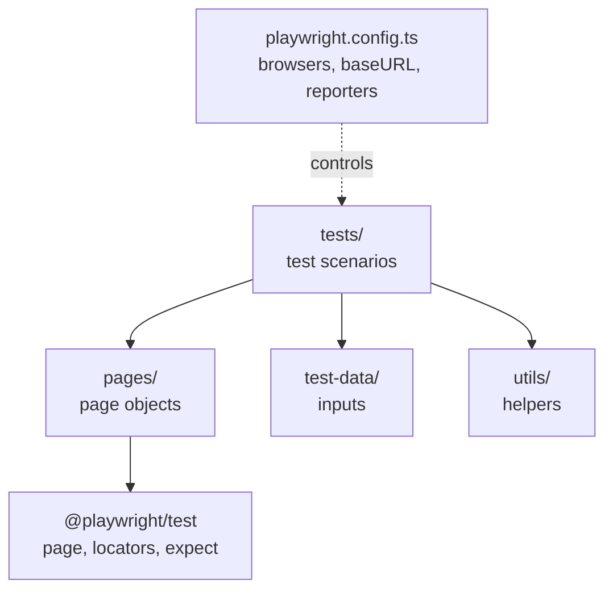

# Prerequisites

## P1 · Node.js, npm and npx in plain words

Playwright for TypeScript runs on **Node.js**. Three names come as a set:

| Name | Plain-English meaning | Analogy |
|---|---|---|
| **Node.js** | A program that runs JavaScript (and TypeScript) *outside* a browser, on your computer or a server | The engine of a car |
| **npm** (Node Package Manager) | Downloads and manages *packages* — ready-made code other people published. Installed together with Node.js | An app store for code |
| **npx** | Runs a command that comes *inside* a package, without you installing it globally | "Open app" without putting it on your home screen |

A few more words you will see today:

| Name | What it is |
|---|---|
| **package** | A bundle of code published to npm, e.g. `@playwright/test` |
| **`package.json`** | Your project's *ID card and shopping list*: its name, the packages it needs, and handy commands (scripts) |
| **`node_modules/`** | The folder where npm puts the downloaded packages. Big, auto-generated — never edit it, never commit it to Git |
| **`package-lock.json`** | Records the *exact* versions installed, so every teammate gets the same ones |
| **dependency** | A package your project needs. `devDependencies` are needed only while developing/testing |

```quiz
id: d2-p1-q1
type: single
question: You clone a teammate's project. It has package.json but no node_modules folder. What do you run?
options:
  - "`npx playwright test`"
  - "`npm install`"
  - "`node package.json`"
  - Copy node_modules from the teammate's laptop
answer: b
explanation: "`npm install` reads package.json (and package-lock.json) and downloads every dependency into node_modules. node_modules is never shared or committed — it is always re-created."
```

## P2 · Terminal survival kit

The **terminal** (also called command line, shell, console or command prompt) is a text window where you type commands. On this course platform it is the **Terminal** panel; on your computer it is also built into VS Code (**View → Terminal**).

| Task | macOS / Linux / platform terminal | Windows (PowerShell) |
|---|---|---|
| Where am I? | `pwd` | `pwd` |
| List files | `ls` (add `-a` to see hidden files) | `ls` or `dir` |
| Go into a folder | `cd pw-course` | `cd pw-course` |
| Go up one folder | `cd ..` | `cd ..` |
| Create a folder | `mkdir tests` | `mkdir tests` |
| Clear the screen | `clear` | `cls` or `clear` |
| Stop a running command | `Ctrl + C` | `Ctrl + C` |
| Repeat a previous command | `↑` arrow key | `↑` arrow key |
| Auto-complete a name | `Tab` | `Tab` |

> [!TIP]
> Most "command not found" or "no such file" errors mean you are in the **wrong folder**. Run `pwd` to check, then `cd` to the right place.

Try it in the terminal panel:

```bash terminal
pwd
mkdir practice-folder
cd practice-folder
pwd
cd ..
ls
```

```quiz
id: d2-p2-q1
type: single
question: A long-running command is stuck and you want to stop it. What do you press?
options:
  - "`Ctrl + Z`"
  - "`Ctrl + C`"
  - "`Esc`"
  - Close the browser
answer: b
explanation: "`Ctrl + C` stops (interrupts) the running command. You'll use it to close the HTML report server later today."
```

## P3 · VS Code essentials

**Visual Studio Code (VS Code)** is a free code editor from Microsoft and the most common editor for Playwright work. On this platform you already have a built-in editor; on your own computer you'll use VS Code.

The five areas you'll use:

1. **Explorer** (left) — your project's files and folders
2. **Editor** (centre) — where you write code; tabs for open files
3. **Terminal** (bottom, **View → Terminal** or `` Ctrl + ` ``) — runs commands inside your project folder
4. **Extensions** (left bar, the squares icon) — add features such as the Playwright extension
5. **Testing** (left bar, the flask icon) — run and debug tests with a click (after installing the Playwright extension)

> [!TESTER]
> Think of VS Code as your test-management tool, test editor and execution console in one window.

# Fundamentals

## F1 · System requirements

Playwright's official requirements (check [playwright.dev/docs/intro](https://playwright.dev/docs/intro) for the latest):

| Requirement | Supported |
|---|---|
| **Node.js** | Latest **22.x**, **24.x** or **26.x** |
| **Windows** | Windows 11+, Windows Server 2019+, or WSL |
| **macOS** | macOS 14 (Sonoma) or later |
| **Linux** | Debian 12/13, Ubuntu 22.04 / 24.04 / 26.04 (x86-64 or arm64) |

> [!WARNING] Use an even-numbered LTS version of Node.js
> Download the **LTS** ("Long-Term Support") version from [nodejs.org](https://nodejs.org). Very old versions (for example Node 16 or 18) are no longer supported and cause confusing installation errors.

## F2 · Installing the tools on your own computer

> [!NOTE]
> On this course platform everything is already installed — you can skip to **F3** and do the hands-on part in **Implementation**. Follow F2 when you set up your own laptop.

### Step 1 — Install Node.js (npm comes with it)

1. Go to [nodejs.org](https://nodejs.org) and download the **LTS** installer for your operating system
2. Run it and accept the defaults
3. Open a **new** terminal and check:

```bash terminal
node -v
npm -v
```

```output terminal
v24.11.0
11.6.1
```

Your numbers will differ — anything starting with `v22`, `v24` or `v26` for Node is fine.

### Step 2 — Install VS Code

Download it from [code.visualstudio.com](https://code.visualstudio.com), install, and open it.

### Step 3 — Install the Playwright extension

1. Open **Extensions** (`Ctrl + Shift + X` / `Cmd + Shift + X`)
2. Search **Playwright Test for VS Code** — publisher **Microsoft**
3. Click **Install**

The extension adds a **Testing** panel where you can run, debug and record tests with a click, and see green/red icons next to each test in the editor.

```quiz
id: d2-f2-q1
type: single
question: You typed `node -v` and got "command not found". What is the most likely cause?
options:
  - Playwright is not installed
  - Node.js is not installed, or the terminal was opened before installing it
  - The tests folder is missing
  - VS Code needs the Playwright extension
answer: b
explanation: "`node` comes from the Node.js installation. Install Node.js, then open a NEW terminal window so it picks up the updated system path."
```

## F3 · Creating a project: `npm init playwright@latest`

One command creates a complete, working Playwright project:

```bash terminal
npm init playwright@latest
```

What that command means:

- `npm init <something>` → run the project *initializer* package called `create-<something>` — here, `create-playwright`
- `@latest` → use the newest version

It asks four questions (on Linux, a fifth one):

| Prompt | Recommended answer | Why |
|---|---|---|
| Do you want to use TypeScript or JavaScript? | **TypeScript** (default) | This course uses TypeScript |
| Where to put your end-to-end tests? | **tests** (default) | Playwright looks for tests here (becomes `testDir` in the config) |
| Add a GitHub Actions workflow? | **N** for now | Creates a CI file — we'll cover CI later in the course |
| Install Playwright browsers? | **Y** (default) | Downloads Chromium, Firefox and WebKit |
| *(Linux only)* Install Playwright operating system dependencies? | **N** on this platform (already done); **Y** on a fresh Linux machine | Installs system libraries the browsers need — requires `sudo`/root |

Then it:

1. Installs `@playwright/test` (and `@types/node`) into `node_modules/`
2. Creates `playwright.config.ts`, `tests/example.spec.ts` and `.gitignore`
3. Downloads the browser builds (a few hundred MB, only the first time)

### Where do the browsers go?

Not into your project. They go into a shared cache folder so every project on your computer can reuse them:

| OS | Browser cache folder |
|---|---|
| Windows | `%USERPROFILE%\AppData\Local\ms-playwright` |
| macOS | `~/Library/Caches/ms-playwright` |
| Linux | `~/.cache/ms-playwright` |

Useful related commands:

| Command | What it does |
|---|---|
| `npx playwright install` | Download the browsers for the Playwright version in this project |
| `npx playwright install chromium` | Download only Chromium |
| `npx playwright install --with-deps` | Also install the operating-system libraries browsers need (mainly Linux/CI) |
| `npx playwright --version` | Show the installed Playwright version |
| `npm install -D @playwright/test@latest` | Upgrade Playwright in this project (then run `npx playwright install` again) |

> [!TIP]
> You can safely re-run `npm init playwright@latest` in an existing project — for every file that already exists it **asks** before overwriting it (the default answer is No).

```quiz
id: d2-f3-q1
type: single
question: After upgrading Playwright with `npm install -D @playwright/test@latest`, tests fail with "Executable doesn't exist". What should you run?
options:
  - "`npm init playwright@latest` in a new folder"
  - "`npx playwright install`"
  - "`npm uninstall node`"
  - "`npx playwright show-report`"
answer: b
explanation: Each Playwright version needs its matching browser builds. `npx playwright install` downloads them.
```

## F4 · The generated project, file by file

After the installer finishes, your project looks like this:

```text mode=read
pw-course/
├── .gitignore               ← tells Git which files NOT to save
├── package.json             ← project ID card + dependencies + scripts
├── package-lock.json        ← exact installed versions (don't edit by hand)
├── playwright.config.ts     ← THE settings file for all your tests
├── node_modules/            ← downloaded packages (auto-generated, never edit)
└── tests/
    └── example.spec.ts      ← a sample test file with 2 tests
```

After you run tests, two more folders appear:

```text mode=read
├── test-results/            ← raw results: error details, traces, screenshots of failures
└── playwright-report/       ← the HTML report (open with: npx playwright show-report)
```

(If you answered **Y** to GitHub Actions you also get `.github/workflows/playwright.yml`.)

### `package.json`

```json mode=read
{
  "name": "pw-course",
  "version": "1.0.0",
  "scripts": {},
  "devDependencies": {
    "@playwright/test": "^1.63.0",
    "@types/node": "^26.6.2"
  }
}
```

- `@playwright/test` — Playwright Test itself (the version number on your machine may be newer)
- `@types/node` — type information about Node.js so TypeScript and VS Code can help you
- `^1.63.0` — "version 1.63.0 or any newer 1.x" (the `^` allows minor updates)
- `scripts` — empty for now; you'll add shortcuts in the Implementation part

### `.gitignore`

```text mode=read
# Playwright
node_modules/
/test-results/
/playwright-report/
/blob-report/
/playwright/.cache/
/playwright/.auth/
```

Everything generated or downloaded is excluded from Git: packages, results and reports can always be re-created.

### Test files: `*.spec.ts`

Playwright finds tests by name: any file in the `testDir` folder (and its sub-folders) ending in **`.spec.ts`** or **`.test.ts`** (also `.js` variants). A file called `tests/login.ts` would be **ignored**.

```quiz
id: d2-f4-q1
type: single
question: You create `tests/checkout.ts` with a test inside, but `npx playwright test` doesn't run it. Why?
options:
  - Test files must be in the project root
  - Test file names must end in `.spec.ts` or `.test.ts`
  - Playwright only runs example.spec.ts
  - You must restart VS Code
answer: b
explanation: Rename it to `tests/checkout.spec.ts` and Playwright will discover it.
```

```quiz
id: d2-f4-q2
type: multiple
question: Which of these should NOT be committed to Git? (Select all that apply)
options:
  - node_modules/
  - playwright.config.ts
  - playwright-report/
  - tests/example.spec.ts
answer: [a, c]
explanation: node_modules and the report are generated automatically and are already in .gitignore. Your config and tests are the valuable source code — always commit them.
```

## F5 · `playwright.config.ts` explained

This file controls **how** all your tests run. Here is the generated file with the comments shortened (the full file has more commented-out examples):

```ts mode=read
import { defineConfig, devices } from '@playwright/test';

export default defineConfig({
  testDir: './tests',                        // where to look for *.spec.ts files
  fullyParallel: true,                       // run tests in parallel, even inside one file
  forbidOnly: !!process.env.CI,              // on CI, fail if someone left test.only in the code
  retries: process.env.CI ? 2 : 0,           // retry failed tests twice on CI, never locally
  workers: process.env.CI ? 1 : undefined,   // 1 worker on CI; locally Playwright decides (half your CPU cores)
  reporter: 'html',                          // produce the HTML report

  use: {                                     // settings shared by every test
    // baseURL: 'http://localhost:3000',     // lets you write page.goto('/login')
    trace: 'on-first-retry',                 // record a trace when a test is retried
  },

  projects: [                                // one "project" per browser
    { name: 'chromium', use: { ...devices['Desktop Chrome'] } },
    { name: 'firefox',  use: { ...devices['Desktop Firefox'] } },
    { name: 'webkit',   use: { ...devices['Desktop Safari'] } },
    // Commented examples: 'Mobile Chrome' (Pixel 5), 'Mobile Safari' (iPhone 12),
    // branded 'Microsoft Edge' and 'Google Chrome' via channel: 'msedge' / 'chrome'
  ],

  // webServer: { ... }                      // optionally start your app before the tests
});
```

The most important ideas:

| Setting | In one line |
|---|---|
| `testDir` | The folder Playwright searches for test files |
| `fullyParallel` | `true` = tests inside the same file may also run at the same time |
| `retries` | How many times to re-run a failed test before calling it failed |
| `workers` | How many tests run at the same time (each worker is a separate process) |
| `reporter` | How results are shown — `'list'`, `'line'`, `'dot'`, `'html'`, `'json'`, `'junit'`… |
| `use` | Default options for every test: `baseURL`, `headless`, `viewport`, `trace`, `screenshot`, `video`… |
| `projects` | Each project = one set of settings (usually one browser or device). Every test runs once per project |
| `devices['Desktop Chrome']` | A ready-made preset: browser engine, screen size, user agent |

> [!NOTE] What is `process.env.CI`?
> CI servers (GitHub Actions, Jenkins, Azure DevOps…) set an environment variable called `CI`. The config uses it to behave differently on the build server (retries, one worker) than on your laptop. You'll learn the `condition ? a : b` syntax on Day 3.

```quiz
id: d2-f5-q1
type: single
question: You want every test to use `https://staging.shop.com` as its starting address so tests can write `page.goto('/login')`. Which setting do you use?
options:
  - "`testDir`"
  - "`use: { baseURL: 'https://staging.shop.com' }`"
  - "`projects: ['https://staging.shop.com']`"
  - "`reporter: 'https://staging.shop.com'`"
answer: b
explanation: "`baseURL` inside `use` is prepended to relative URLs, so `page.goto('/login')` opens `https://staging.shop.com/login`."
```

```quiz
id: d2-f5-q2
type: single
question: "The config has 3 projects and `retries: process.env.CI ? 2 : 0`. On your LAPTOP, a test fails once. What happens?"
options:
  - It is retried twice
  - It is reported as failed immediately (0 retries)
  - It is skipped
  - It runs on a 4th browser
answer: b
explanation: "Your laptop doesn't set the `CI` variable, so `retries` is 0. On a CI server the same test would be retried up to 2 times."
```

## F6 · Running tests — the command cheat sheet

| Goal | Command |
|---|---|
| Run **all** tests, all projects, headless | `npx playwright test` |
| Watch the browser | `npx playwright test --headed` |
| One browser only | `npx playwright test --project=chromium` |
| One file | `npx playwright test tests/example.spec.ts` |
| Files whose path contains a word | `npx playwright test example` |
| One line in a file | `npx playwright test tests/example.spec.ts:3` |
| Tests whose **title** matches | `npx playwright test -g "has title"` |
| List tests without running them | `npx playwright test --list` |
| Run tests one at a time | `npx playwright test --workers=1` |
| Only re-run what failed last time | `npx playwright test --last-failed` |
| Step through with the Inspector | `npx playwright test --debug` |
| Visual UI Mode | `npx playwright test --ui` |
| Open the last HTML report | `npx playwright show-report` |
| Record a test by clicking | `npx playwright codegen https://playwright.dev` |

Options can be combined: `npx playwright test tests/example.spec.ts --project=firefox --headed`.

```quiz
id: d2-f6-q1
type: single
question: Which command runs ONLY the test titled "get started link", in Firefox, with the browser visible?
options:
  - "`npx playwright test --headed firefox get started link`"
  - "`npx playwright test -g \"get started link\" --project=firefox --headed`"
  - "`npx playwright show-report --project=firefox`"
  - "`npx playwright codegen \"get started link\"`"
answer: b
explanation: "`-g` filters by test title, `--project` picks the browser project, and `--headed` shows the window."
```

## F7 · Framework structure overview — where you're heading

The generated project is the *starting point*. Real automation frameworks add layers so that hundreds of tests stay easy to maintain. Over the coming weeks you'll build this structure:

```text mode=read
pw-course/
├── playwright.config.ts        ← global settings: browsers, baseURL, retries, reporters
├── package.json                ← dependencies + npm scripts (npm test, npm run test:headed)
├── tests/                      ← WHAT to test: spec files grouped by feature
│   ├── auth/login.spec.ts
│   └── cart/checkout.spec.ts
├── pages/                      ← HOW to use each page (Page Object Model — later weeks)
│   ├── LoginPage.ts
│   └── CartPage.ts
├── fixtures/                   ← reusable setup, e.g. "a logged-in page" (later weeks)
├── test-data/                  ← input data: users.json, products.json
└── utils/                      ← small helpers: random emails, date formatting
```



The rule of thumb: **tests describe *what* the user does and expects; everything else describes *how*.** When the login page changes, you fix one page object instead of 50 tests.

> [!TESTER]
> This mirrors good manual-testing practice: test cases (tests/) are separate from test data (test-data/) and from detailed navigation instructions (pages/).

```quiz
id: d2-f7-q1
type: single
question: The "Log in" button's text changes to "Sign in". In a well-structured framework, where would you ideally update this — once?
options:
  - In every test file that logs in
  - In the login page object (pages/LoginPage.ts)
  - In package.json
  - In .gitignore
answer: b
explanation: Page objects hold the "how" (locators and steps for a page). Change it once there and every test that uses it keeps working.
```

# Implementation

## I1 · Check your tools

Open the **Terminal** panel and run:

```bash terminal
node -v
npm -v
```

You should see a Node version starting with `v22`, `v24` or `v26`, and an npm version.

## I2 · Create your project

Create a folder for the course and generate a Playwright project inside it:

```bash terminal
mkdir pw-course
cd pw-course
npm init playwright@latest
```

Answer the prompts: **TypeScript**, **tests**, **N** (no GitHub Actions), **Y** (install browsers) and, if asked, **N** for operating-system dependencies (the platform already has them).

```output terminal
Need to install the following packages:
create-playwright@1.17.x
Ok to proceed? (y) y

Getting started with writing end-to-end tests with Playwright:
Initializing project in '.'
✔ Do you want to use TypeScript or JavaScript? · TypeScript
✔ Where to put your end-to-end tests? · tests
✔ Add a GitHub Actions workflow? (y/N) · false
✔ Install Playwright browsers (can be done manually via 'npx playwright install')? (Y/n) · true
✔ Install Playwright operating system dependencies (requires sudo / root …)? (y/N) · false
Initializing NPM project (npm init -y)…
Installing Playwright Test (npm install --save-dev @playwright/test)…
Installing Types (npm install --save-dev @types/node)…
Writing playwright.config.ts.
Writing tests/example.spec.ts.
Writing package.json.
Downloading browsers (npx playwright install)…
✔ Success! Created a Playwright Test project at /home/learner/pw-course
```

(Version numbers and paths will differ.) Confirm the version:

```bash terminal
npx playwright --version
```

> [!WARNING] Linux users on their own machine
> If the browser download finishes but tests later complain about missing libraries, run `npx playwright install --with-deps` (it may ask for your password).

## I3 · Explore what was created

```bash terminal
ls -a
ls tests
```

Open `package.json`, `.gitignore`, `playwright.config.ts` and `tests/example.spec.ts` in the editor and match each one to lesson F4/F5.

Now read the sample test. You don't need to understand every symbol yet — Days 3–5 will explain them — but you can already read it like a test case:

```ts file=tests/example.spec.ts mode=read network=true
import { test, expect } from '@playwright/test';

test('has title', async ({ page }) => {
  await page.goto('https://playwright.dev/');

  // Expect a title "to contain" a substring.
  await expect(page).toHaveTitle(/Playwright/);
});

test('get started link', async ({ page }) => {
  await page.goto('https://playwright.dev/');

  // Click the get started link.
  await page.getByRole('link', { name: 'Get started' }).click();

  // Expects page to have a heading with the name of Installation.
  await expect(page.getByRole('heading', { name: 'Installation' })).toBeVisible();
});
```

| Line | Reads as |
|---|---|
| `test('has title', …)` | A test case named **has title** |
| `page.goto('https://playwright.dev/')` | Step: open the Playwright website |
| `expect(page).toHaveTitle(/Playwright/)` | Expected: the tab title contains "Playwright" |
| `page.getByRole('link', { name: 'Get started' }).click()` | Step: click the link named "Get started" |
| `expect(…heading 'Installation'…).toBeVisible()` | Expected: a heading "Installation" is visible |

```quiz
id: d2-i3-q1
type: single
question: How many tests are in example.spec.ts, and how many runs will `npx playwright test` report with the default 3 browser projects?
options:
  - 2 tests → 2 runs
  - 2 tests → 6 runs
  - 3 tests → 6 runs
  - 1 test → 3 runs
answer: b
explanation: 2 tests × 3 projects (chromium, firefox, webkit) = 6 runs.
```

## I4 · Your first run

> [!NOTE]
> The example tests open playwright.dev, so they need an internet connection.

```bash terminal
npx playwright test
```

```output terminal
Running 6 tests using 3 workers
  6 passed (6.8s)

To open last HTML report run:

  npx playwright show-report
```

Six green runs: 2 tests × 3 browsers. Everything ran **headless** — no windows opened.

Open the report:

```bash terminal
npx playwright show-report
```

The report opens in the browser pane (it is served at `http://localhost:9323`). Click a test to see its steps and timing. Filter by browser or status at the top.

**When you're done, go back to the terminal and press `Ctrl + C`** to stop the report server — the terminal is blocked until you do.

## I5 · Tune the config for learning

Two small changes make the next weeks smoother:

1. See **each test** in the terminal as it finishes (the `list` reporter) *and* still get the HTML report.
2. Stop the HTML report from **opening automatically** after a failure (it would block your terminal until you press `Ctrl + C`).

In `playwright.config.ts`, replace the `reporter` line:

```ts mode=read
  // BEFORE
  reporter: 'html',

  // AFTER: list in the terminal + HTML report on demand
  reporter: [['list'], ['html', { open: 'never' }]],
```

Run again, this time only on Chromium:

```bash terminal
npx playwright test --project=chromium
```

```output terminal
Running 2 tests using 2 workers

  ✓  1 [chromium] › tests/example.spec.ts:3:5 › has title (1.1s)
  ✓  2 [chromium] › tests/example.spec.ts:10:5 › get started link (1.6s)

  2 passed (2.5s)
```

> [!PLATFORM]
> Use this same `reporter` line in the pre-loaded Day 1 workspace, so the output learners saw on Day 1 matches what they see from now on.

## I6 · Headed, one file, one test, one browser

Try each command and notice the difference:

```bash terminal
# watch the browser work
npx playwright test --project=chromium --headed

# only one file
npx playwright test tests/example.spec.ts --project=firefox

# only tests whose title contains "title"
npx playwright test -g "title" --project=webkit

# list what WOULD run, without running anything
npx playwright test --list
```

```output terminal
Listing tests:
  [chromium] › example.spec.ts:3:5 › has title
  [chromium] › example.spec.ts:10:5 › get started link
  [firefox] › example.spec.ts:3:5 › has title
  [firefox] › example.spec.ts:10:5 › get started link
  [webkit] › example.spec.ts:3:5 › has title
  [webkit] › example.spec.ts:10:5 › get started link
Total: 6 tests in 1 file
```

```quiz
id: d2-i6-q1
type: single
question: What does `npx playwright test --list` do?
options:
  - Runs all tests and lists failures
  - Shows which tests would run (per project) without running them
  - Lists installed browsers
  - Opens the HTML report
answer: b
explanation: "`--list` is a quick way to check that your filters (`-g`, `--project`, file names) select the tests you expect."
```

## I7 · Break it on purpose — and read the error

A tester's superpower is reading failures. Let's create one.

1. In `tests/example.spec.ts`, change `/Playwright/` to `/Selenium/` in the first test.
2. Run just that test:

```bash terminal
npx playwright test -g "has title" --project=chromium
```

```output terminal
Running 1 test using 1 worker

  ✘  1 [chromium] › tests/example.spec.ts:3:5 › has title (5.9s)

  1) [chromium] › tests/example.spec.ts:3:5 › has title ─────────────────────────

    Error: expect(page).toHaveTitle(expected) failed

    Expected pattern: /Selenium/
    Received string:  "Fast and reliable end-to-end testing for modern web apps | Playwright"
    Timeout: 5000ms

    Call log:
      - Expect "toHaveTitle" with timeout 5000ms
        9 × locator resolved to <html lang="en" dir="ltr" …>…</html>
          - unexpected value "Fast and reliable end-to-end testing for modern web apps | Playwright"

       4 |   await page.goto('https://playwright.dev/');
       5 |   // Expect a title "to contain" a substring.
    >  6 |   await expect(page).toHaveTitle(/Selenium/);
         |                      ^
       7 | });

  1 failed
    [chromium] › tests/example.spec.ts:3:5 › has title ──────────────────────────
```

How to read it — top to bottom:

| Part | What it tells you |
|---|---|
| `✘ … has title (5.9s)` | Which test failed and on which browser |
| `Expected pattern: /Selenium/` | What the test expected |
| `Received string: "… | Playwright"` | What the page actually had |
| `Timeout: 5000ms` / `9 × … unexpected value` | Playwright retried the check for 5 seconds before giving up (web-first assertion!) |
| `> 6 | … ^` | The exact line and position in your code |

3. Change `/Selenium/` back to `/Playwright/` and run again — green.

> [!TESTER]
> This is a defect report written for you: **expected**, **actual**, **where**. When a test fails, first decide: is it a bug in the app, or a problem in the test?

## I8 · Add npm script shortcuts

Typing long commands gets old. Add **scripts** to `package.json` with the terminal (or edit the file by hand):

```bash terminal
npm pkg set scripts.test="playwright test"
npm pkg set scripts.test:headed="playwright test --headed"
npm pkg set scripts.test:chromium="playwright test --project=chromium"
npm pkg set scripts.report="playwright show-report"
```

Your `package.json` now contains:

```json mode=read
"scripts": {
  "test": "playwright test",
  "test:headed": "playwright test --headed",
  "test:chromium": "playwright test --project=chromium",
  "report": "playwright show-report"
}
```

Use them:

```bash terminal
npm test
npm run test:chromium
# pass extra options after --
npm run test:chromium -- -g "get started"
npm run report
```

> [!NOTE]
> `test` is special — `npm test` works without `run`. Every other script needs `npm run <name>`. Inside scripts you don't need `npx`; npm finds the `playwright` command in `node_modules` automatically.

## I9 · Prepare your framework folders

Create the folders from lesson F7 so your project is ready to grow (they'll stay empty for now):

```bash terminal
mkdir -p pages fixtures test-data utils tests/day5
ls
```

> [!NOTE]
> `mkdir -p` creates several folders at once (and nested ones such as `tests/day5`) without complaining if one already exists. In Windows PowerShell, `mkdir pages, fixtures, test-data, utils, tests/day5` does the same.

## I10 · (Own computer) Run tests from VS Code

With the **Playwright Test for VS Code** extension installed:

1. Open the `pw-course` folder in VS Code (**File → Open Folder**)
2. Click the **Testing** (flask) icon — your tests appear in a tree
3. Click ▶ next to a test to run it; tick **Show browser** at the bottom of the panel to watch it
4. Green ✓ / red ✗ icons also appear next to each `test(...)` line in the editor
5. **Record new** opens a browser and records your clicks into a new test file (Codegen)

# Practice

## Quiz · Day 2 check

```quiz
id: d2-pr-q1
type: single
question: Which file lists your project's dependencies and npm scripts?
options:
  - playwright.config.ts
  - package.json
  - .gitignore
  - tests/example.spec.ts
answer: b
explanation: package.json is the project's ID card — name, dependencies (`devDependencies`) and `scripts`.
```

```quiz
id: d2-pr-q2
type: single
question: What is the default folder where Playwright looks for tests in a freshly generated project?
options:
  - "`./src`"
  - "`./tests`"
  - "`./node_modules`"
  - "`./e2e` always"
answer: b
explanation: "`testDir: './tests'` — unless a `tests` folder already existed, in which case the installer suggests `e2e`."
```

```quiz
id: d2-pr-q3
type: single
question: In the config, what does a "project" usually represent?
options:
  - A Git repository
  - A browser or device configuration that every test runs against
  - A single test file
  - A team of testers
answer: b
explanation: Projects are sets of settings — typically one per browser/device. Each test runs once per project.
```

```quiz
id: d2-pr-q4
type: single
question: What does `npx playwright show-report` do?
options:
  - Runs tests and prints a report
  - Serves the last HTML report so you can open it in a browser
  - Sends the report by email
  - Deletes old reports
answer: b
explanation: It starts a small local web server (default port 9323) for the playwright-report folder. Press Ctrl + C to stop it.
```

```quiz
id: d2-pr-q5
type: truefalse
question: Playwright's browser binaries are downloaded into your project's node_modules folder.
answer: false
explanation: They go into a shared cache folder (e.g. ~/.cache/ms-playwright on Linux) so all projects on the computer can reuse them.
```

```quiz
id: d2-pr-q6
type: single
question: "You run `npm run test:chromium -- -g \"login\"`. What does the `--` do?"
options:
  - Comments out the rest of the line
  - Passes the options after it (`-g "login"`) on to the Playwright command inside the script
  - Runs the tests twice
  - Disables Chromium
answer: b
explanation: Everything after `--` is forwarded to the script's command, so it becomes `playwright test --project=chromium -g "login"`.
```

```quiz
id: d2-pr-q7
type: multiple
question: "The failure output says: Expected pattern: /Dashboard/, Received string: \"Login\", Timeout: 5000ms. What can you conclude? (Select all that apply)"
options:
  - The page title was "Login" instead of containing "Dashboard"
  - Playwright retried the assertion for about 5 seconds
  - The test definitely found a real bug in the app
  - The login step may have failed, or the test's expectation may be wrong — investigate
answer: [a, b, d]
explanation: The message shows expected vs actual and that the assertion retried for 5 s. Whether it's an app bug or a test problem needs investigation — never assume.
```

## Exercises

````exercise
id: d2-ex1
title: Write the command
level: easy
type: terminal
prompt: |
  Write the single command for each situation (run them to check):

  1. Run every test, only in WebKit.
  2. Run only `tests/example.spec.ts`, in Chromium, with the browser visible.
  3. Run only tests whose title contains `link`, in all browsers.
  4. Show which tests would run in Firefox without running them.
  5. Re-run only the tests that failed in the previous run.
hints:
  - "`--project=<name>` picks a browser project."
  - "`-g` filters by title; `--list` lists; `--last-failed` re-runs failures."
solution: |
  npx playwright test --project=webkit
  npx playwright test tests/example.spec.ts --project=chromium --headed
  npx playwright test -g "link"
  npx playwright test --project=firefox --list
  npx playwright test --last-failed
````

````exercise
id: d2-ex2
title: Troubleshooting desk
level: medium
type: written
prompt: |
  A colleague sends you these problems. What is the most likely cause and fix for each?

  1. `npx: command not found`
  2. `Error: No tests found` — their file is `tests/Login.ts`.
  3. `browserType.launch: Executable doesn't exist at …/ms-playwright/chromium-…` right after upgrading Playwright.
  4. They ran `npm test` in their home folder and got `Missing script: "test"`.
  5. After a failing run, the terminal shows `Serving HTML report at http://localhost:9323. Press Ctrl+C to quit.` and won't accept commands.
modelAnswer: |
  1. Node.js (which includes npm and npx) isn't installed, or the terminal was opened before installing it. Install Node.js LTS and open a new terminal.
  2. Test files must end in `.spec.ts` or `.test.ts`. Rename it to `tests/login.spec.ts`.
  3. The new Playwright version needs matching browser builds. Run `npx playwright install`.
  4. They're in the wrong folder — npm reads the package.json of the current folder. `cd pw-course` first (check with `pwd`).
  5. The HTML reporter opened the report automatically after the failure. Press `Ctrl + C`. To prevent it, set `reporter: [['list'], ['html', { open: 'never' }]]`.
````

````exercise
id: d2-ex3
title: Customise the config
level: medium
type: code
prompt: |
  Edit `playwright.config.ts` so that:

  1. Only **chromium** and **firefox** projects remain (remove or comment out webkit).
  2. Failed tests are retried **once** locally and **twice** on CI.
  3. Tests run **headed** by default (hint: `headless: false` inside `use`).

  Then run `npx playwright test --list` and check that only 4 runs are listed (2 tests × 2 projects). Afterwards, set `headless` back (or remove the line) so tests run headless again.
file: playwright.config.ts
hints:
  - "`retries` uses the same `process.env.CI ? a : b` pattern that is already there — just change the numbers."
  - "Projects are objects inside the `projects: [ … ]` list. Put `//` in front of lines to comment them out."
solution: |
  import { defineConfig, devices } from '@playwright/test';

  export default defineConfig({
    testDir: './tests',
    fullyParallel: true,
    forbidOnly: !!process.env.CI,
    retries: process.env.CI ? 2 : 1,          // 2 on CI, 1 locally
    workers: process.env.CI ? 1 : undefined,
    reporter: [['list'], ['html', { open: 'never' }]],
    use: {
      trace: 'on-first-retry',
      headless: false,                         // show the browser for every run
    },
    projects: [
      { name: 'chromium', use: { ...devices['Desktop Chrome'] } },
      { name: 'firefox', use: { ...devices['Desktop Firefox'] } },
      // { name: 'webkit', use: { ...devices['Desktop Safari'] } },
    ],
  });
````

````exercise
id: d2-ex4
title: Your own copy of the example
level: medium
type: code
prompt: |
  Create `tests/day2/my-first.spec.ts` by **copying** `tests/example.spec.ts`, then change it so that:

  1. The first test is called `docs page has title` and checks that the title contains `Playwright`.
  2. The second test is called `get started opens installation` (same steps as before).
  3. Add a comment above every line describing the step in your own words.

  Run only your new file in Chromium: `npx playwright test tests/day2 --project=chromium`.
file: tests/day2/my-first.spec.ts
run: npx playwright test tests/day2 --project=chromium
network: true
hints:
  - Only the text inside `test('…'` changes for the names.
  - Comments start with `//`.
solution: |
  import { test, expect } from '@playwright/test';

  test('docs page has title', async ({ page }) => {
    // Open the Playwright website
    await page.goto('https://playwright.dev/');
    // Check that the tab title contains the word "Playwright"
    await expect(page).toHaveTitle(/Playwright/);
  });

  test('get started opens installation', async ({ page }) => {
    // Open the Playwright website
    await page.goto('https://playwright.dev/');
    // Click the "Get started" link
    await page.getByRole('link', { name: 'Get started' }).click();
    // Check that the "Installation" heading is visible
    await expect(page.getByRole('heading', { name: 'Installation' })).toBeVisible();
  });
````

````exercise
id: d2-ex5
title: Record a test with Codegen (own computer)
level: challenge
type: terminal
prompt: |
  On your own computer, run `npx playwright codegen https://playwright.dev`.

  1. In the browser that opens, click **Docs**, then use the search box to search for `locators`.
  2. Watch the Playwright Inspector window write code as you click.
  3. Copy the generated code into `tests/day2/recorded.spec.ts` and run it.
  4. Write down two things in the generated code you *don't* understand yet — you'll recognise them by the end of Day 5.
hints:
  - Close the Codegen browser window when you're finished recording.
  - Codegen code often needs small clean-ups; that's normal.
solution: |
  npx playwright codegen https://playwright.dev
  # …record, copy the code into tests/day2/recorded.spec.ts, then:
  npx playwright test tests/day2/recorded.spec.ts --project=chromium --headed
````

## Reflection

1. Explain `npm`, `npx` and `package.json` to a teammate in one sentence each.
2. Which file would you open to add a fourth browser, change retries, or set a base URL?
3. When a test fails, which three pieces of information in the error do you look at first?

> [!TIP] Coming up on Day 3
> The Playwright code is written in **TypeScript**. Over the next two days you'll learn exactly enough programming to read and write it confidently — starting with variables, data types and operators.
