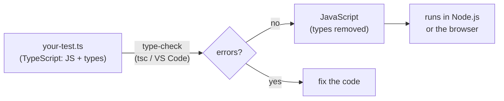

# Prerequisites

## P1 · What a program is

A **program** is a list of instructions (called **statements**) that the computer runs **from top to bottom**, one after another — exactly like the steps in a test case.

```ts mode=read
console.log('Step 1: open the login page');   // prints a line of text
console.log('Step 2: enter the username');
console.log('Step 3: click Log in');
```

Five rules to know before you write any code:

| Rule | Example |
|---|---|
| **`console.log(…)` prints** something to the console/terminal | `console.log('Hello')` |
| **Text goes in quotes** — single `'…'`, double `"…"` or backticks `` `…` `` | `'Log in'`, `"Log in"` |
| **Comments** are notes for humans; the computer ignores them | `// one line` and `/* several lines */` |
| **Semicolons** `;` end a statement (optional in most cases, but we use them for clarity) | `console.log('Hi');` |
| **Case matters** — `Console.log` is not `console.log` | `userName` ≠ `username` |

> [!WARNING] Straight quotes only
> Copying code from Word, PDFs or chat apps can turn `'` into curly quotes `‘ ’`. Code needs straight quotes. If you see a strange "Invalid character" error, retype the quotes.

## P2 · Set up your TypeScript playground

You'll practise TypeScript in a small separate folder inside your course project, called `ts-basics`. Run these commands from the `pw-course` folder:

```bash terminal
mkdir ts-basics
cd ts-basics
npm init -y
npm pkg set type=module
npm pkg set scripts.check="tsc --noEmit --strict --target esnext --module nodenext --allowImportingTsExtensions --ignoreConfig"
npm install -D typescript
mkdir day3 day4
```

What these do:

| Command | Purpose |
|---|---|
| `npm init -y` | Creates a `package.json` for the playground (`-y` = accept all defaults) |
| `npm pkg set type=module` | Uses modern `import`/`export` syntax (needed on Day 4) |
| `npm pkg set scripts.check=…` | Adds a `check` shortcut that runs the TypeScript **type checker** in strict mode (`--ignoreConfig` makes it check just the file you name, even if a `tsconfig.json` exists higher up) |
| `npm install -D typescript` | Installs the TypeScript compiler (`tsc`) |

From now on, for every `.ts` file you'll do two things:

| You want to… | Command (inside `ts-basics`) |
|---|---|
| **Run** the file and see its output | `node day3/hello.ts` |
| **Check** the file for type errors | `npm run check -- day3/hello.ts` |

> [!NOTE] Why can Node run `.ts` files?
> Modern Node.js (22.18 and newer, 24, 26) can run TypeScript directly: it simply **removes the type annotations** and runs the JavaScript that's left. It does **not** check your types — that's the job of `npm run check` (the TypeScript compiler). On older Node 22 versions, use `node --experimental-strip-types day3/hello.ts`.

Create your first file, `day3/hello.ts`:

```ts file=ts-basics/day3/hello.ts mode=editor run="node day3/hello.ts"
// My first TypeScript program
const course: string = 'Playwright with TypeScript';
console.log('Welcome to ' + course + '!');
```

```bash terminal
node day3/hello.ts
npm run check -- day3/hello.ts
```

```output console
Welcome to Playwright with TypeScript!
```

The `check` command prints nothing when there are **no errors** — silence is success.

## P3 · How to read an error message

Errors are normal. Professionals see dozens a day. Here's one — change `hello.ts` so the course is a number:

```ts file=ts-basics/day3/broken.ts mode=editor expect=error run="npm run check -- day3/broken.ts"
const course: string = 2026;   // a number stored where a string is expected
console.log(course);
```

```bash terminal
npm run check -- day3/broken.ts
```

```output terminal
day3/broken.ts(1,7): error TS2322: Type 'number' is not assignable to type 'string'.
```

| Part | Meaning |
|---|---|
| `day3/broken.ts` | The file |
| `(1,7)` | Line 1, character 7 |
| `TS2322` | The error code (searchable online) |
| `Type 'number' is not assignable to type 'string'` | The explanation: you put a number where a string belongs |

> [!TESTER]
> Treat an error message like a bug report: **where** (file, line), **what** (the message), then investigate. Read it slowly — it usually tells you exactly what's wrong.

# Fundamentals

## F1 · JavaScript vs TypeScript

**JavaScript (JS)** is the programming language of the web. Every browser runs it, and Node.js runs it outside the browser. Playwright itself is used from JavaScript/TypeScript.

**TypeScript (TS)** is JavaScript **plus types**. It was created by Microsoft (first released in 2012) and is a **superset** of JavaScript: every valid JavaScript program is also valid TypeScript. TypeScript adds a way to say *what kind of value* each thing holds — text, number, true/false, list… — so mistakes are caught **before** the code runs.



### Static vs dynamic typing

JavaScript is **dynamically typed** — a variable can hold a string now and a number later, and nobody complains until something breaks while the program is running. TypeScript is **statically typed** — once a variable is a string it must stay a string, and the editor warns you immediately.

```ts mode=read
// JavaScript: allowed, bug discovered later (maybe in production)
let retries = 'three';
retries = 3;

// TypeScript: the editor flags it instantly
let timeout: number = 30000;
timeout = 'thirty seconds';   // ❌ Type 'string' is not assignable to type 'number'
```

### Why TypeScript for test automation?

| Benefit | What it means for you |
|---|---|
| **Catches mistakes early** | Typos and wrong values are underlined in red *before* you run a 10-minute suite |
| **Autocomplete** | Type `page.` and VS Code lists every Playwright action — `click`, `fill`, `goto`… |
| **Readable** | `function login(user: string, password: string)` documents itself |
| **Default in Playwright** | `npm init playwright@latest` picks TypeScript by default; most Playwright examples are TypeScript |

Drawbacks: a little more to type, and types are one more concept to learn. For test suites that grow to hundreds of tests, the benefits win.

> [!WARNING] Important: Playwright runs TypeScript, but does not type-check it
> When you run `npx playwright test`, Playwright converts your `.ts` files to JavaScript on the fly and runs them — **without** checking types (so your tests start fast). Type errors are shown by **VS Code** (red underlines) and by running `npx tsc --noEmit`. Always fix the red underlines!

### See the compiler in action (optional)

The classic TypeScript workflow is: compile `.ts` → `.js`, then run the `.js`. Try it once:

```bash terminal
npx tsc day3/hello.ts --target esnext --ignoreConfig
node day3/hello.js
```

Open the new `day3/hello.js` — it's the same code **with the `: string` removed**. That's all "compiling" TypeScript mostly does. You can delete `hello.js` afterwards.

```quiz
id: d3-f1-q1
type: single
question: Which statement about TypeScript is TRUE?
options:
  - TypeScript is a completely different language from JavaScript
  - Every valid JavaScript program is also valid TypeScript; TypeScript adds types on top
  - Browsers run TypeScript directly without any conversion
  - TypeScript was created by Google
answer: b
explanation: TypeScript is a superset of JavaScript made by Microsoft. Browsers run JavaScript, so types are removed (compiled away) before code runs.
```

```quiz
id: d3-f1-q2
type: truefalse
question: When you run `npx playwright test`, Playwright stops and refuses to run if your test file has a type error.
answer: false
explanation: Playwright strips the types and runs the JavaScript without type-checking. The type error may still cause a failure at runtime — or silently do the wrong thing. Use VS Code's red underlines or `npx tsc --noEmit` to catch type errors.
```

## F2 · Variables: `let`, `const` (and why not `var`)

A **variable** is a named box that stores a value so you can use it later.

```ts mode=read
const siteUrl = 'https://shop.example.com';   // create a box called siteUrl and put a URL in it
let attempts = 0;                              // a box whose value will change
attempts = attempts + 1;                       // put a new value in the box
```

### The three keywords

| Keyword | Can you change the value later? | Use it when… |
|---|---|---|
| `const` | ❌ No — "constant" | The value should never be replaced (URLs, test data, locators). **Use by default.** |
| `let` | ✅ Yes | The value must change (counters, results that update) |
| `var` | ✅ Yes | **Avoid** — the old way (before 2015). It has confusing scoping rules and lets you redeclare the same name by accident |

```ts file=ts-basics/day3/variables.ts mode=editor run="node day3/variables.ts"
// const: a value that never changes
const baseUrl = 'https://shop.example.com';

// let: a value that will change
let loginAttempts = 0;
loginAttempts = loginAttempts + 1;   // first attempt
loginAttempts = loginAttempts + 1;   // second attempt

console.log('Testing', baseUrl);
console.log('Login attempts:', loginAttempts);

// Uncomment the next line and run `npm run check -- day3/variables.ts`:
// baseUrl = 'https://other.example.com';   // ❌ Cannot assign to 'baseUrl' because it is a constant
```

```output console
Testing https://shop.example.com
Login attempts: 2
```

> [!NOTE]
> `console.log` can print several things separated by commas — it adds a space between them.

### Declaring now, assigning later

```ts mode=read
let testResult: string;       // declared with a type, no value yet
testResult = 'passed';        // assigned later
```

A `const` must get its value immediately: `const x;` is an error.

### Naming rules

| ✅ Allowed | ❌ Not allowed |
|---|---|
| `userName`, `user_name`, `$price`, `_temp`, `test2` | `2test` (can't start with a digit) |
| Letters, digits, `_`, `$` | `user-name` (no hyphens), `user name` (no spaces) |
| | `let`, `const`, `class`, `return` … (reserved words) |

**Convention:** use **camelCase** — first word lowercase, each next word capitalised: `loginButton`, `maxRetryCount`, `isLoggedIn`. Choose names that explain the value: `expectedTitle` beats `t`.

```quiz
id: d3-f2-q1
type: single
question: Which declaration will cause an error?
options:
  - "`let count = 1; count = 2;`"
  - "`const url = 'https://a.com'; url = 'https://b.com';`"
  - "`let name: string; name = 'Asha';`"
  - "`const maxRetries = 3;`"
answer: b
explanation: A `const` cannot be reassigned. Use `let` if the value must change.
```

```quiz
id: d3-f2-q2
type: multiple
question: Which are valid AND follow the camelCase convention? (Select all that apply)
options:
  - "`loginButton`"
  - "`login-button`"
  - "`expectedPageTitle`"
  - "`2ndUser`"
answer: [a, c]
explanation: Hyphens aren't allowed in names, and names can't start with a digit. `loginButton` and `expectedPageTitle` are valid camelCase.
```

## F3 · Primitive data types

A **data type** says what kind of value something is. TypeScript's everyday **primitive** (simple) types:

| Type | Examples | Used in testing for… |
|---|---|---|
| `string` | `'Asha'`, `"Log in"`, `` `Hello ${name}` `` | URLs, usernames, expected text |
| `number` | `42`, `3.14`, `-7`, `30000` | Counts, prices, timeouts (ms) |
| `boolean` | `true`, `false` | Is the checkbox ticked? Did the test pass? |
| `undefined` | `undefined` | "No value has been given yet" |
| `null` | `null` | "Intentionally empty" |

(There are also `bigint` for huge whole numbers and `symbol` for unique ids — you won't need them for testing.)

### Type annotations vs type inference

You can **annotate** a type with `: type` after the name — or let TypeScript **infer** (work out) the type from the value:

```ts mode=read
let username: string = 'asha';   // annotation: explicitly says "string"
let password = 'Secret@123';     // inference: TypeScript sees a string, so password is a string

password = 12345;                // ❌ error — TypeScript inferred string
```

Rule of thumb: when you give a value immediately, inference is enough. Annotate when you declare without a value, and for function parameters (Day 4).

### Strings in detail

```ts file=ts-basics/day3/strings.ts mode=editor run="node day3/strings.ts"
const firstName: string = 'Asha';
const product = "Wireless Mouse";

// Template literal: backticks + ${ } to insert values into text
const greeting = `Hello, ${firstName}! You added ${product} to the cart.`;
console.log(greeting);

// Useful string tools
console.log(product.length);              // number of characters
console.log(product.toUpperCase());       // WIRELESS MOUSE
console.log(product.includes('Mouse'));   // does it contain "Mouse"?
console.log('  padded  '.trim());         // remove spaces at both ends
```

```output console
Hello, Asha! You added Wireless Mouse to the cart.
14
WIRELESS MOUSE
true
padded
```

> [!TIP]
> Template literals (backticks) are everywhere in Playwright tests — for building URLs (`` `${baseUrl}/login` ``) and expected messages (`` `Welcome, ${user}` ``).

### Numbers

TypeScript has **one** number type for whole numbers and decimals. Timeouts in Playwright are numbers in **milliseconds**: `5000` = 5 seconds.

```ts mode=read
const price = 499.99;
const quantity = 2;
const timeoutMs = 30_000;   // underscores make big numbers readable (same as 30000)
```

### null vs undefined

```ts mode=read
let couponCode: string | undefined;   // not set yet → undefined
console.log(couponCode);              // undefined

let middleName: string | null = null; // deliberately "no middle name"
```

`undefined` usually means *"not set (yet)"*; `null` means *"set to nothing on purpose"*. You'll see both when a value may be missing.

### Checking a type at runtime: `typeof`

```ts mode=read
console.log(typeof 'hello');   // "string"
console.log(typeof 42);        // "number"
console.log(typeof true);      // "boolean"
```

```quiz
id: d3-f3-q1
type: single
question: "What does this print? `` const user = 'Ravi'; console.log(`Welcome back, ${user}!`); ``"
options:
  - "`Welcome back, ${user}!`"
  - "`Welcome back, Ravi!`"
  - "`Welcome back, user!`"
  - An error
answer: b
explanation: Inside backticks, `${ }` inserts the value of the expression — here the value of `user`.
```

```quiz
id: d3-f3-q2
type: single
question: "`let isVisible = true;` — what type does TypeScript infer for isVisible?"
options:
  - string
  - number
  - boolean
  - any
answer: c
explanation: "`true` and `false` are boolean values, so TypeScript infers `boolean`."
```

## F4 · Arrays, tuples, objects and special types

### Arrays — ordered lists

```ts file=ts-basics/day3/arrays.ts mode=editor run="node day3/arrays.ts"
// An array of strings. Two ways to write the type: string[] or Array<string>
const browsers: string[] = ['chromium', 'firefox', 'webkit'];

console.log(browsers[0]);        // first item — counting starts at 0!
console.log(browsers[2]);        // third item
console.log(browsers.length);    // how many items

browsers.push('msedge');         // add an item at the end
console.log(browsers);
console.log(browsers.includes('firefox'));   // is "firefox" in the list?

const retryDelays: number[] = [1000, 2000, 4000];
console.log(retryDelays[1]);
```

```output console
chromium
webkit
3
[ 'chromium', 'firefox', 'webkit', 'msedge' ]
true
2000
```

> [!NOTE]
> `browsers` is a `const`, yet we could `push` into it. `const` means *the box can't be replaced with a different array* — the contents of the array can still change.

### Tuples — fixed-length lists with a type per position

```ts mode=read
// [username, password] — always exactly a string then a string
const credentials: [string, string] = ['asha@example.com', 'Secret@123'];

// [product name, price, in stock?]
const item: [string, number, boolean] = ['Keyboard', 1499, true];
item[1] = 'free';   // ❌ error — position 1 must be a number
```

### Objects — named properties

Objects group related values under **property names** — perfect for test data:

```ts file=ts-basics/day3/objects.ts mode=editor run="node day3/objects.ts"
// A type alias describes the shape of an object once, so we can reuse it
type User = {
  name: string;
  email: string;
  age: number;
  isAdmin: boolean;
  phone?: string;          // ? = optional property (may be missing)
};

const testUser: User = {
  name: 'Asha Verma',
  email: 'asha@example.com',
  age: 29,
  isAdmin: false,
};

console.log(testUser.name);        // read a property with a dot
console.log(testUser['email']);    // or with square brackets
testUser.age = 30;                 // change a property
console.log(testUser);
console.log(testUser.phone);       // optional and not set → undefined
```

```output console
Asha Verma
asha@example.com
{
  name: 'Asha Verma',
  email: 'asha@example.com',
  age: 30,
  isAdmin: false
}
undefined
```

If you forget a required property or use the wrong type, the checker complains:

```ts mode=read
const badUser: User = { name: 'Ravi', email: 'ravi@example.com', age: '31' };
// ❌ Type 'string' is not assignable to type 'number'   (age)
// ❌ Property 'isAdmin' is missing
```

> [!TESTER]
> Objects are how you'll store **test data**: one object per user, product or form submission — just like a row in your test-data spreadsheet, with named columns.

### Union types — "this OR that"

```ts mode=read
let orderId: string | number;   // may be a string or a number
orderId = 1045;                 // ✅
orderId = 'ORD-1045';           // ✅
orderId = true;                 // ❌ boolean is not allowed
```

### Literal types — only these exact values

```ts mode=read
type BrowserName = 'chromium' | 'firefox' | 'webkit';

let target: BrowserName = 'firefox';   // ✅
target = 'safari';                     // ❌ '"safari"' is not assignable to type 'BrowserName'
```

Playwright uses literal types a lot — for example `browserName` is typed as `'chromium' | 'firefox' | 'webkit'`, so VS Code can autocomplete and catch typos.

### `any` and `unknown` — escape hatches

| Type | Meaning | Advice |
|---|---|---|
| `any` | "Turn off type checking for this value" — anything goes | **Avoid.** It hides bugs — it turns TypeScript back into plain JavaScript |
| `unknown` | "Could be anything — check before using it" | Safer when you truly don't know the type (e.g. data from a file) |

```quiz
id: d3-f4-q1
type: single
question: "`const cities = ['Delhi', 'Kolkata', 'Hyderabad'];` — what is `cities[1]`?"
options:
  - "'Delhi'"
  - "'Kolkata'"
  - "'Hyderabad'"
  - undefined
answer: b
explanation: Array positions (indexes) start at 0. Index 0 is 'Delhi', index 1 is 'Kolkata'.
```

```quiz
id: d3-f4-q2
type: single
question: "Given `type Status = 'passed' | 'failed' | 'skipped';`, which assignment causes a type error?"
options:
  - "`let s: Status = 'passed';`"
  - "`let s: Status = 'skipped';`"
  - "`let s: Status = 'flaky';`"
  - "`let s: Status = 'failed';`"
answer: c
explanation: A literal-union type only accepts the exact listed values. 'flaky' isn't one of them.
```

```quiz
id: d3-f4-q3
type: single
question: "In `type Product = { name: string; price: number; discount?: number };`, what does the `?` mean?"
options:
  - discount must be a question
  - discount is optional — an object may leave it out
  - discount can be any type
  - discount is required
answer: b
explanation: A `?` after a property name makes it optional. If it's missing, reading it gives `undefined`.
```

## F5 · Operators

**Operators** are symbols that do something with values: calculate, compare, combine.

### Arithmetic

| Operator | Meaning | Example | Result |
|---|---|---|---|
| `+` | add (also joins strings) | `5 + 2` | `7` |
| `-` | subtract | `5 - 2` | `3` |
| `*` | multiply | `5 * 2` | `10` |
| `/` | divide | `5 / 2` | `2.5` |
| `%` | remainder (modulo) | `5 % 2` | `1` |
| `**` | power | `5 ** 2` | `25` |

### Assignment and increment

| Operator | Same as |
|---|---|
| `x = 5` | put 5 in x |
| `x += 2` | `x = x + 2` |
| `x -= 2` | `x = x - 2` |
| `x *= 2` | `x = x * 2` |
| `x++` | `x = x + 1` |
| `x--` | `x = x - 1` |

### Comparison — always produce `true` or `false`

| Operator | Meaning |
|---|---|
| `===` | equal (value **and** type) — **use this** |
| `!==` | not equal (value or type) — **use this** |
| `==` / `!=` | "loose" equal / not equal — converts types first. **Avoid** |
| `>` `<` `>=` `<=` | greater, less, greater-or-equal, less-or-equal |

```ts file=ts-basics/day3/comparison.ts mode=editor run="node day3/comparison.ts"
const expectedCount: number = 3;   // e.g. how many items we expect in the cart
const actualCount: number = 3;     // e.g. how many items the page shows
const fromTextBox = '3';           // text from an input box is always a string!

console.log(actualCount === expectedCount);    // same value, same type
console.log(actualCount > 5);
console.log(actualCount !== 0);

// Why we avoid == : it converts types behind your back
console.log(fromTextBox == (actualCount as any));    // loose: '3' becomes 3 → true
console.log(fromTextBox === (actualCount as any));   // strict: string vs number → false
```

```output console
true
false
true
true
false
```

> [!NOTE]
> The `as any` above only exists to let TypeScript compile this deliberately bad comparison. In real code, TypeScript would stop you from comparing a string with a number — one more reason to love it.

### Logical — combine true/false values

| Operator | Name | Result is `true` when… |
|---|---|---|
| `&&` | AND | **both** sides are true |
| `\|\|` | OR | **at least one** side is true |
| `!` | NOT | flips true ↔ false |

```ts mode=read
const isLoggedIn = true;
const hasItemsInCart = false;

console.log(isLoggedIn && hasItemsInCart);   // false — both needed
console.log(isLoggedIn || hasItemsInCart);   // true  — one is enough
console.log(!isLoggedIn);                    // false — flipped
```

### `+` with strings — joining text

```ts mode=read
console.log('Order ' + 1045);   // "Order 1045"  — number is turned into text
console.log(5 + '5');           // "55"          — careful: text wins!
console.log(5 + 5);             // 10
```

### Ternary — a one-line if/else

`condition ? valueIfTrue : valueIfFalse`

```ts mode=read
const failedTests = 0;
const status = failedTests === 0 ? 'PASS' : 'FAIL';   // "PASS"
```

This is exactly what you saw in `playwright.config.ts`: `retries: process.env.CI ? 2 : 0`.

### Nullish coalescing `??` and optional chaining `?.`

```ts mode=read
// ?? gives a fallback when the left side is null or undefined
const envUrl: string | undefined = undefined;
const url = envUrl ?? 'http://localhost:3000';   // "http://localhost:3000"

// ?. reads a property only if the object exists (otherwise gives undefined, no crash)
type Order = { coupon?: { code: string } };
const order: Order = {};
console.log(order.coupon?.code);   // undefined — no error
```

### Order of operations

`*` and `/` happen before `+` and `-`, just like in maths: `2 + 3 * 4` is `14`. When in doubt, add parentheses: `(2 + 3) * 4` is `20`.

```quiz
id: d3-f5-q1
type: single
question: "What does `console.log(10 % 3);` print?"
options:
  - "3.33"
  - "3"
  - "1"
  - "30"
answer: c
explanation: "`%` gives the remainder: 10 ÷ 3 = 3 remainder 1."
```

```quiz
id: d3-f5-q2
type: single
question: "What does `console.log('2' + 2);` print?"
options:
  - "4"
  - "22"
  - An error
  - NaN
answer: b
explanation: When one side of `+` is a string, `+` joins text. '2' + 2 becomes '22'.
```

```quiz
id: d3-f5-q3
type: single
question: "`const passed = 8; const total = 10;` — what is `passed === total ? 'All green' : 'Some failed'`?"
options:
  - "'All green'"
  - "'Some failed'"
  - "true"
  - "false"
answer: b
explanation: 8 === 10 is false, so the ternary returns the value after the colon.
```

```quiz
id: d3-f5-q4
type: single
question: Why should you prefer `===` over `==`?
options:
  - "`===` is faster to type"
  - "`===` compares value AND type without converting, so `'5' === 5` is false — no surprises"
  - "`==` doesn't work in TypeScript"
  - They are exactly the same
answer: b
explanation: "`==` converts types before comparing (`'5' == 5` is true), which hides bugs. `===` is strict and predictable."
```

# Implementation

## I1 · Build a test-data profile

You'll store test data for a registration test and print a summary — using `const`, an object type, template literals and string tools.

```ts file=ts-basics/day3/test-data.ts mode=editor run="node day3/test-data.ts"
// Describe the shape of our test data once
type RegistrationData = {
  fullName: string;
  email: string;
  age: number;
  country: string;
  acceptsTerms: boolean;
};

// One test-data record (like one row in a test-data sheet)
const newCustomer: RegistrationData = {
  fullName: 'Meera Iyer',
  email: 'meera.iyer@example.com',
  age: 27,
  country: 'India',
  acceptsTerms: true,
};

// Build some values from the data
const firstName = newCustomer.fullName.split(' ')[0];   // split the name at the space, take the first part
const expectedWelcome = `Welcome, ${firstName}!`;

// Print a readable summary
console.log('--- Test data: new customer ---');
console.log(`Name:    ${newCustomer.fullName}`);
console.log(`Email:   ${newCustomer.email}`);
console.log(`Adult:   ${newCustomer.age >= 18}`);
console.log(`Terms:   ${newCustomer.acceptsTerms ? 'accepted' : 'NOT accepted'}`);
console.log(`Expected message after sign-up: "${expectedWelcome}"`);
```

```bash terminal
node day3/test-data.ts
npm run check -- day3/test-data.ts
```

```output console
--- Test data: new customer ---
Name:    Meera Iyer
Email:   meera.iyer@example.com
Adult:   true
Terms:   accepted
Expected message after sign-up: "Welcome, Meera!"
```

**Try it:** change `age` to `'27'` (in quotes) and run `npm run check -- day3/test-data.ts`. Read the error, then change it back.

## I2 · Type detective — find and fix 5 bugs

This file has **five** type errors. Don't run it yet — first **check** it:

```ts file=ts-basics/day3/detective.ts mode=editor expect=error run="npm run check -- day3/detective.ts"
type Product = {
  name: string;
  price: number;
  inStock: boolean;
};

const keyboard: Product = {
  name: 'Mechanical Keyboard',
  price: '2499',            // bug 1
  inStock: 'yes',           // bug 2
};

const quantity: number = 2;
const maxQuantity = 5;
maxQuantity = 10;           // bug 3

let browser: 'chromium' | 'firefox' | 'webkit' = 'chrome';   // bug 4

const total: string = keyboard.price * quantity;             // bug 5
console.log(`Total for ${quantity}: ${total}`);
```

```bash terminal
npm run check -- day3/detective.ts
```

```output terminal
day3/detective.ts(9,3): error TS2322: Type 'string' is not assignable to type 'number'.
day3/detective.ts(10,3): error TS2322: Type 'string' is not assignable to type 'boolean'.
day3/detective.ts(15,1): error TS2588: Cannot assign to 'maxQuantity' because it is a constant.
day3/detective.ts(17,5): error TS2322: Type '"chrome"' is not assignable to type '"chromium" | "firefox" | "webkit"'.
day3/detective.ts(19,7): error TS2322: Type 'number' is not assignable to type 'string'.
```

Fix each line, then check again until the command prints nothing, and finally run it:

```ts file=ts-basics/day3/detective-fixed.ts mode=editor run="node day3/detective-fixed.ts"
type Product = {
  name: string;
  price: number;
  inStock: boolean;
};

const keyboard: Product = {
  name: 'Mechanical Keyboard',
  price: 2499,              // fix 1: a number, not text
  inStock: true,            // fix 2: a boolean
};

const quantity: number = 2;
let maxQuantity = 5;        // fix 3: let, because it changes
maxQuantity = 10;

let browser: 'chromium' | 'firefox' | 'webkit' = 'chromium';   // fix 4: an allowed value

const total: number = keyboard.price * quantity;               // fix 5: the result is a number
console.log(`Total for ${quantity}: ${total}`);
console.log(`Max quantity: ${maxQuantity}, browser: ${browser}`);
```

```output console
Total for 2: 4998
Max quantity: 10, browser: chromium
```

## I3 · Calculate test-run metrics

Use arithmetic, comparison, logical and ternary operators to summarise a test run — the kind of numbers you'd put in a test-summary report.

```ts file=ts-basics/day3/metrics.ts mode=editor run="node day3/metrics.ts"
// Results from a test run (typed as number: in real life they come from a report)
const total: number = 48;
const passed: number = 42;
const failed: number = 4;
const skipped = total - passed - failed;       // whatever is left over

// Percentages
const passRate = (passed / total) * 100;       // brackets first, then × 100
const passRateText = passRate.toFixed(1);      // round to 1 decimal place → a string

// Decisions
const allPassed = failed === 0;
const releaseReady = passRate >= 90 && failed <= 5;   // both rules must be true
const status = allPassed ? '✅ GREEN' : '❌ RED';

console.log(`Total: ${total} | Passed: ${passed} | Failed: ${failed} | Skipped: ${skipped}`);
console.log(`Pass rate: ${passRateText}%`);
console.log(`Status: ${status}`);
console.log(`Ready for release? ${releaseReady}`);
```

```output console
Total: 48 | Passed: 42 | Failed: 4 | Skipped: 2
Pass rate: 87.5%
Status: ❌ RED
Ready for release? false
```

**Try it:** change `passed` to `44` and `failed` to `2`. Predict the four lines *before* you run it.

```quiz
id: d3-i3-q1
type: single
question: With passed = 44, failed = 2, total = 48, what is `releaseReady`? (Pass rate ≈ 91.7%)
options:
  - "true — the pass rate is at least 90 AND failures are at most 5"
  - "false — some tests failed"
  - "true — because failed is not 0"
  - An error
answer: a
explanation: 91.7 >= 90 is true and 2 <= 5 is true; true && true is true.
```

## I4 · Arrays, tuples and literal types for a test matrix

```ts file=ts-basics/day3/matrix.ts mode=editor run="node day3/matrix.ts"
// Only these three browser names are allowed
type BrowserName = 'chromium' | 'firefox' | 'webkit';

// The browsers we test on
const browsers: BrowserName[] = ['chromium', 'firefox'];
browsers.push('webkit');                        // add one more

// Login credentials as a tuple: [email, password]
const validLogin: [string, string] = ['asha@example.com', 'Secret@123'];
const [email, password] = validLogin;          // unpack the tuple into two variables

// Pages to check
const pagesToCheck: string[] = ['/home', '/products', '/cart'];

const runsNeeded = browsers.length * pagesToCheck.length;

console.log(`Browsers: ${browsers.join(', ')}`);
console.log(`Logging in as ${email} (password has ${password.length} characters)`);
console.log(`First page: ${pagesToCheck[0]}, last page: ${pagesToCheck[pagesToCheck.length - 1]}`);
console.log(`Total page checks: ${runsNeeded}`);
```

```output console
Browsers: chromium, firefox, webkit
Logging in as asha@example.com (password has 10 characters)
First page: /home, last page: /cart
Total page checks: 9
```

> [!TIP]
> `const [email, password] = validLogin;` is called **destructuring** — unpacking values into separate variables. You'll meet its object version, `{ page }`, in every Playwright test.

**Try it:** add `browsers.push('safari');` and run the checker. Why does it complain?

# Practice

## Quiz · Day 3 check

```quiz
id: d3-pr-q1
type: single
question: Which keyword should you use by default for a variable whose value never changes?
options:
  - var
  - let
  - const
  - static
answer: c
explanation: Use `const` by default and switch to `let` only when the value must change. Avoid `var`.
```

```quiz
id: d3-pr-q2
type: single
question: What is the type of `30000` in `const timeout = 30000;`?
options:
  - string
  - number
  - boolean
  - time
answer: b
explanation: It's a number (30,000 milliseconds = 30 seconds).
```

```quiz
id: d3-pr-q3
type: single
question: "What does `console.log(typeof 'false');` print?"
options:
  - boolean
  - string
  - "false"
  - undefined
answer: b
explanation: "'false' is in quotes, so it's a string that happens to contain the word false."
```

```quiz
id: d3-pr-q4
type: single
question: "`const tags = ['@smoke', '@regression'];` — what is `tags.length`?"
options:
  - "1"
  - "2"
  - "3"
  - "0"
answer: b
explanation: The array has two items. (The last index is 1, but the length is 2.)
```

```quiz
id: d3-pr-q5
type: single
question: "What does `true && !false` evaluate to?"
options:
  - "true"
  - "false"
  - An error
answer: a
explanation: "`!false` is true, and true && true is true."
```

```quiz
id: d3-pr-q6
type: single
question: "`const port = process.env.PORT ?? '3000';` — if PORT is not set (undefined), what is port?"
options:
  - undefined
  - "'3000'"
  - "null"
  - An empty string
answer: b
explanation: "`??` returns the right-hand fallback when the left side is null or undefined."
```

```quiz
id: d3-pr-q7
type: multiple
question: Which of these are TypeScript-only features (they don't exist in plain JavaScript)? (Select all that apply)
options:
  - "Type annotations like `: string`"
  - "`const` and `let`"
  - "Type aliases like `type User = { … }`"
  - "Template literals with backticks"
answer: [a, c]
explanation: "`const`, `let` and template literals are modern JavaScript. Type annotations and type aliases are what TypeScript adds — and they're removed when the code runs."
```

```quiz
id: d3-pr-q8
type: single
question: Why is using `any` everywhere a bad idea?
options:
  - It makes the program run slower
  - It switches off type checking for those values, so TypeScript can no longer catch mistakes
  - It isn't allowed in Playwright
  - It turns numbers into strings
answer: b
explanation: "`any` tells TypeScript to trust you blindly — you lose the main benefit of TypeScript."
```

## Predict the output

````exercise
id: d3-pr-p1
title: Predict — strings and numbers
level: easy
type: predict
prompt: Without running it, write down the four lines this program prints. Then run it to check.
code: |
  const a = 10;
  const b = '10';
  console.log(a + 5);
  console.log(b + 5);
  console.log(a === Number(b));
  console.log(`${a} items`);
answer: |
  15
  105
  true
  10 items

  `b + 5` joins text ('10' + 5 → '105'). `Number(b)` converts the string '10' to the number 10, so the strict comparison is true.
````

````exercise
id: d3-pr-p2
title: Predict — let and const
level: easy
type: predict
prompt: What is printed? Is there any line the type checker would reject?
code: |
  let count = 1;
  count += 4;
  count--;
  const label = count > 3 ? 'many' : 'few';
  console.log(count, label);
answer: |
  `4 many`

  count: 1 → 5 (after `+= 4`) → 4 (after `--`). 4 > 3 is true, so label is 'many'. No errors — `count` uses `let`, so it may change.
````

````exercise
id: d3-pr-p3
title: Predict — arrays and objects
level: medium
type: predict
prompt: What is printed?
code: |
  const results = ['pass', 'fail', 'pass'];
  const summary = { suite: 'Checkout', total: results.length };
  results.push('skip');
  console.log(results.length, summary.total, results[results.length - 1]);
answer: |
  `4 3 skip`

  `summary.total` stored the length (3) at the moment the object was created; pushing later doesn't change it. The array now has 4 items and the last one is 'skip'.
````

## Exercises

````exercise
id: d3-ex1
title: Tester profile card
level: easy
type: code
prompt: |
  Create `day3/profile.ts`. Declare **constants** for your name (string), years of testing experience (number), favourite browser (only `'chromium' | 'firefox' | 'webkit'` allowed) and whether you have used automation before (boolean).

  Print exactly this format using **one template literal per line** (with your own values):

  ```
  Tester: Priya Sharma
  Experience: 3 years
  Favourite browser: firefox
  Automation before: false
  ```
file: ts-basics/day3/profile.ts
run: node day3/profile.ts
starter: |
  // 1. Declare your constants here (with types)

  // 2. Print the four lines with template literals
hints:
  - "A literal type looks like: `const favouriteBrowser: 'chromium' | 'firefox' | 'webkit' = 'firefox';`"
  - "A template literal: `` console.log(`Tester: ${testerName}`); ``"
solution: |
  // 1. Constants with types
  const testerName: string = 'Priya Sharma';
  const yearsOfExperience: number = 3;
  const favouriteBrowser: 'chromium' | 'firefox' | 'webkit' = 'firefox';
  const usedAutomation: boolean = false;

  // 2. Print with template literals
  console.log(`Tester: ${testerName}`);
  console.log(`Experience: ${yearsOfExperience} years`);
  console.log(`Favourite browser: ${favouriteBrowser}`);
  console.log(`Automation before: ${usedAutomation}`);
expectedOutput: |
  Tester: Priya Sharma
  Experience: 3 years
  Favourite browser: firefox
  Automation before: false
````

````exercise
id: d3-ex2
title: Shopping-cart calculator
level: medium
type: code
prompt: |
  Create `day3/cart.ts`. A cart has: unit price **1299**, quantity **3**, discount **10%**, and shipping **99** that is **free when the discounted subtotal is 3000 or more**.

  Calculate and print:
  ```
  Subtotal: 3897
  Discount: 389.7
  After discount: 3507.3
  Shipping: 0
  Total to pay: 3507.30
  ```
  Use `const` for the inputs, arithmetic operators for the maths, a **ternary** for shipping and `toFixed(2)` for the final line.
file: ts-basics/day3/cart.ts
run: node day3/cart.ts
hints:
  - "discount = subtotal × discountPercent / 100"
  - "`const shipping = afterDiscount >= 3000 ? 0 : 99;`"
solution: |
  // Inputs
  const unitPrice = 1299;
  const quantity = 3;
  const discountPercent = 10;

  // Calculations
  const subtotal = unitPrice * quantity;                      // 3897
  const discount = (subtotal * discountPercent) / 100;        // 389.7
  const afterDiscount = subtotal - discount;                  // 3507.3
  const shipping = afterDiscount >= 3000 ? 0 : 99;            // free above 3000
  const totalToPay = afterDiscount + shipping;

  // Output
  console.log(`Subtotal: ${subtotal}`);
  console.log(`Discount: ${discount}`);
  console.log(`After discount: ${afterDiscount}`);
  console.log(`Shipping: ${shipping}`);
  console.log(`Total to pay: ${totalToPay.toFixed(2)}`);
expectedOutput: |
  Subtotal: 3897
  Discount: 389.7
  After discount: 3507.3
  Shipping: 0
  Total to pay: 3507.30
````

````exercise
id: d3-ex3
title: Test-data object with a type alias
level: medium
type: code
prompt: |
  Create `day3/login-data.ts`:

  1. Define a type alias `LoginCase` with: `id` (string), `username` (string), `password` (string), `shouldSucceed` (boolean) and an **optional** `expectedError` (string).
  2. Create two constants of that type:
     - `validCase`: id `TC-01`, username `standard_user`, password `secret_sauce`, shouldSucceed `true`
     - `lockedCase`: id `TC-02`, username `locked_out_user`, password `secret_sauce`, shouldSucceed `false`, expectedError `Sorry, this user has been locked out.`
  3. Put both in an array `loginCases` typed `LoginCase[]` and print:
  ```
  2 login cases
  TC-01 standard_user expects success: true
  TC-02 locked_out_user expects error: Sorry, this user has been locked out.
  ```
  Run `npm run check -- day3/login-data.ts` — it must print nothing.
file: ts-basics/day3/login-data.ts
run: node day3/login-data.ts
hints:
  - "Optional property: `expectedError?: string;`"
  - "Access items with `loginCases[0]` and `loginCases[1]`."
solution: |
  // The shape of one login test case
  type LoginCase = {
    id: string;
    username: string;
    password: string;
    shouldSucceed: boolean;
    expectedError?: string;   // only needed for failing cases
  };

  const validCase: LoginCase = {
    id: 'TC-01',
    username: 'standard_user',
    password: 'secret_sauce',
    shouldSucceed: true,
  };

  const lockedCase: LoginCase = {
    id: 'TC-02',
    username: 'locked_out_user',
    password: 'secret_sauce',
    shouldSucceed: false,
    expectedError: 'Sorry, this user has been locked out.',
  };

  const loginCases: LoginCase[] = [validCase, lockedCase];

  console.log(`${loginCases.length} login cases`);
  console.log(`${loginCases[0].id} ${loginCases[0].username} expects success: ${loginCases[0].shouldSucceed}`);
  console.log(`${loginCases[1].id} ${loginCases[1].username} expects error: ${loginCases[1].expectedError}`);
expectedOutput: |
  2 login cases
  TC-01 standard_user expects success: true
  TC-02 locked_out_user expects error: Sorry, this user has been locked out.
````

````exercise
id: d3-ex4
title: Fix the config-style code
level: medium
type: code
prompt: |
  The file below mimics settings from `playwright.config.ts`, but has **four** type errors. Save it as `day3/settings.ts`, run `npm run check -- day3/settings.ts`, and fix every error so that it checks cleanly and prints:
  ```
  Retries: 0 | Workers: 4 | Headless: true | Base URL: http://localhost:3000
  ```
  (Assume the `isCI` variable is `false`.)
file: ts-basics/day3/settings.ts
run: node day3/settings.ts
starter: |
  const isCI: boolean = 'false';
  const retries: number = isCI ? 2 : '0';
  const workers: number = isCI ? 1 : 4;
  const headless: boolean = 'true';
  let baseURL: string | undefined;
  const finalUrl: number = baseURL ?? 'http://localhost:3000';
  console.log(`Retries: ${retries} | Workers: ${workers} | Headless: ${headless} | Base URL: ${finalUrl}`);
hints:
  - Booleans are written without quotes.
  - Both sides of the ternary should be numbers for `retries`.
  - What type does `baseURL ?? 'http://…'` produce?
solution: |
  const isCI: boolean = false;                              // fix 1: boolean, not text
  const retries: number = isCI ? 2 : 0;                     // fix 2: number on both sides
  const workers: number = isCI ? 1 : 4;
  const headless: boolean = true;                           // fix 3: boolean, not text
  let baseURL: string | undefined;
  const finalUrl: string = baseURL ?? 'http://localhost:3000';   // fix 4: the result is a string
  console.log(`Retries: ${retries} | Workers: ${workers} | Headless: ${headless} | Base URL: ${finalUrl}`);
expectedOutput: |
  Retries: 0 | Workers: 4 | Headless: true | Base URL: http://localhost:3000
````

````exercise
id: d3-ex5
title: "Challenge: build a URL and a test title"
level: challenge
type: code
prompt: |
  Create `day3/url-builder.ts`. Given:
  ```ts
  const baseUrl = 'https://shop.example.com';
  const category = 'Laptops & Tablets';
  const page = 2;
  const sortBy: 'price' | 'rating' = 'price';
  ```
  1. Turn the category into a URL-friendly **slug**: lowercase, `&` removed, spaces replaced by `-`, no double dashes → `laptops-tablets`. (Use `toLowerCase()`, `replace('&', '')`, `split(' ')`, `filter(...)` and `join('-')` — or research your own way.)
  2. Build: `https://shop.example.com/c/laptops-tablets?page=2&sort=price`
  3. Build a test title: `[P2] Laptops & Tablets sorted by price` — `P2` comes from the page number.
  4. Print both lines, the URL first.
file: ts-basics/day3/url-builder.ts
run: node day3/url-builder.ts
hints:
  - "'Laptops & Tablets'.toLowerCase() → 'laptops & tablets'"
  - ".replace('&', '') → 'laptops  tablets' (two spaces!)"
  - ".split(' ') → ['laptops', '', 'tablets'] — filter out the empty string with `.filter((word) => word !== '')`"
solution: |
  const baseUrl = 'https://shop.example.com';
  const category = 'Laptops & Tablets';
  const page = 2;
  const sortBy: 'price' | 'rating' = 'price';

  // 1. Make a slug: lowercase → remove & → split into words → drop empty words → join with -
  const slug = category
    .toLowerCase()
    .replace('&', '')
    .split(' ')
    .filter((word) => word !== '')
    .join('-');

  // 2. Build the URL with a template literal
  const url = `${baseUrl}/c/${slug}?page=${page}&sort=${sortBy}`;

  // 3. Build the test title
  const title = `[P${page}] ${category} sorted by ${sortBy}`;

  // 4. Print
  console.log(url);
  console.log(title);
expectedOutput: |
  https://shop.example.com/c/laptops-tablets?page=2&sort=price
  [P2] Laptops & Tablets sorted by price
````

## Reflection

1. Explain in one sentence the difference between *running* a `.ts` file with Node and *checking* it with `tsc`.
2. When do you choose `let` instead of `const`?
3. Give one example each of a string, number, boolean, array, tuple and object you'd use as test data.
4. Why is `'5' === 5` false, and why is that a good thing?

> [!TIP] Coming up on Day 4
> Conditions, loops and functions let your code make decisions and repeat work. Then you'll learn `async`/`await` — the one concept behind every `await page.click()` in Playwright.
