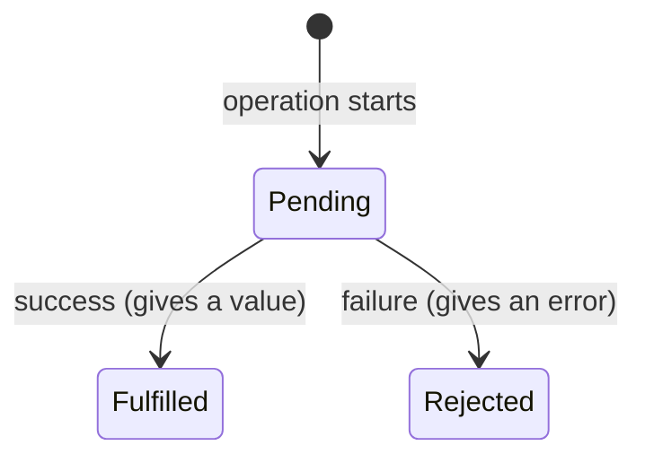

# Prerequisites

## P1 · Blocks, indentation and scope

Curly braces `{ }` group statements into a **block**. Code inside a block is **indented** (moved right) so you can see what belongs together.

```ts mode=read
if (isLoggedIn) {            // the block starts
  console.log('Welcome');    // indented: belongs to the if
  showDashboard();
}                            // the block ends
console.log('Done');         // not indented: always runs
```

**Scope** means *where a variable exists*. A `let` or `const` created **inside** a block exists only inside that block:

```ts mode=read
const suite = 'Checkout';           // outside any block: visible everywhere below
if (true) {
  const message = 'inside';         // only exists inside these braces
  console.log(suite, message);      // ✅ both visible
}
console.log(message);               // ❌ Cannot find name 'message'
```

> [!TIP]
> In VS Code, select code and press `Shift + Alt + F` (Windows/Linux) or `Shift + Option + F` (Mac) to auto-format indentation.

## P2 · Truthy and falsy

Conditions need `true` or `false`. When you give them another value, JavaScript treats it as "truthy" or "falsy".

**Falsy** — these count as `false`: `false`, `0`, `''` (empty string), `null`, `undefined`, `NaN`.
**Truthy** — *everything else*: `'hello'`, `42`, `[]`, `{}`, `'false'` (a non-empty string!).

```ts mode=read
const errorMessage = '';
if (errorMessage) {
  console.log('Error shown:', errorMessage);   // skipped — '' is falsy
}
```

```quiz
id: d4-p2-q1
type: multiple
question: Which values are FALSY? (Select all that apply)
options:
  - "`0`"
  - "`'0'`"
  - "`''`"
  - "`undefined`"
answer: [a, c, d]
explanation: "`'0'` is a non-empty string, so it's truthy. The number 0, the empty string and undefined are falsy."
```

## P3 · Quick recap from Day 3

```quiz
id: d4-p3-q1
type: single
question: "`const browsers = ['chromium', 'firefox']; browsers.push('webkit');` — what is `browsers[2]`?"
options:
  - "'firefox'"
  - "'webkit'"
  - undefined
  - An error, because browsers is const
answer: b
explanation: "`const` stops you replacing the array, not changing its contents. After push, index 2 is 'webkit'."
```

```quiz
id: d4-p3-q2
type: single
question: "What is `5 > 3 && 2 > 4`?"
options:
  - "true"
  - "false"
answer: b
explanation: "5 > 3 is true but 2 > 4 is false. With `&&`, both must be true."
```

# Fundamentals

## F1 · Conditions: making decisions

### `if`, `else if`, `else`

```ts file=ts-basics/day4/conditions.ts mode=editor run="node day4/conditions.ts"
const statusCode = 404;

// Checked from top to bottom — the FIRST true condition wins, the rest are skipped
if (statusCode >= 200 && statusCode < 300) {
  console.log('Success');
} else if (statusCode >= 400 && statusCode < 500) {
  console.log('Client error — check the request');
} else if (statusCode >= 500) {
  console.log('Server error — raise a bug');
} else {
  console.log('Something else');
}

// A condition can use a truthy/falsy value directly
const couponCode = '';
if (!couponCode) {
  console.log('No coupon applied');
}
```

```output console
Client error — check the request
No coupon applied
```

### `switch` — choose between many exact values

```ts file=ts-basics/day4/switch.ts mode=editor run="node day4/switch.ts"
const browserName: string = 'webkit';
let realBrowser: string;

switch (browserName) {
  case 'chromium':
    realBrowser = 'Chrome / Edge';
    break;                          // stop here — otherwise the next case runs too!
  case 'firefox':
    realBrowser = 'Firefox';
    break;
  case 'webkit':
    realBrowser = 'Safari';
    break;
  default:                          // none of the cases matched
    realBrowser = 'Unknown';
}

console.log(`${browserName} is like ${realBrowser}`);
```

```output console
webkit is like Safari
```

> [!WARNING]
> Forgetting `break` is a classic bug: execution "falls through" into the next case.

### Choosing the right tool

| Situation | Use |
|---|---|
| Ranges or combined conditions (`>= 200 && < 300`) | `if / else if / else` |
| One variable compared to many exact values | `switch` |
| Choose between two values in one line | ternary `cond ? a : b` |

```quiz
id: d4-f1-q1
type: single
question: "`const score = 75;` — what prints? `if (score >= 90) { console.log('A'); } else if (score >= 70) { console.log('B'); } else if (score >= 50) { console.log('C'); }`"
options:
  - A
  - B
  - B and C
  - C
answer: b
explanation: The chain stops at the first true condition. 75 >= 70 is true, so 'B' prints and the 'C' check is skipped.
```

## F2 · Loops: repeating work

Automation is about repetition — the same check for every user, every browser, every row. Loops do that.

### `for...of` — for each item in a list (your most-used loop)

```ts mode=read
const users = ['asha', 'ravi', 'meera'];
for (const user of users) {
  console.log(`Logging in as ${user}`);
}
```

### Classic `for` — when you need a counter

```ts mode=read
// start at 1; keep going while attempt <= 3; add 1 after each round
for (let attempt = 1; attempt <= 3; attempt++) {
  console.log(`Attempt ${attempt}`);
}
```

### `while` and `do...while` — repeat until something changes

```ts mode=read
let itemsInCart = 3;
while (itemsInCart > 0) {        // checks BEFORE each round (may run 0 times)
  itemsInCart--;
}

let tries = 0;
do {                              // runs at least ONCE, checks AFTER each round
  tries++;
} while (tries < 3);
```

> [!WARNING] Infinite loops
> If the condition never becomes false (e.g. you forget `itemsInCart--`), the loop never ends. Press `Ctrl + C` in the terminal to stop it.

### `break` and `continue`

```ts file=ts-basics/day4/loops.ts mode=editor run="node day4/loops.ts"
const results = ['pass', 'pass', 'skip', 'fail', 'pass'];

// continue: skip the rest of THIS round, go to the next item
for (const result of results) {
  if (result === 'skip') {
    continue;
  }
  console.log('Counted:', result);
}

// break: stop the whole loop immediately
for (let i = 0; i < results.length; i++) {
  if (results[i] === 'fail') {
    console.log(`First failure at position ${i}`);
    break;
  }
}
```

```output console
Counted: pass
Counted: pass
Counted: fail
Counted: pass
First failure at position 3
```

### Array methods that loop for you

Arrays have built-in methods that take a small function (you'll write these properly in F3):

| Method | Does | Example | Result |
|---|---|---|---|
| `forEach` | runs code for each item | `names.forEach((n) => console.log(n))` | prints each name |
| `map` | makes a new array by transforming each item | `[1, 2, 3].map((n) => n * 2)` | `[2, 4, 6]` |
| `filter` | keeps only items that pass a test | `['pass', 'fail'].filter((r) => r === 'fail')` | `['fail']` |
| `find` | returns the first matching item | `users.find((u) => u.isAdmin)` | first admin or `undefined` |
| `some` / `every` | is it true for any / all items? | `results.every((r) => r === 'pass')` | `true` or `false` |

> [!WARNING] `forEach` and `await` don't mix
> Later, when a loop contains Playwright actions (`await page.click(…)`), use `for...of`. `forEach` does **not** wait for `await` inside it — a subtle and common bug.

```quiz
id: d4-f2-q1
type: single
question: How many times does "Hi" print? `for (let i = 0; i < 3; i++) { console.log('Hi'); }`
options:
  - "2"
  - "3"
  - "4"
  - Forever
answer: b
explanation: i takes the values 0, 1, 2 (three rounds). When i becomes 3, `i < 3` is false and the loop stops.
```

```quiz
id: d4-f2-q2
type: single
question: "What does `[5, 12, 8, 20].filter((n) => n > 10)` return?"
options:
  - "[5, 8]"
  - "[12, 20]"
  - "12"
  - "true"
answer: b
explanation: "`filter` keeps the items for which the function returns true: 12 and 20."
```

## F3 · Functions: reusable steps

A **function** is a named, reusable block of steps — like a reusable test step "Log in as user X" that many test cases call.

### Declaring and calling

```ts file=ts-basics/day4/functions.ts mode=editor run="node day4/functions.ts"
// name     parameters (inputs, with types)       return type
function calculatePassRate(passed: number, total: number): number {
  return (passed / total) * 100;              // return sends a value back to the caller
}

// A function that returns nothing uses the type void
function printHeader(title: string): void {
  console.log(`===== ${title} =====`);
}

// Calling (using) the functions
printHeader('Nightly run');
const rate = calculatePassRate(45, 50);       // arguments: the actual values
console.log(`Pass rate: ${rate}%`);
console.log(`Smoke pass rate: ${calculatePassRate(9, 10)}%`);
```

```output console
===== Nightly run =====
Pass rate: 90%
Smoke pass rate: 90%
```

Words to know: **parameters** are the input names in the definition (`passed`, `total`); **arguments** are the actual values you pass (`45`, `50`); **`return`** ends the function and hands back a value.

### Optional and default parameters

```ts file=ts-basics/day4/parameters.ts mode=editor run="node day4/parameters.ts"
// timeout has a DEFAULT value; tag is OPTIONAL (may be undefined)
function describeTest(title: string, timeout: number = 30000, tag?: string): string {
  const tagText = tag ? ` ${tag}` : '';        // add the tag only if one was given
  return `${title}${tagText} (timeout ${timeout / 1000}s)`;
}

console.log(describeTest('Login works'));
console.log(describeTest('Checkout completes', 60000));
console.log(describeTest('Search returns results', 30000, '@smoke'));
```

```output console
Login works (timeout 30s)
Checkout completes (timeout 60s)
Search returns results @smoke (timeout 30s)
```

### Rest parameters — any number of arguments

```ts mode=read
function logTags(title: string, ...tags: string[]): void {
  console.log(title, 'has', tags.length, 'tags');
}
logTags('Checkout', '@smoke', '@regression', '@payments');   // Checkout has 3 tags
```

### Arrow functions — the short form you'll see everywhere

```ts mode=read
// Regular function
function double(n: number): number {
  return n * 2;
}

// Same thing as an arrow function stored in a constant
const doubleArrow = (n: number): number => {
  return n * 2;
};

// Even shorter: one expression → no braces, no return keyword
const doubleShort = (n: number) => n * 2;
```

### Functions as values: callbacks

In TypeScript a function is a value — you can pass it **into another function**. The receiving function decides *when* to run it. A function passed like this is called a **callback**.

```ts file=ts-basics/day4/callbacks.ts mode=editor run="node day4/callbacks.ts"
// runStep receives a NAME and a FUNCTION, prints the name, then calls the function
function runStep(name: string, action: () => void): void {
  console.log(`▶ ${name}`);
  action();                       // run the function we were given
}

// Pass an arrow function directly as the second argument
runStep('Open the home page', () => {
  console.log('  …navigating to /home');
});

runStep('Search for "mouse"', () => {
  console.log('  …typing into the search box');
});
```

```output console
▶ Open the home page
  …navigating to /home
▶ Search for "mouse"
  …typing into the search box
```

> [!TESTER] This is exactly how Playwright tests are written
> ```ts
> test('Open the home page', async ({ page }) => { … });
> ```
> `test` is a function that receives a **title** and a **callback**. Playwright decides when to run your callback — and hands it a ready-made `page`. You just wrote the same pattern yourself!

```quiz
id: d4-f3-q1
type: single
question: "`` function greet(name: string, greeting = 'Hello'): string { return `${greeting}, ${name}`; } `` — what does `greet('Ravi')` return?"
options:
  - "'Ravi, Hello'"
  - "'Hello, Ravi'"
  - "'undefined, Ravi'"
  - An error — greeting is missing
answer: b
explanation: "`greeting` has a default value 'Hello', used when no second argument is passed."
```

```quiz
id: d4-f3-q2
type: single
question: Which is a correct arrow function that adds two numbers?
options:
  - "`const add = (a: number, b: number) => a + b;`"
  - "`const add = function => a + b;`"
  - "`add(a, b) => { a + b }`"
  - "`const add => (a + b);`"
answer: a
explanation: Parameters in brackets, then `=>`, then the result. With a single expression the value is returned automatically.
```

## F4 · Interfaces, destructuring and spread

### Interfaces — another way to describe an object

An **interface** describes an object's shape, just like the `type` aliases from Day 3. For objects, both work; many teams use `interface` for objects and `type` for unions.

```ts mode=read
interface Product {
  name: string;
  price: number;
  inStock: boolean;
}

const mouse: Product = { name: 'Wireless Mouse', price: 799, inStock: true };
```

### Object destructuring — unpack properties into variables

```ts file=ts-basics/day4/destructuring.ts mode=editor run="node day4/destructuring.ts"
interface TestContext {
  page: string;
  browserName: string;
  retry: number;
}

const context: TestContext = { page: 'Page#1', browserName: 'firefox', retry: 0 };

// Long way
const page1 = context.page;

// Destructuring: pull out the properties you need, by name
const { page, browserName } = context;
console.log(page1, page, browserName);

// Destructuring directly in a function's parameter list
function runTest({ page, browserName }: TestContext): void {
  console.log(`Running on ${browserName} with ${page}`);
}
runTest(context);
```

```output console
Page#1 Page#1 firefox
Running on firefox with Page#1
```

> [!TESTER] Now you can read `async ({ page }) => {…}`
> Playwright calls your test function with an object full of ready-made tools (**fixtures**): `page`, `context`, `browser`, `browserName`, `request`… Writing `({ page })` destructures that object and takes only the `page`. Writing `({ page, browserName })` takes two.

### Spread `...` — copy properties or items into a new object/array

```ts mode=read
const defaults = { headless: true, timeout: 30000 };
const debugSettings = { ...defaults, headless: false };   // copy defaults, then override headless
// → { headless: false, timeout: 30000 }

const coreBrowsers = ['chromium', 'firefox'];
const allBrowsers = [...coreBrowsers, 'webkit'];          // → ['chromium', 'firefox', 'webkit']
```

That's what this config line from Day 2 does: `use: { ...devices['Desktop Chrome'] }` — copy all the settings of the "Desktop Chrome" preset into `use`.

```quiz
id: d4-f4-q1
type: single
question: "In `test('checkout', async ({ page, browserName }) => { … })`, what does `{ page, browserName }` do?"
options:
  - Creates a new page and a new browser
  - Destructures the fixtures object Playwright passes in, taking only `page` and `browserName`
  - Declares two global variables
  - Imports page and browserName from a file
answer: b
explanation: Playwright passes one object containing all fixtures; destructuring picks the ones your test needs.
```

## F5 · Asynchronous code: Promises, `async` and `await`

This is the **most important concept for Playwright**. Every browser action takes time, so almost every Playwright line starts with `await`.

### Synchronous vs asynchronous — the coffee-shop analogy

- **Synchronous:** you order a coffee and stand frozen at the counter until it's ready. Nothing else happens.
- **Asynchronous:** you order, get a **token**, and the barista calls you when it's ready. The token is a **Promise** — a promise of a future result.

In code, slow operations — loading a page, clicking and waiting for a response, reading a file — return a **Promise**. A Promise is in one of three states:



### `await` — wait for the Promise, then continue

`await` pauses the current function until the Promise is finished, then gives you its value. You can only use `await` inside a function marked **`async`** (or at the top level of a module file).

```ts file=ts-basics/day4/async-basics.ts mode=editor run="node day4/async-basics.ts"
// A helper that returns a Promise which finishes after `ms` milliseconds.
// (You won't write Promises by hand in Playwright — its methods return them for you.)
const wait = (ms: number) => new Promise<void>((resolve) => setTimeout(resolve, ms));

// Pretend browser action: takes 300 ms, then returns the page title
async function loadPage(url: string): Promise<string> {
  await wait(300);                     // pause here until 300 ms have passed
  return `Title of ${url}`;
}

async function main(): Promise<void> {
  console.log('1. Opening page…');
  const title = await loadPage('/home'); // wait for the result
  console.log(`2. Loaded: ${title}`);
  console.log('3. Now we can check the title safely');
}

main();
```

```output console
1. Opening page…
2. Loaded: Title of /home
3. Now we can check the title safely
```

Notice the return type `Promise<string>`: an `async` function **always** returns a Promise. The value inside is a `string`.

### The #1 Playwright bug: a missing `await`

```ts file=ts-basics/day4/missing-await.ts mode=editor run="node day4/missing-await.ts"
const wait = (ms: number) => new Promise<void>((resolve) => setTimeout(resolve, ms));

async function click(label: string): Promise<void> {
  await wait(200);                     // clicking takes a moment
  console.log(`   clicked "${label}"`);
}

async function withoutAwait(): Promise<void> {
  console.log('WITHOUT await:');
  click('Log in');                     // ❌ no await — we don't wait for the click
  console.log('   checking the dashboard…   ← too early!');
}

async function withAwait(): Promise<void> {
  console.log('WITH await:');
  await click('Log in');               // ✅ wait until the click is done
  console.log('   checking the dashboard…   ← correct order');
}

async function main(): Promise<void> {
  await withoutAwait();
  await wait(300);                     // let the forgotten click finish printing
  await withAwait();
}

main();
```

```output console
WITHOUT await:
   checking the dashboard…   ← too early!
   clicked "Log in"
WITH await:
   clicked "Log in"
   checking the dashboard…   ← correct order
```

Without `await`, the program **doesn't wait** — it rushes on and checks the dashboard before the click happened. In a real test that gives random ("flaky") failures or false passes.

> [!WARNING] Rule for the rest of the course
> If a Playwright method **does something in the browser** or **checks something that may take time** — `goto`, `click`, `fill`, `expect(…).toBeVisible()` — put `await` in front of it. VS Code's Playwright extension and linters (ESLint's `no-floating-promises` rule) can warn you when you forget.

### Handling failures: `try / catch / finally`

When an awaited Promise is **rejected** (fails), it throws an error. You can catch it:

```ts file=ts-basics/day4/try-catch.ts mode=editor run="node day4/try-catch.ts"
const wait = (ms: number) => new Promise<void>((resolve) => setTimeout(resolve, ms));

async function findElement(name: string): Promise<string> {
  await wait(100);
  if (name !== 'Log in') {
    throw new Error(`Element "${name}" not found`);   // reject the Promise with an error
  }
  return `<button>${name}</button>`;
}

async function main(): Promise<void> {
  try {
    const found = await findElement('Log in');
    console.log('Found:', found);
    await findElement('Sign up');                      // this one fails…
    console.log('This line is skipped');
  } catch (error) {
    console.log('Caught:', (error as Error).message);  // …so we jump here
  } finally {
    console.log('Clean-up always runs');               // runs whether it failed or not
  }
}

main();
```

```output console
Found: <button>Log in</button>
Caught: Element "Sign up" not found
Clean-up always runs
```

> [!NOTE]
> In Playwright tests you rarely write `try/catch` yourself: when an action or assertion fails, the error travels up to the test runner, which marks the test as **failed** and shows the message. That's what you want.

`(error as Error)` is a **type assertion**: in strict mode a caught error has the type `unknown`, and `as Error` tells TypeScript "treat it as an Error object" so we can read `.message`.

```quiz
id: d4-f5-q1
type: single
question: What does an `async` function always return?
options:
  - A string
  - A Promise
  - undefined
  - Whatever type you like, without a Promise
answer: b
explanation: An async function always returns a Promise — `Promise<string>`, `Promise<void>`, etc. Use `await` to get the value inside.
```

```quiz
id: d4-f5-q2
type: single
question: "A test does `page.getByRole('button', { name: 'Save' }).click();` (no await) and then immediately checks for a success message. What is the likely result?"
options:
  - Always passes — Playwright auto-waits anyway
  - "Unreliable: the check may run before the click finished, causing random failures or false passes"
  - A syntax error
  - The click happens twice
answer: b
explanation: Auto-waiting happens INSIDE the click — but without `await`, your test doesn't wait for the click to finish before moving on.
```

```quiz
id: d4-f5-q3
type: truefalse
question: You can use `await` inside any normal (non-async) function.
answer: false
explanation: "`await` only works inside functions marked `async` (or at the top level of a module). That's why Playwright tests are written as `async ({ page }) => { … }`."
```

## F6 · Modules: `export` and `import`

As a project grows, you split code across files. Each file is a **module**. A module **exports** what others may use; other modules **import** it.

```ts mode=read
// file: utils/format.ts
export function formatPrice(amount: number): string {   // named export
  return `₹${amount.toFixed(2)}`;
}
export const CURRENCY = 'INR';                            // another named export

// file: tests/cart.ts
import { formatPrice, CURRENCY } from '../utils/format';  // import by name, with curly braces
```

| Kind | Export | Import |
|---|---|---|
| **Named** (many per file) | `export function login() {}` | `import { login } from './auth';` |
| **Default** (one per file) | `export default class LoginPage {}` | `import LoginPage from './LoginPage';` (no braces, any name) |

Path rules: `'./x'` = same folder, `'../x'` = one folder up. A name **without** `./` (like `'@playwright/test'`) means an installed package from `node_modules`.

### Decoding the first line of every Playwright test

```ts mode=read
import { test, expect } from '@playwright/test';
//      └─ named imports ─┘      └─ installed package in node_modules
```

"From the installed package `@playwright/test`, bring in the two things called `test` and `expect`."

> [!NOTE] File extensions in imports
> In the `ts-basics` playground (plain Node.js) you must write the extension: `import { x } from './utils.ts'`. Inside Playwright test files you normally leave it out — `import { x } from '../utils/helpers'` — because the Playwright runner resolves it for you.

```quiz
id: d4-f6-q1
type: single
question: "`utils/data.ts` contains `export const adminUser = { … };`. How do you import it into `tests/admin.spec.ts`?"
options:
  - "`import adminUser from 'utils/data';`"
  - "`import { adminUser } from '../utils/data';`"
  - "`require adminUser;`"
  - "`import { adminUser } from '@playwright/test';`"
answer: b
explanation: It's a named export, so use curly braces. From tests/ you go up one level (`../`) and into utils/.
```

# Implementation

## I1 · A data-driven validator

Combine **objects**, **functions**, **conditions** and **loops**: a function checks a password against rules, and a loop runs it over a table of test data — exactly like a data-driven test.

```ts file=ts-basics/day4/password-rules.ts mode=editor run="node day4/password-rules.ts"
// Business rule: 8+ characters, at least one digit, at least one uppercase letter
function validatePassword(password: string): string[] {
  const problems: string[] = [];

  if (password.length < 8) {
    problems.push('too short');
  }
  if (!/[0-9]/.test(password)) {          // /[0-9]/ = "any digit" pattern
    problems.push('needs a digit');
  }
  if (!/[A-Z]/.test(password)) {          // /[A-Z]/ = "any uppercase letter" pattern
    problems.push('needs an uppercase letter');
  }
  return problems;                        // an empty list means the password is valid
}

// Test data: each case says what we EXPECT
interface PasswordCase {
  input: string;
  shouldBeValid: boolean;
}

const cases: PasswordCase[] = [
  { input: 'Secret123', shouldBeValid: true },
  { input: 'short1A', shouldBeValid: false },
  { input: 'alllowercase1', shouldBeValid: false },
  { input: 'NoDigitsHere', shouldBeValid: false },
  { input: 'Valid2Password', shouldBeValid: true },
];

let passed = 0;
for (const testCase of cases) {
  const problems = validatePassword(testCase.input);
  const isValid = problems.length === 0;
  const ok = isValid === testCase.shouldBeValid;          // did reality match the expectation?
  if (ok) {
    passed++;
  }
  const details = isValid ? 'valid' : problems.join(', ');
  console.log(`${ok ? '✓' : '✗'} "${testCase.input}" → ${details}`);
}

console.log(`${passed}/${cases.length} cases behaved as expected`);
```

```output console
✓ "Secret123" → valid
✓ "short1A" → too short
✓ "alllowercase1" → needs an uppercase letter
✓ "NoDigitsHere" → needs a digit
✓ "Valid2Password" → valid
5/5 cases behaved as expected
```

**Try it:** add a case `{ input: 'Abcdefg1', shouldBeValid: true }` and predict the output first. Then add a new rule — "must not contain spaces" (`password.includes(' ')`) — and a case that checks it.

## I2 · Simulate a test flow with `async`/`await`

These pretend "browser actions" behave like Playwright's: they take time and return Promises. Read the flow — it looks a lot like a real test.

```ts file=ts-basics/day4/fake-browser.ts mode=editor run="node day4/fake-browser.ts"
const wait = (ms: number) => new Promise<void>((resolve) => setTimeout(resolve, ms));

// --- pretend browser API (Playwright gives you real versions of these) ---
let currentUrl = 'about:blank';

async function goto(url: string): Promise<void> {
  await wait(150);
  currentUrl = url;
  console.log(`  goto ${url}`);
}

async function fill(field: string, value: string): Promise<void> {
  await wait(50);
  console.log(`  fill ${field} = ${value}`);
}

async function click(button: string): Promise<void> {
  await wait(100);
  if (button === 'Log in') {
    currentUrl = '/dashboard';           // clicking Log in takes us to the dashboard
  }
  console.log(`  click ${button}`);
}

// --- the "test" ---
async function loginTest(): Promise<void> {
  console.log('TEST: user can log in');
  await goto('/login');
  await fill('Email', 'asha@example.com');
  await fill('Password', 'Secret@123');
  await click('Log in');

  // the "assertion"
  if (currentUrl === '/dashboard') {
    console.log('✓ PASSED — landed on /dashboard');
  } else {
    console.log(`✗ FAILED — expected /dashboard but was ${currentUrl}`);
  }
}

loginTest();
```

```output console
TEST: user can log in
  goto /login
  fill Email = asha@example.com
  fill Password = Secret@123
  click Log in
✓ PASSED — landed on /dashboard
```

**Try it:** remove the `await` in front of `click('Log in')` and run it again. The "assertion" runs before the click finishes and the test **fails** — the missing-await bug from F5, reproduced.

## I3 · Organise code into modules

Move reusable helpers into their own file and import them.

First the helper module:

```ts file=ts-basics/day4/helpers.ts mode=editor
// Reusable helpers for our "tests"

// Build a unique-looking test email from a name and a number
export function buildEmail(name: string, id: number, domain: string = 'example.com'): string {
  return `${name.toLowerCase()}.${id}@${domain}`;
}

// Turn milliseconds into readable text: 1500 → "1.5s"
export function formatDuration(ms: number): string {
  return ms < 1000 ? `${ms}ms` : `${ms / 1000}s`;
}

// A default export: the main settings object of this module
const settings = {
  baseUrl: 'https://shop.example.com',
  defaultTimeout: 30000,
};
export default settings;
```

Then a file that uses it:

```ts file=ts-basics/day4/use-helpers.ts mode=editor run="node day4/use-helpers.ts"
// default import (no braces) + named imports (with braces)
import settings, { buildEmail, formatDuration } from './helpers.ts';

const users = ['Asha', 'Ravi'];

for (let i = 0; i < users.length; i++) {
  console.log(buildEmail(users[i], i + 1));
}
console.log(buildEmail('Meera', 3, 'test.org'));

console.log(`Open ${settings.baseUrl}/login`);
console.log(`Default timeout: ${formatDuration(settings.defaultTimeout)}`);
console.log(`Quick action: ${formatDuration(250)}`);
```

```bash terminal
node day4/use-helpers.ts
npm run check -- day4/use-helpers.ts
```

```output console
asha.1@example.com
ravi.2@example.com
meera.3@test.org
Open https://shop.example.com/login
Default timeout: 30s
Quick action: 250ms
```

## I4 · Build your own mini test runner

Time to put **everything** together. You'll build a tiny version of what Playwright Test does: register tests with a title and an async callback, run them, catch failures and print a report. After this, Playwright's test runner will feel familiar.

```ts file=ts-basics/day4/mini-runner.ts mode=editor run="node day4/mini-runner.ts"
// ---------- the mini "framework" ----------
type TestFunction = () => Promise<void>;          // a test body: an async function

interface RegisteredTest {
  title: string;
  body: TestFunction;
}

const registeredTests: RegisteredTest[] = [];

// 1. test(): register a test — it does NOT run it yet (same idea as Playwright)
function test(title: string, body: TestFunction): void {
  registeredTests.push({ title, body });
}

// 2. expectEqual(): a tiny assertion — throws an Error when the values differ
function expectEqual(actual: unknown, expected: unknown): void {
  if (actual !== expected) {
    throw new Error(`Expected ${JSON.stringify(expected)} but received ${JSON.stringify(actual)}`);
  }
}

// 3. run(): execute every registered test, one after another, and report
async function run(): Promise<void> {
  let passed = 0;
  for (const t of registeredTests) {             // for...of works with await
    try {
      await t.body();                            // run the test body and wait for it
      console.log(`  ✓ ${t.title}`);
      passed++;
    } catch (error) {
      console.log(`  ✘ ${t.title}`);
      console.log(`      ${(error as Error).message}`);
    }
  }
  console.log(`\n  ${passed} passed, ${registeredTests.length - passed} failed`);
}

// ---------- the "tests" ----------
const wait = (ms: number) => new Promise<void>((resolve) => setTimeout(resolve, ms));

test('cart total adds up', async () => {
  const prices = [499, 1299, 250];
  let total = 0;
  for (const price of prices) {
    total += price;
  }
  expectEqual(total, 2048);
});

test('page title is correct', async () => {
  await wait(100);                               // pretend the page is loading
  const title = 'My Shop – Home';
  expectEqual(title, 'My Shop – Home');
});

test('discount is applied', async () => {
  const price = 1000;
  const discounted = price * 0.9;
  expectEqual(discounted, 850);                  // wrong expectation → this test fails
});

run();
```

```output console
  ✓ cart total adds up
  ✓ page title is correct
  ✘ discount is applied
      Expected 850 but received 900

  2 passed, 1 failed
```

Compare your runner with real Playwright code you'll write tomorrow:

| Your mini runner | Playwright Test |
|---|---|
| `test('title', async () => { … })` | `test('title', async ({ page }) => { … })` |
| `expectEqual(total, 2048)` | `expect(total).toBe(2048)` / `await expect(locator).toHaveText('…')` |
| Tests registered first, run later by `run()` | Tests registered in `*.spec.ts` files, run by `npx playwright test` |
| `try/catch` marks a test as failed and continues | The runner catches failures, marks the test failed and continues |
| Runs tests one by one | Runs files in parallel with workers, one fresh page per test |

```quiz
id: d4-i4-q1
type: single
question: In the mini runner, why does `run()` use `for...of` instead of `registeredTests.forEach(...)`?
options:
  - "`forEach` doesn't exist on arrays"
  - "`for...of` works with `await`, so each test finishes before the next starts; `forEach` doesn't wait"
  - "`for...of` is faster to type"
  - No reason — they behave identically here
answer: b
explanation: "`forEach` ignores the Promise returned by an async callback. `for...of` inside an async function awaits each test in turn."
```

# Practice

## Quiz · Day 4 check

```quiz
id: d4-pr-q1
type: single
question: Which loop always runs its body at least once?
options:
  - for
  - while
  - do...while
  - for...of
answer: c
explanation: "`do...while` checks the condition AFTER each round, so the body runs at least once."
```

```quiz
id: d4-pr-q2
type: single
question: What does `continue` do inside a loop?
options:
  - Stops the loop completely
  - Skips the rest of the current round and moves to the next one
  - Restarts the loop from the first item
  - Pauses the program
answer: b
explanation: "`continue` skips to the next round; `break` exits the loop."
```

```quiz
id: d4-pr-q3
type: single
question: "`function f(a: number, b?: number) { return b === undefined ? a : a + b; }` — what is `f(4)`?"
options:
  - "4"
  - NaN
  - An error
  - undefined
answer: a
explanation: "`b` is optional and wasn't passed, so it is undefined and the function returns `a`."
```

```quiz
id: d4-pr-q4
type: single
question: What is a callback?
options:
  - A phone call from the test runner
  - A function passed into another function, to be called later by that function
  - A function that calls itself forever
  - A type of loop
answer: b
explanation: "In `test('title', async ({ page }) => {…})`, the arrow function is a callback that Playwright calls when it runs the test."
```

```quiz
id: d4-pr-q5
type: single
question: "`const { name } = { name: 'Asha', role: 'admin' };` — what is `name`?"
options:
  - "{ name: 'Asha' }"
  - "'Asha'"
  - "'admin'"
  - undefined
answer: b
explanation: Object destructuring pulls out the property called `name`.
```

```quiz
id: d4-pr-q6
type: multiple
question: Which lines in a Playwright test NEED `await`? (Select all that apply)
options:
  - "`page.goto('/login')`"
  - "`page.getByRole('button', { name: 'Log in' }).click()`"
  - "`await expect(page).toHaveURL(/dashboard/)` — the `expect(...)` web-first assertion"
  - "`const email = 'asha@example.com'`"
answer: [a, b, c]
explanation: Browser actions and web-first assertions return Promises and must be awaited. Assigning a plain string doesn't.
```

```quiz
id: d4-pr-q7
type: single
question: "What does `{ ...devices['Desktop Chrome'] }` do in playwright.config.ts?"
options:
  - Deletes the Desktop Chrome preset
  - Copies all properties of the Desktop Chrome preset into a new object
  - Launches three Chrome windows
  - Imports Chrome from node_modules
answer: b
explanation: The spread operator `...` copies properties from one object into another.
```

## Predict the output

````exercise
id: d4-pr-p1
title: Predict — loop with conditions
level: easy
type: predict
prompt: What does this print?
code: |
  const statuses = [200, 301, 404, 500];
  for (const code of statuses) {
    if (code >= 500) {
      console.log(code, 'server');
      break;
    } else if (code >= 400) {
      console.log(code, 'client');
      continue;
    }
    console.log(code, 'ok');
  }
answer: |
  200 ok
  301 ok
  404 client
  500 server

  404 hits `continue`, so 'ok' is skipped for it. 500 prints 'server' and `break` ends the loop (it was the last item anyway).
````

````exercise
id: d4-pr-p2
title: Predict — async order
level: medium
type: predict
prompt: In which order are the letters printed?
code: |
  const wait = (ms: number) => new Promise<void>((r) => setTimeout(r, ms));

  async function step(letter: string, ms: number) {
    await wait(ms);
    console.log(letter);
  }

  async function main() {
    console.log('A');
    step('B', 200);          // no await!
    await step('C', 100);
    console.log('D');
    await wait(200);
  }
  main();
answer: |
  A
  C
  D
  B

  'B' starts but isn't awaited. `await step('C', 100)` waits 100 ms → prints C, then D. B finishes at 200 ms, so it prints last (the final `await wait(200)` keeps the program alive long enough).
````

````exercise
id: d4-pr-p3
title: Predict — scope
level: medium
type: predict
prompt: Which line does the type checker reject, and why?
code: |
  const suite = 'Login';
  for (let i = 0; i < 2; i++) {
    const title = `${suite} test ${i}`;
    console.log(title);
  }
  console.log(title);
answer: |
  The last line: `console.log(title);` → "Cannot find name 'title'".

  `title` is declared with `const` inside the loop's block, so it only exists inside that block. `suite` is fine because it's declared outside.
````

## Exercises

````exercise
id: d4-ex1
title: Test-run reporter
level: easy
type: code
prompt: |
  Create `day4/reporter.ts`. Given
  ```ts
  const results: string[] = ['pass', 'fail', 'pass', 'skip', 'pass', 'fail'];
  ```
  use **one `for...of` loop** and **`if / else if / else`** to count passes, failures and skips, then print:
  ```
  Passed: 3
  Failed: 2
  Skipped: 1
  Verdict: FAIL
  ```
  The verdict is `PASS` only when there are **no** failures (use a ternary).
file: ts-basics/day4/reporter.ts
run: node day4/reporter.ts
hints:
  - Create three `let` counters starting at 0 before the loop.
  - "`const verdict = failed === 0 ? 'PASS' : 'FAIL';`"
solution: |
  const results: string[] = ['pass', 'fail', 'pass', 'skip', 'pass', 'fail'];

  // Counters
  let passed = 0;
  let failed = 0;
  let skipped = 0;

  // Count each result
  for (const result of results) {
    if (result === 'pass') {
      passed++;
    } else if (result === 'fail') {
      failed++;
    } else {
      skipped++;
    }
  }

  // Verdict: PASS only if nothing failed
  const verdict = failed === 0 ? 'PASS' : 'FAIL';

  console.log(`Passed: ${passed}`);
  console.log(`Failed: ${failed}`);
  console.log(`Skipped: ${skipped}`);
  console.log(`Verdict: ${verdict}`);
expectedOutput: |
  Passed: 3
  Failed: 2
  Skipped: 1
  Verdict: FAIL
````

````exercise
id: d4-ex2
title: Priority mapper with switch
level: easy
type: code
prompt: |
  Create `day4/priority.ts`. Write a function `slaHours(priority: 'P1' | 'P2' | 'P3' | 'P4'): number` that uses a **switch** to return the bug-fix deadline: P1 → 4, P2 → 24, P3 → 72, P4 → 168.

  Then loop over `['P1', 'P3', 'P4']` and print:
  ```
  P1 must be fixed within 4 hours
  P3 must be fixed within 72 hours
  P4 must be fixed within 168 hours
  ```
file: ts-basics/day4/priority.ts
run: node day4/priority.ts
hints:
  - "With `return` inside each case you don't need `break` — `return` leaves the function immediately."
  - "Type the list so TypeScript accepts it: `const priorities: ('P1' | 'P2' | 'P3' | 'P4')[] = ['P1', 'P3', 'P4'];`"
solution: |
  type Priority = 'P1' | 'P2' | 'P3' | 'P4';

  // Return the SLA (in hours) for a bug priority
  function slaHours(priority: Priority): number {
    switch (priority) {
      case 'P1':
        return 4;
      case 'P2':
        return 24;
      case 'P3':
        return 72;
      case 'P4':
        return 168;
    }
  }

  const priorities: Priority[] = ['P1', 'P3', 'P4'];
  for (const p of priorities) {
    console.log(`${p} must be fixed within ${slaHours(p)} hours`);
  }
expectedOutput: |
  P1 must be fixed within 4 hours
  P3 must be fixed within 72 hours
  P4 must be fixed within 168 hours
````

````exercise
id: d4-ex3
title: Find the failed tests
level: medium
type: code
prompt: |
  Create `day4/failed.ts` with this data:
  ```ts
  interface TestResult { title: string; status: 'passed' | 'failed' | 'skipped'; durationMs: number; }
  const run: TestResult[] = [
    { title: 'login works', status: 'passed', durationMs: 1200 },
    { title: 'search works', status: 'failed', durationMs: 5300 },
    { title: 'cart updates', status: 'passed', durationMs: 900 },
    { title: 'checkout completes', status: 'failed', durationMs: 30000 },
    { title: 'profile edits', status: 'skipped', durationMs: 0 },
  ];
  ```
  1. Use `filter` to get only the failed tests.
  2. Use `map` to get their titles.
  3. Write an **arrow function** `slowest(results: TestResult[]): TestResult` that loops over the list and returns the test with the largest `durationMs`.
  4. Print:
  ```
  Failed (2): search works, checkout completes
  Slowest: checkout completes (30s)
  ```
file: ts-basics/day4/failed.ts
run: node day4/failed.ts
hints:
  - "`run.filter((r) => r.status === 'failed')`"
  - "In `slowest`, start with `let max = results[0];` and replace it whenever you find a longer duration."
solution: |
  interface TestResult {
    title: string;
    status: 'passed' | 'failed' | 'skipped';
    durationMs: number;
  }

  const run: TestResult[] = [
    { title: 'login works', status: 'passed', durationMs: 1200 },
    { title: 'search works', status: 'failed', durationMs: 5300 },
    { title: 'cart updates', status: 'passed', durationMs: 900 },
    { title: 'checkout completes', status: 'failed', durationMs: 30000 },
    { title: 'profile edits', status: 'skipped', durationMs: 0 },
  ];

  // 1 + 2: failed tests → their titles
  const failedTests = run.filter((r) => r.status === 'failed');
  const failedTitles = failedTests.map((r) => r.title);

  // 3: find the test with the largest duration
  const slowest = (results: TestResult[]): TestResult => {
    let max = results[0];
    for (const r of results) {
      if (r.durationMs > max.durationMs) {
        max = r;
      }
    }
    return max;
  };

  const worst = slowest(run);
  console.log(`Failed (${failedTests.length}): ${failedTitles.join(', ')}`);
  console.log(`Slowest: ${worst.title} (${worst.durationMs / 1000}s)`);
expectedOutput: |
  Failed (2): search works, checkout completes
  Slowest: checkout completes (30s)
````

````exercise
id: d4-ex4
title: Retry a flaky action
level: hard
type: code
prompt: |
  Create `day4/retry.ts`. The function `flakyCheck()` below fails the first **two** times it is called and succeeds on the third — like a flaky service.

  Write `async function retry(action: () => Promise<string>, maxAttempts: number): Promise<string>` that:
  - calls `await action()` inside `try/catch`,
  - prints `Attempt N failed: <message>` on failure and tries again,
  - returns the result as soon as it succeeds,
  - throws `new Error('Gave up after N attempts')` if every attempt fails.

  Run it with `maxAttempts = 3` and print the final result.

  Expected output:
  ```
  Attempt 1 failed: Service unavailable
  Attempt 2 failed: Service unavailable
  Result: OK on call 3
  ```
file: ts-basics/day4/retry.ts
run: node day4/retry.ts
starter: |
  const wait = (ms: number) => new Promise<void>((resolve) => setTimeout(resolve, ms));

  let calls = 0;
  async function flakyCheck(): Promise<string> {
    calls++;
    await wait(50);
    if (calls < 3) {
      throw new Error('Service unavailable');
    }
    return `OK on call ${calls}`;
  }

  // TODO: write retry() here

  async function main(): Promise<void> {
    const result = await retry(flakyCheck, 3);
    console.log(`Result: ${result}`);
  }
  main();
hints:
  - Use a classic `for (let attempt = 1; attempt <= maxAttempts; attempt++)` loop.
  - "`return` inside the `try` exits both the loop and the function on success."
  - After the loop ends, every attempt has failed — `throw` the "Gave up" error there.
solution: |
  const wait = (ms: number) => new Promise<void>((resolve) => setTimeout(resolve, ms));

  let calls = 0;
  async function flakyCheck(): Promise<string> {
    calls++;
    await wait(50);
    if (calls < 3) {
      throw new Error('Service unavailable');
    }
    return `OK on call ${calls}`;
  }

  // Try an async action up to maxAttempts times
  async function retry(action: () => Promise<string>, maxAttempts: number): Promise<string> {
    for (let attempt = 1; attempt <= maxAttempts; attempt++) {
      try {
        return await action();                                        // success → leave immediately
      } catch (error) {
        console.log(`Attempt ${attempt} failed: ${(error as Error).message}`);
      }
    }
    throw new Error(`Gave up after ${maxAttempts} attempts`);         // every attempt failed
  }

  async function main(): Promise<void> {
    const result = await retry(flakyCheck, 3);
    console.log(`Result: ${result}`);
  }
  main();
expectedOutput: |
  Attempt 1 failed: Service unavailable
  Attempt 2 failed: Service unavailable
  Result: OK on call 3
````

````exercise
id: d4-ex5
title: "Challenge: upgrade the mini runner"
level: challenge
type: code
prompt: |
  Copy `day4/mini-runner.ts` to `day4/mini-runner-v2.ts` and add three features that Playwright Test also has:

  1. `beforeEach(fn)` — registers **one** async function that runs before **every** test (store it in a variable).
  2. `test.skip`-style skipping: a function `skip(title, body)` that registers a test which is **not run** and is reported as `- title (skipped)`.
  3. A summary line: `2 passed, 1 failed, 1 skipped`.

  Use these tests:
  ```ts
  let cart: number[] = [];
  beforeEach(async () => { cart = []; });            // fresh cart for every test
  test('adds one item', async () => { cart.push(499); expectEqual(cart.length, 1); });
  test('cart starts empty', async () => { expectEqual(cart.length, 0); });
  skip('applies coupon', async () => { expectEqual(1, 2); });
  test('total is right', async () => { cart.push(100, 200); expectEqual(cart.length, 3); });
  ```
  Expected output:
  ```
    ✓ adds one item
    ✓ cart starts empty
    - applies coupon (skipped)
    ✘ total is right
        Expected 3 but received 2

    2 passed, 1 failed, 1 skipped
  ```
  Notice how `beforeEach` gives each test a clean cart — the same idea as Playwright's fresh page per test.
file: ts-basics/day4/mini-runner-v2.ts
run: node day4/mini-runner-v2.ts
hints:
  - "Add a `skipped: boolean` property to `RegisteredTest`."
  - "Store the hook: `let beforeEachHook: TestFunction | undefined;` and call it with `if (beforeEachHook) { await beforeEachHook(); }`."
  - The skipped test must still appear in its original position, so keep it in the same array.
solution: |
  type TestFunction = () => Promise<void>;

  interface RegisteredTest {
    title: string;
    body: TestFunction;
    skipped: boolean;
  }

  const registeredTests: RegisteredTest[] = [];
  let beforeEachHook: TestFunction | undefined;      // no hook until beforeEach() is called

  function test(title: string, body: TestFunction): void {
    registeredTests.push({ title, body, skipped: false });
  }

  function skip(title: string, body: TestFunction): void {
    registeredTests.push({ title, body, skipped: true });
  }

  function beforeEach(fn: TestFunction): void {
    beforeEachHook = fn;
  }

  function expectEqual(actual: unknown, expected: unknown): void {
    if (actual !== expected) {
      throw new Error(`Expected ${JSON.stringify(expected)} but received ${JSON.stringify(actual)}`);
    }
  }

  async function run(): Promise<void> {
    let passed = 0;
    let failed = 0;
    let skippedCount = 0;

    for (const t of registeredTests) {
      if (t.skipped) {                                // don't run skipped tests
        console.log(`  - ${t.title} (skipped)`);
        skippedCount++;
        continue;
      }
      try {
        if (beforeEachHook) {
          await beforeEachHook();                     // fresh state before every test
        }
        await t.body();
        console.log(`  ✓ ${t.title}`);
        passed++;
      } catch (error) {
        console.log(`  ✘ ${t.title}`);
        console.log(`      ${(error as Error).message}`);
        failed++;
      }
    }
    console.log(`\n  ${passed} passed, ${failed} failed, ${skippedCount} skipped`);
  }

  // ---------- the tests ----------
  let cart: number[] = [];
  beforeEach(async () => { cart = []; });
  test('adds one item', async () => { cart.push(499); expectEqual(cart.length, 1); });
  test('cart starts empty', async () => { expectEqual(cart.length, 0); });
  skip('applies coupon', async () => { expectEqual(1, 2); });
  test('total is right', async () => { cart.push(100, 200); expectEqual(cart.length, 3); });

  run();
expectedOutput: |2
    ✓ adds one item
    ✓ cart starts empty
    - applies coupon (skipped)
    ✘ total is right
        Expected 3 but received 2

    2 passed, 1 failed, 1 skipped
````

## Reflection

1. When would you choose `switch` over `if / else if`?
2. Write, from memory, an arrow function that takes a `name: string` and returns `` `Hello, ${name}` ``.
3. In one sentence: what does `await` do, and what happens if you forget it before `page.click()`?
4. Read this line aloud in plain English: `test('login', async ({ page }) => { … });`

> [!TIP] Coming up on Day 5
> You've built a mini test runner. Tomorrow you'll use the real one: `test`, `expect`, fixtures, `describe`, hooks, tags and the CLI — and write a full suite for a practice web page.
